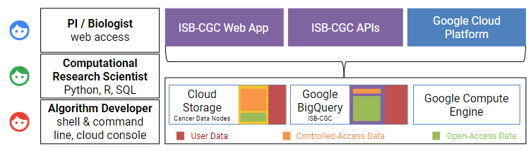

.. ISB-CGC documentation master file, created by
   sphinx-quickstart on Sun Dec 20 11:20:02 2015.
   You can adapt this file completely to your liking, but it should at least
   contain the root `toctree` directive.

*****************************
ISB-CGC
*****************************

Welcome to the ISB-CGC Documentation on Read the Docs!

Contained within the documentation are descriptions of ISB-CGC features along with guides and tips for exploring data sets hosted on the Google Cloud Platform.

The `ISB-CGC <https://isb-cgc.org>`_ aims to serve the needs of a broad range of cancer researchers ranging from scientists or clinicians who prefer to use an interactive web-based application to access and explore the rich TCGA, TARGET, CCLE, and COSMIC datasets, to computational scientists who want to write their own custom scripts using languages such as R or Python, accessing the data through APIs, and to algorithm developers who wish to spin up thousands of virtual machines to analyze hundreds of terabytes of sequence data.

-- the ISB-CGC team

.. toctree::
   :hidden:
   :maxdepth: 1
   :caption: GETTING STARTED

   sections/About-ISB-CGC
   sections/HowToGetStartedonISB-CGC
   sections/HowtoRequestCloudCredits
   sections/BestPractices
   sections/Benefits
   
.. toctree::
   :hidden:
   :maxdepth: 1
   :caption: USER GUIDE
   
   sections/Hosted-Data
   sections/BigQuery
   sections/BigQuery/BigQueryTableSearchUI
   sections/Web-UI
   sections/progapi/progAPI-v4/Programmatic-Demo
   sections/Gaining-Access-To-Controlled-Access-Data
   
.. toctree::
   :hidden:
   :maxdepth: 1
   :caption: MORE INFORMATION
   
   sections/RegulomeExplorerNotebooks
   sections/HowTos
   sections/TutorialsAndHow-ToGuides
   sections/FeatureAlertsandDataReleases
   sections/Quick-links-updated
   sections/FAQ
   sections/Support
