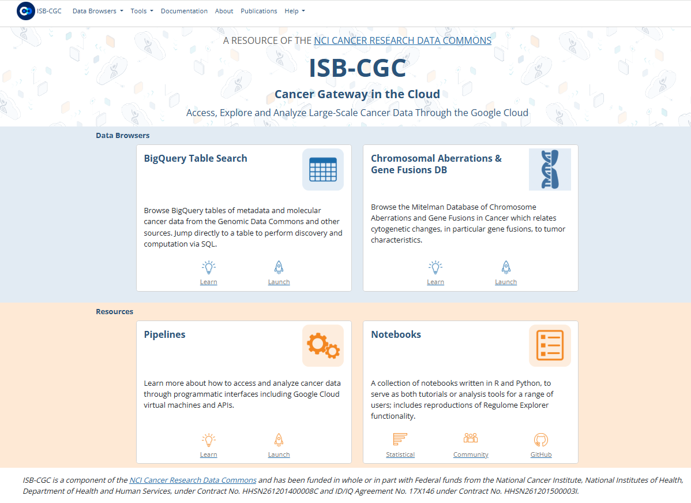

.. ISB-CGC documentation master file, created by
   sphinx-quickstart on Sun Dec 20 11:20:02 2015.
   You can adapt this file completely to your liking, but it should at least
   contain the root `toctree` directive.

********
ISB-CGC
********

*Democratizing access to cancer data in the cloud*

Contained within this documentation are descriptions of ISB-CGC features along with guides and tips for exploring data sets hosted on the Google Cloud Platform.

The `ISB-CGC <https://isb-cgc.org>`_ aims to serve the needs of cancer researchers who would like to explore cancer data from the Genomic Data Commons (GDC), Proteomics Data Commons (PDC), 
Imaging Data Commons (IDC) and other programs stored in user-friendly data sets on the Google Cloud in BigQuery tables, easily accessed through SQL. 
They can also access the data by writing their own custom scripts using languages such as R or Python, accessing the data through APIs, and by utilizing virtual machines to analyze hundreds of terabytes of sequence data.

-- the ISB-CGC team

.. toctree::
   :hidden:
   :maxdepth: 1
   :caption: GETTING STARTED

   sections/About-ISB-CGC
   sections/ExploringISB-CGC
   sections/HowToGetStarted-Analysis
   sections/BestPractices
   
.. toctree::
   :hidden:
   :maxdepth: 1
   :caption: USER GUIDE
   
   sections/Hosted-Data
   sections/BigQueryTableSearchUI
   sections/BigQuery
   sections/Tutorials/KidneyCancerDemo/KidneyCancerDemo

.. toctree::
   :hidden:
   :maxdepth: 1
   :caption: MORE ISB-CGC RESOURCES

   sections/data/Mitelman_about
   sections/SyntheticLethality_resource
   sections/data/HTAN_about
   sections/ProgrammaticAccess
   
.. toctree::
   :hidden:
   :maxdepth: 1
   :caption: NOTEBOOKS
   
   sections/HowTos
   sections/RegulomeExplorerNotebooks
   sections/MachineLearningNotebooks
   sections/HTANNotebooks
   sections/MitelmanDBNotebooks

.. toctree::
   :hidden:
   :maxdepth: 1
   :caption: MORE INFORMATION

   sections/Releases
   sections/Quick-links-updated
   sections/FAQ
   sections/Support
