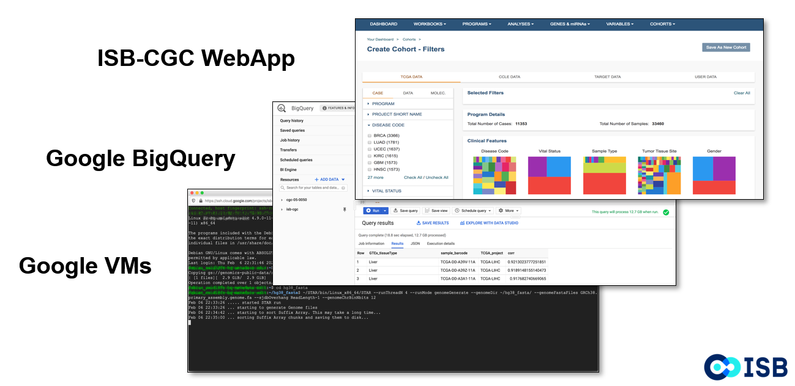

**************************
About the ISB-CGC Platform
**************************

The ISB Cancer Gateway in the Cloud (ISB-CGC) is one of three `National Cancer Institute (NCI) Cloud Resources <https://datascience.cancer.gov/data-commons/cloud-resources>`_ tasked with bringing cancer data and computation power together through cloud platforms. It is a collaboration between the `Institute for Systems Biology <https://isbscience.org/>`_ (ISB) and `General Dynamics Information Technology Inc. <https://www.gdit.com/>`_ (GDIT). Since starting in 2014 as part of NCI’s Cloud Pilot Resource initiative, ISB-CGC has provided access to increasing amounts of cancer data in the cloud. 

-------------------------
Exploring Cancer Data
-------------------------

The ISB-CGC Platform enables a wide range of users to bring their analysis tools to the data in the cloud, eliminating the need to download and store large data sets. Built with the Google Cloud Platform, it provides several entry points for exploring and analyzing cancer data:

  * The **ISB-CGC Web Application** allows users to interactively create and explore cohorts of interest. It includes the functionality of the Cancer Data File Browser and the Cohort Builder/Data Explorer as well as other tools.
  
    - The **Cancer Data File Browser** allows users to explore a comprehensive selection of cancer related data files in Google Cloud Storage Buckets, such as raw sequencing, cancer nucleotide variation, pathology or radiology images.
    - The **Cohort Builder/Data Explorer** is a web interface which builds cohorts based on clinical demographics and molecular filters. Compare patient cohorts with various exploration tools including IGV viewer, image viewers, and analytical visualization.
  * The **ISB-CGC API** gives users the ability to programmatically work with data such as cases, samples, cohorts, files and cloud projects.
  * The **ISB-CGC BigQuery Table Search** is a discovery tool that allows the user to explore and search for ISB-CGC Google BigQuery tables.
  * On the **Google Cloud Platform BigQuery Console**, ISB-CGC tables can be viewed and queried directly.
  * **Python and R** can interface with the ISB-CGC tables, retrieving and analyzing data.
  * Using **Google Compute Engines and VMs**, workflows can be run to perform data analysis. 
  
Please see the USER GUIDE section to learn more about each of these tools and to see `Jupyter and R Notebook <https://github.com/isb-cgc/Community-Notebooks>`_ examples. See the MORE INFORMATION section for tutorials, release notes, Frequently Asked Questions and more.

