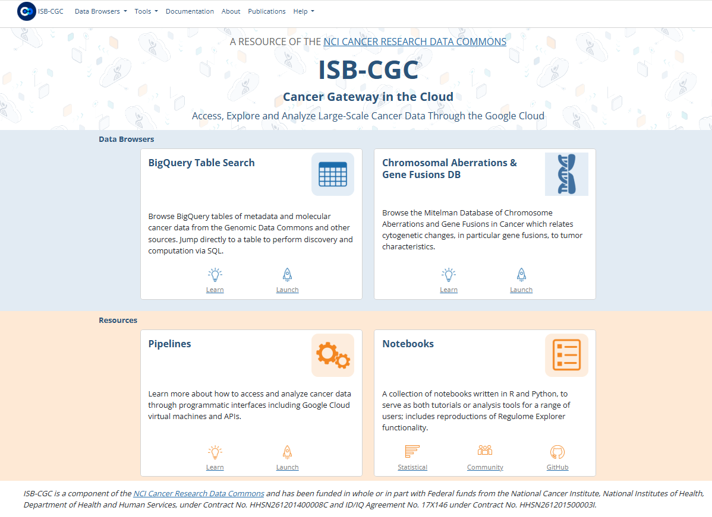
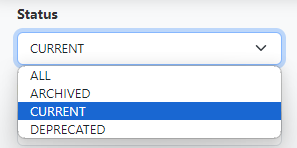
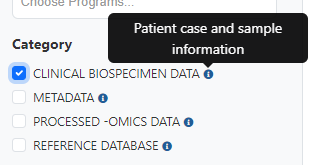
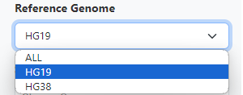
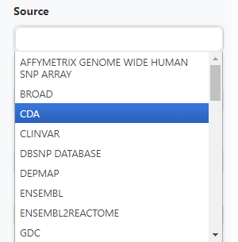

******************************
ISB-CGC BigQuery Table Search 
******************************

The ISB-CGC BigQuery Table Search UI (**URL**) is a discovery tool that allows users to explore and search for ISB-CGC hosted BigQuery tables. It can be accessed directly from the ISB-CGC homepage (`<https://isb-cgc.org/>`_) as shown in the image below. 

**Note**: Users are not required to have a Google Cloud Platform (GCP) project  or an account to learn more about the tables hosted by ISB-CGC.

Currently, ISB-CGC hosts over 300 Open Access BigQuery Tables. Each table has been curated to include detailed table and field descriptions as well as table labels allowing users to search for BigQuery tables of interest using a wild card search or via available filters. The filters consist of a combination of a multi-select dropdown lists and checkboxes. Boolean operators "OR" as well as "AND" are supported for multiple inputs. 

.. image:: BigQueryTableSearch-UI-homepage.png
   :align: center

Links to various helpful documentation pages are also made available including Google BigQuery's documentation and our Community Notebook repository which contains example uses-cases on how to use BigQuery tables programmatically via Jupyter notebooks or R scripts.

.. image:: BigQueryTableSearch-DocumentationPages.png
   :align: center

**Status**

We are committed to providing the most up-to-date information in our BigQuery tables but realize that at times researchers need to reference older versions of data. Each table is assigned a status based on the following criteria:

   * Tables with the most up-to-date available information are given a status of **current**
   * Tables with the older information are given a status of **archived**
   * Tables that have data that is no longer supported are **deprecated**
   

   
   
**Categories**

The tables are grouped into four high-level categories: 

* Clinical Biospecimen Data : Patient case and sample information (includes clinical tables with patient demographic data, and                               biospecimen data with detailed sample information)

* File Metadata : Information about raw data files including Google Cloud Storage Paths (includes tables with information                       about files available at the GDC, including GCS paths, creation dates, sizes, etc)

* Genomic Reference Database: Genomic information that can be used to cross-reference against processed-omics data tables                                   (examples include  COSMIC, ClinVar, cytoBand, dbSNP, Ensembl, Ensembl2Reactome)

* Processed-omics  Datasets: Processed data primarily from the GDC (i.e. raw data that has gone through GDC pipeline                                        processing e.g. gene expression, miRNA expression, copy number, somatic mutations, methylation)

**Reference Genome Build**

Filter for tables that contain data for hg19 or hg38. In a few cases, there are tables which contain information from both genome builds; for example, tables that include liftover coordinates between the reference builds. 

**Source**

Search through the sources of the data in our BigQuery tables by using the Source filter. Click the Source box to see the dropdown list and click on a source to select it. Additional sources can be selected by clicking in the Source box. 

**Data Type**

The Data Type filter also allows you to filter for data types of interest. Like Source, multiple Data Types can be selected.

.. image:: DataType-filter.png
   :align: center

**More Filters**

For users already familiar with the BigQuery tables (including dataset ID, table ID, table description, or a particular field name), you can use "show more filters" button to display filters allow users to search by dataset ID, table ID, table description or a field name of interest. 

**Labels**

Each table was tagged with labels relating to the source, data type, reference genome build, status, and access. Users can search on any of these tags on the label filter field. 

