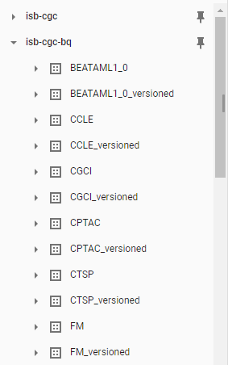

*************************
ISB-CGC BigQuery Projects
*************************

ISB-CGC has two Google BigQuery projects.  In order to see and query the ISB-CGC tables from the BigQuery Console, you'll need to link to these projects. This process, know as "pinning a project", is described `here <../progapi/bigqueryGUI/LinkingBigQueryToIsb-cgcProject.html>`_.

 - isb-cgc - This project has been in use since ISB-CGC's inception.
 - isb-cgc-bq - This is a new project as of July 2020. It will hold all new ISB-CGC tables, and many of the tables in the isb-cgc project will be migrated here over time.

.. figure:: ISBCGC-BQ-projects.png
    :align: right
    :figwidth: 300px

isb-cgc project
===============
 
The isb-cgc project contains all of the ISB-CGC BiqQuery tables created before July 2020.

Tables in isb-cgc will be retired, and labeled as deprecated as we copy them over to the new project. Table descriptions will include new table location. Eventually they will be turned into only views (with no preview ability), so existing references will continue to work correctly. Many older tables with light usage may remain in isb-cgc and not be copied over; tables with no logged recent usage may be deleted.
 
isb-cgc-bq project
===================

The isb-cgc-bq project contains all new ISB-CGC BigQuery tables created after July 1, 2020. It features a more intuitive data set and table organization, 
as well as consistent table naming both within and across programs.

This new project is a work in progress. The migration of existing tables from the isb-cgc project will be occurring over time, and will not be all at once.
**All new tables** will be created in this project.

isb-cgc-bq Data Set and Table Organization
------------------------------------------

Each Program has two data sets. 

  - One data set has (or will have after the migration) the latest tables for each data type (ex. miRNA Expression, File Metadata) that ISB-CGC has for that Program. This data set has the name of the Program.
 
   - Table names within this data set will consist of the following: Data Type, Reference Genome, Source, Current. Ex. TARGET.miRNAseq_h38_gdc_current
   - When using the `BigQuery Table Search UI <https://isb-cgc.appspot.com/bq_meta_search/>`_ to find these tables, select Status of **Current**.
   
  - The other data set contains (or will) previously released tables, as well as the most current table. Here, though, the name of the most current table will be appended with the release number or year and not "Current".
 
   - Table names within this data set will consist of the following: Data Type, Reference Genome, Source, Release Number or Year. Ex. TARGET.miRNAseq_h38_gdc_r22
   - When using the `BigQuery Table Search UI <https://isb-cgc.appspot.com/bq_meta_search/>`_ to find these tables, select Status of **Archived**.

