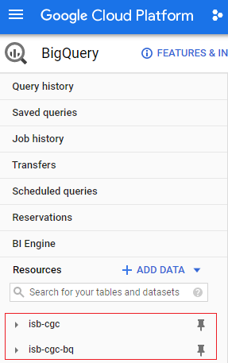
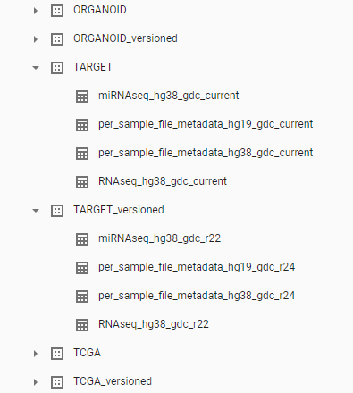

*************************
ISB-CGC BigQuery Projects
*************************

ISB-CGC has two open-access Google BigQuery projects.  To quickly access the ISB-CGC tables from your project on the Google BigQuery Console, you'll need to link to these projects. This process, known as "pinning a project", is described `here <../progapi/bigqueryGUI/LinkingBigQueryToIsb-cgcProject.html>`_.

 - **isb-cgc** - This project has been in use since ISB-CGC's inception.
 - **isb-cgc-bq** - This is a new project as of July 2020. It will hold all new ISB-CGC tables, and many of the tables in the isb-cgc project will be migrated here over time.

isb-cgc project
===============
 
The isb-cgc project contains all of the ISB-CGC BigQuery tables created before July 2020.

Tables in isb-cgc will be retired and labeled as deprecated as we copy them over to the new project. Table descriptions will include the new table location. Eventually they will be turned into only views (with no preview ability) to ensure that existing references will continue to work correctly. Many older tables with light usage may remain in isb-cgc and not be copied over; tables with no logged recent usage may be deleted. When using the `BigQuery Table Search UI <https://isb-cgc.appspot.com/bq_meta_search/>`_ to find these retired tables, select Status of **Deprecated**. 

Many tables will continue to have the status of **Current**, at least for the time being, until they are copied to the new project. In addition, there are tables with the status of **Archived** in the isb-cgc project and more may become archived. **Archived** indicates that the table contains an older version of data; a newer version of the same data exists in another table.

isb-cgc-bq project
===================

The isb-cgc-bq project contains all new ISB-CGC BigQuery tables created after July 1, 2020 as well as tables that have been migrated from project isb-cgc. It features a more intuitive data set and table organization, as well as consistent table naming both within and across cancer research programs.

This new project is a work in progress. The migration of existing tables from the isb-cgc project will be occurring over time, and will not be all at once. See the `Migration to Project isb-cgc-bq Release Notes <../ReleaseNotes/MigrationToISB-CGC-BQ.html>`_ to find out which tables have been migrated as of this time. 

**All new tables** will be created in this project.

isb-cgc-bq Data Set and Table Organization
------------------------------------------

Each Program has two data sets, one containing the most current data that ISB-CGC has, and one containing versioned tables, which serves as an archive of previously released tables.

As new data releases occur, the data in the "_current" tables will be replaced with this new data. If you want the most up-to-date data, use these tables in your queries.
However, if you want to ensure that your queries create a reproducible result, use a table from the "_versioned" data set. The most current data is also in this data set; however, the name of the table will end with the release number or year and not "current".

See below for more details.

.. list-table::
   :header-rows: 1

   * - Data Set Name
     - Data Set Contents
     - Table Name Format
     - Table Status
   * - <Program>
     - Latest tables for each data type (ex. miRNA Expression, File Metadata) that ISB-CGC has, per Program
     - Data Type, Reference Genome, Source, Current. Ex. ``TARGET.miRNAseq_hg38_gdc_current``
     - When using the `BigQuery Table Search UI <https://isb-cgc.appspot.com/bq_meta_search/>`_ to find these tables, select Status of **Current**.
   * - <Program>_versioned
     - Previously released tables, as well as the most current table 
     - Data Type, Reference Genome, Source, Release Number or Year. Ex. ``TARGET_versioned.miRNAseq_hg38_gdc_r22``. Here, the name of the most current table will end with the release number or year and not "current". 
     - Previously released tables have status of **Archived**. The most current table has the status of **Current**.
 
See below for a snapshot of the isb-cgc-bq data set and table organization in the Google BigQuery Console.

    
