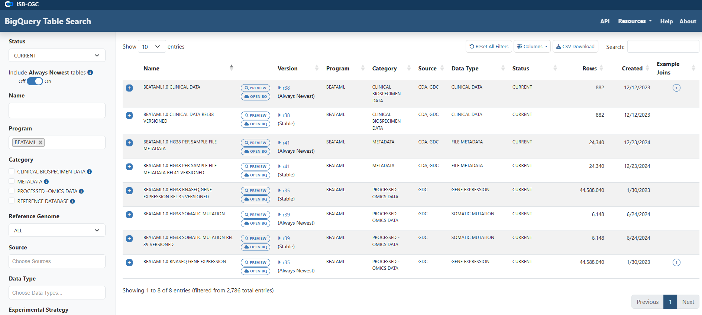
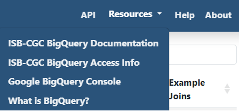
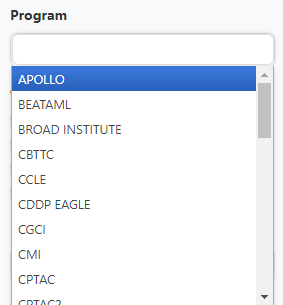
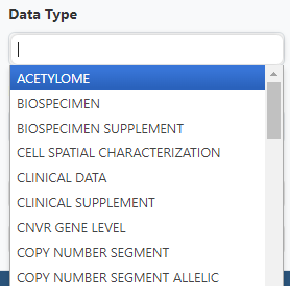
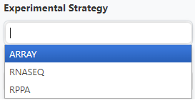
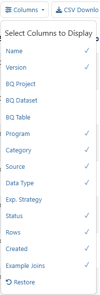
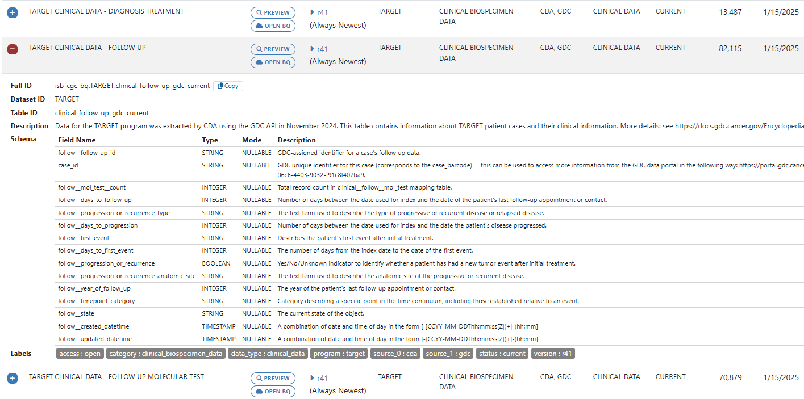
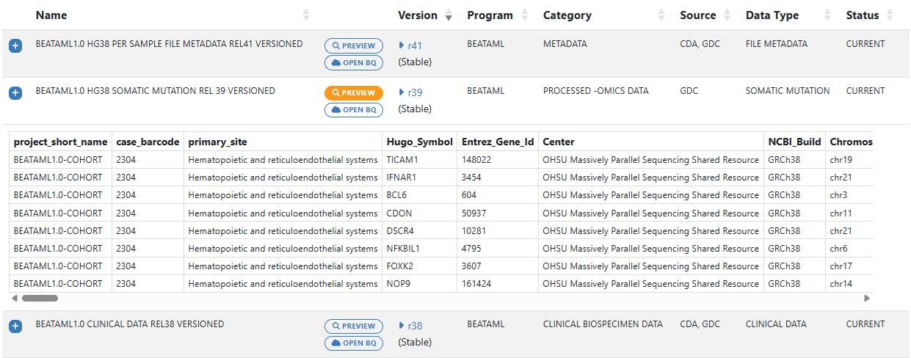

******************************
ISB-CGC BigQuery Table Search 
******************************

The ISB-CGC BigQuery Table Search UI (`<https://isb-cgc.appspot.com/bq_meta_search/>`_) is a discovery tool that allows users to explore and search for ISB-CGC hosted BigQuery tables. It can be accessed directly from the ISB-CGC homepage (`<https://isb-cgc.org/>`_) by clicking on **Launch** in the **BigQuery Table Search** box or selecting **BigQuery Table Search** from the **Data Browsers** drop down menu on the main menu bar. 

**Note**: Users are not required to have a Google Cloud Platform (GCP) project or an account to learn more about the tables hosted by ISB-CGC.

.. image:: BigQuery/BigQueryTableSearchUI.png
   :align: center

Currently, ISB-CGC hosts open access BigQuery tables containing data for over 25 research programs and for over 15 data types. Each table has been curated to include detailed table and field descriptions as well as table labels allowing users to search for BigQuery tables of interest using a free-form text search or via available filters. 

Links to various helpful documentation pages are available, including Google BigQuery's documentation and ISB-CGC's BigQuery documentation and the ISB-CGC Release Notes.

Filters
-------

The search filters consist of a combination of multi-select dropdown lists, checkboxes and free-form text fields. 

Selecting multiple items within a multi-select dropdown list or checkbox filter will perform a Boolean "AND" on those selections and bring back any data that match any of the selected items. For example, selecting Data Type BIOSPECIMEN and CLINICAL will display both biospecimen and clinical data.

Selecting multiple filters will perform a Boolean "OR" on those selections and bring back only data that fits all criteria. For example, selecting Data Type BIOSPECIMEN and Source of CCLE will only display CCLE biospecimen data.

Information about each filter is detailed below.

**Status**

We are committed to providing the most up-to-date information in our BigQuery tables but realize that at times researchers need to reference older versions of data. Each table is assigned a status based on the following criteria:

   * Tables with the most up-to-date available information are given a status of **current**
   * Tables with older versions of data are given a status of **archived**
   * Tables that have data that is no longer supported are **deprecated**
   
By default, the Status filter is set to Current.   
   
.. image:: BigQuery/Status-filter.png
   :align: center
   
**Name**   

The **Name** filter is a free-form text field; the user can type all or a portion of the name into the field to perform the search. It will match against the Name column. 

Note that this Name field is not the Table ID (which is used in SQL queries) but is a **Friendly Name**; that is, a descriptive, user-friendly name for the table. 

**Program**

Filter the BigQuery tables by programs such as CCLE, TARGET and TCGA by using the **Program** filter. Click the Program box to see the dropdown list and click on a program to select it. Additional programs can be selected by clicking in the Program box again. 

   
**Categories**

The tables are grouped into four high-level categories: 

* **Clinical Biospecimen Data**: Patient case and sample information (includes clinical tables with patient demographic data, and biospecimen data with detailed sample information)

* **File Metadata**: Information about raw data files including Google Cloud Storage Paths (includes tables with information                       about files available at the GDC, including GCS paths, creation dates, sizes, etc.)

* **Genomic Reference Database**: Genomic information that can be used to cross-reference against processed-omics data tables                                   (examples include  COSMIC, ClinVar, cytoBand, dbSNP, Ensembl, Ensembl2Reactome)

* **Processed-omics Datasets**: Processed data primarily from the GDC (i.e. raw data that has gone through GDC pipeline                                        processing e.g. gene expression, miRNA expression, copy number, somatic mutations, methylation)

Click on one or more checkboxes to select categories. 
Hovering the cursor over the information icon will display a short description of the category.

.. image:: BigQuery/Category-filter.png
   :align: center

**Reference Genome Build**

Filter for tables that contain data for hg19 or hg38. In a few cases, there are tables which contain information from both genome builds; for example, tables that include liftover coordinates between the reference builds. 

By default, the **Reference Genome** filter is set to ALL.  

.. image:: BigQuery/GenomeReference-filter.png
   :align: center

**Source**

Search through the sources of the data in our BigQuery tables by using the **Source** filter. Click the Source box to see the dropdown list and click on a source to select it. Additional sources can be selected by clicking in the Source box again. 

.. image:: BigQuery/Source-filter.png
   :align: center

**Data Type**

The **Data Type** filter also allows you to filter for data types of interest. Like Source, multiple Data Types can be selected.

**Experimental Strategy**

The **Experimental Strategy** filter also allows you to filter for experimental strategies of interest. Multiple Experimental Strategies can be selected.

**Access**

The **Access** filter has options of All, Open Access and Controlled Access. Controlled Access tables will be displayed with a Lock icon to the right of the table name. Controlled Access data cannot be previewed, but can be opened in the Google BigQuery Console, if the user has the required permissions. 

.. image:: BigQuery/Access-filter.png
   :align: center

**More Filters**

The **Show More Filters** button can be used to display **BQ Project**, **BQ Dataset**, **BQ Table**, **Table Description**, **Labels** and **Field Name** filters. Except for BQ Project, these are free-form text fields; the user can type all or a portion of the name into the field to perform the query. For instance, for all datasets which have "alpha" in the name, type "alpha" into the field.

These fields are most useful for users already familiar with the BigQuery tables.

**Labels**

Each table was tagged with labels relating to the status, program, reference genome build, source, data type, experimental strategy and access. Users can search on any of these labels on the Labels filter field. Users can find the **Labels** search filter under the **Show More Filters** option. 

The labels for a table can be viewed when the blue plus sign (+) to the left of the table row is clicked. See the screen shot in the Schema section below.

Search Results
--------------

By default, each row will display the Name, Category, Source, Data Type, Status, number of rows, and Created Date of the table.

Click on the column header to sort the displayed results by that column.

**Columns Selector**

Columns can be added or removed from the display by using the Columns selector. For instance, the Bq Project, BQ Dataset and BQ Table are not initially displayed, but they can be added to the display.

**Search Box**

To further filter the results, use the **Search** box above the results, on the right-hand side. This is a free-form text field; the user can type all or a portion of the search item into the field to perform the query. This searches all fields in the table.

**Export**

To export the results of your search to a file in Comma Separated Values (CSV) format, click the **CSV Download** button.

Schema Description
++++++++++++++++++

For detailed table information, click on the blue plus sign (+) on the left-hand side. 

The following information is displayed:

   * **Full ID** - This is the Project, Dataset ID, and Table ID concatenated with periods between them. The Full ID is used in SQL queries.
   * **Dataset ID** - The BigQuery dataset of the table. A data set is a group of related tables.
   * **Table ID** - The BigQuery table ID.
   * **Description** - A description of the table, which includes information such as how the data was created, its source, data type, and contents.
   * **Schema** - The schema displays the Field Name, Type, Mode and Field Description for each field in the table.
   * **Labels** - Labels are table metadata describing the source, data type, reference genome build, status, and access of the table data.

**Copy button**

Next to the Full ID is a **Copy** button. When the user clicks this, the Full ID is copied to the clipboard. The Full ID can then be pasted into an SQL query within the BigQuery Query editor.

**Open button**

Next to the Copy button is an **Open** button. Clicking on this button opens the table in the BigQuery Google Cloud Platform Console. For more details, see the **Table Access in Google BigQuery** section below.

Table Preview
++++++++++++++

A few rows of the data in a BigQuery table can be viewed by clicking on the **Preview** button on the right-hand side. This feature allows the user to get a better idea of the contents and format of the data.

 
 
Table Access in Google BigQuery
-------------
To access the BigQuery tables in Google Cloud Console directly from the Table Search UI, simply click on the **Open** button on the right-hand side. 

**Note:** 
 * If you have previously accessed the Google Cloud Platform and have a Google Cloud Platform project already set up, this button will automatically open up the table in the Google BigQuery Console as depicted in the image below.

 * If you have never accessed Google Cloud Platform, you will be presented with a Google login page. You can use any Google ID to log in. Instructions on how to create a Google identity if you don't already have one can be found `here <HowToGetStartedonISB-CGC.html#data-access-and-google-cloud-project-setup>`_. You will be prompted to create a project, free of charge. Once you create the project, you will be directed to the BigQuery table you wished to open in the Google BigQuery Cloud Platform Console. 

`Google Cloud Platform's free tier <https://cloud.google.com/free>`_ allows users to access many common Google Cloud resources including BigQuery free of charge and query up to 1 TB of data per month for free.

.. image:: BigQuery/BigQueryOpenButton.gif
   :align: center

Please see the following ISB-CGC documentation pages for guidance:

* `How to create a Google Cloud Platform (GCP) project <HowToGetStartedonISB-CGC.html>`_ 
* `How to link ISB-CGC BigQuery tables to your Google Cloud Platform (GCP) project <progapi/bigqueryGUI/LinkingBigQueryToIsb-cgcProject.html>`_ 
