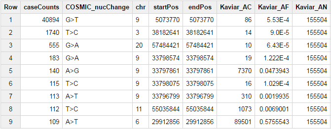
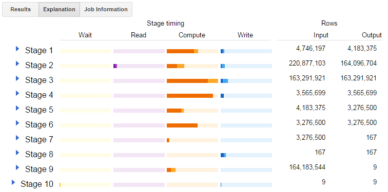

*************************************
COSMIC in BigQuery hosted by ISB-CGC
*************************************

.. image:: COSMIC.png
   :scale: 40 %
   :align: right

The COSMIC tables in BigQuery, produced in collaboration with the 
`Wellcome Trust Sanger Institute <http://www.sanger.ac.uk/>`_, provide 
a new way to explore and understand the mutations driving cancer.  
The availability of COSMIC in BigQuery enables easy integration of this 
resource with other public datasets in BigQuery, including other 
open-access datasets made available by the ISB-CGC 
(see `this <http://isb-cancer-genomics-cloud.readthedocs.io/en/latest/sections/data/data2/data_in_BQ.html>`_
and `that <http://isb-cancer-genomics-cloud.readthedocs.io/en/latest/sections/data/Reference-Data.html>`_ 
for more details on other publicly accessible BigQuery datasets).

**COSMIC Release v82 update**: Two new BigQuery datasets now contain *all* of the tables
available for download from the `COSMIC ftp site <http://cancer.sanger.ac.uk/cosmic/download>`_.
The availability of these additional tables will support 
many more types of queries -- please explore them at (after registering for access as described below):
    - `isb-cgc:COSMIC_v82_grch38 <https://bigquery.cloud.google.com/dataset/isb-cgc:COSMIC_v82_grch38>`_
    - `isb-cgc:COSMIC_v82_grch37 <https://bigquery.cloud.google.com/dataset/isb-cgc:COSMIC_v82_grch37>`_
Details about the underlying COSMIC export files used to create these BigQuery tables can be
found in README files for 
`GRCh38 <https://raw.githubusercontent.com/isb-cgc/readthedocs/master/docs/source/sections/cosmic/README-cosmic-grch38.txt>`_ 
and 
`GRCh37 <https://raw.githubusercontent.com/isb-cgc/readthedocs/master/docs/source/sections/cosmic/README-cosmic-grch37.txt>`_.

Getting Started
###############

`Register <https://cancer.sanger.ac.uk/cosmic/register>`_ for access to
`COSMIC <https://cancer.sanger.ac.uk/cosmic/about>`_ in `BigQuery <https://cloud.google.com/bigquery/what-is-bigquery>`_:

    * if you are already a registered user of COSMIC, you will need to go to `your account <https://cancer.sanger.ac.uk/cosmic/myaccount>`_ page and add a valid "Google identity" in the Google ID box: when you are signed in to COSMIC, your name in the upper-right corner is a pull-down menu from which you can access your Account Settings;
    * if the Email Address that you initially used when registering for COSMIC is already a valid Google identity, you may simply re-enter the same email address into the Google ID box;
    * if you are not sure whether your institutional (or other) email address is a Google identity, you can check by entering it in the Google `password-assistance page <https://accounts.google.com/ForgotPasswd>`_; or by asking your IT staff;
    * if you are not currently a registered COSMIC user, you will first need to `register <https://cancer.sanger.ac.uk/cosmic/register>`_, agree to the Terms and Conditions, and supply a valid Google identity in the Google ID box;

Once you have completed these steps, ISB-CGC will obtain the Google identity that you provided and you will be given "viewer" access to the COSMIC tables in BigQuery.  You will also be added to an exploratory Google Cloud Platform (GCP) project called isb-cgc-cosmic which will allow you to run queries at no cost to you.
 
A few important notes:

    * When you register with COSMIC, you create a password for your COSMIC account -- which is associated with whatever email address you provided.  This password is your COSMIC password, please avoid reusing any other password.
    * If you are not sure what a "Google ID" is, it is the name associated wth a  "Google account"  -- this includes any gmail address.  If you do not already have a Google account, you can `create one <https://accounts.google.com/SignUp?hl=en>`_.
    * If you mistype your Google ID, or enter a string that is not a valid Google ID, you will not be able to access the COSMIC tables in BigQuery.  Google IDs are not being automatically verified at this time, so please double-check that the Google ID you provided is correct.  
    * Avoid using an alias: *eg* the base account tb@mylab.org might have a longer-form alias like thomas.brown@mylab.org -- please enter the 'base' name;

Interactive Web-based Exploration
#################################

**NB**:  After going through the registration process described above, there will be a short 
delay before your Google identity is granted the necessary access to BigQuery and the COSMIC 
data resources.  If you get an error when running the sample query in this section, please 
wait 10-15 minutes and then try again. If you are still not successful, please 
`verify <https://accounts.google.com/ForgotPasswd>`_
that the Google ID you have provided is a valid Google account.  If you are still not able
to run the sample query given below, please contact us at feedback@isb-cgc.org.

    * `login <https://accounts.google.com/Login>`_ to your Google account (`Chrome <https://www.google.com/chrome/browser/desktop/index.html>`_ is the preferred browser);
    * go to the `BigQuery web UI <https://bigquery.cloud.google.com>`_  --  if you see a welcome screen inviting you to **Create a Project** then your ISB-CGC registration process is not yet complete;

.. image:: COSMIC-sql-00.png
   :scale: 90 %
   :align: right
..

    * click on the big red **COMPOSE QUERY** button in the upper left corner;
    * click on the **Show Options**  button below the **New Query** text-box;
    * un-check the **Use Legacy SQL** check-box (the bottom-most "option");
    * click on the **Hide Options** button;
    * paste the sample query below into the New Query text-box;
    * within a second or two you should see a green circle with a check-mark below the lower-right-corner of the New Query text-box  --  if instead you see a red circle with an exclamation mark, click on it to see what your Syntax Error is;
    * once you do have the green circle, you can click on it to see a message like: "Valid: This query will process 131 MB when run."
    * to execute the query, click on **RUN QUERY** !       

.. code-block:: sql

    WITH
      mutCounts AS (
      SELECT
        COUNT(DISTINCT(ID_tumour)) AS CaseCount,
        Mutation_AA,
        Gene_name
      FROM
        `isb-cgc.COSMIC_v82_grch37.Mutant`
      GROUP BY
        Mutation_AA,
        Gene_name ),
      mutRatios AS (
      SELECT
        Mutation_AA,
        Gene_name,
        CaseCount,
        (CaseCount/SUM(CaseCount) OVER (PARTITION BY Gene_name)) AS ratio
      FROM
        mutCounts )
    SELECT
      *
    FROM
      mutRatios
    WHERE
      CaseCount>=1000
      AND ratio>=0.10
      AND NOT ( Mutation_AA LIKE "%?%" )
    ORDER BY
      Gene_name,
      ratio DESC

BigQuery Usage Costs
####################

More details about BigQuery costs can be found in the Google 
`documentation <https://cloud.google.com/bigquery/pricing>`_.  
There are two basic types of costs: storage costs and usage costs.  ISB-CGC is hosting 
these COSMIC tables in BigQuery and is paying for the storage costs (with support from NCI).  
The size of each COSMIC table is less than 1.5 GB and therefore costs less than $0.25 per year to store.

The main costs associated with using BigQuery are the query costs.  BigQuery is a 
cloud-based massively parallel analytic engine which can scan terabytes of data in seconds.  
Query costs start at $5 (USD) per TB of data scanned, but can be higher for more 
computationally intensive queries (*eg* those that include complex user-defined-functions).

For the sample query above, we saw that clicking on the check-mark in the green circle 
produced this message: Valid:  This query will process 131 MB when run.
The cost of this specific query can be estimated using this information: 
($5/TB) x (131 MB / (1000000 MB/TB)) = $0.000655.  This cost is very (perhaps suprisingly) low, 
but it is always important to think carefully about your queries and to make them as 
efficient as possible.  If you want to derive summary information about all ~20,000 genes, 
for example, you could do that with a single query that might cost a few pennies, or 
you might write a less-clever query that returns information only about a single gene 
and then programmatically loop over all genes, running that single-gene query 20,000 times.  
Your overall query costs using this less-clever approach, instead of being a few pennies 
would be several hundred dollars!  This latter approach would also take significantly more time.  

As your queries become more complex and you begin to join in other resources such as the 
ISB-CGC `genomic-reference <http://isb-cancer-genomics-cloud.readthedocs.io/en/latest/sections/data/Reference-Data.html>`_ 
or 
`molecular-data <http://isb-cancer-genomics-cloud.readthedocs.io/en/latest/sections/data/data2/data_in_BQ.html>`_ 
tables, the amount of data processed by a 
single query may increase into the GB or even TB range.

During this introductory period (for at least the next 6 months), all registered COSMIC 
users will be added to the ``isb-cgc-cosmic`` Google Cloud Platform (GCP) project so that 
they will be able to perform exploratory queries at no cost.  
(These costs will be paid by ISB-CGC, again with funding from NCI.)  Please note that 
users who perform large numbers of queries and incur significant costs will be 
removed from the ``isb-cgc-cosmic`` GCP project and will be required to create their own 
GCP projects prior to performing additional queries.  If you want to be able to 
upload your own data to BigQuery or save the results of your queries as new BigQuery tables,
you will need to have your own GCP project.  (All new GCP users are welcome 
to take advantage of the Google `free trial <https://cloud.google.com/free/>`_ 
which includes up to $300 in funding to be used over a period of one year.)

Additional Public BigQuery Datasets
###################################

There are many public BigQuery datasets containing genomic information, and you 
can combine any of these resources into your SQL queries on the COSMIC tables -- 
all you need is the name of the table.
  
In the example query above, the table being queried is ``isb-cgc.COSMIC_v82_grch37.Mutant``; 
a complete BigQuery table name has three components:

    * the first part of the name (isb-cgc) is the Google Cloud Platform (GCP) project name; 
    * the second part (COSMIC_v82_grch37) is the dataset name; and 
    * the third part (Mutant) is the table name.

To add public BigQuery datasets and tables to your "view" in the BigQuery web UI you 
need to know the name of the GCP project that owns the dataset(s).  
To add the publicly accessible ISB-CGC datasets (project name: ``isb-cgc``)
follow these steps_.

.. _steps: http://isb-cancer-genomics-cloud.readthedocs.io/en/latest/sections/progapi/bigqueryGUI/LinkingBigQueryToIsb-cgcProject.html

You should now be able to see and explore all of the ISB-CGC public datasets, including 
the COSMIC dataset, if you are a registered COSMIC user.  Clicking on the blue triangle 
next to a dataset name will open it and show the list of tables in the dataset.  Clicking 
on a table name will open up information about the table in main panel, where you can 
view the Schema, Details, or a Preview of the table.

Additional projects with public BigQuery datasets which you may want to explore (repeating 
the same process will add these to your BigQuery side-panel) include genomics-public-data and
google.com:biggene.

Additional BigQuery Documentation
#################################

The main Google BigQuery documentation can be found `here <https://cloud.google.com/bigquery/docs/>`_.

Legacy SQL vs Standard SQL
--------------------------

BigQuery introduced support for 
`Standard SQL <https://cloud.google.com/bigquery/docs/reference/standard-sql/>`_ 
in 2016.  The previous version of SQL supported by 
BigQuery is now known as 
`Legacy SQL <https://cloud.google.com/bigquery/docs/reference/legacy-sql>`_.  
Note that when you first go to the BigQuery web UI, 
Legacy SQL will be activated by default and you will need to enable Standard SQL if you want to 
use Standard SQL.  For simple queries, the same syntax will work in both, except for one 
important detail which is how you specify the table name.  A simple Standard SQL query might look like:

.. code-block:: sql

    SELECT *
      FROM `isb-cgc.COSMIC.COSMIC_v82_grch37.Mutant`
      LIMIT 1000

whereas the same query in Legacy SQL requires square brackets around the table name and a colon 
between the project name and the dataset name, like this:

.. code-block:: sql

    SELECT *
      FROM [isb-cgc:COSMIC_v82_grch37.Mutant]
      LIMIT 1000

SQL functions
-------------

Standard SQL includes a large variety of built-in 
`functions and operators <https://cloud.google.com/bigquery/docs/reference/standard-sql/functions-and-operators>`_ 
including logical and statistical aggregate functions, and mathematical functions, just to name a few.  
`User-defined functions <https://cloud.google.com/bigquery/docs/reference/standard-sql/user-defined-functions>`_ (UDFs) 
are also supported and can be used to further extend the types of analyses possible in BigQuery.

Using the bq Command Line Tool
------------------------------
The **bq** command line tool is part of the 
`cloud SDK <https://cloud.google.com/sdk/>`_ and can be used to interact directly 
with BigQuery from the command line.  The cloud SDK is easy to install and 
is available for most operating systems.  You can use **bq** to create and upload
your own tables into BigQuery (if you have your own GCP project), 
and you can run queries at the command-line like this:

.. code-block:: none

   bq query --allow_large_results \
            --destination_table="myproj:dataset:query_output" \
            --nouse_legacy_sql \
            --nodry_run \
            "$(cat myQuery.sql)"

(where myQuery.sql is a plain-text file containing the SQL, and the destination
table is in an existing BigQuery dataset in your project).

Using BigQuery from R
---------------------
BigQuery can be accessed from R using one of two powerful R packages: 
`bigrquery <https://cran.r-project.org/web/packages/bigrquery/>`_ and 
`dplyr <https://cran.r-project.org/web/packages/dplyr/>`_.  
Please refer to the documentation provided with these packages for more information.

Using BigQuery from Python
--------------------------
BigQuery 
`client libraries <https://cloud.google.com/bigquery/docs/reference/libraries#client-libraries-install-python>`_ 
are available that let you interact with BigQuery from Python or other languages.  
In addition, the experimental 
`pandas.io.gbq <http://pandas.pydata.org/pandas-docs/stable/io.html#google-bigquery-experimental>`_ 
module provides a wrapper for BigQuery.

Getting Help
------------
Aside from the documentation, the best place to look for help using BigQuery and tips 
and tricks with SQL is 
`StackOverflow <http://stackoverflow.com/>`_.  If you tag your question with ``google-bigquery``     
your question will quickly get the attention of Google BigQuery experts.  You may also find 
that your question has already been asked and answered among the nearly 10,000 questions 
that have already been asked about BigQuery on StackOverflow. 

More SQL Examples
#################

Let's start with a few simple examples to get some practice using BigQuery, and to 
explore some of the available fields in these COSMIC tables.  

.. image:: COSMIC-sql-01.png
   :scale: 75 %
   :align: right

Note that all of these examples are in "Standard SQL", so make sure that you have that enabled.
(See instructions above regarding un-checking the "Legacy SQL" box in the BigQuery web UI.)

**1. How many mutations have been observed in KRAS?**

.. code-block:: sql

   SELECT
     COUNT(DISTINCT(ID_sample)) AS numSamples,
     COUNT(DISTINCT(ID_tumour)) AS numTumours
   FROM
     `isb-cgc.COSMIC_v82_grch37.Mutant`
   WHERE
     Gene_name="KRAS"

You can simply copy-and-paste any of the SQL queries on this page into the 
`BigQuery web UI  <https://bigquery.cloud.google.com>`_ .  The screen-shot
shown here shows the query in the "New Query" box, and the results 
down below.  Just click on the "RUN QUERY" button to run the query.  
Notice the green check-mark indicating that the query looks good.

**2. What other information is available about these KRAS mutant tumours?**

In addition to answering the question above, 
this next query also illustrates usage of the **WITH** construct to create an intermediate
table on the fly, and then use it in a follow-up **SELECT**:

.. code-block:: sql

   WITH
     t1 AS (
     SELECT
       ID_tumour,
       Primary_site,
       Primary_histology,
       Mutation_AA,
       Mutation_Description,
       FATHMM_prediction,
       Sample_source
     FROM
       `isb-cgc.COSMIC_v82_grch37.Mutant`
     WHERE
       Gene_name="KRAS"
     GROUP BY
       ID_tumour,
       Primary_site,
       Primary_histology,
       Mutation_AA,
       Mutation_Description,
       FATHMM_prediction,
       Sample_source )
   SELECT
     COUNT(*) AS n,
     Primary_site,
     Primary_histology,
     Mutation_AA,
     Mutation_Description,
     FATHMM_prediction,
     Sample_source
   FROM
     t1
   GROUP BY
     Primary_site,
     Primary_histology,
     Mutation_AA,
     Mutation_Description,
     FATHMM_prediction,
     Sample_source
   ORDER BY
     n DESC

**3. What are the most frequently observed mutations and how often do they occur?**

.. code-block:: sql

   WITH
     t1 AS (
     SELECT
       ID_tumour,
       Gene_name,
       Mutation_AA,
       Mutation_Description
     FROM
       `isb-cgc.COSMIC_v82_grch37.Mutant`
     GROUP BY
       ID_tumour,
       Gene_name,
       Mutation_AA,
       Mutation_Description )
   SELECT
     COUNT(*) AS n,
     Gene_name,
     Mutation_AA,
     Mutation_Description
   FROM
     t1
   GROUP BY
     Gene_name,
     Mutation_AA,
     Mutation_Description
   HAVING
     n >=1000
   ORDER BY
     n DESC

.. _CKE_query:
**4. Joining COSMIC to Kaviar and Ensembl -- all in BigQuery!**

Now let's try something a bit more complicated!  We're going to query the COSMIC database
and then join the intermediate results with the 
`Kaviar <http://db.systemsbiology.net/kaviar/>`_ table and the 
`Ensembl <http://grch37.ensembl.org/Homo_sapiens/Info/Index>`_ gene-set.  
(Note that since
most of the available TCGA data is based on GRCH37/hg19, we're still frequently using
those older reference sources, but newer gene-sets are also available in the ISB-CGC
`genome_reference dataset <https://bigquery.cloud.google.com/dataset/isb-cgc:genome_reference>`_ 
in BigQuery.

`Kaviar <http://db.systemsbiology.net/kaviar/>`_ is a large database
of known variants which is also 
`available <https://bigquery.cloud.google.com/table/isb-cgc:genome_reference.Kaviar_160204_Public_hg19>`_ 
in BigQuery, hosted by the ISB-CGC.
In the complex query below, we will extract a subset of commonly observed
mutations in cancer from COSMIC and then see how many of them have also
been observed in "normal" genomes 
(Kaviar excludes cancer genomes but includes some data from cell lines 
and individuals affected by disease.)

.. code-block:: sql

   WITH
     --
     -- *COSMIC_t1*
     -- Our first subquery intermediate table extracts just the sample-name, nucleotide-change
     -- and genomic coordinates from the COSMIC table for all single-nucleotide mutations.
     -- The resulting intermediate table contains ~3.7M rows
     COSMIC_t1 AS ( SELECT
       -- some of the TCGA identifiers are 12-characters long and some 15 -- this CASE statement
       -- just strips off the additional 3 characters from the longer identifiers
       (CASE
           WHEN (Sample_name LIKE 'TCGA-%' AND CHAR_LENGTH(Sample_name)>12) THEN SUBSTR(Sample_name,1,12)
           ELSE Sample_name END) AS Sample_name,
       -- here we split off just the nucleotide-change, eg "G>T"
       SUBSTR(Mutation_CDS,-3,3) AS COSMIC_nucChange,
       -- here we're splitting up the genomic coordinate into it's three component parts:
       SPLIT(Mutation_genome_position,':')[OFFSET(0)] AS chr,
       CAST(SPLIT(SPLIT(Mutation_genome_position,':')[OFFSET(1)],'-')[OFFSET(0)] AS INT64) AS startPos,
       CAST(SPLIT(SPLIT(Mutation_genome_position,':')[OFFSET(1)],'-')[OFFSET(1)] AS INT64) AS endPos
     FROM
       `isb-cgc.COSMIC_v82_grch37.Mutant`
     WHERE
       Mutation_genome_position IS NOT NULL
       AND GRCh=37
       AND SUBSTR(Mutation_CDS,-2,1)='>'
     GROUP BY
       Sample_name,
       Mutation_CDS,
       Mutation_genome_position ),
     --
     -- *COSMIC_t2*
     -- Next, we want to count up how frequently these mutations have been observed, and keep
     -- only those mutations that are observed in at least 100 samples in COSMIC: this brings
     -- our number of "interesting" mutations down to just 167, with caseCounts ranging from
     -- over 40,000 down to 100.
     COSMIC_t2 AS (
     SELECT
       COUNT(*) AS caseCounts,
       COSMIC_nucChange,
       chr,
       startPos,
       endPos
     FROM
       COSMIC_t1
     GROUP BY
       COSMIC_nucChange,
       chr,
       startPos,
       endPos
     HAVING
       caseCounts>=100 ),
     --
     -- *fromKaviar*
     -- Now we want to bring the Kaviar database into our analysis: we're going to extract most of the
     -- columns from the Kaviar table, while adjusting the 0-based coordinates and keeping only the
     -- single-nucleotide variants that were seen at least 10 times.
     -- The resulting intermediate table has ~33.5M rows.
     fromKaviar AS (
     SELECT
       reference_name AS chr,
       (start_pos+1) AS startPos,
       (end_pos+0) AS endPos,
       reference_bases,
       alternate_bases,
       MAX(AC) AS AC,
       MAX(AF) AS AF,
       MAX(AN) AS AN
     FROM
       `isb-cgc.genome_reference.Kaviar_160204_Public_hg19`
     WHERE
       (end_pos-start_pos)=1
       AND CHAR_LENGTH(reference_bases)=1
       AND CHAR_LENGTH(alternate_bases)=1
     GROUP BY
       reference_name,
       start_pos,
       end_pos,
       reference_bases,
       alternate_bases
     HAVING
       AC>=10 ),
     --
     -- *join1*
     -- Now we're going to join the table of frequent COSMIC variants to the intermediate Kaviar table,
     -- requring that the genomic coordinates and the nucleotides match.
     join1 AS (
     SELECT
       c.caseCounts AS caseCounts,
       c.COSMIC_nucChange AS nucChange,
       c.chr AS chr,
       c.startPos AS startPos,
       c.endPos AS endPos,
       k.AC AS Kaviar_AC,
       k.AF AS Kaviar_AF,
       k.AN AS Kaviar_AN
     FROM
       COSMIC_t2 c
     JOIN
       fromKaviar k
     ON
       c.chr=k.chr
       AND c.startPos=k.startPos
       AND c.endPos=k.endPos
       -- just in case the reference and the alternate have been swapped,
       -- we check for both kinds of matches:
       AND ( (reference_bases=SUBSTR(c.COSMIC_nucChange,1,1)
           AND alternate_bases=SUBSTR(c.COSMIC_nucChange,3,1))
         OR (reference_bases=SUBSTR(c.COSMIC_nucChange,3,1)
           AND alternate_bases=SUBSTR(c.COSMIC_nucChange,1,1)) ) ),
     --
     -- *Ensembl*
     -- Before we finish, we want to also pull in some information from Ensembl,
     -- so we're going to select a few columns from the Ensembl_GRCh37_75 table
     -- (also publicly available in BigQuery).  This subquery will create a
     -- table with information about ~132k exons:
     Ensembl AS (
     SELECT
       gene_name,
       exon_id,
       seq_name,
       start,
       `end`
     FROM
       `isb-cgc.genome_reference.Ensembl_GRCh37_75`
     WHERE
       exon_number IS NOT NULL
       AND feature="exon"
       AND transcript_source="ensembl"
     GROUP BY
       gene_name,
       exon_id,
       seq_name,
       start,
       `end` )
     --
     -- In our final step, we will join the results of the earlier join with the
     -- Ensembl reference information obtained above.
     -- We're down to just a handful of mutations which, for the most part occur 
     -- frequently in COSMIC and quite rarely in Kaviar.
   SELECT
     caseCounts,
     nucChange,
     chr,
     startPos AS pos,
     Kaviar_AC,
     Kaviar_AF,
     Kaviar_AN,
     gene_name,
     exon_id
   FROM
     join1 j
   JOIN
     Ensembl r
   ON
     j.chr=r.seq_name
     AND r.start<=j.startPos
     AND r.`end`>=j.endPos
   ORDER BY
     caseCounts DESC,
     Kaviar_AF DESC

Our final result includes only 8 mutations that are found relatively frequently
in COSMIC and are also found (though generally rarely) in Kaviar.  Notice the
frequently-mutated gene 
`PRSS3 <http://grch37-cancer.sanger.ac.uk/cosmic/gene/analysis?ln=PRSS3>`_ 
(which encodes a member of the trypsin family of serine proteases),
and the major histocompatibility gene
`HLA-A <http://grch37-cancer.sanger.ac.uk/cosmic/gene/analysis?ln=HLA-A>`_.

You can also click on the "Explanation" button to see diagnostic information about
the completed query's execution plan.  This feature is similar to the EXPLAIN 
statement available in some other query engines.  You can often use this information
to improve query performance.

|
|

**Stay-tuned, more examples coming soon!**

If you have a specific use-case that you need help with, feel free to contact us!

