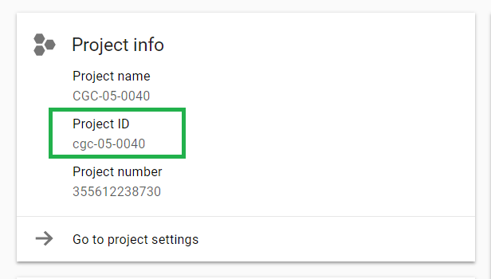
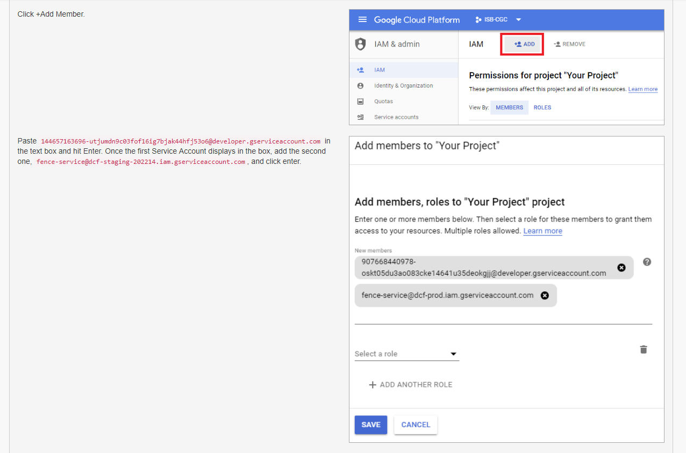

************************************************
Accessing Controlled Data from a GCE VM
************************************************
This section only applies to ISB-CGC users with access to a Google Cloud Platform (GCP) 
`project <https://cloud.google.com/resource-manager/docs/creating-managing-projects>`_.
GCP projects are automatically configured with a "Compute Engine default service account"
which you can find on the `IAM & Admin page <https://console.cloud.google.com/iam-admin/iam/project>`_ of the 
`Cloud Console <https://console.cloud.google.com/home/dashboard>`_.  You can create additional
service accounts for special purposes, but most users will be able to just use this one
default service account.

When running on a Google Compute Engine (GCE) VM (virtual machine), a "service account" associated with
your Google Cloud Project (GCP) is acting on your behalf and those are the credentials being
used rather than your personal credentials.  (If you want to learn more about service accounts, please
refer to the Google `documentation <https://cloud.google.com/iam/docs/service-accounts>`_.)

In order for this **service account** to access controlled data, you must register it with ISB-CGC.
Once this process has completed successfully, this service account will be able to access controlled
data for up to 7 days.

NOTES: 

- To allow flexibility while working with different research teams and different processes, you can have many GCPs registered with ISB-CGC, as well as many service accounts registered per GCP.
- If the service account (*ie* any program running on a VM using the service account's credentials) tries to access controlled data after the 7 day expiration, it will get an Access Denied error; to prevent this from causing problems with long-running jobs, you can extend access by another 7 days (see below).

Requirements for Registering a Google Cloud Project Service Account
--------------------------------------------------------------------
To be able to register your GCP Project and at least one service account to access controlled data the following must all be true:

- You must be an **owner** of the GCP project (because you will need to add an ISB-CGC service account as a new project member and a DCF service account as a new project member)
 - 907668440978-oskt05du3ao083cke14641u35deokgjj@developer.gserviceaccount.com
 - fence-service@dcf-prod.iam.gserviceaccount.com
- At any time, ALL members of the project MUST be authorized to use the data set (*ie* be a registered dbGaP "PI" or "downloader") (see dbGap Data Access `Request Portal <http://dbgap.ncbi.nlm.nih.gov/aa/wga.cgi?login=&page=login>`_, and `Understanding Data Security <http://isb-cancer-genomics-cloud.readthedocs.org/en/latest/sections/data//TCGA_Data_Security.html>`_ for more details).
- All members of the project have signed in to the ISB-CGC Web App *at least once*
- All members of the project have authenticated via the NIH login page and thereby linked their NIH identity to their Google identity
- The GCP project cannot be associated with an Organization
- No Google Groups or other multi-member identifiers (e.g. all authenticated Google users) have been provided with a project role
- The GCP project must have the ISB-CGC monitoring service account (SA) assigned to an Editor role
- All SAs with roles in the project must belong to the project, with the exception of the ISB-CGC monitoring SA; this means that all Google-managed SAs with project roles must belong to the project as well
- The SA you are registering cannot be the ISB-CGC monitoring SA, or SAs from other projects
- You have not created any keys for any SAs in the project
- No IDs have been assigned roles on any SAs in the project

If ANY of these requirements are not met, your GCP and ANY associated service accounts will **not** be able to access controlled data.  An automated email will be sent to the GCP project owner(s) if data access is revoked.

Registering your Google Cloud Project Service Account
--------------------------------------------------------------
To register your GCP and its Service Account with ISB-CGC, select the "persona" icon next to your login name on the ISB-CGC WebApp, 
which takes you to the following page:

.. image:: webapp/RegisteredGCPs.png
   :align: center
   
Select the "Register a Google Cloud Project" link.  That takes you to the following page:

.. image:: webapp/RegisterAGCPForm.png
   :align: center
   
Please fill out the form following the provided instructions. You can hide the instructions by selecting the blue Instructions button.  
You must enter your GCP ID and enable the isb-cgc service account as an editor in your project to move on to the next step.  

   

Please be sure to add both service accounts listed below. If you don't add both service accounts you will run into issues viewing the controlled data in ISB-CGC.

Once you have completed these steps you will be presented at the bottom of the same page a listing of the members of your GCP you registering (see screenshot below):

.. image:: webapp/GCPMembers.png
   :align: center
   
Pushing the "Register" button will take you to the next screen:

.. image:: webapp/0007projectregistered.PNG
   :align: center
   
Select "Register Service Account" from the drop down menu on the left of the GCP you want to add a service account to.  By default, there will be the 
Compute Engine Default service account in the Enter the service account ID text box (see screenshot below).  Additionally, select the programs you wish
to gain access to by selecting the checkbox to the associated Controlled Dataset(s) you plan to access.  Currently you can select either Controlled TCGA data
or controlled TARGET data to gain access  to.

.. image:: webapp/RegisterAServiceAccountFirstScreen.PNG
   :align: center

If you receive the error message listed below, this signifies you need to enable the Default Compute Engine API for your Google Cloud Project.  
For more information on how to enable all the API's you will need to work on a Google Cloud Project please go
`here <https://isb-cancer-genomics-cloud.readthedocs.io/en/latest/sections/DIYWorkshop.html#enabling-required-google-apis>`_.

.. image:: webapp/EnableComputeEngineError.PNG
   :align: center

Once you click the "Verify Service Account Users" at the bottom of the page, you will be presented with multiple lists. You will be presented with the
Verification Results, Google Cloud Project User ISB-CGC Registration and Identity Linkages, Dataset Permissions Verification, Registered Service Account Verification
Results, Google Cloud Project Verification Results, and the Google Cloud Project Service Account Verification Results (see screenshots below).
All columns MUST have a green check-marks in them for each user before your service account can be registered.

.. image:: webapp/ServiceAcctRegTable.png
   :align: center
   
.. image:: webapp/ServiceAcctRegTable2.png
   :align: center

If all the requirements for registering a service account are met, the account will be registered.  If not, the service account will only be registered for
Open Datasets.  The final screen below shows the final registered data set (shown by selecting the drop-down menu beside the service account count highlighted in red).

.. image:: webapp/ServiceAcctRegSuccess.png
   :align: center

Managing your Google Cloud Project(s) and Service Account(s)
---------------------------------------------------
Once your GCP(s) and Service Account(s) are registered, you can add or remove additional service accounts by following the instructions below.
You can also extend the use of a service account for another 7 days, or reauthorize a service account after you have corrected errors that
previously caused it to have its permissions revoked.

Adding additional Google Cloud Projects
~~~~~~~~~~~~~~~~~~~~~~~~~~~~~~~~~~~~~~~~~~~
To add additional Google Cloud Projects (GCPs) that you own to be able run programs programmatically 
select the "+ Register New Google Cloud Project" button from the "Registered Google Cloud Projects" page (see screenshot below).

.. image:: webapp/RegisterAnotherGCP.PNG
   :align: center

Deleting Google Cloud Projects
~~~~~~~~~~~~~~~~~~~~~~~~~~~~~~~~~~~~
To delete a GCP that is registered, select the "Unregister Project" button from the dropdown menu beside the project your are removing on the "Registered Google Cloud Projects" page (see screenshot below).

.. image:: webapp/UnregisterAGCP.PNG
   :align: center

Adding additional service accounts to a given Google Cloud Project
~~~~~~~~~~~~~~~~~~~~~~~~~~~~~~~~~~~~~~~~~~~~~~~~~~~~~~~~~~~~~~~~~~~~~~~~~
To add additional service accounts to a given GCP reselect the "Register Service Account" from the dropdown menu beside the project that has the service account
(see screenshot below). 

.. image:: webapp/0007projectregistered.PNG
   :align: center

Adjusting a Service Accounts using the Adjust Service Account page
~~~~~~~~~~~~~~~~~~~~~~~~~~~~~~~~~~~~~~~~~~~~~~~~~~~~~~~~~~~~~~~~~~~~
To add or remove a controlled dataset from one specific service account from this feature. If you select the plus "+" sign icon next to the trash can
(see screenshot below).

.. image:: webapp/AdjustServiceAccount.png
   :align: center

Deleting Service Accounts from Google Cloud Projects
~~~~~~~~~~~~~~~~~~~~~~~~~~~~~~~~~~~~~~~~~~~~~~~~~~~~~~~~~~~
To delete a service account from a GCP (not allowing it to be used to programmatically access controlled data), push the "trashcan" icon beside the service account
(see screenshot below).

.. image:: webapp/DeleteServiceAccount.png
   :align: center

Extending Your Service Account Access by 7 Days 
~~~~~~~~~~~~~~~~~~~~~~~~~~~~~~~~~~~~~~~~~~~~~~~~~~~~~~~~
Once you have registered a Service Account, you have 7 days before the access is automatically revoked.  To extend the service account access another 7 days
(*e.g.* if your program is still running), select the "refresh" icon beside the service account (see screenshot below).

.. image:: webapp/RefreshServiceAccount.png
   :align: center

Reauthorizing a Google Cloud Project(s) Service Account(s)
~~~~~~~~~~~~~~~~~~~~~~~~~~~~~~~~~~~~~~~~~~~~~~~~~~~~~~~~~~~~~~~~~~~~~~~~~
Your service account may have its permissions revoked (because, for example, the 7-day limit has expired, or you have added a member to the GCP who is not
authorized to use that controlled data). If permissions were revoked because an unauthorized user was added to the project,  
the Google Cloud Project owner will be sent an email specifying the Service Account, GCP Project, and user which resulted in their access being revoked. 

To reauthorize the service account: 
1) Remedy the problem that resulted in access being denied, and
2) Select the "adjust" icon beside the service account (see screenshot below) and add the controlled datasets to the service account.

.. image:: webapp/AdjustServiceAccount.png
   :align: center

Google Cloud Project Associated to an Organization Will NOT Work with controlled data
~~~~~~~~~~~~~~~~~~~~~~~~~~~~~~~~~~~~~~~~~~~~~~~~~~~~~~~~~~~~~~~~~~~~~~~~~~~~~~~~~~~~~
If your Google Cloud Project is associated to an organization, you will be unable to register the service account to controlled data.  An error message
similar to this one will display: "GCP cgc-08-0126 was found to be in organization ID 8784632854871; its service accounts cannot be registered for use with
controlled data."  This is mainly because ISB-CGC cannot see the permissions associated to the organization's project; therefore, it is considered a security risk.
We are currently working with Google to resolve this issue.

.. image:: webapp/OrganizationFound.PNG
   :align: center

