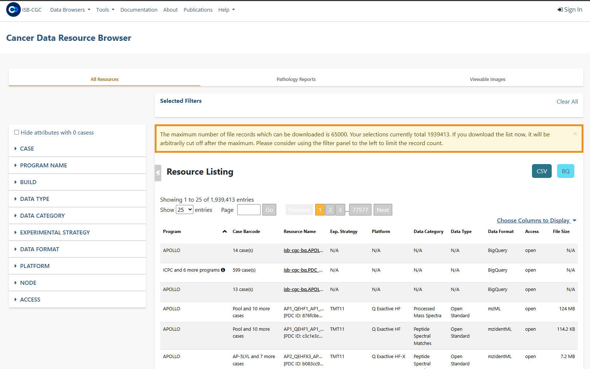

***********************************
ISB-CGC Data Browser
***********************************

The `Data Browser <https://isb-cgc.appspot.com/cohorts/filelist/>`_ is an ISB-CGC web interface which allows you to 
explore a comprehensive selection of cancer related data files in Google Cloud Storage Buckets, such as raw sequencing, cancer nucleotide variation, pathology or radiology images.

Selecting  **Data Browser** from the **Data Browsers** drop down menu on the ISB-CGC home screen will display the **Data Browser** screen. 
Another way to get to this screen is to click on the **Launch** icon in the **Data Browser** box in the **Data Browsers** section of the ISB-CGC home page.

You will be able to use the available filters to select a file record list. Click on the CSV button to download this list which includes barcodes and GCS locations, 
without needing to log into the ISB-CGC Web Application. Except for the ability to save output results to a Google BigQuery table or to a Google Cloud Storage Bucket (GCS), 
this screen has the same functionality as the one that you navigate to when selecting the **File Browser** button from the **Saved Cohorts** screen, 
after signing into the Web App. To learn more about this screen, see the `Cohorts File Browser documentation <webapp/Saved-Cohorts.html#file-browser>`_.

Note that the maximum number of file records that can be downloaded is 65000. You'll need to use the filters to get the file listing results below this number.

If you decide to log into the ISB-CGC Web App (using **Sign In** in the upper right-hand corner), you can register a Google Cloud Project and BigQuery data set and export the file record list to a BigQuery table or a Google Cloud Storage Bucket.

