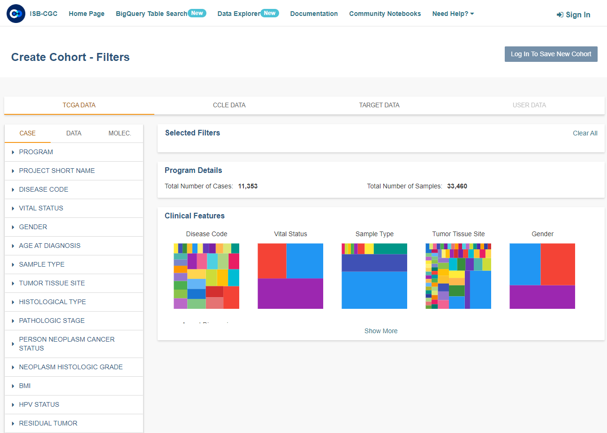

*************
Data Explorer
*************

Cohorts are a way of creating custom groupings of the samples and/or cases that you are interested in analyzing further. 
Selecting the **Data Explorer** menu option on the ISB-CGC Home screen will display the **Create Cohorts - Filters** screen. You will able to use the available filters to create a cohort, without logging into the ISB-CGC Web Application. Except for the ability to save cohorts, this screen has the same functionality as the one that you navigate to the **Create Cohorts - Filters** after signing into the Web App. To learn more about this screen, see the `Cohorts documentation </webapp/Saved_Cohorts.html>`_.

You may want to frequently reuse a cohort in multiple analyses. Creating a "saved cohort" allows you to do this. If this is the case, click on the **Login to Save New Cohort**.

