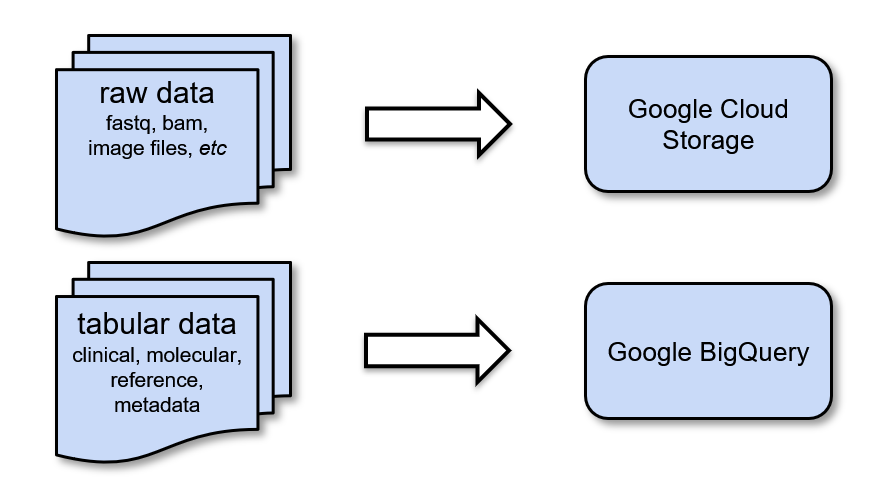

***********************
ISB-CGC Data Overview
***********************

ISB-CGC provides access to data from several research programs, such as **The Cancer Genome Atlas (TCGA)**, **Therapeutically Applicable Research to Generate Effective Treatments (TARGET)**, **Cancer Cell Line Encyclopedia (CCLE)** and **Catalogue of Somatic Mutations in Cancer (COSMIC)**. The full list is available `here <Hosted-Data.html>`_.  

The majority of the data made available through ISB-CGC originates from NCI `Genomic Data Commons <https://gdc.cancer.gov/>`_ (GDC). Users can access GDC data on the cloud through ISB-CGC. Users have access to both raw and processed data from cancer patients. 

NCI `Proteomics Data Commons <https://pdc.cancer.gov/pdc/>`_ (PDC) data is also available in ISB-CGC Google BigQuery tables.

In general, almost all raw data is controlled-access and is accessible through Google Cloud Storage buckets; only those users with proper authorization can access them. The GDC has established bioinformatics workflows/pipelines executed on the raw data to generate processed data. In this way, users can directly access the processed data without having to run compute-intensive workflows themselves. However, users who wish to run their own workflows/pipelines still have access to the raw data as well. 

Processed data, however, are generally open-access. ISB-CGC allows users to utilize this processed data in two ways on the platform: 

  - **Google Cloud Storage:**  Individual GDC processed data files are accessible through GDC Google Cloud Storage buckets; ISB-CGC provides pointers to these files. 

  - **Google BigQuery:**  Processed data are consolidated by datatype (ex. Clinical, DNA Methylation, RNAseq, Somatic Mutation, etc.) and transformed into ISB-CGC Google BigQuery tables for ease of access and analysis. This novel approach allows our users to quickly analyze information from thousands of patients in our curated BigQuery tables. 

Google Cloud Storage
~~~~~~~~~~~~~~~~~~~~
`Google Cloud Storage <https://cloud.google.com/storage/>`_ (GCS) is a cloud-based object-store that is used to store many types of (usually binary) data, typically processed by custom software pipelines. The data hosted by GDC is contained within Google Cloud Storage. Metadata stored within ISB-CGC BigQuery tables contains pointers to file locations in this GDC data.

Google BigQuery
~~~~~~~~~~~~~~~~
`Google BigQuery <https://cloud.google.com/bigquery/>`_ (BQ) is a columnar database ideal for storing tabular data. Its query speed is automatically scaled by multiprocessing. Data is accessed using a powerful SQL language interface.

ISB-CGC stores high-level clinical, biospecimen, and molecular data from the main NCI programs in the BigQuery projects `isb-cgc-bq <https://console.cloud.google.com/bigquery?p=isb-cgc-bq&d=0_README&page=dataset>`_ and `isb-cgc <https://console.cloud.google.com/bigquery?p=isb-cgc&d=0_README&page=dataset>`_. It also stores a large amount of metadata about files that are stored in the GDC Google Cloud Storage, as well as genome reference sources (*e.g.* GENCODE, miRBase, *etc.*). Most of these data sets and tables are completely *open access* and available to the research community.

Terms of Use
~~~~~~~~~~~~~~~~~~~~

Using the data stored in ISB-CGC is subject to the terms of use of its origin.

- Genomic Data Commons (GDC) `Data Access Policies <https://gdc.cancer.gov/access-data/data-access-policies>`_

- Proteomics Data Commons (PDC) `Data Use Guidelines <https://pdc.cancer.gov/pdc/data-use-guidelines>`_

- The Cancer Imaging Archive (TCIA) `Data Usage Policies and Restrictions <https://wiki.cancerimagingarchive.net/display/Public/Data+Usage+Policies+and+Restrictions>`_

- The Cancer Research Data Commons (CRDC) `Data Use Policy Statement <https://datacommons.cancer.gov/data#policy>`_

For reference and other tables, see the table description for specific information.
