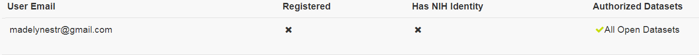
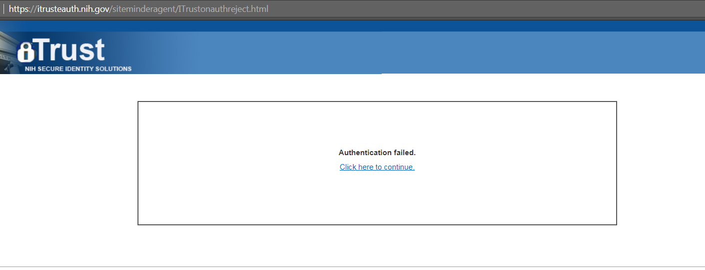
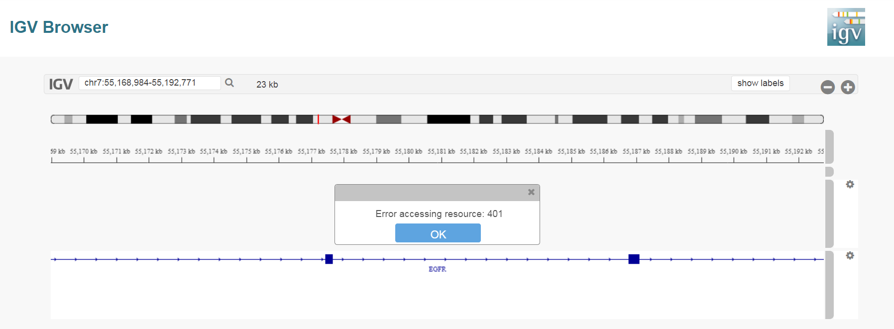
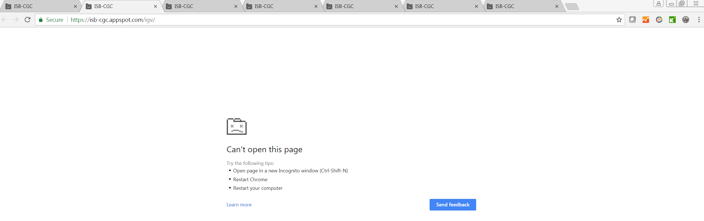

********************************
Frequently Asked Questions (FAQ)
********************************

ISB-CGC Accounts and Cloud Projects
###################################

Do I have to request an ISB-CGC account before I can try the web app?
-------------------------------------------------------------------------------

No, you can just "sign in" to the Web App using your Google identity.  

I want to be able to run big jobs using Google Compute Engine on the TCGA data hosted by the ISB-CGC.  What should I do?
-------------------------------------------------------------------------------------------------------------------------

You will need to request a Google Cloud Platform (GCP) project.  Please see `How to Request Cloud Credits <HowtoRequestCloudCredits.html>`_ for more details
about requesting a project.

Can I use any email address as a Google identity?
-----------------------------------------------------

Yes, you can.  If your email address is not already linked to a Google account, you can create_ a Google account with your current email address.
Please note, however that although these two accounts will then share the same *name*, they will still be two separate accounts, with two separate passwords, *etc*.  (It is also possible that your institutional email address is *already* a Google account, if your institution uses Google Apps. `This <https://support.google.com/accounts/answer/40560?hl=en&ref_topic=3382296>`_ is how to find out).

.. _create: https://accounts.google.com/signupwithoutgmail

How do I connect my Google Cloud Project to the ISB-CGC?
---------------------------------------------------------

Your Google Cloud Project gives you access to all of the technologies that make
up the Google Cloud Platform.  These technologies include BigQuery, Cloud Storage, Compute Engine, etc.  The ISB-CGC makes use of a variety of these technologies to provide access to the TCGA data, as well as many other data sets. Please see the `Google Cloud Project Setup and Data Access <HowToGetStartedonISB-CGC.html#data-access-and-google-cloud-project-setup>`_ section in the Quick Start Guide.

The connection between your Google Cloud Project (whether it is an ISB-CGC sponsored and funded project
or your own personal project) and the ISB-CGC is your Google identity 
(also referred to as your "user credentials").  

Access to all ISB-CGC hosted data is controlled using the `Data Commons Framework Gen3 <https://dcf.gen3.org/>`_ which defines the
permissions attached to each data set, bucket, or object.

What project information do I input on the Register a Google Cloud Project page?
---------------------------------------------------------------------------------

You will need to input the Google Cloud Project ID which can be found on the Dashboard page of the Google Console under Project info.

.. image:: project_info.PNG
   :align: center

Why do I add the service account 907668440978-oskt05du3ao083cke14641u35deokgjj@developer.gserviceaccount.com to my Google Cloud Project?
----------------------------------------------------------------------------------------------------------------------------------------

This service account is needed in your Google Cloud Project IAM page for the ISB-CGC project to be able to automatically verify that all users of your Google Cloud Project have the same appropriate access rights to the protected data that has been requested for the project.

What service account do I use on the Register a Service Account page to be able to gain access to protected data?
-------------------------------------------------------------------------------------------------------------------------

On the Register a Service account page you are asked to input a service account ID.  You need to go to the IAM and Admin page which can be found in your `console <https://console.cloud.google.com/home/dashboard?>`_ for your Google Cloud Project to find the correct service account.  The service account you would like to use is named, "Compute Engine default service account". This service account is the default option on the Register A Service Account page. *Please DO NOT use the service account 144657163696-utjumdn9c03fof16ig7bjak44hfj53o6@developer.gserviceaccount.com (you will be prevented from using this account by our software and an error message will be sent indicating this).* 

Why can't I reauthorize my Service Account on my Google Cloud Project?
------------------------------------------------------------------------

Your service account may have had its permissions revoked (because, for example, the 7-day limit has been reached, or you have added a member to the GCP who is not authorized to use controlled data the service account is linked with or has not logged into the ISB-CGC UI and authenticated using their dbGaP credentials). If permissions were revoked because an unauthorized user was added to the project, the Google Cloud Project owner will be sent
an email specifying the Service Account, and Google Cloud Project which resulted in the access being revoked. If the user has not logged into the ISB-CGC Web App and/or has not authenticated, you will be given a red error message saying, "There was an error in processing your service account. Please try again." when attempting to refresh using the refresh wheel.  To see which new user hasn't logged in or authenticated, please go to either the Register a Service Account page or the Adjust a Service Account page and see which user it is within the table for which the data set is not selected and there are X's in the Registered and Has NIH Identity.

Ensure that the user has 1) Logged into the ISB-CGC web app and 2) Has registered their NIH Identity with their user interface identity.

To reauthorize the service account 1) Remedy the problem that resulted in access being denied, and 2) Select the "Adjust A Service Account" icon(plus sign) next to Current Access Expires.

Another reason could be if some users are marked as unable to access datasets they should have access to, make sure they have logged into the system and linked their eRA Commons/NIH Identity to their Google Identity.

Why would I get an Authorization Failed page on NIH iTrust when attempting to link my Google Account with my NIH identity?
---------------------------------------------------------------------------------------------------------------------------

   
You can get this page for two reasons:  First, if you may have typed in your password incorrectly, please select the Click Here to continue link and try to log in again.  Second, if you have typed your password correctly, it could be time to refresh your NIH identity password.  Please reset your password by using this link `here <https://public.era.nih.gov/commons>`_ and try again.  This should allow you to link your NIH Identity to the ISB-CGC web app. 

What happens if I accidently delete the default service account from a Google Cloud Project?
----------------------------------------------------------------------------------------------

If you accidently delete the default service account associated to the Google Cloud Project you are working in, you can no longer authorize the service account during instance creation, associate the service account to controlled access data, and many other functionalities will no longer work. 

If you then try to add the service account back to the Google Cloud Project, this error occurs:

 *ERROR: (gcloud.compute.instances.create) Some requests did not succeed:*
 *- The resource 'xx...@project.gserviceaccount.com' of type 'serviceAccount' was not found.*

Unfortunately at this time, there is no direct way to recover the default service account.

One workaround to recreate the Google Compute Engine default service account is to disable and reenable Google Compute Engine API in your project. This will only work if you have no Google Compute Engine resources (e.g VMs, Disks, Snapshots etc) in your project; otherwise, you will get "Backend Provisioning Error" when you try to disable Compute Engine API.

Another solution would be creating a new project and redeploying your instances there.

Google has an internal feature request to prevent accidental deletion of default service accounts.

There is a Google forum discussion that can be found `here <https://groups.google.com/forum/#!topic/gce-discussion/bQ_-qCWoUZw>`_ with more details and explanation.

ISB-CGC Web Interface
########################

I ran the same query in the Web App that I've run before, but the results were different. Why is that?
-------------------------------------------------------------------------------------------------------

The Web App performs its data retrieval and counts on ISB-CGC Google BigQuery tables which are based on the latest GDC data release. So, it's possible that a new GDC release
occurred since you last performed that query.

Why do I sometimes get a "Do you want to leave this site?" pop-up box when leaving a page or canceling a workflow edit?
--------------------------------------------------------------------------------------------------------------------------

This is a security feature when working with forms found in most web browsers; it lets you know that you may have made some changes which will be lost when you navigate away from the page. If you intend to cancel what you were doing, you can safely ignore it.

Which web browser is recommended when working with the site?
------------------------------------------------------------

We recommend using Google Chrome browser.  Currently a chart will display slightly off when working with workbooks on a FireFox browser. 

Why did I get a 401 error on the IGV Browser?
----------------------------------------------

You will see the 401 error only if your pop-up blocker is enabled for the ISB-CGC website.  Please disable the pop-up blocker on the top right-hand side of the screen by selecting to always allow pop-ups from ISB-CGC.

   
Why does the web browser crash if too many IGV Browser tabs are opened at once?
----------------------------------------------------------------------------------

The web browser may crash when too many IGV Browser tabs are open due to the memory intensive nature of loading bam files.  When working with the IGV Browser, please be mindful of having multiple tabs of the IGV Browser open.

   
Does SeqPeek and CNVR plotting only work with TCGA data?
---------------------------------------------------------

We currently have no data associated with CNVR or Seqpeek for TARGET or CCLE.  Therefore, SeqPeek and CNVR will only work with TCGA data.

Data Access
###########

Does all TCGA data require dbGaP authorization prior to access?
----------------------------------------------------------------
No, generally only the low-level sequence (DNA and RNA) and SNP-array data (CEL files) require
dbGaP authorization.  All of the "high-level" molecular data, as well as the clinical data are
open-access and much of this has been made available in a convenient set of BigQuery tables. 

Where can I find the TCGA data that ISB-CGC has made publicly available in BigQuery tables?
----------------------------------------------------------------------------------------------

The BigQuery web interface can be accessed at https://console.cloud.google.com/bigquery.  If you have not already added the ISB-CGC data sets to your BigQuery "view", click on the blue arrow
next to your project name at the top of the left side-bar, select "Switch to Project", then "Display Project...",
and enter "isb-cgc-bq" (without quotes) in the text box labeled "Project ID". For older ISB-CGC data sets, repeat and enter "isb-cgc". All ISB-CGC public BigQuery
data sets and tables will now be visible in the left side-bar of the BigQuery web interface. 
*Note that in order to use BigQuery, you need to be a member of a Google Cloud Project.*

How can I apply for access to low-level DNA and RNA sequence data?
-----------------------------------------------------------------------

In order to access the TCGA or All other controlled-access data available, you will need to apply to dbGaP_.
Please also review our section on **Understanding Data Security**.

.. _dbGaP: https://dbgap.ncbi.nlm.nih.gov/aa/wga.cgi?login=&page=login

I have dbGaP authorization.  How do I provide this information to the ISB-CGC platform?
---------------------------------------------------------------------------------------

In order for us to verify your dbGaP authorization, you first need to associate your Google Identity
(used to sign-in to the Web App) with a valid NIH login (*eg* your eRA Commons ID).  After you have
signed in, click on your avatar (next to your name in the upper-right corner) 
and you will be taken to your account details page where you can 
verify your dbGaP authorization.  You will be redirected to the NIH iTrust login page and after you
successfully authenticate, you will be brought back to the ISB-CGC Web App.  After you successfully
authenticate, we will verify that you also have dbGaP authorization for the TCGA controlled-access data and other programs you have dbGaP access to.

We also ask that you review our section on `Understanding Data Security <data/TCGA_Data_Security.html>`_.

My professor has dbGaP authorization.  Do I have to have my own authorization too?
---------------------------------------------------------------------------------------

Yes, your professor will need to add you as a "data downloader" to his/her dbGaP application so that you
have your own dbGaP authorization associated with your own eRA Commons ID.  
(This `video <https://www.youtube.com/watch?v=Yem3OH26kX4>`_ explains how an authorized user of 
controlled-access data can assign a downloader role to someone in his/her institution.)

**I already authenticated using my eRA Commons ID but now I want to use a different Google identity to
access the ISB-CGC Web App. Can I reauthenticate using the same eRA Commons ID?**

Yes, but you will first need to sign in using your previous Google identity and "unlink" your eRA Commons
ID from that one before you can link it with your new Google Identity.  An eRA Commons ID cannot be
associated with more than one Google Identity within the ISB-CGC platform at any one time.

Can I authenticate to NIH programmatically?
--------------------------------------------

No, the current NIH authentication flow requires
web-based authentication and must therefore be done from within the ISB-CGC Web App.  Once you have
authenticated to NIH via the Web App, and your dbGaP authorization has been verified, the Google 
identity associated with your account will have access to the controlled-data for 24 hours.

Data Content
############

I get a different number of samples in BigQuery than I do with the same query in the Web App. Why?
-----------------------------------------------------------------------------------------------------

Older programs like TCGA have both legacy data (data from the original program) and harmonized data (data run through the Genomics Data Commons).  The Web App primarily uses harmonized data whereas BigQuery contains both legacy and harmonized data.  In addition, some cases and samples have been removed from the Web App if annotation suggests the data from those cases or samples are incorrect, misleading or from cases of uncertain origin.  Most of these cases and samples are still in BigQuery and users are encouraged to check the annotations tables.

Python Users
############ 

I want to write Python scripts that access the TCGA data hosted by the ISB-CGC.  Do you have some examples that can get me started?
-------------------------------------------------------------------------------------------------------------------------------------

Yes, of course!  The best place to start is with our `Community Notebooks <HowTos.html>`_  or our repository in `GitHub <https://github.com/isb-cgc/Community-Notebooks>`_. You can run any of these examples yourself. It includes an introduction explaining what Notebooks are, how to get started as a novice user, and how to run more advanced analyses once you are comfortable. 

R Users
########

I want to use R and Bioconductor packages to work with the TCGA data.  How can I do that?
---------------------------------------------------------------------------------------------

You can run RStudio locally or deploy a dockerized version on a Google Compute Engine VM.  You can
find some great examples to get you started in our  `Community Notebooks <HowTos.html>`_  or our repository in `Community Notebooks GitHub <https://github.com/isb-cgc/Community-Notebooks>`_.

For an example on how to use Bioconductor packages with TCGA data in BigQuery, please check out our interactive tutorial found `here <https://isb-cgc.appspot.com/how_to_discover/#0>`_.

Regulome Explorer Users
###########################

Can I run Regulome Explorer Analyses using TCGA tables of heterogeneous data in BigQuery?
------------------------------------------------------------------------------------------

Yes, of course! A series of Python Notebooks have been created to replicate Regulome Explorer and includes detailed information on the statistical methods implemented. To get started, please visit our `Regulome Explorer <RegulomeExplorerNotebooks.html>`_ page in readthedocs or our Repository in `Regulome Explorer GitHub <https://github.com/isb-cgc/Community-Notebooks/tree/master/RegulomeExplorer>`_. 

