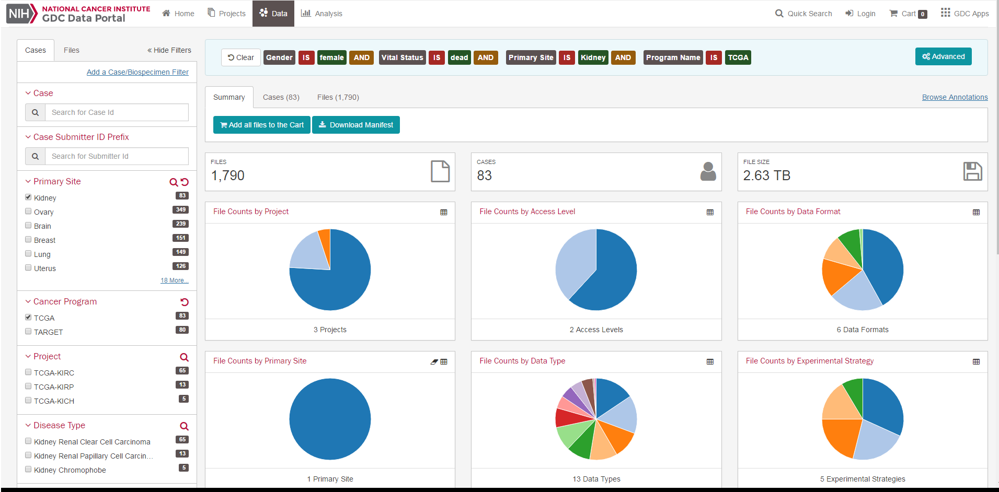
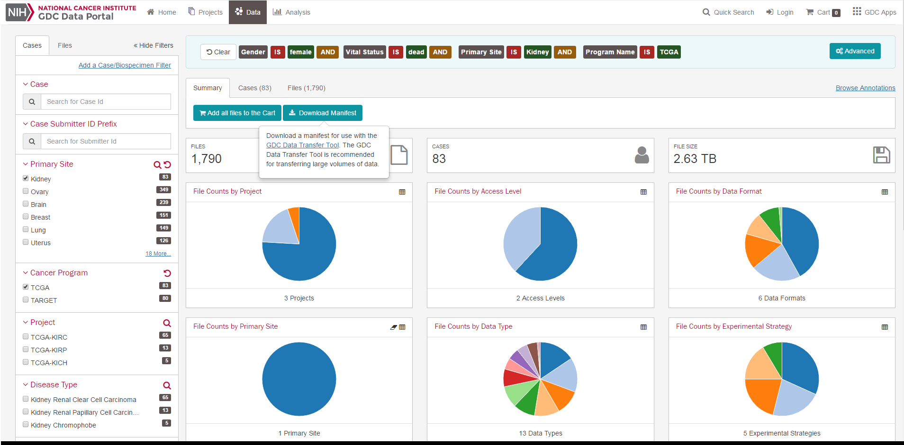

Moving from GDC to ISB-CGC
===========================

If you've been using the National Cancer Institute's `Genomic Data Commons Portal 
<https://portal.gdc.cancer.gov/>`_ you've probably discovered that while you can identify patients and files that might be interesting, you have to download them to your own system in order to actually do anything with them.

But isn't the point of having data on the cloud that you shouldn't have to download anything?

Fortunately, since the ISB-CGC stores data from the GDC, you can do your analysis on the cloud without having to move data at all!  The only thing you need from GDC is a case manifest or a file manifest and in the following tutorials, we'll show you how to turn those manifests into usable analysis starting points.

Differences between GDC and ISB-CGC
====================================

Since the GDC is mostly aimed at storing data and the ISB-CGC is aimed at making use of that data there are some differences between the two that you need to understand before starting:

  * While the ISB-CGC does have all the *data* from the GDC, it doesn't have all the *files* from the GDC.  This is because we've stored the anaylzed data ("Level 3") in BigQuery tables rather than as files.  In fact, the only files stored at ISB-CGC are the raw, "Level 1" files.  So unless you plan on re-analyzing data from scratch, you can dive straight into BigQuery.
  * GDC file manifests can be directly imported into BigQuery
  * GDC case manifests aren't directly importable into ISB-CGC. A bit of manipulation needs to happen to make them useful in ISB-CGC.
  
Output from  GDC
=================

GDC has two different outputs for users once they've finished doing their selections, the file manifest and the case table export.  In the example shown below, various filters were set to produce a cohort of 83 cases from the three TCGA kidney cancers and that cohort has 1,790 files on hand at the GDC.

  
A file manifest can be dowloaded simply by clicking on the *Download Manifest button*.  To create a list of the cases, swith to the Cases tab and click on the Export Table JSON button.

  
Using BigQuery
==============
  
The rest of this tutorial assumes that the user is familiar with using the BigQuery interface and can write some basic SQL statements.  If you need an introduction to BigQuery, visit our `tutorial <http://isb-cancer-genomics-cloud.readthedocs.io/en/latest/sections/progapi/bigqueryGUI/WalkthroughOfGoogleBigQuery.html?highlight=bigquery>`__
 
Importing a GDC File Manifest into ISB-CGC
===========================================
  
The easiest way to make a GDC File manifest useful is to import it into BigQuery as its own table.  One way of keeping your file manifests organized is to create a data set specifically for the tables created to hold the manifests.  New data sets can be created by clicking on the down arrow to the right of your project name in BigQuery.
  
  Creating a table from a GDC file manifest is remarkably easy:
   * On the right of the data set, click on the down arrow and select *Create new table*
   
   .. image:: CreateTable1.png
   
   * In the resulting screen, select your manifest file, set the File format to *CSV* if it isn't already (tab delimited will work with this setting)
   * Have BigQuery automatically create the schema by checking the *Automatically detect* box for Schema
   * Click on the *Create Tabe* button
   
   .. image:: BQ-CreateFileManifestTable.png
   
Once the process is complete, you should have a table with contents similar to what is shown below.

.. image:: BQ-FileManifestTable.png
