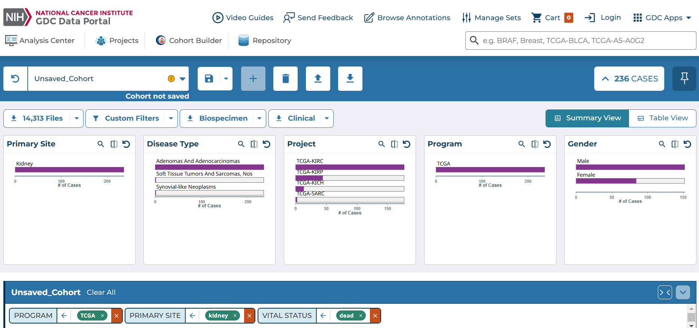
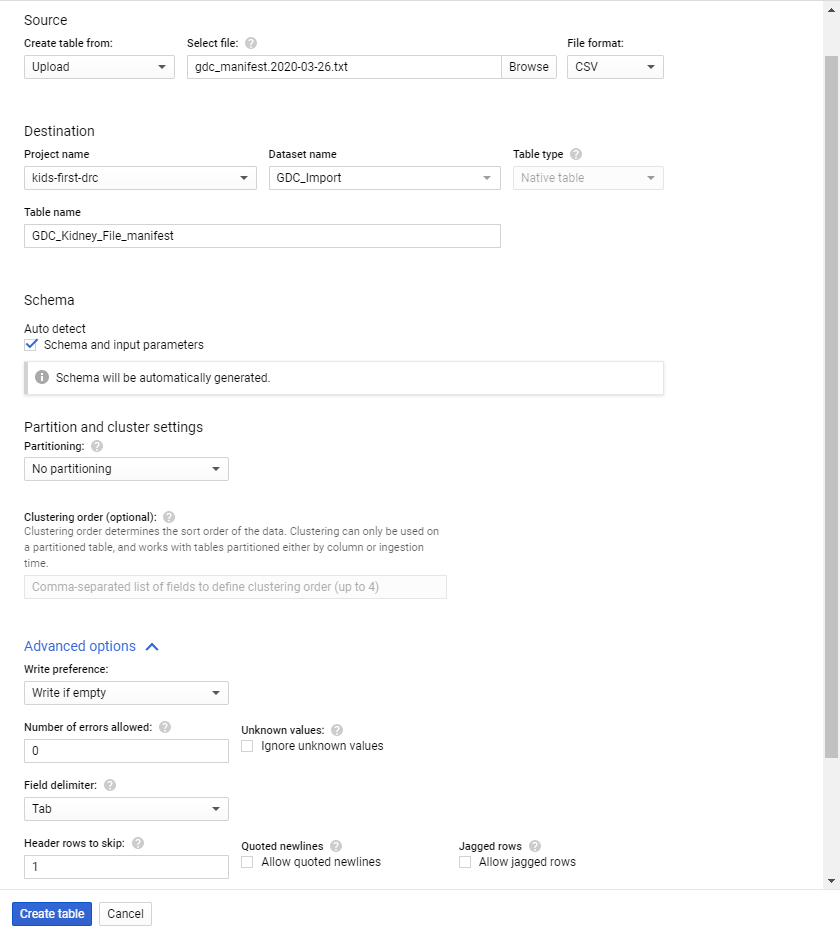
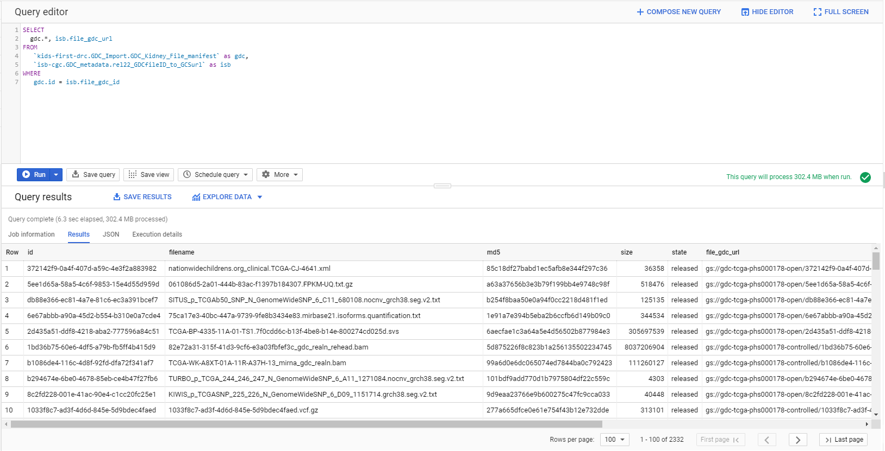

******************************************
Importing a GDC File Manifest into ISB-CGC
******************************************

If you've been using the National Cancer Institute's `Genomic Data Commons Portal 
<https://portal.gdc.cancer.gov/>`_, you know that while you can identify interesting cases and files, you need to download files to your own system in order to perform unique analysis.

Since the ISB-CGC stores Google Cloud file references for the GDC data, you can do your analysis on the cloud without having to move data. This tutorial will show you how to take a downloaded file manifest from the GDC, and use ISB-CGC to find the file locations on the cloud, providing a useful analysis starting point.

**Download the File Manifest from GDC**

On the GDC Data Portal, first use the selection filters to create your cohort. In the example shown below, the filters of Program: TCGA, Primary Site: kidney, Vital Status: dead and Gender: female were set to produce a cohort of 84 cases with 2332 files.  
 
To download a File Manifest, which we'll use to find the file locations in ISB-CGC, on the **Repository** screen, click on the **Manifest** button.  

  
**Import the File Manifest into Google BigQuery**

Importing a GDC file manifest into its own BigQuery table will enable you to join that table with an ISB-CGC BigQuery table containing the file locations on the Google Cloud. Here's how to do it.

If you don't already have a Google Cloud Project, please see the following ISB-CGC documentation pages for guidance:

* `How to create a Google Cloud Platform (GCP) project <../HowToGetStartedonISB-CGC.html#google-cloud-project-setup-and-data-access>`_ 
* `How to link ISB-CGC BigQuery tables to your Google Cloud Platform (GCP) project <../progapi/bigqueryGUI/LinkingBigQueryToIsb-cgcProject.html>`_ 

One way of keeping your file manifests organized is to create a data set specifically for those tables. New data sets can be created by clicking on the **Create Dataset** button within your project in BigQuery.
  
Creating a table from a GDC file manifest is remarkably easy:
 
* Click on the **Create Table** button while you are within your new data set.  
* In the resulting screen, for **Create table from**, select **Upload**. Select your manifest file and set the **File format** to **CSV**. (Tab delimited will work with this setting.)
* Have BigQuery automatically create the schema by checking the **Auto detect** box for Schema.
* Click on **Advanced options**. Select **Tab** for **Field delimiter**; enter **1** for **Header rows to skip**.
* Click on the **Create Table** button.
   
   

**Find the file locations on the Google Cloud**

Now that you have a table containing the GDC file identifiers, the next step is to find the locations for the Level 1 files on the Google Cloud.  To help with that task, ISB-CGC maintains BigQuery tables that contain the GDC file identifier and the Google bucket location for the file in data set GDC_metadata.  Adding the Google bucket location to our GDC information can be done via a simple SQL query:

.. code-block:: sql

        SELECT gdc.*, isb.file_gdc_url
        FROM `Your-project.GDC_Import.GDC_Kidney_File_manifest` as gdc,
             `isb-cgc.GDC_metadata.rel22_GDCfileID_to_GCSurl` as isb
        WHERE gdc.id = isb.file_gdc_id

Note that you'll need to replace "Your-project.GDC_Import.GDC_Kidney_File_manifest" with your project and the data set and table that you created above.

This query will return the results shown below and, as with any BigQuery result, you can either export it as a file or save it as a new table in BigQuery.

