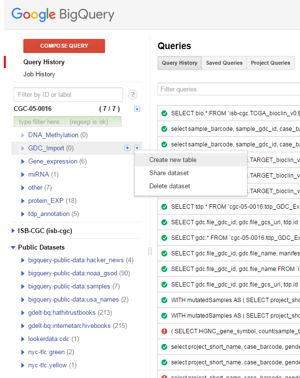

Importing a GDC Case List into ISB-CGC
======================================

In addition to the file manifest, GDC also allows users to export case lists from your searches as shown in the image below:

  
As we did with the file manifest, in this tutorial we'll look at how to bring that case list into BigQuery and create a table that you can use as the basis for analyzing data in the ISB-CGC system.  In this case, the GDC file is in JSON format, and while BigQuery does understand JSON there are special characteristics that BigQuery needs that unfortunately are not provided by the GDC file.  So to get around the incompatibility, the first step is to convert the JSON into something that BigQuery can understand.

Converting JSON to tab delimited
================================

Let's start by looking at the data that GDC has provided:

.. code-block:: javascript

  {
    "project": {
      "project_id": "TCGA-LIHC", 
      "primary_site": "Liver"
    }, 
    "case_id": "67a00f5f-c753-48f9-bc24-8287f50ec776", 
    "demographic": {
      "gender": "male"
    }, 
    "summary": {
      "data_categories": [
        {
          "file_count": 1, 
          "data_category": "DNA Methylation"
        }, 
        {
          "file_count": 1, 
          "data_category": "Clinical"
        }, 
        {
          "file_count": 1, 
          "data_category": "Biospecimen"
        }, 
        {
          "file_count": 5, 
          "data_category": "Transcriptome Profiling"
        }, 
        {
          "file_count": 16, 
          "data_category": "Simple Nucleotide Variation"
        }, 
        {
          "file_count": 4, 
          "data_category": "Copy Number Variation"
        }, 
        {
          "file_count": 4, 
          "data_category": "Raw Sequencing Data"
        }
      ]
    }
  }

For our purposes, the data in the "summary" section can be ignored.  Since ISB-CGC doesn't store all the files from GDC, having the file count stored in a table doesn't do us much good.  So what are useful are the Project ID, Primary Site, Case ID and Gender.  Those can be easily parsed out and put into a tab-delimited file with a simple Python script:

.. code-block:: python

  #! /usr/bin/python
  import json
  import argparse

  def main(args):
	inputfile = open(args.inputfile,'r')
	outputfile = open(args.outputfile,'w')
	header = "project_short_name\tprimary_site\tgdc_case_id\tgender\n"	
	outputfile.write(header)	
	data = json.load(inputfile)
	
	for entry in data:	
		project = entry['project']['project_id']		
		site = entry['project']['primary_site']		
		case = entry['case_id']		
		gender = entry['demographic']['gender']		
		outputfile.write(("%s\t%s\t%s\t%s\n") % (project,site,case,gender))	
	
	outputfile.close()
	
  if __name__ == "__main__":
	parser = argparse.ArgumentParser()
	parser.add_argument("-i", "--inputfile", required = True, help = "JSON file from GDC")
	parser.add_argument("-o", "--outputfile", required = True, help = "File to save")
	args = parser.parse_args()
	main(args)

Once the tab-delimited file has been created the next step is to upload the information to a new BigQuery table.  As with the file manifest example, the first step is to create a new table:

While we could allow BigQuery to automatically determine the names of the columns, it is also possible to provide those names yourself in case you wish to customize the names.  That process is outlined in the figure below:

Once the process is finished, there will be a new table with the information obtained from the GDC.  However, there is one additional issue that needs to be handled.  The JSON file downloaded from the GDC contains the case UUID, but not the case barcode.  Since many people are more comfortable using barcodes (and the ISB-CGC system largely uses them), it would be a good idea to modify our table to include both the case and sample barcode.  Fortunately, ISB-CGC has a BigQuery table that contains all of the biospecimen information for TCGA, so finding the additional information requires a simple SQL query:

.. code-block:: sql

 SELECT
  gdc.*, bio.case_barcode, bio.sample_gdc_id, bio.sample_barcode
 FROM
  `isb-cgc.TCGA_bioclin_v0.Biospecimen` as bio,
  `cgc-05-0016.GDC_Import.GDC_Case_manifest` as gdc
 WHERE
  bio.case_gdc_id = gdc.tcga_case_id
  
  
Once this query is complete, simply save the results as a new table and you now have your GDC case list available to you in BigQuery.

Links to other GDC tutorial pages:
++++++++++++++++++++++++++++++++++

* `Introduction to Moving from GDC to ISB-CGC <FromGDCtoISBCGC.html>`__
* `Importing a GDC File Manifest <ImportGDCFileManifest.html>`__
* `Creating an ISB-CGC Cohort from a GDC Case JSON file <ISB-CGC_Cohort_from_GDC_Cases.html>`__
