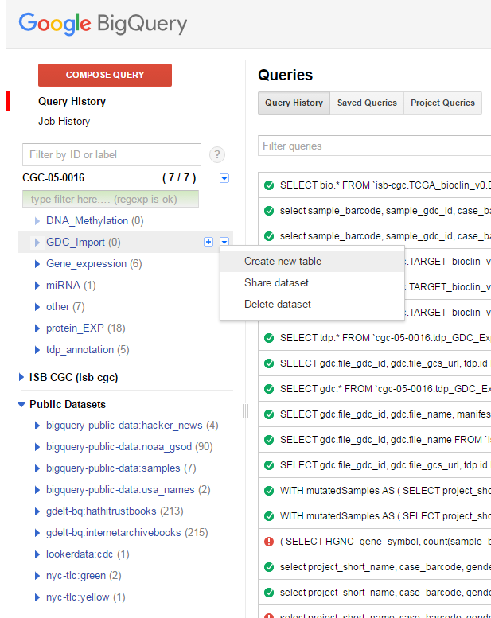
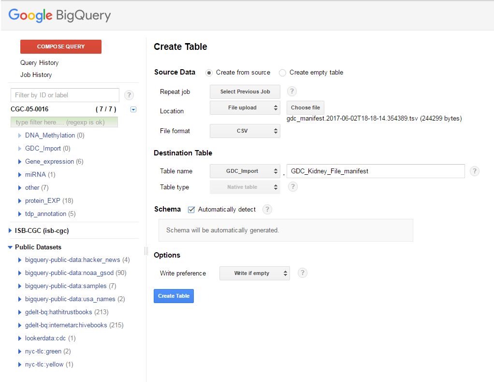
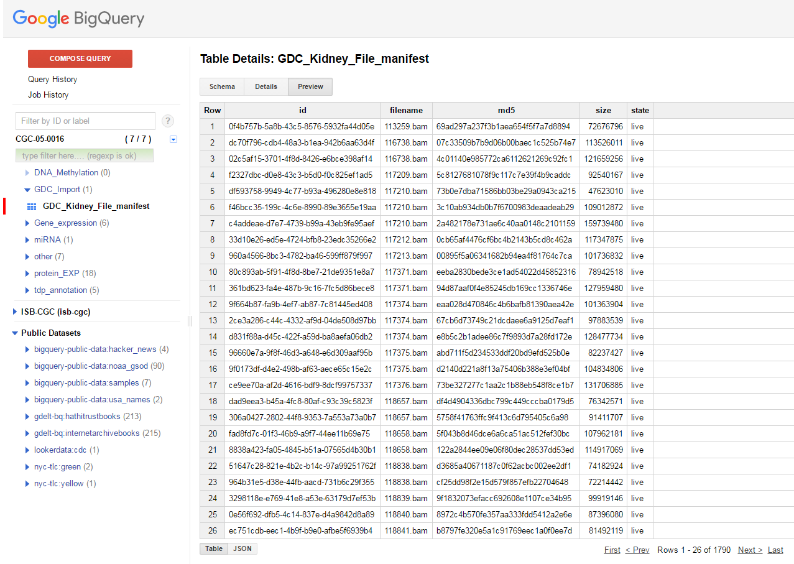
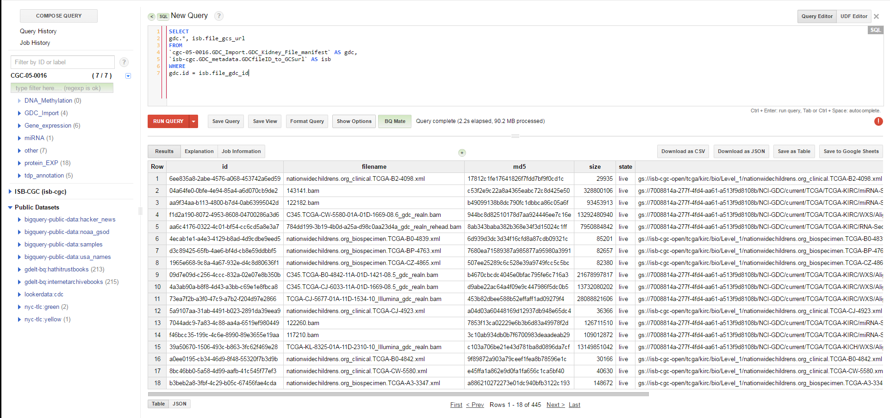

Importing a GDC File Manifest into ISB-CGC
===========================================
  
The easiest way to make a GDC File manifest useful is to import it into BigQuery as its own table.  One way of keeping your file manifests organized is to create a data set specifically for the tables created to hold the manifests.  New data sets can be created by clicking on the down arrow to the right of your project name in BigQuery.
  
Creating a table from a GDC file manifest is remarkably easy:
 
* On the right of the data set, click on the **down arrow** and select *Create new table*
   
   

   
   
* In the resulting screen, select your manifest file, set the File format to *CSV* if it isn't already (tab delimited will work with this setting)
* Have BigQuery automatically create the schema by checking the *Automatically detect* box for Schema
* Click on the *Create Table* button
   
   

   
   
Once the process is complete, you should have a table with contents similar to what is shown below.

So now that you have a table containing the GDC file identifiers, the next step is to find the locations for the Level 1 files on the ISB-CGC system.  To help with that task, ISB-CGC maintains a BiqQuery table that contains the GDC file identifier and the Google bucket location for the file (GDCfileID_to_GSCurl).  So to add the Google bucket location to our GDC information can be done via a very simple SQL query:

.. code-block:: sql

        SELECT
          gdc.*, isb.file_gcs_url
        FROM
           `cgc-05-0016.GDC_Import.GDC_Kidney_File_manifest` as gdc,
           `isb-cgc.GDC_metadata.GDCfileID_to_GCSurl` as isb
        WHERE
           gdc.id = isb.file_gdc_id 

This query will return the table shown in the figure below and, as with any BiqQuery result, you can either export it as a file or save it as a new table in BigQuery.

*But WAIT!  The GDC file manifest has 1790 files, but your query results only have 445 files! Where are the rest of the files?*

As was mentioned in the introduction, while ISB-CGC does have all TCGA data, it does not have all TCGA files.  In the GDC file list, many of the files are analyzed data files ("Level 3") and rather than store thousands of results files, ISB-CGC instead stores the data from those files in BigQuery tables (see the BiqQuery links in the Introduction for details).  By doing this, ISB-CGC saves users the step of creating their own tables of results; you can just use the tables that ISB-CGC provides.  ISB-CGC does store raw data files ("Level 1") like .bam files, and those are the files that were returned by the query.

.. hint:: Excuse me but my files list is in JSON format

   It is possible to download a file list from the GDC in JSON format rather than as a tab-delimited text file.  This is done from the      *Files* tab of any results table.  Like we describe for processing the `Case list <ImportGDCCaseDownload.html>`__, BigQuery doesn't      understand the JSON files GDC produces so you would need to write a parser to extract the information you want.  Unless you need some    of the information in the JSON file, the easiest way to load files is via the GDC file manifest.
   
