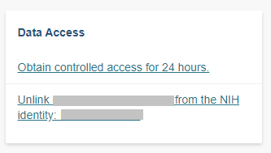
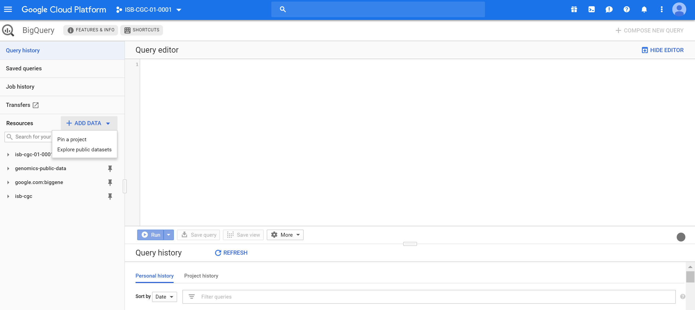
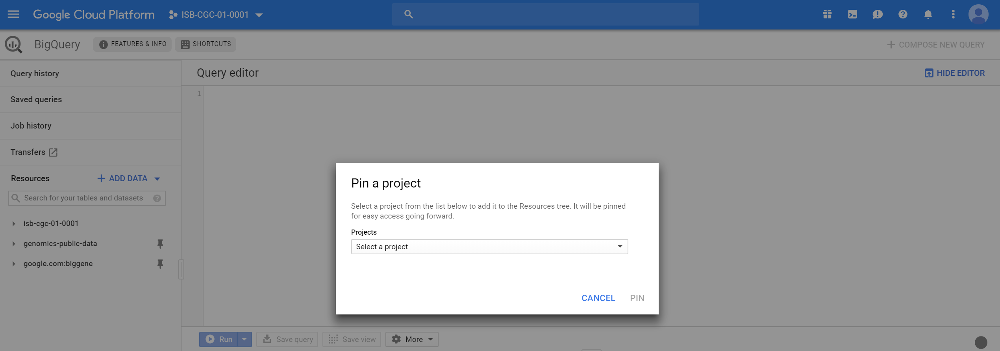
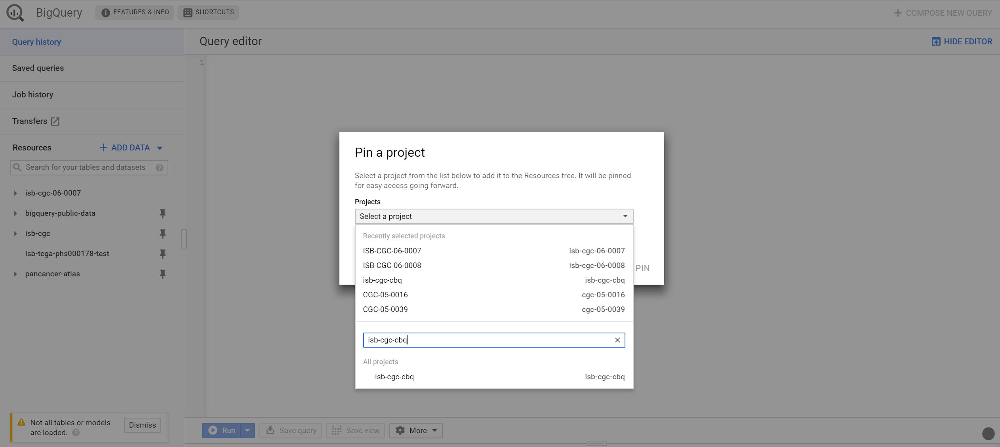
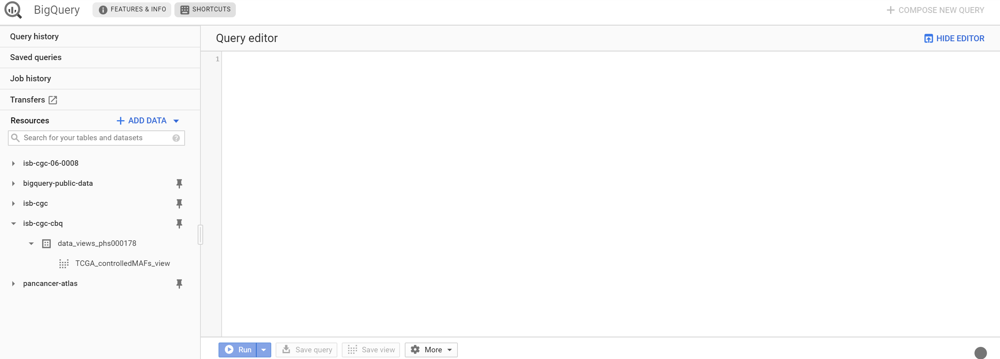

************************************************
Accessing Controlled Data
************************************************

You can gain access to  **controlled data** by two different methods via ISB-CGC. The methods can be used simultaneously if needed.

Select this method for `controlled access via personal user credentials <controlled-access/Controlled-data-Interactive.html>`_: 
  
  * Provides access to controlled data for 24 hours at a time;
  * Uses your *personal* credentials;
  * Example uses: the ISB-CGC Web App, R Studio or running short jobs on Google Compute Engine that complete in under 24 hours
      
Select this method for `controlled access via service account credentials <controlled-access/Controlled-data-GCP.html>`_:
  
  * Provides access to controlled data for seven days at a time;
  * Uses the credentials of a *service account*, acting on your behalf (To learn about service accounts, refer to the Google `documentation <https://cloud.google.com/iam/docs/service-accounts>`_.);
  * Example uses: using a Google Cloud Project; running a program from a Google Compute Engine (GCE) Virtual Machine (VM) that takes longer than 24 hours to complete
 
.. note:: If you are looking to gain access to COSMIC data, please see the `COSMIC documentation <data/COSMIC_about.html>`_.

Prerequisites
--------------

You'll need the following before requesting controlled access via ISB-CGC:

  * A Google identity;
  * An NIH or electronic Research Administration (eRA) account;
  * Database of Genotypes and Phenotypes (dbGaP) permission for each type of controlled access data of interest, linked to your NIH or eRA account;
  * Your Google identify `linked <controlled-access/Controlled-data-Interactive.html>`_ to your NIH/eRA account via the ISB-CGC Web App.

1) Google identity
++++++++++++++++++

If you don't have a Google identity yet, please see the  `ISB-CGC Quick-Start Guide <HowToGetStartedonISB-CGC.html>`_. 

2) NIH or eRA account
+++++++++++++++++++++

Intramural researchers can use their NIH log-in account, and extramural researchers will need to have a personal eRA account. Either way, the user's NIH/eRA
account needs to be affiliated with their institution's eRA account. Your principal investigator (PI) or other authorized person can create
your personal eRA account and link it to your institution's eRA account. 

If you already have an NIH/eRA account, you can log into eRA at `<https://public.era.nih.gov/commons>`_. 

  * If the Institution listed for you is not your current one, ask your PI to change it for you.
  * If you are the PI or other authorized person, you can create, link and update accounts from here.

Visit `electronic Research Administration (eRA) <http://era.nih.gov>`_ for more information on registering for a NIH eRA account.

3) Link your eRA (or NIH) account to dbGaP permissions.
++++++++++++++++++++++++++++++++++++++++++++++++++++++

Your principal investigator (PI) can link your NIH/eRA account to `dbGaP <http://dbgap.ncbi.nlm.nih.gov>`_ permissions for selected controlled access data sets. 

For more information on applying for dbGaP authorization to access controlled data, please see 
this dbGap How to Video: `Apply for Controlled Access Data <http://www.youtube.com/watch?v=-3tUBeKbP5c>`_.

For additional information, refer to `Tips for Preparing a Successful Data Access Request <https://www.ncbi.nlm.nih.gov/projects/gap/cgi-bin/GetPdf.cgi?document_name=GeneralAAInstructions.pdf>`_, 
and `Understanding Data Security <data/TCGA_Data_Security.html>`_.  Please be sure to review the Data Use Certification Agreement for `TCGA controlled data <https://www.ncbi.nlm.nih.gov/projects/gap/cgi-bin/study.cgi?study_id=phs000178.v9.p8>`_ and `TARGET controlled data <https://www.ncbi.nlm.nih.gov/projects/gap/cgi-bin/study.cgi?study_id=phs000218.v17.p6>`_. 

4) Link your NIH/eRA and Google identities.
+++++++++++++++++++++++++++++++++++++++++++

Before you can access *any* controlled-data hosted by the ISB-CGC, you must first associate your Google identity (which you use to sign in to the ISB-CGC Web App and
access the Google Cloud) with a valid NIH or eRA account associated with a dbGaP data-access request.

This is accomplished through the ISB-CGC Web App. Follow the directions on the  `How to link NIH/eRA and Google identities <controlled-access/Controlled-data-Interactive.html>`_ page.

During this process:
   
   * You will first be redirected to an NIH login page, and once you have successfully authenticated, ISB-CGC will store an association between your NIH/eRA identity and your Google identity. (Note that this should be a one-to-one association.)

   * Once you have authenticated, ISB-CGC will check which data sets (such as TCGA, TARGET controlled data, etc.) that you have been authorized (by dbGaP) to access. ISB-CGC obtains an updated whitelist for each of the hosted data sets from dbGaP every day.  If you have just recently been granted access by dbGaP, there may be a 24 hour delay before you will be able to request access to this data on ISB-CGC.

   * Once you have authenticated to NIH via the Web App, and your dbGaP authorization has been verified, the Google identity associated with your account will have access to the controlled data for 24 hours.

These prerequisite steps only need to be done once, unless your accounts become unlinked, you need access to another dbGaP controlled data set, or some other reason.

.. toctree::
   :maxdepth: 1
   :hidden:
   
   controlled-access/Controlled-data-Interactive

Controlled Access Via Personal User Credentials
-----------------------------------------------

The first time that you perform the above steps, you are automatically granted controlled access via your personal uer credentials. This access lasts for 24 hours, though it can be extended. Subsequently, to obtain access, sign into the Web App, click on your persona (or **Account Details** on the drop down menu next to your name). Click the **Get Controlled Access** button below **Obtain controlled access for 24 hours**.

Controlled Access Via Service Account Credentials
-------------------------------------------------

To access controlled data programmatically, such as through Google Cloud or when running a VM, you'll need to register a GCP and service account. Follow these steps:

   * `Registering a Google Cloud Project & Service Account <controlled-access/Controlled-data-GCP.html>`_

.. toctree::
   :maxdepth: 1
   :hidden:
   
   controlled-access/Controlled-data-GCP

   
Controlled Access in the Google BigQuery Console
------------------------------------------------------

The BigQuery project "isb-cgc-cbq" contains the ISB-CGC controlled access data which is stored in BigQuery tables. To obtain access to these ISB-CGC tables within the Google BigQuery Console, you must link to them within the BigQuery Console. Before doing so, you must have followed all the prerequisites above, including  `linking your Google identity to your NIH/eRA account  <controlled-access/Controlled-data-Interactive.html>`_ via the ISB-CGC Web App.
 
When you access BigQuery from your Google Cloud Platform Console (see `here <progapi/bigqueryGUI/HowToAccessBigQueryFromTheGoogleCloudPlatform.html>`_ for more information on this), you will be presented with the following page:

The blue arrow will produce a drop down list; select 'Switch to Project'; then click 'display project...'

You will then be presented with the following page:

As shown in the image below you will need to type in "isb-cgc-cbq" in the project id and then click okay. 

Once this has been completed you will be able to see the appropriate controlled access ISB-CGC BigQuery data sets on the left hand side (see screenshot below).

