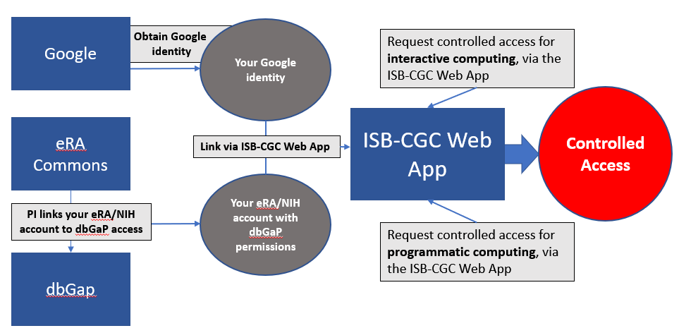

************************************************
Accessing Controlled Data
************************************************

Accessing **controlled data** is achieved in two different ways, depending on how you are using it: 

  - `Interactive computing <controlled-access/Controlled-data-Interactive.html>`_  
  
    * Provides access to controlled data for 24 hours at a time
    * Uses your *personal* credentials
    * Example uses: the ISB-CSC Web App or R Studio
      
  - `Programmatic computing <controlled-access/Controlled-data-GCP.html>`_ 
  
    * Provides access to controlled data for seven days at a time
    * Uses the credentials of a *service account*, acting on your behalf
    * Example uses: using a Google Cloud Project; running a program from a Google Compute Engine (GCE) Virtual Machine (VM)
    
You can use both methods at the same time; they are not mutually exclusive.

No matter which way you intend to request controlled access via ISB-CGC, you'll need the following first:

   * A Google identity
   * An NIH or electronic Research Administration (eRA) account
   * Database of Genotypes and Phenotypes (dbGaP) permission for each type of controlled access data of interest, linked to your NIH or eRA account
   * Link your Google identify to your NIH/eRA account via the ISB-CGC Web App.
   

**You must have a Google identity**.

If you don't have a Google identity yet, please see the  `ISB-CGC Quick-Start Guide <HowToGetStartedonISB-CGC.html>`_. 

**You must have either an NIH or eRA account.**

Intramural researchers can use their NIH log-in account, and extramural researchers will need to have a personal eRA account. Either way, the user's NIH/eRA
account needs to be affiliated with their institution's eRA account. Your principal investigator (PI) or other authorized person can create
your personal eRA account and link it to your institution's eRA account. 

If you already have an NIH/eRA account, you can log into eRA at `<https://public.era.nih.gov/commons>`_. 

 * If the Institution listed for you is not your current one, ask your PI to change it for you.
 * If you are the PI or other authorized person, you can create, link and update accounts from here.

Visit `electronic Research Administration (eRA) <http://era.nih.gov>`_ for more information on registering for a NIH eRA account.

**Your eRA (or NIH) account must be linked to dbGaP permissions.**

Your principal investigator (PI) can link your NIH/eRA account though `dbGaP <http://dbgap.ncbi.nlm.nih.gov>`_. 

For more information on applying for dbGaP authorization to access controlled data, please see 
the "How to" `Apply for Controlled Access Data Video <http://www.youtube.com/watch?v=-3tUBeKbP5c>`_.

For additional instructions, please refer to `Tips for Preparing a Successful Data Access Request <https://www.ncbi.nlm.nih.gov/projects/gap/cgi-bin/GetPdf.cgi?document_name=GeneralAAInstructions.pdf>`_, 
and `Understanding Data Security </data/TCGA_Data_Security.html>`_.  Please be sure to review the Data Use Certification Agreement for `TCGA controlled data <https://www.ncbi.nlm.nih.gov/projects/gap/cgi-bin/study.cgi?study_id=phs000178.v9.p8>`_ and `TARGET controlled data <https://www.ncbi.nlm.nih.gov/projects/gap/cgi-bin/study.cgi?study_id=phs000218.v17.p6>`_. 

**Your must link your NIH/eRA and Google identities.**

Before you can access *any* controlled-data hosted by the ISB-CGC,
you must first associate your Google identity (which you use to sign in to the ISB-CGC WebApp and
access the Google Cloud) with a valid NIH or eRA account associated with a dbGaP data-access request.

This is done through the Web App: you will first be redirected to an NIH login page, and once you have successfully authenticated,
ISB-CGC will store an association between your NIH identity and your Google identity.
(Note that this should be a one-to-one association.)

Once you have authenticated, ISB-CGC will check which datasets (such as TCGA, TARGET controlled data, etc.) that you have been authorized (by dbGaP) to access.  
ISB-CGC obtains an updated whitelist for each of the hosted datasets from dbGaP every day.  If you have just recently been granted access by dbGaP, there may be a 24 hour
delay before you will be able to request access to these data on ISB-CGC.

Once you have authenticated to NIH via the Web App, and your dbGaP authorization has been verified, the 
Google identity associated with your account will have access to the controlled-data for 24 hours.

.. toctree::
   :maxdepth: 1
   :hidden:
   
   controlled-access/Controlled-data-Interactive
   controlled-access/Controlled-data-GCP
   
   
