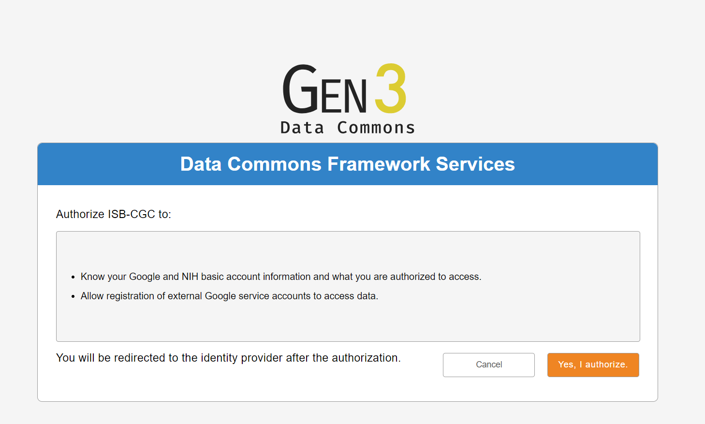

************************************************
Accessing Controlled Data
************************************************

Accessing **controlled data** is achieved in two different ways, depending on how you are using it: 

  - Interactive computing (*e.g.* the Web App or R Studio) or, 
  - Programmatic computing (*e.g.* a program running from a Google Virtual Machine Compute Engine you have started).  
  
In some cases you will be using your *personal* credentials while in other cases a "service account" will be acting on your behalf, using its own credentials.  The methods are described below.  Please note, you can use both methods at the same time; they are not mutually exclusive.

.. image:: Controlled-Access-Flowchart.png
   :align: center

Interactive Access to Controlled Data 
======================================

This section explains how to get access to controlled data through the ISB-CGC WebApp. It shows you how to associate your Google Identity to your NIH or eRA 
account through the WebApp.

**You must have a Google identity**

If you don't have a Google Identity yet, please see the  `ISB-CGC Quick-Start Guide <HowToGetStartedonISB-CGC.html>`_. 

**You must have either an NIH or eRA account.**

Before you can access *any* controlled-data hosted by the ISB-CGC,
you must first associate (or "link") your Google identity (which you use to sign in to the ISB-CGC WebApp and
access the Google Cloud) with a valid NIH login associated with a dbGaP data-access request
(either an eRA account ID or an NIH account User ID).  This is done through the Web App: you will 
first be redirected to an NIH login page, and once you have successfully authenticated,
ISB-CGC will store an association between your NIH identity and your Google identity.
(Note that this should be a one-to-one association.)

**Your eRA (or NIH) account must be linked to dbGaP permissions.**

Once you have authenticated, ISB-CGC will check which datasets, e.g. TCGA controlled data and/or TARGET controlled data you have been authorized (by dbGaP) to access.  ISB-CGC obtains an updated whitelist for each of the hosted datasets from
dbGaP every day.  If you have just recently been granted access by dbGaP, there may be a 24 hour
delay before you will be able to request access to these data on ISB-CGC.

Visit `electronic Research Administration (eRA) <http://era.nih.gov>`_ for more information on 
registering for a NIH eRA account. NIH staff may utilize their NIH log-in. 
(For additional instructions, please refer to `Tips for Preparing a Successful Data Access Request <https://www.ncbi.nlm.nih.gov/projects/gap/cgi-bin/GetPdf.cgi?document_name=GeneralAAInstructions.pdf>`_, 
and `Understanding Data Security <https://isb-cancer-genomics-cloud.readthedocs.io/en/latest/sections/data/TCGA_Data_Security.html>`_).  Please be sure to review the Data Use Certification Agreement for `TCGA controlled data <https://www.ncbi.nlm.nih.gov/projects/gap/cgi-bin/study.cgi?study_id=phs000178.v9.p8>`_ and `TARGET controlled data <https://www.ncbi.nlm.nih.gov/projects/gap/cgi-bin/study.cgi?study_id=phs000218.v17.p6>`_. 

Once you have authenticated to NIH via the Web App, and your dbGaP authorization has been verified, the 
Google identity associated with your account will have access to the controlled-data for 24 hours.

For more information on applying for dbGaP authorization to access controlled data, please see 
the "How to" `Apply for Controlled Access Data Video <http://www.youtube.com/watch?v=-3tUBeKbP5c>`_.

Linking your NIH and Google identities
--------------------------------------
To link your NIH identity with your Google identity (ie the Google account you used to login to the ISB-CGC system), 
select the "persona" icon next to your login name (A in the image below) after you have signed in to the ISB-CGC Web App.  

.. image:: webapp/personaeicon-NIHLoginAssoc.png
   :scale: 30
   :align: center

You will then see the following page:

.. image:: webapp/NIHAssociationPage.png
   :scale: 30
   :align: center

You will see a pop up describing all the steps needed to link you NIH Identity to the Data Commons Framework (DCF).

.. image:: webapp/LinkNIHIDInstructions.PNG
   :scale: 30
   :align: center

Now you need to associate your Google identity with your NIH identity.  (Your NIH identity is the one associated
with your dbGaP application and authorization to work with controlled data.) 
To do this, select the "Associate with eRA Commons Account" link (highlighted in the diagram above, and labeled A).  
You will then be redirected to an NIH login page to be authenticated by NIH:

.. image:: webapp/iTrust.png
   :scale: 30
   :align: center

If you have an eRA identification, use this to sign in through panel A (see example above).  
If you have an NIH PIV card, use that to sign in through panel B on this page (see above).  
Once you have been authenticated by NIH, and your NIH identity has been verified to be on
the current dbGaP whitelist, you will have access to controlled data for 24 hours.  

   

Select the Yes, I Authorize button at the bottom right of the page to authorize the Data Commons Framework to authorize your Google identity with controlled data.

.. image:: webapp/datacommons.ioLogIn.PNG
   :scale: 30
   :align: center

Select the email you used to originally log into the ISB-CGC web application to finalize the authorization.

Once logged in through eRA identification you are redirected to the user details page and given a Warning Notice referring to abiding by the rules and regulations provided by the DUCA Use Agreement.  Please refer to image below.

.. image:: webapp/warningNotice.png
   :scale: 30
   :align: center

Please note: the ISB-CGC system will enforce a one-to-one relationship between NIH identities
and Google identities.  In other words, a single NIH identity may not be used to
gain access to controlled data by multiple, different Google identities.
If you need to *unlink* your eRA account from your Google account (for example if you want to
change which Google identity you use to sign in to the ISB-CGC platform), you may do so by
selecting "Unlink <GoogleID> from the NIH username <eRA Commons ID>" (link B in the screen above).

In the unusual instance that your NIH identity has been registered with another Google identity 
(*eg* with another Google identity you own), you will see the screen below:

.. image:: webapp/eRAlinkedtoAnotherGoogle.png
   :scale: 30
   :align: center
   
If this happens, please sign in with that other account and "unlink" your eRA from that account
(see description above).  You will then be able to register your eRA account with the desired Google identity.  
If you are not able to resolve the issue, contact us at feedback@isb-cgc.org and we will help you resolve it.   

To end your Web App session, just "Sign Out" by using the pull-down below your name 
(see image below, A).  After you sign out from the ISB-CGC Web App, your Google identity may 
still be signed in to your browser, so you may want to also sign out of the browser.

.. image:: webapp/SignOut.png
   :scale: 30
   :align: center

Extending Your Access by 24 hours 
-----------------------------------
Once you have received permission to view controlled access data, your user login page will look 
like the screenshot below. If you need to extend your access to controlled data for another 24 
hours from now (*eg* if you have a compute job which is using these Google credentials to access 
controlled data and it is still running), select the link "Extend controlled access 
period to 24 hours from now" (red box on figure below).  
Your time of access will be extended to 24 hours from the time you push the link. 

.. image:: webapp/24hrExtension.png
   :scale: 30
   :align: center

.. toctree::
   :maxdepth: 1
   :hidden:
   
   Controlled-data-GCP
   
   
