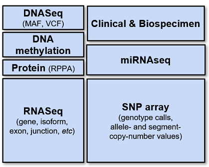

**********************
Programs and Data Sets
**********************

The National Cancer Institute (NCI) `Genomic Data Commons <https://gdc.cancer.gov/>`_ (GDC) and  `Proteomics Data Commons (PDC) <https://pdc.cancer.gov/pdc/>`_ provide the cancer research community with data repositories that enables data sharing across cancer genomic and proteomic studies (known as Programs) in support of precision medicine. 

The ISB-CGC started with The Cancer Genome Atlas (TCGA) data sets but has expanded to include other data sets from programs such as Therapeutically Applicable Research to Generate Effective Treatments (TARGET). Along with the NCI GDC and PDC data sets, ISB-CGC hosts data sets from programs such as Catalogue Of Somatic Mutations In Cancer (COSMIC) from the `Wellcome Trust Sanger Institute <http://www.sanger.ac.uk/>`_. We are always interested in adding new data sets, so if you have any suggestions or requests for additional data, please let us know (feedback@isb-cgc.org).

Clinical, Biospecimen and Processed -Omics Data Sets
----------------------------------------------------

From Genomic Data Commons
~~~~~~~~~~~~~~~~~~~~~~~~~

Between ISB-CGC and the NCI GDC, there are many cancer data sets available on the Google Cloud Platform. ISB-CGC hosts some carefully curated, high-level clinical, biospecimen and molecular data sets and tables in Google BigQuery as well as radiology and pathology images in Google Cloud Storage. The GDC hosts several more data sets that include low-level sequencing data. For more information about the GDC, see the `GDC Overview <data/GDC_top.html>`_.

Clinical, biospecimen and processed -omics data (such as RNASeq, etc.) are available in the GDC Cloud Storage buckets, in ISB-CGC BigQuery tables and through ISB-CGC web tools. The table below lists each Program and where (through ISB-CGC) that you can find its data. 

- Within the detailed documentation on each Program (click on the Program name), there is an example of how to use the metadata stored in ISB-CGC BigQuery tables to locate the Program's files on the GDC Google Cloud Storage buckets. 
- To learn more about using this data with ISB-CGC web tools, go to the ISB-CGC Web Interface section of this document.
- To locate these tables in the ISB-CGC BigQuery project, use the ISB-CGC BigQuery Table Search.
   
   
.. list-table:: 
   :widths: 10 3 3 3
   :header-rows: 1 
   :stub-columns: 1
  
   
   * - Program
     - GDC Google Cloud Storage
     - ISB-CGC BigQuery Tables
     - ISB-CGC Cohort Builder
   * - `BEATAML <data/BEATAML_about.html>`_
     - |checkmark| 
     - |checkmark| 
     - |checkmark|
   * - `CCLE <data/CCLE_top.html>`_
     - |checkmark|
     - |checkmark|
     - |checkmark|
   * - `CGCI <data/CGCI_about.html>`_
     - |checkmark|
     - |checkmark|
     - 
   * - `CMI <data/CMI_about.html>`_
     - |checkmark|
     - |checkmark|
     - 
   * - `CPTAC <data/CPTAC_about.html>`_
     - |checkmark|
     - |checkmark| 
     - 
   * - `CTSP <data/CTSP_about.html>`_
     - |checkmark|
     - |checkmark|
     - 
   * - `FM <data/FM_about.html>`_
     - |checkmark|
     - |checkmark|
     - |checkmark|
   * - `GENIE <data/GENIE_about.html>`_
     - |checkmark|
     - |checkmark| *
     - 
   * - `HCMI <data/HCMI_about.html>`_
     - |checkmark|
     - |checkmark| 
     - 
   * - `MMRF <data/MMRF_about.html>`_
     - |checkmark|
     - |checkmark|
     - |checkmark|
   * - `NCICCR <data/NCICCR_about.html>`_
     - |checkmark|
     - |checkmark| *
     - 
   * - `OHSU <data/OHSU_about.html>`_
     - |checkmark|
     - |checkmark| *
     - |checkmark|
   * - `ORGANOID <data/ORGANOID_about.html>`_
     - |checkmark|
     - |checkmark| 
     - 
   * - `TARGET <data/TARGET_top.html>`_
     - |checkmark|
     - |checkmark|
     - |checkmark|   
   * - `TCGA <data/TCGA_top.html>`_
     - |checkmark|
     - |checkmark|
     - |checkmark|
   * - `TCGA Pathology and Radiology images <data/TCGA-images.html>`_
     - |checkmark|
     - |checkmark|
     - |checkmark|
   * - `VAREPOP <data/VAREPOP_about.html>`_
     - |checkmark|
     - |checkmark| 
     - 
   * - `WCDT <data/WCDT_about.html>`_
     - |checkmark|
     - |checkmark|
     - 
     

   
*Clinical and metadata only available

.. toctree::
   :maxdepth: 1
   :hidden:
   
   data/BEATAML_about
   data/CCLE_top
   data/CGCI_about
   data/CMI_about
   data/CPTAC_about
   data/CTSP_about
   data/FM_about
   data/GENIE_about
   data/HCMI_about
   data/MMRF_about
   data/NCICCR_about
   data/OHSU_about
   data/ORGANOID_about
   data/TARGET_top
   data/TCGA_top
   data/TCGA-images
   data/VAREPOP_about
   data/WCDT_about
   
From Proteomics Data Commons
~~~~~~~~~~~~~~~~~~~~~~~~~   

PDC protein expression data are available in ISB-CGC BigQuery tables. The table below lists each Program. 

.. list-table:: 
   :widths: 10 3 3 3
   :header-rows: 1 
   :stub-columns: 1
  
   
   * - Program
     - PDC AWS Cloud Storage
     - ISB-CGC BigQuery Tables
     - ISB-CGC Cohort Builder
   * - `CBTN <data/CBTN_about.html>`_  
     - 
     - |checkmark| 
     - 
   * - `CPTAC <data/CPTAC_about.html>`_
     - 
     - |checkmark| 
     - 
   * - `Georgetown Proteomics Research Program <data/GPRP_about.html>`_
     - 
     - |checkmark| 
     - |checkmark|
   * - `ICPC <data/ICPC_about.html>`_
     - 
     - |checkmark|
     - 
   * - `Quantitative Digital Maps of Tissue Biopsies <data/Quant_Maps_Tissue_Biopsies_about.html>`_
     - 
     - |checkmark|
     -  
     
.. toctree::
   :maxdepth: 1
   :hidden:
   
   data/CBTN_about
   data/CPTAC_about
   data/GPRP_about
   data/ICPC_about 
   data/Quant_Maps_Tissue_Biopsies_about
     
From Other Sources
~~~~~~~~~~~~~~~~~~

.. list-table:: 
   :header-rows: 1
   :stub-columns: 1
   
   * - Program
     - GDC Google Cloud Storage
     - ISB-CGC BigQuery Tables
     - ISB-CGC Cohort Builder
   * - `COSMIC <data/COSMIC_about.html>`_
     - No, the COSMIC database is maintained by the Wellcome Sanger Institute, UK
     - Yes, COSMIC data is in BigQuery for registered users. Learn more about how to gain access to the COSMIC data `here <data/COSMIC_about.html>`_   
     - 
   * - `Pan-Cancer Atlas <PanCancer-Atlas-Mirror.html>`_
     - 
     - |checkmark|
     - 
     
.. toctree::
   :maxdepth: 1
   :hidden:
   
   data/COSMIC_about
   PanCancer-Atlas-Mirror

Reference Data Sets
-------------------

ISB-CGC hosts `reference tables <data/Reference-Data.html>`_  in BigQuery with information that describes or annotates human or other genomes, or is necessary to work with data generated by specific platforms.

.. toctree::
   :maxdepth: 1
   :hidden:
   
   data/Reference-Data
   
File Metadata Data Sets
------------------------
ISB-CGC hosts `metadata tables <data/FileMetadata.html>`_ in BigQuery with information that points to the raw and processed cancer data in the NCI GDC Google Cloud Storage buckets.

.. toctree::
   :maxdepth: 1
   :hidden:
   
   data/FileMetadata
   
