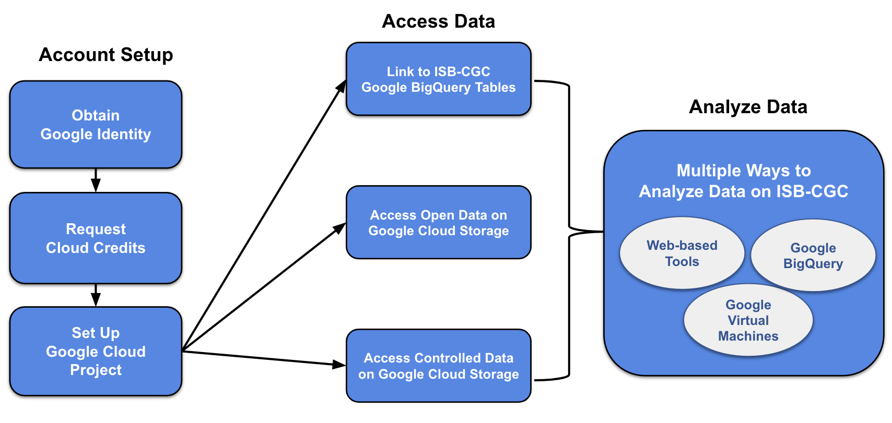

******************
Quick-Start Guide
******************

ISB-CGC provides both interactive (through a `web application <https://isb-cgc.appspot.com/>`_) and programmatic access to data hosted by institutes such as the Genomic Data Commons (GDC) of the National Cancer Institute (NCI), and the Wellcome Trust Sanger Institute, leveraging many aspects of the Google Cloud Platform. To get started, you'll need a Google Cloud Project. Additionally, to access controlled data, you'll also need `dbGaP authorization <Gaining-Access-To-Controlled-Access-Data.html>`_.

Google Cloud Project Setup and Data Access
##########################################################
A Google Cloud Project (GCP) is required to make use of all of the data, tools, and Google Cloud functionality.

**Obtain a Google identity**

 - Do you or your institution already have a Google identity, such as a Gmail account? If so, you can proceed to the next step.
 - If not, it only takes a minute to `create a Google identity <https://accounts.google.com/signup/v2/webcreateaccount?dsh=308321458437252901&continue=https%3A%2F%2Faccounts.google.com%2FManageAccount&flowName=GlifWebSignIn&flowEntry=SignUp#FirstName=&LastName=>`_.  You can even link a non-Gmail account (eg. scientist@nih.gov) as a Google identity by `this <https://accounts.google.com/signup/v2/webcreateaccount?flowName=GlifWebSignIn&flowEntry=SignUp&nogm=true>`_ method.

**Request Google Cloud Credits**

 - Take advantage of a one-time `$300 Google Credit <https://cloud.google.com/free/>`_.
 - If you have already used this one-time offer (or there is some other reason you cannot use it), see this information about how to request `ISB-CGC Cloud Credits <HowtoRequestCloudCredits.html>`_.

**Set up a Google Cloud Project**

 - See Google's documentation about how to `create a Google Cloud Project <https://cloud.google.com/resource-manager/docs/creating-managing-projects>`_.
 - Learn about how to `add members and roles to a project <https://cloud.google.com/iam/docs/quickstart>`_.
 - If you'll be accessing controlled data, `register the GCP project <controlled-access/Controlled-data-GCP.html>`_.
 - `Enable Required Google Cloud APIs <https://cloud.google.com/apis/docs/getting-started#enabling_apis>`_

**Connect to ISB-CGC's cancer data tables in Google BigQuery**
 
 - To obtain access to the ISB-CGC open access project tables in BigQuery, users can link these tables to their GCP project as described `here <progapi/bigqueryGUI/LinkingBigQueryToIsb-cgcProject.html>`_.
 - To obtain access to the ISB-CGC controlled access project tables in BigQuery, users can link these tables to their GCP project as described `here <Gaining-Access-To-Controlled-Access-Data.html#controlled-access-in-the-google-bigquery-console>`_.
  
**Access open-access data**

 - All individual processed data files are accessible through GDC Google Cloud Storage buckets; ISB-CGC provides pointers to these files. Examples of how to find these URLs are in `this section <Hosted-Data.html>`_, on each Program's documentation page; these SQL queries can also be incorporated into notebooks or workflows.

**Access controlled data (with proper authorization)**

 - To access controlled data (primarily raw data files in the GDC Google Cloud Storage buckets), users must first be authenticated by NIH (`via the ISB-CGC web-app <Gaining-Access-To-Controlled-Access-Data.html>`_). Upon successful authentication, user dbGaP authorization will be verified. These two steps are required before the user’s Google identity is added to the access control list (ACL) for the controlled data. At this time, this access must be renewed every 24 hours.
  
**Getting Started with Analysis**

Now you're ready to perform analysis. ISB-CGC offers web-based interactive interactive analysis, analysis with Google BigQuery and analysis using APIs and VMs. Please see the next section `Getting Started with Analysis <HowToGetStarted-Analysis.html>`_ to learn more.

