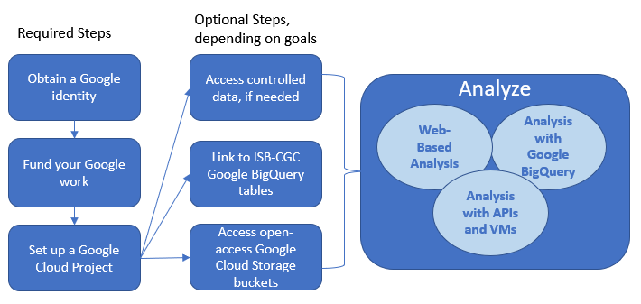

******************
How To Get Started on ISB-CGC
******************

The ISB-CGC provides both interactive (through a `web application <https://isb-cgc.appspot.com/>`_) and programmatic access to data hosted by institutes such as the Genomic Data Commons (GDC) of the National Cancer Institute (NCI), and the Wellcome Trust Sanger Institute, leveraging many aspects of the Google Cloud Platform. To get started, you'll need a Google Cloud Project. Additionally, to access controlled data, you'll also need `dbGaP authorization <Gaining-Access-To-Controlled-Access-Data.html>`_.

Google Cloud Project Setup and Data Access
##########################################################
A Google Cloud Project (GCP) is required to make use of all of the data, tools, and Google Cloud functionality.

**Obtain a Google identity**

 - Do you have a Google identity already (e.g. a Gmail account)? Your institutional email may be a Google identity (if your institution uses Google Apps), or you may have a personal Gmail address.
 - If not, it only takes a minute to `create a Google identity <https://accounts.google.com/signup/v2/webcreateaccount?dsh=308321458437252901&continue=https%3A%2F%2Faccounts.google.com%2FManageAccount&flowName=GlifWebSignIn&flowEntry=SignUp#FirstName=&LastName=>`_.  You can even link a non-Gmail account (eg. scientist@nih.gov) as a Google identity by `this <https://accounts.google.com/signup/v2/webcreateaccount?flowName=GlifWebSignIn&flowEntry=SignUp&nogm=true>`_ method.

**Ways to fund your Google Cloud work**

 - Create your own GCP project and take advantage of a one-time `$300 Google Credit <https://cloud.google.com/free/>`_.
 - If you have already used this one-time offer (or there is some other reason you cannot use it), please see the information here about how to request `ISB-CGC Cloud Credits <HowtoRequestCloudCredits.html>`_.

**Set up a Google Cloud Project**

 - If you'll be accessing controlled data, `register the GCP project <Gaining-Access-To-Controlled-Access-Data.html#requirements-for-registering-a-google-cloud-project-service-account>`_.
 
 - `Enable Required Google Cloud APIs <https://cloud.google.com/apis/docs/getting-started#enabling_apis>`_

**Connect to ISB-CGC's cancer data tables in Google BigQuery**
 
 - To obtain access to the ISB-CGC open access project tables in BigQuery, users can link these tables to their GCP project as described `here <progapi/bigqueryGUI/LinkingBigQueryToIsb-cgcProject.html>`_.
 - To obtain access to the ISB-CGC controlled access project tables in BigQuery, users can link these tables to their GCP project as described `here <progapi/bigqueryGUI/LinkingISB-CGCtoCABQ.html>`_.
  
**Access open-access Google Cloud Storage buckets**

 - All individual processed data files are accessible through GDC Google Cloud Storage buckets; ISB-CGC provides pointers to these files. Examples of how to find these URLs are in `this section <Hosted-Data.html>`_, on each Program's documentation page.

**Access controlled data, if needed**

 - To access controlled data (primarily raw data files in the GDC Google Cloud Storage buckets), users must first be authenticated by NIH (`via the ISB-CGC web-app <Gaining-Access-To-Controlled-Access-Data.html#interactive-access-to-controlled-data>`_). Upon successful authentication, user dbGaP authorization will be verified. These two steps are required before the user’s Google identity is added to the access control list (ACL) for the controlled data. At this time, this access must be renewed every 24 hours.
  
Interactive web-based Cancer Data Analysis & Exploration
##########################################################
Explore and analyze ISB-CGC cancer data through a suite of graphical user interfaces (GUIs) that allow users to select and
filter data from one or more public data sets (such as TCGA, CCLE, and TARGET), combine with your own uploaded data and analyze
using a variety of built-in visualization tools.

.. list-table::
   :widths: 60, 40
   :header-rows: 0 

   * - **Patient Cohort Data Explorer:**
       *Interactively create and explore cohorts of interest.*
     - `ISB-CGC Data Explorer Documentation <https://isb-cancer-genomics-cloud.readthedocs.io/en/latest/sections/DataExplorer.html>`_ 
   * - **Interactive Pathology and Radiology Image Viewers:**  
       *View images from cancer patients seamlessly using integrated image viewers.*
     - `ISB-CGC Web Browser Documentation <https://isb-cancer-genomics-cloud.readthedocs.io/en/latest/sections/webapp/OsimisWebViewer.html>`_ 
   * - **Integrative Genomics Viewer (IGV):**
       *Interactively explore and visualize genomic data.*
     - `ISB-CGC Integrative Genomics Viewer (IGV) Documentation <https://isb-cancer-genomics-cloud.readthedocs.io/en/latest/sections/webapp/OsimisWebViewer.html>`_
   * - **Cancer Data File Browser:**   
       *Browse and identify files associated with cohorts of interest*
     - `ISB-CGC Cancer Data File Browser Documentation <https://isb-cancer-genomics-cloud.readthedocs.io/en/latest/sections/webapp/Saved-Cohorts.html#file-browser>`_
   * - **Mitelman Database for Chromosome Aberrations and Gene Fusions in Cancer:**
       *Explore relationships between chromosomal changes and cancer.*
     - `ISB-CGC Mitelman Database Documentation <https://isb-cancer-genomics-cloud.readthedocs.io/en/latest/sections/data/Mitelman_about.html>`_
     
Cancer data analysis using Google BigQuery
##########################################################
Processed data are consolidated by data type (ex. Clinical, DNA Methylation, RNAseq, Somatic Mutation, etc.) and transformed
into ISB-CGC Google BigQuery tables for ease of access and analysis. This novel approach allows users to quickly analyze
information from thousands of patients in our curated BigQuery tables.

.. list-table::
   :widths: 60, 40
   :header-rows: 0
 
   * - **BigQuery Table Search User Interface:**
       *Learn more about ISB-CGC hosted BigQuery tables* 
     - `ISB-CGC BigQuery Table Search Documentation <https://isb-cancer-genomics-cloud.readthedocs.io/en/latest/sections/BigQueryTableSearchUI.html>`_
   * - **Google BigQuery Console:**
       *Use SQL to analyze and query ISB-CGC cancer data store in Google’s cloud-based data warehouse* 
     - `ISB-CGC BigQuery Documentation <https://isb-cancer-genomics-cloud.readthedocs.io/en/latest/sections/BigQuery.html>`_
   * - **Notebooks:** 
       *Seamlessly integrate ISB-CGC tables with R and Python to conduct robust analyses*
     - * `ISB-CGC Notebook Documentation <https://isb-cancer-genomics-cloud.readthedocs.io/en/latest/sections/HowTos.html>`_  
       * `ISB-CGC Statistical Notebook Documentation <https://isb-cancer-genomics-cloud.readthedocs.io/en/latest/sections/RegulomeExplorerNotebooks.html>`_

Cancer data analysis using APIs & Google Cloud Virtual Machines
#################################################################
ISB-CGC enables as many workflow technologies as possible through documentation, support, necessary infrastructure.

.. list-table::
   :widths: 60, 40
   :header-rows: 0
 
   * - **ISB-CGC APIs:**
       *Programmatically access data and user-generated cancer patient cohort information* 
     - `ISB-CGC API Documentation <https://isb-cancer-genomics-cloud.readthedocs.io/en/latest/sections/progapi/progAPI-v4/Programmatic-Demo.html>`_
   * - **Connecting to GA4GH and Cloud Life Sciences APIs:**
       *Easily connect to APIs from ISB-CGC*
     - * `How to find a tool using GA4GH TRS Notebook <https://nbviewer.jupyter.org/github/isb-cgc/Community-Notebooks/blob/master/Notebooks/How_to_find_a_tool_using_GA4GH_TRS.ipynb>`_ 
       * `How to use a GA4GH tool using WES Notebook <https://nbviewer.jupyter.org/github/isb-cgc/Community-Notebooks/blob/master/Notebooks/How_to_use_a_GA4GH_tool_using_WES.ipynb>`_ 
       * `Google API Documentation <https://cloud.google.com/life-sciences/docs/apis>`_
   * - **Running workflows on ISB-CGC:**
       *Execute custom pipelines & algorithms on scalable virtual machines*
     - `ISB-CGC Workflow Documentation <https://isb-cancer-genomics-cloud.readthedocs.io/en/latest/sections/progapi/workflows_top.htm>`_  
