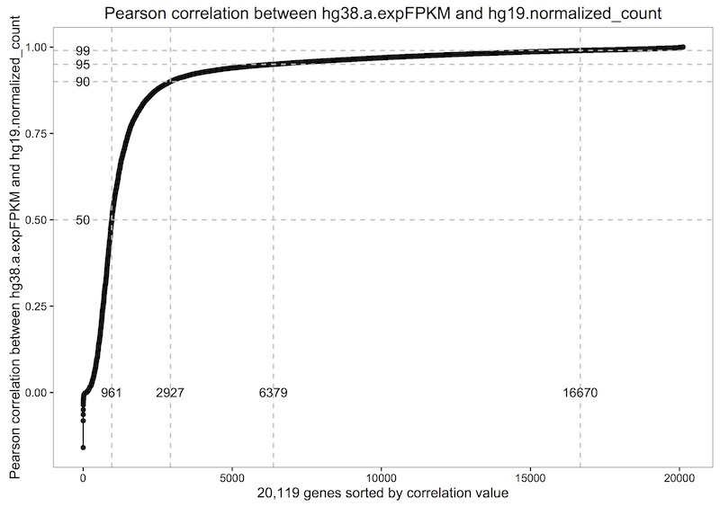

***********************
Query of the Half Month
***********************

The half-month is a two week period of time used in astronomy labeled A-Y.
Each half-month we'll be adding new and interesting queries. Please let us
know if you'd like to be featured on the "query-blog"!
email: dgibbs (at) systemsbiology (dot) org

Half-month V, 2016
##################

This half-month's query comes from our own Sheila Reynolds. Thanks Sheila!

Description
-----------
Sheila writes, "I wanted to have a look at Michael's new hg38 TCGA gene expression
data table, based on the newest data from the GDC (coming soon!
isb-cgc:GDC_data_open.TCGA_GeneExpressionQuantification).
I was thinking about maybe picking one highly-variable gene and then doing a
scatter-plot of the hg19 vs hg38 data to see how things looked. But once I got
started I got more and more ambitious. I finally ended up with the following ~50
line query which computes the correlation between the hg19 and the hg38 expression
values for each gene, and then calculates deciles across all of the correlation
coefficients and finally outputs them as a short little table (see below) --
80% of the correlation coefficients are > 0.92, and the median is nearly 0.97"

The query took a grand total of 33s, and processed 34GB of data.

The BigQuery
------------

.. code-block:: sql

	SELECT
	  QUANTILES ( gexpCorr, 11 )
	FROM (
	  SELECT
	    hg38.a.geneID,
	    hg38.b.gene_name,
	    CORR(hg38.a.expFPKM,hg19.normalized_count) AS gexpCorr
	  FROM (
	      # this nearly-outermost SELECT results in the lined-up hg38 and hg19 expression
	      # for all samples and all genes -- for a total of ~224M rows
	    SELECT
	      hg38.a.sampleID,
	      hg38.a.geneID,
	      hg38.b.gene_name,
	      hg38.a.expFPKM,
	      hg19.normalized_count
	    FROM (
	        # from these two SELECTs + JOIN, we get a.sampleID, a.geneID, b.gene_name, and a.expFPKM
	        # with a total of ~669M rows
	      SELECT
	        a.sampleID,
	        a.geneID,
	        b.gene_name,
	        a.expFPKM,
	      FROM (
	          # this next bit returns a table that is too large and requires 'allow large results'
	          # but anyway, it has sampleID, geneID, expFPKM (for 671M rows)
	        SELECT
	          SamplesSubmitterID AS sampleID,
	          Ensembl_gene_ID AS geneID,
	          HTSeq__FPKM AS expFPKM
	        FROM
	          [isb-cgc:GDC_data_open.TCGA_GeneExpressionQuantification] ) a
	      JOIN EACH (
	          # this next bit gets ~60k rows of gene_id and gene_name from GENCODE_v24
	        SELECT
	          gene_id,
	          gene_name
	        FROM
	          [isb-cgc:genome_reference.GENCODE_v24]
	        WHERE
	          feature="gene" ) b
	      ON
	        a.geneID=b.gene_id ) hg38
	    JOIN EACH (
	        # this select results in ~228M rows of hg19 data ...
	      SELECT
	        SampleBarcode,
	        HGNC_gene_symbol,
	        normalized_count,
	      FROM
	        [isb-cgc:tcga_201607_beta.mRNA_UNC_RSEM] ) hg19
	    ON
	      hg38.a.sampleID=hg19.SampleBarcode
	      AND hg38.b.gene_name=hg19.HGNC_gene_symbol )
	  GROUP BY
	    hg38.a.geneID,
	    hg38.b.gene_name
	  HAVING
	    gexpCorr IS NOT null )

Rscript
-------

.. code-block:: r

  library(bigrquery)
  library(ggplot2)

  # after removing the quantiles statement and
	# saving the above query as a string variable named 'q'

	res1 <- query_exec(q, project='isb-cgc-xx-xyzw')

	dim(res1)
	# [1] 20119     3

	ys <- c(0.5, 0.9, 0.95, 0.99)
	xs <- c(961, 2927, 6379,16670)

	qplot(x=1:20119, y=sort(res1$gexpCorr)) + geom_line() +
  geom_hline(yintercept = ys, col='grey', lty=2) +
  geom_vline(xintercept = xs, col='grey', lty=2) +
  annotate(geom="text", label="961", x=961, y=0) +
  annotate(geom="text", label="2927", x=2927, y=0) +
  annotate(geom="text", label="6379", x=6379, y=0) +
  annotate(geom="text", label="16670", x=16670, y=0) +
  annotate(geom="text", label="50", y=.50, x=0) +
  annotate(geom="text", label="90", y=.90, x=0) +
  annotate(geom="text", label="95", y=.95, x=0) +
  annotate(geom="text", label="99", y=.99, x=0) +
  xlab("20,119 genes sorted by correlation value") +
  ylab("Pearson correlation between hg38.a.expFPKM and hg19.normalized_count") +
  ggtitle("Pearson correlation between hg38.a.expFPKM and hg19.normalized_count") +
  theme_bw() +
  theme(panel.grid.major = element_blank(), panel.grid.minor = element_blank(),
        panel.background = element_blank(), axis.line = element_line(colour = "black"))

	# Then let's take a look at a few genes with good and bad correlations.
	# I did that by modifying the above query. First I removed the quantiles bit,
	# then I broke up the correlation statement and added the hg38.SampleID
	# so we'd get a gene expression value for each sample.

	res1[which(res1$gexpCorr > 0.999),]

	# let's look at IL25

Visualization
-------------

Let us know if you're having trouble! We're here to help.

**Additional Resources:**

`ISB-CGC documentation <http://isb-cancer-genomics-cloud.readthedocs.io/en/latest/index.html>`_

What's Next?
############

Check out our github repo containing introductions to data types and ideas
for different analysis.

https://github.com/isb-cgc/examples-R

.. toctree::
   :maxdepth: 1

   workshop/Workshop_R_tut
