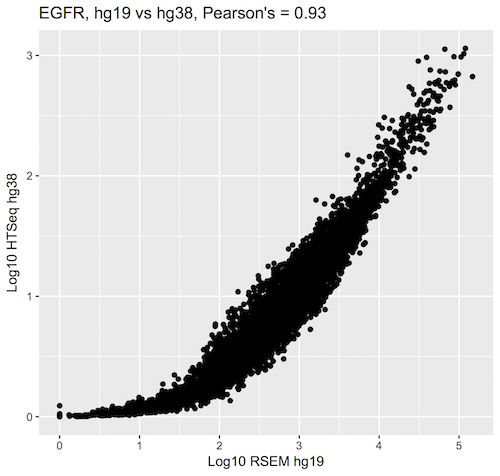
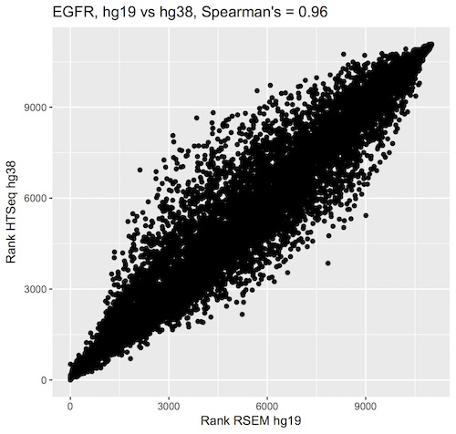

***********************
Query of the Month Club
***********************

Welcome to the 'Query of the Month Club' where we'll be creating a collection
of new and interesting queries to demonstrate the powerful combination of
BigData from the TCGA and BigQuery from Google.

Please let us know if you'd like to be featured on the "query-club"!
email: dgibbs (at) systemsbiology (dot) org

December, 2016
##############

Comparing the TCGA hg19 and GDC hg38 gene expression data.

Description
-----------
This query compares two gene expression builds. The first, from the TCGA, used
the RSEM quantification method with the hg19 reference. The second is the
new GDC data, quantified with the HTSeq method on the hg38 reference.
Rather than look at one gene at a time, it's easy (and fast!) to look across all genes simultaneously.
The following query includes gene reference tables and computes both
Pearson and Spearman's correlation for each gene. After saving the results in a new
table, we calculates deciles across all of the correlation coefficients and
output a short summary table. We find that about 80% of the correlation
coefficients are > 0.84, and the median is 0.93.
The query took a grand total of 28.9s, and processed 34GB of data. As an example,
we look at the expression data for EGFR. See the SQL and R code below.

The BigQuery
------------

.. code-block:: sql

    WITH
    --
    -- *GdcGene*
    -- We start by extracting gene-expression data from the new GDC/hg38-based
    -- table in the isb-cgc:hg38_data_previews dataset.  For each row, we
    -- extract simply the SamplesSubmitterID (aka the TCGA sample barcode),
    -- the Ensembl gene ID (eg ENSG00000182253), and the FPKM value.  The input
    -- table has ~671M rows and many more fields, but we just need these 3.
    GdcGene AS (
    SELECT
      SamplesSubmitterID AS sampleID,
      Ensembl_gene_ID AS geneID,
      HTSeq__FPKM AS HTSeq_FPKM
    FROM
      `isb-cgc.hg38_data_previews.TCGA_GeneExpressionQuantification` ),
    --
    -- *GeneRef*
    -- Next, we're going to get the gene-id to gene-symbol mapping from the GENCODE
    -- reference table because the GDC table reference above contains only the gene-id
    -- while the expression data we want to compare that to contains gene symbols.
    GeneRef AS (
    SELECT
      gene_id,
      gene_name
    FROM
      `isb-cgc.genome_reference.GENCODE_v24`
    WHERE
      feature='gene' ),
    --
    -- *Hg38*
    -- Now we'll join the two tables above to annotate the GDC expression data with gene-symbols,
    -- and we'll call it Hg38.  We're also going to create a ranking of the expression values
    -- so that we can compute a Spearman correlation later on.
    Hg38 AS (
    SELECT
      GdcGene.sampleID,
      GdcGene.geneID,
      GeneRef.gene_name,
      GdcGene.HTSeq_FPKM,
      DENSE_RANK() OVER (PARTITION BY GdcGene.geneID ORDER BY GdcGene.HTSeq_FPKM ASC) AS rankHTSeq
    FROM
      GdcGene
    JOIN
      GeneRef
    ON
      GdcGene.geneID = GeneRef.gene_id ),
    --
    -- *Hg19*
    -- Now, we'll get the older hg19-based TCGA gene expression data that was generated
    -- by UNC using RSEM.  This table has ~228M rows and we're just going to extract
    -- the sample-barcode, the gene-symbol, the normalized-count, and the platform (since
    -- this data ws produced on two different platforms and this might be relevant later).
    -- As above, we will also create ranking of the expression values.
    Hg19 AS (
    SELECT
      SampleBarcode,
      HGNC_gene_symbol,
      normalized_count as RSEM_FPKM,
      DENSE_RANK() OVER (PARTITION BY HGNC_gene_symbol ORDER BY normalized_count ASC) AS rankRSEM,
      Platform
    FROM
      `isb-cgc.tcga_201607_beta.mRNA_UNC_RSEM`
    WHERE
      HGNC_gene_symbol IS NOT NULL ),
    --
    -- *JoinAndCorr*
    -- Finally, we join the two tables and compute correlations
    JoinAndCorr AS (
    SELECT
      hg38.geneID AS gene_id,
      hg38.gene_name AS gene_name,
      CORR(LOG10(hg38.HTSeq_FPKM+1),
        LOG10(hg19.RSEM_FPKM+1)) AS gexpPearsonCorr,
      CORR(hg38.rankHTSeq,
        hg19.rankRSEM) AS gexpSpearmanCorr
    FROM
      Hg19
    JOIN
      Hg38
    ON
      hg38.sampleID=hg19.SampleBarcode
      AND hg38.gene_name=hg19.HGNC_gene_symbol
    GROUP BY
      hg38.geneID,
      hg38.gene_name )
    --
    -- Lastly, we make one last select
    -- to get a difference between Pearson and Spearman correlations.
    SELECT
      gene_id,
      gene_name,
      gexpPearsonCorr,
      gexpSpearmanCorr,
      (gexpSpearmanCorr-gexpPearsonCorr) AS deltaCorr
    FROM
      JoinAndCorr
    WHERE
      IS_NAN(gexpSpearmanCorr) = FALSE
    ORDER BY
      gexpSpearmanCorr DESC

The results of the query were saved to a table, which allowed us to write
queries to examine the results over the 20K+ genes.

.. code-blocks:: sql

    SELECT
      APPROX_QUANTILES ( gexpPearsonCorr, 10 ) AS PearsonQ,
      APPROX_QUANTILES ( gexpSpearmanCorr, 10 ) AS SpearmanQ,
      APPROX_QUANTILES ( deltaCorr, 10 ) AS deltaQ
    FROM
      `isb-cgc-02-0001.Daves_working_area.hg19_vs_hg38_results`

------------

Visualizations
--------------

.. figure:: query_figs/correlation_btw_hg19_hg38_v2.jpg
   :scale: 100
   :align: center

   This plot shows the correlation between TCGA hg19 and GDC hg38 gene expression data
   where each point is a gene.

------------

   This plot shows the EFGR log10 expression values for both TCGA hg19 and GDC hg38 sources.

------------

   This plot shows the ranked EFGR expression values for both TCGA hg19 and GDC hg38 sources.

------------

------------

Rscript
-------

Newer bigrquery package versions support using standard SQL, so make sure you're up to date.

.. code-block:: r

  library(devtools)
  devtools::install_github("rstats-db/bigrquery")

  library(bigrquery)
  library(ggplot2)
  library(stringr)

  # saving the above query as a string variable named 'q'

  res1 <- query_exec(q, project='isb-cgc-02-abcd', useLegacySql = FALSE)

  dim(res1)
  # [1] 20119     3

  ys <- c(0.5, 0.9, 0.95, 0.99)
  ls <- sapply(1:4, function(i) sum(res1$gexpPearsonCorr < ys[i]))

  qplot(x=1:20119, y=sort(res1$gexpPearsonCorr)) + geom_line() +
  geom_hline(yintercept = ys, col='grey', lty=2) +
  geom_vline(xintercept = ls, col='grey', lty=2) +
  annotate(geom="text", label=ls[1], x=ls[1], y=0) +
  annotate(geom="text", label=ls[2], x=ls[2], y=0) +
  annotate(geom="text", label=ls[3], x=ls[3], y=0) +
  annotate(geom="text", label=ls[4], x=ls[4], y=0) +
  annotate(geom="text", label="50", y=ys[1], x=0) +
  annotate(geom="text", label="90", y=ys[2], x=0) +
  annotate(geom="text", label="95", y=ys[3], x=0) +
  annotate(geom="text", label="99", y=ys[4], x=0) +
  xlab("20,119 genes sorted by correlation value") +
  ylab("Pearson correlation between hg38.a.expFPKM and hg19.normalized_count") +
  ggtitle("Pearson correlation between hg38.a.expFPKM and hg19.normalized_count") +
  theme_bw() +
  theme(panel.grid.major = element_blank(), panel.grid.minor = element_blank(),
        panel.background = element_blank(), axis.line = element_line(colour = "black"))

  # As an exercise, you could make the above plot with Spearman's correlations.

  # Then let's take a look at one of our favorite genes, EGFR.

  q <- "
    WITH
    --
    Hg38 AS (
    SELECT
      SamplesSubmitterID AS sampleID,
      Ensembl_gene_ID AS geneID,
      DENSE_RANK() OVER (PARTITION BY Ensembl_gene_ID ORDER BY HTSeq__FPKM ASC) AS rankHTSeq,
      HTSeq__FPKM AS HTseq_FPKM
    FROM
      `isb-cgc.hg38_data_previews.TCGA_GeneExpressionQuantification`
    WHERE
      Ensembl_gene_ID = 'ENSG00000146648'),
    --
    Hg19 AS (
    SELECT
      SampleBarcode,
      HGNC_gene_symbol,
      normalized_count as RSEM_FPKM,
      DENSE_RANK() OVER (PARTITION BY HGNC_gene_symbol ORDER BY normalized_count ASC) AS rankRSEM,
      Platform
    FROM
      `isb-cgc.tcga_201607_beta.mRNA_UNC_RSEM`
    WHERE
      HGNC_gene_symbol = 'EGFR' )
    --
    -- *Join and Get Expr*
    SELECT
      hg38.geneID AS gene_id,
      hg19.HGNC_gene_symbol AS gene_name,
      LOG10(hg38.HTseq_FPKM+1) as Log10_hg38_HTSeq,
      LOG10(hg19.RSEM_FPKM+1) AS Log10_hg19_RSEM,
      rankRSEM,
      rankHTSeq
    FROM
      Hg19
    JOIN
      Hg38
    ON
      hg38.sampleID=hg19.SampleBarcode
    GROUP BY
      gene_id,
      gene_name,
      Log10_hg38_HTSeq,
      Log10_hg19_RSEM,
      rankRSEM,
      rankHTSeq"

  result <- query_exec(q, project="isb-cgc-02-abcd", useLegacySql=F)

  qplot(data=result, x=Log10_hg19_RSEM, y=Log10_hg38_HTSeq, main="EGFR, hg19 vs hg38, Pearson's = 0.93", xlab="Log10 RSEM hg19", ylab="Log10 HTSeq hg38")

  qplot(data=result, x=rankRSEM, y=rankHTSeq, main="EGFR, hg19 vs hg38, Spearman's = 0.96", xlab="Rank RSEM hg19", ylab="Rank HTSeq hg38")

  # As an exercise to the reader, try plotting some other genes. Maybe genes
  # with both high and low correlations. What do you find?

------------

Let us know if you're having trouble! We're here to help.

**Additional Resources:**

`ISB-CGC documentation <http://isb-cancer-genomics-cloud.readthedocs.io/en/latest/index.html>`_

What's Next?
############

Check out our github repo containing introductions to data types and ideas
for different analysis.

https://github.com/isb-cgc/examples-R

.. toctree::
   :maxdepth: 1

   workshop/Workshop_R_tut
