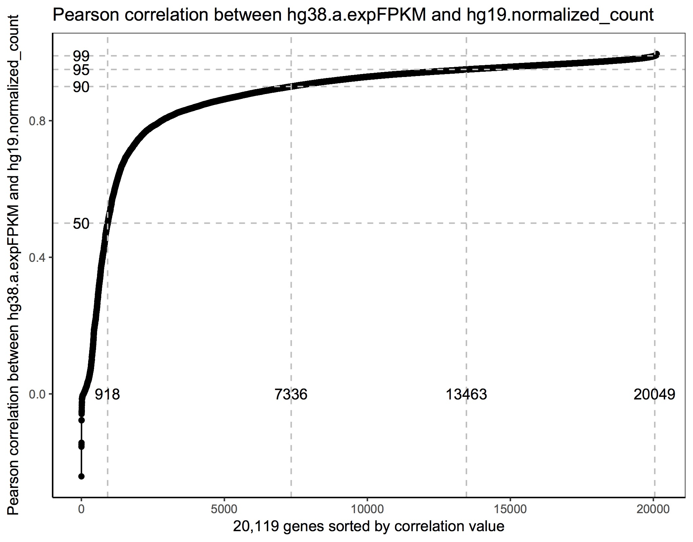
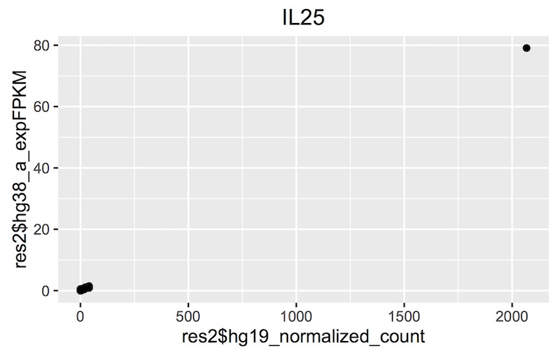
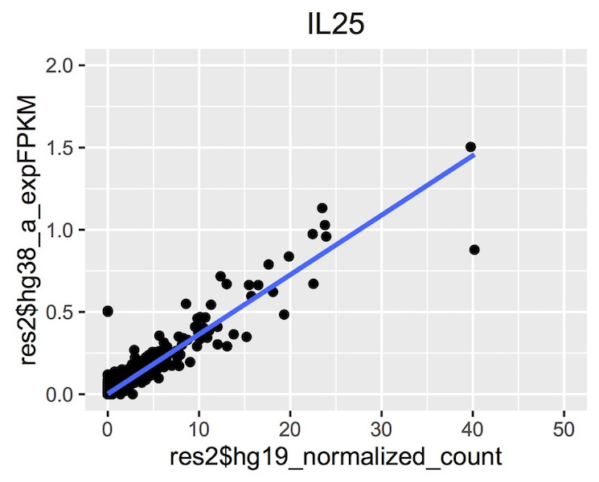
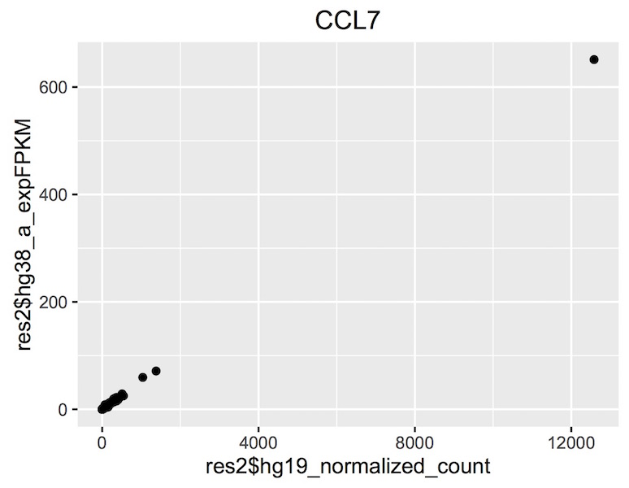
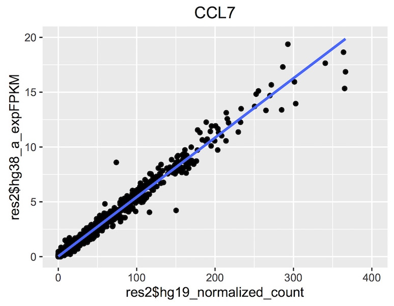
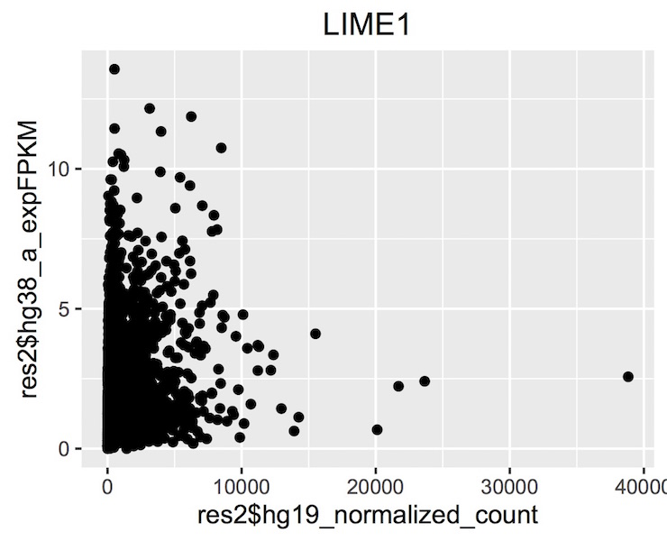

***********************
Query of the Month Club
***********************

Welcome to the 'Query of the Month Club' where we'll be creating a collection
of new and interesting queries to demonstrate the powerful combination of
BigData from the TCGA and BigQuery from Google.

Please let us know if you'd like to be featured on the "query-club"!
email: dgibbs (at) systemsbiology (dot) org

December, 2016
##############

This month's query comes from our own Sheila Reynolds. Thanks Sheila!

Description
-----------
Sheila writes, "I wanted to have a look at our new hg38 TCGA gene expression
table which is based on the newest data from the GDC (coming soon!).
I was thinking about maybe picking one highly-variable gene and then doing a
scatter-plot of the hg19 vs hg38 data to see how things looked. But once I got
started I got more and more ambitious. I finally ended up with the following query
which computes the correlation (both Pearson and Spearman's) between the hg19 and
the hg38 expression values for each gene, and then calculates deciles across all
of the correlation coefficients and finally outputs them as a short little table
80% of the correlation coefficients are > 0.84, and the median is 0.93"

The query took a grand total of 28.9s, and processed 34GB of data.

The BigQuery
------------

.. code-block:: sql

		WITH
		--
		-- *GdcGene*
		-- We start by extracting gene-expression data from the new GDC/hg38-based
		-- table in the isb-cgc:hg38_data_previews dataset.  For each row, we
		-- extract simply the SamplesSubmitterID (aka the TCGA sample barcode),
		-- the Ensembl gene ID (eg ENSG00000182253), and the FPKM value.  The input
		-- table has ~671M rows and many more fields, but we just need these 3.
		GdcGene AS (
		SELECT
			SamplesSubmitterID AS sampleID,
			Ensembl_gene_ID AS geneID,
			HTSeq__FPKM AS expFPKM
		FROM
			`isb-cgc.hg38_data_previews.TCGA_GeneExpressionQuantification` ),
		--
		-- *GeneRef*
		-- Next, we're going to get the gene-id to gene-symbol mapping from the GENCODE
		-- reference table because the GDC table reference above contains only the gene-id
		-- while the expression data we want to compare that to contains gene symbols.
		GeneRef AS (
		SELECT
			gene_id,
			gene_name
		FROM
			`isb-cgc.genome_reference.GENCODE_v24`
		WHERE
			feature="gene" ),
		--
		-- *Hg38*
		-- Now we'll join the two tables above to annotate the GDC expression data with gene-symbols,
		-- and we'll call it Hg38.  We're also going to create a ranking of the expression values
		-- so that we can compute a Spearman correlation later on.
		Hg38 AS (
		SELECT
			GdcGene.sampleID,
			GdcGene.geneID,
			GeneRef.gene_name,
			GdcGene.expFPKM,
			DENSE_RANK() OVER (PARTITION BY GdcGene.geneID ORDER BY GdcGene.expFPKM ASC) AS rankFPKM
		FROM
			GdcGene
		JOIN
			GeneRef
		ON
			GdcGene.geneID = GeneRef.gene_id ),
		--
		-- *Hg19*
		-- Now, we'll get the older hg19-based TCGA gene expression data that was generated
		-- by UNC using RSEM.  This table has ~228M rows and we're just going to extract
		-- the sample-barcode, the gene-symbol, the normalized-count, and the platform (since
			-- this data ws produced on two different platforms and this might be relevant later).
		-- As above, we will also create ranking of the expression values.
		Hg19 AS (
		SELECT
			SampleBarcode,
			HGNC_gene_symbol,
			normalized_count,
			DENSE_RANK() OVER (PARTITION BY HGNC_gene_symbol ORDER BY normalized_count ASC) AS rankRSEM,
			Platform
		FROM
			`isb-cgc.tcga_201607_beta.mRNA_UNC_RSEM`
		WHERE
			HGNC_gene_symbol IS NOT NULL ),
		--
		-- *JoinAndCorr*
		-- Finally, we join the two tables and compute correlations
		JoinAndCorr AS (
		SELECT
			hg38.geneID AS gene_id,
			hg38.gene_name AS gene_name,
			CORR(LOG10(hg38.expFPKM+1),
				LOG10(hg19.normalized_count+1)) AS gexpPearsonCorr,
			CORR(hg38.rankFPKM,
				hg19.rankRSEM) AS gexpSpearmanCorr
		FROM
			Hg19
		JOIN
			Hg38
		ON
			hg38.sampleID=hg19.SampleBarcode
			AND hg38.gene_name=hg19.HGNC_gene_symbol
		GROUP BY
			hg38.geneID,
			hg38.gene_name )
		SELECT
			gene_id,
			gene_name,
			gexpPearsonCorr,
			gexpSpearmanCorr,
			(gexpSpearmanCorr-gexpPearsonCorr) AS deltaCorr
		FROM
			JoinAndCorr
		WHERE
			IS_NAN(gexpSpearmanCorr) = FALSE
		ORDER BY
			gexpSpearmanCorr DESC

The results of the query were saved to a table, which allowed us to write
queries to examine the results over the 20K+ genes.

.. code-blocks:: sql

		SELECT
		  APPROX_QUANTILES ( gexpPearsonCorr, 10 ) AS PearsonQ,
		  APPROX_QUANTILES ( gexpSpearmanCorr, 10 ) AS SpearmanQ,
		  APPROX_QUANTILES ( deltaCorr, 10 ) AS deltaQ
		FROM
		  `isb-cgc-02-0001.Daves_working_area.hg19_vs_hg38_results`

------------

Visualizations
--------------

   This plot shows the correlation between TCGA hg19 and GDC hg38 gene expression data
   where each point is a gene.

------------

   This plot shows the expression values for TCGA hg19 and GDC hg38 sources
   for IL25. We can see that the exceptional correlation (0.999) is caused by
   an outlier.

------------

   This plot is zoomed in, and we can see that the actual relationship is slightly
   more fuzzy.

------------

   This plot shows the expression values for TCGA hg19 and GDC hg38 sources
   for CCL7. We can see that (again) the exceptional correlation (0.999) is caused by
   an outlier.

------------

   This plot is zoomed in, and we can see that the actual relationship is slightly
   more fuzzy.

------------

   This plot is zoomed in, and we can see that the actual relationship is slightly
   more fuzzy.

------------

Rscript
-------

Newer bigrquery package versions support using standard SQL, so make sure you're up to date.

.. code-block:: r

	library(devtools)
	devtools::install_github("rstats-db/bigrquery")

  library(bigrquery)
  library(ggplot2)
	library(stringr)

	# saving the above query as a string variable named 'q'

	res1 <- query_exec(q, project='isb-cgc-xx-xyzw', useLegacySql = FALSE)

	dim(res1)
	# [1] 20119     3

	ys <- c(0.5, 0.9, 0.95, 0.99)
  ls <- sapply(1:4, function(i) sum(res1$gexpPearsonCorr < ys[i]))

	qplot(x=1:20119, y=sort(res1$gexpPearsonCorr)) + geom_line() +
  geom_hline(yintercept = ys, col='grey', lty=2) +
  geom_vline(xintercept = ls, col='grey', lty=2) +
  annotate(geom="text", label=ls[1], x=ls[1], y=0) +
  annotate(geom="text", label=ls[2], x=ls[2], y=0) +
  annotate(geom="text", label=ls[3], x=ls[3], y=0) +
  annotate(geom="text", label=ls[4], x=ls[4], y=0) +
  annotate(geom="text", label="50", y=ys[1], x=0) +
  annotate(geom="text", label="90", y=ys[2], x=0) +
  annotate(geom="text", label="95", y=ys[3], x=0) +
  annotate(geom="text", label="99", y=ys[4], x=0) +
  xlab("20,119 genes sorted by correlation value") +
  ylab("Pearson correlation between hg38.a.expFPKM and hg19.normalized_count") +
  ggtitle("Pearson correlation between hg38.a.expFPKM and hg19.normalized_count") +
  theme_bw() +
  theme(panel.grid.major = element_blank(), panel.grid.minor = element_blank(),
        panel.background = element_blank(), axis.line = element_line(colour = "black"))

  # As an exercise, you could make the above plot with Spearman's correlations.

	# Then let's take a look at a few genes with good and bad correlations.
	# I did that by modifying the above query. First I removed the quantiles bit,
	# then I broke up the correlation statement and added the hg38.SampleID
	# so we'd get a gene expression value for each sample.

	res1[which(res1$gexpPearsonCorr > 0.995),]

	# One interesting thing, is that when the correlation is below 0.5,
	# many of the gene species showing up are snoRNAs.

	sum(res1$gexpPearsonCorr < 0.5)
  #[1] 918
	sum(str_detect(pattern="SNOR", string=res1[which(res1$gexpPearsonCorr < 0.5),2]))
  [1] 370

	q <- "
	  SELECT
	    hg38.a.sampleID,
	    hg38.a.geneID,
	    hg38.b.gene_name,
	    hg38.a.expFPKM,
	    hg19.normalized_count
	  FROM (
	    SELECT
	      hg38.a.sampleID,
	      hg38.a.geneID,
	      hg38.b.gene_name,
	      hg38.a.expFPKM,
	      hg19.normalized_count
	    FROM (
	      SELECT
	        a.sampleID,
	        a.geneID,
	        b.gene_name,
	        a.expFPKM,
	      FROM (
	        SELECT
	          SamplesSubmitterID AS sampleID,
	          Ensembl_gene_ID AS geneID,
	          HTSeq__FPKM AS expFPKM
	        FROM
	          [isb-cgc:GDC_data_open.TCGA_GeneExpressionQuantification] ) a
	      JOIN EACH (
	        SELECT
	          gene_id,
	          gene_name
	        FROM
	          [isb-cgc:genome_reference.GENCODE_v24]
	        WHERE
	          feature='gene' ) b
	      ON
	        a.geneID=b.gene_id ) hg38
	    JOIN EACH (
	      SELECT
	        SampleBarcode,
	        HGNC_gene_symbol,
	        normalized_count,
	      FROM
	        [isb-cgc:tcga_201607_beta.mRNA_UNC_RSEM] ) hg19
	    ON
	      hg38.a.sampleID=hg19.SampleBarcode
	      AND hg38.b.gene_name=hg19.HGNC_gene_symbol )
	  WHERE
	    hg38.b.gene_name = 'IL25'
	  GROUP BY
	    hg38.a.sampleID,
	    hg38.a.geneID,
	    hg38.b.gene_name,
	    hg38.a.expFPKM,
	    hg19.normalized_count"

	# let's look at IL25
	res2 <- query_exec(query_for_IL25, project="isb-cgc-02-0001")

	qplot(x=res2$hg19_normalized_count, y=res2$hg38_a_expFPKM, main="IL25")

	qplot(x=res2$hg19_normalized_count, y=res2$hg38_a_expFPKM, main="IL25", xlim=c(0,50), ylim=c(0,2)) + geom_smooth(method="lm")

------------

Let us know if you're having trouble! We're here to help.

**Additional Resources:**

`ISB-CGC documentation <http://isb-cancer-genomics-cloud.readthedocs.io/en/latest/index.html>`_

What's Next?
############

Check out our github repo containing introductions to data types and ideas
for different analysis.

https://github.com/isb-cgc/examples-R

.. toctree::
   :maxdepth: 1

   workshop/Workshop_R_tut
