********************
Query of the Month
********************

Welcome to the 'Query of the Month' where we'll be creating a collection
of new and interesting queries to demonstrate the powerful combination of
BigData from the NCI cancer programs like TCGA, and BigQuery from Google.

Please let us know if you have an idea or a suggestion for our next QotM!

Query of the Month is produced by:

- David L Gibbs (david.gibbs ( ~ at ~ ) systemsbiology ( ~ dot ~ ) org)

- Sheila M Reynolds (sheila.reynolds ( ~ at ~ ) systemsbiology ( ~ dot ~ ) org)

-----------------------

Table of Contents
=================

2018
++++

- May_: Processing bam files using CWL 'scatter and gather'.

- April_: Running CWL workflows in the cloud.

- March_: Machine learning classifer in BigQuery?! Top Scoring Pairs implementation.

- February_: BioCircos shiny app, showing pairwise correlations within a pathway.

- January_: Gene Set Scoring in BigQuery, using the new hg38 mutation tables.

2017
++++

- December2017_: BigQuery comparing TCGA samples to GTEx tissues with Spearman correlation.

- November2017_: Run an R (or python) script in batch mode using dsub on the google cloud.

- October2017_: Using plotly for visualization in Shiny apps. We implement an interatictive heatmap using heatmaply

- September2017_: We implement a new statistical test in BigQuery: the one-way ANOVA.

- August2017_: A small demo application using BigQuery as the backend for a Shiny app.

- July2017_: Look at the BigQuery RECORD data type in methylation tables from the GDC.

- May2017_: Continued from April: estimating the distance between samples based on shared mutations in pathways.

- April2017_: BigQuery compute a similarity metric on overlapping mutations between samples.  Uses MC3 mutation table and data from COSMIC.

- March2017_: BigQuery to compute a pairwise distance matrix and a heatmap in R

- February2017_: Using BigQuery, define K-means clustering as a user defined (javascript) function

- January2017_: Comparing Standard SQL and Legacy SQL.

2016
++++

- December2016_: Spearman correlation in BigQuery to compare the new hg38 expression data to the hg19 data

Links
+++++

Resources_:  Helpful information!

-----------------------

.. _May:

May, 2018
#########

Processing bam files using CWL 'scatter and gather'.

In this edition of the QotM, we're going to continue exploring running workflows 
with CWL. Last time, we performed the 'scatter', where one applies a tool to a list
of files. This time, we'll complete the paradigm by performing a 'gather' to collate 
the results of the scatter.

Specifically, we're going to bin the sequence reads by GC content for each file,
then we can make a plot of GC content by read counts.

The plan:

- compute some statistics over a list of bam files with samtools

- use grep to parse out a portion of the stats output

- use cut to select some columns from the output

- use cat to gather the outputs into a single file

Each of these is defined as a CWL tool, and together they make a workflow.

The first three steps of the workflow are considered scatter operations, and the 
last is the gather, where the outputs are combined.

Let's look at the first tool:

::

	#samtools_stats_tool.cwl 

	cwlVersion: v1.0
	class: CommandLineTool

	baseCommand: [samtools, stats]

	requirements:
	  - class: InlineJavascriptRequirement

	inputs:
	  filein:
	    type: File
	    inputBinding:
	      position: 1

	outputs:
	  statsout:
	    type: File
	    outputBinding:
	      glob: "*.stats"

	stdout: $(inputs.filein.path.split('/').pop() + '.stats')

This tool definition is going to compute a set of different statistics for each bam file.
The statistic-type is delineated by a column label. 
An interesting thing here, is that the standard output, usually printed to the screen, 
is captured and saved using the input file name where '.bam' is replace with '.stats',
and the output looks for that '.stats' with the file glob.

The next tool is going to parse out our statistic of interest.

::
	
	#grep_tool.cwl 

	cwlVersion: v1.0

	class: CommandLineTool

	baseCommand: grep

	arguments:
	  - "--with-filename"
	  - "^GCF"

	inputs:
	  input_file:
	    type: File
	    inputBinding:
	      position: 1

	outputs:
	  grepout:
	    type: stdout

This is a very general tool that could be applied in many settings... since it's just grep!
Grep is a pattern matching tool, so each line of text that starts with 'GCF' is printed. Also
we're going to add the input file name to each line. Then later on we know where this result came from.
Interesting thing here: since we don't explicitly define the file name for the standard output,
the name is random. We can let the workflow runner worry about it.

The next tool wraps the cut command.

::
	
 	#cut_tool.cwl 

	cwlVersion: v1.0

	class: CommandLineTool

	baseCommand: cut
	arguments:
	  - "-d "
	  - "-f"
	  - "1,5-"

	inputs:
	  input_file:
	    type: File
	    inputBinding:
	      position: 1
	    
	outputs:
	  cutout:
	    type: stdout

Here, we define some 'arguments' to the baseCommand. '-d ' sets the delimiter to white space,
'-f 1,5-' says we want fields (-f) 1, and 5+.  Column 1 is the file name, and the stat of interest
appears in columns 5 and beyond.  Again we don't define any file names for the output.

Lastly, we are going to gather all the results.

::
	
	#cat_tool.cwl 

	cwlVersion: v1.0

	class: CommandLineTool

	baseCommand: cat

	inputs:
	  filein:
	    type: File[]
	    inputBinding:
	      position: 1

	outputs:
	  catout:
	    type: stdout

	stdout: final_output.txt

Important to note that in the cat tool, we have defined the input to be an array of files.
That's like 'cat file.a file.b file.c'. And here we *do* define the output file name. 

OK! Let's work these tools into a flow.

Important note: I developed all these tools on my local machine with small test cases. When I was ready to test on the google cloud, 
the only change I made was adding the docker hint (see below), and moving tool definitions (the cwl files) data into a bucket. Then
using the google cwl runner.

The main workflow:

::
	
	#!/usr/bin/env cwl-runner

	cwlVersion: v1.0
	class: Workflow

	requirements:
	  ScatterFeatureRequirement: {}

	hints:
	  DockerRequirement:
	    dockerPull: biocontainers/samtools

	inputs:
	  filein: File[]

	outputs:
	  pipeline_result:
	    type: File
	    outputSource: step4/catout

	steps:

	  step1:
	    run: data/samtools_stats_tool.cwl
	    scatter: [filein]
	    scatterMethod: dotproduct
	    in:
	      filein: filein
	    out:
	      [statsout]

	  step2:
	    run: data/grep_tool.cwl
	    scatter: [input_file]
	    scatterMethod: dotproduct
	    in:
	      input_file: step1/statsout
	    out:
	      [grepout]

	  step3:
	    run: data/cut_tool.cwl
	    scatter: [input_file]
	    scatterMethod: dotproduct
	    in:
	      input_file: step2/grepout
	    out:
	      [cutout]

	  step4:
	    run: data/cat_tool.cwl
	    in:
	      filein: step3/cutout
	    out:
	      [catout]

You will notice, that we only define an array of bam files as inputs to the workflow (File[]), 
the intermediates are carried through without explicitly naming them. Inputs to the middle steps
point to the outputs of previous steps (step1/statsout -> step2).

.. _April:

April, 2018
###########

For the next few months, we're going to be focusing on running
workflows in the Google cloud, starting with workflows defined with CWL.
There's a lot to explore in this area, and it's hopefully going to be useful
for people.

We appear to be moving towards a future where bioinformatics tools are routinely
bundled into runtime containers (like docker), which are somehow 'approved' by the
research community as being safe and effective, launched in the cloud, process
data in the cloud, and write results to the cloud. Sounds great, but how does one
do that?

We previously documented some very low level details on
`running CWL workflows <http://isb-cancer-genomics-cloud.readthedocs.io/en/latest/sections/progapi/CWL_intro.html>`_,
but to make things easier, we started with some `code <https://github.com/googlegenomics/pipelines-api-examples/tree/master/cwl_runner>`_
from Google, made some updates to the scripts, and with them you can (fairly) easily run CWL workflows
in the cloud. The current working google CWL runner is found in our
`examples-Compute <https://github.com/isb-cgc/examples-Compute/tree/master/google_cwl_runner>`_
repo.

In this example, we'll be using `a workflow (transform.cwl) <https://github.com/NCI-GDC/gdc-dnaseq-cwl/blob/master/workflows/dnaseq/transform.cwl>`_
from the GDC that was used to 'harmonize' TCGA data.

The CWL workflow has a few sections: requirements, inputs, outputs, and steps.
The purpose of the workflow is to execute the steps, where each step is a tool
(also described by a CWL) which has a set of inputs and outputs.

In transform.cwl, the first step is:

::

    steps:
      - id: samtools_bamtobam
        run: ../../tools/samtools_bamtobam.cwl
        in:
          - id: INPUT
            source: bam_path
        out:
          - id: OUTPUT

Let's look more closely at this first step
(`samtools_bamtobam.cwl <https://github.com/NCI-GDC/gdc-dnaseq-cwl/blob/master/tools/samtools_bamtobam.cwl>`_)
and see if we can run it; first on one file, and then on a set of files.

**single file**

To make the example a little more accessible, I've rewritten the CWL,
as seen below.

::

  #!/usr/bin/env cwl-runner

  cwlVersion: v1.0

  class: CommandLineTool

  hints:
    DockerRequirement:
      dockerPull: biocontainers/samtools

  baseCommand: [samtools, view, -Shb]

  inputs:
    filein:
      type: File
      inputBinding:
        position: 1
    fileout:
      type: string
      inputBinding:
        prefix: -o
        position: 2

  outputs:
    bamsout:
      type: File
      outputBinding:
        glob: "*.bam"

OK, let's start at the top.
This is going to run `samtools <http://www.htslib.org/doc/samtools.html>`_, so we've defined this CWL as a CommandLineTool.

Then, since this is running in the cloud, we need the tool to be dockerized. I did
a little searching, and found a `biocontainer <https://biocontainers.pro/>`_ with
`samtools <https://hub.docker.com/r/biocontainers/samtools/>`_. We let CWL know this is a dockerized
tool with our DockerRequirement hint.

Next we have the baseCommand, which is a command line command that's broken up by commas.
What's samtools view doing? Well, if we look in `Aaron Quinlan's github repo <https://github.com/arq5x/tutorials/blob/master/samtools.md>`_:
"The samtools view command is the most versatile tool in the samtools package. It's main function, not surprisingly, is to allow you to convert the binary (i.e., easy for the computer to read and process) alignments in the BAM file view to text-based SAM alignments that are easy for humans to read and process."
The 'view' command, with the -Shb flags will (-S is depreciated) -h includes the header, -b outputs a bam. This is simply a bam-to-bam workflow.

We will 'view' an input file, named 'filein', and output a file, named 'fileout' (creative huh?). But those are the inputs, or arguments,
that I'm giving to samtools. The order of the samtools parameters is controlled by the position, and in the case of
'fileout', I'm attaching a prefix '-o' (the output flag).

We still have the CWL outputs section. This is actually what gets connected up to a workflow (a series of steps).
Here I've called it 'bamsout', and declare the file will be named 'something dot bam' (*.bam).

OK then, still with me? Next I set up a google bucket with data and output folders. This is also where the CWL files go.

::

      my-bucket/
          bamtobam/
              samtools_bamtobam_single_file.cwl
              data/
                  bam1.bam
                  bam2.bam (etc)
              outputs/

To get some data to work on, I moved some bams from the
`ENCODE project <http://hgdownload.cse.ucsc.edu/goldenPath/hg19/encodeDCC/wgEncodeUwRepliSeq/>`_
to my bucket's data folder.

The last thing we need is a settings file. This maps actual file names in our bucket
and parameter values to variable names found in the CWL.
The paths are relative to the location to the CWL file. Here's what I used (in the yaml format):

::

  filein:
    class: File
    path: data/wgEncodeUwRepliSeqBjG1bAlnRep1.bam
  fileout: samoutput.bam

You can see the filein and fileout names match up with what's in the CWL. This
is important.

Then after cloning our repo (git clone https://github.com/isb-cgc/examples-Compute),
we can run it!
The cwl_runner.sh script sets up a new VM, runs the cwl_startup.sh script,
attaches a disk, copies over the data,
runs the CWL, copies out the data, and shuts everything down by running the cwl_shutdown.sh script.
Here's the command:

::

  ./examples-Compute/google_cwl_runner/cwl_runner.sh \
    --workflow-file gs://my-bucket/bamtobam/samtools_bamtobam_single_file.cwl \
    --settings-file gs://my-bucket/bamtobam/bamtobam_params.yml \
    --input-recursive gs://my-bucket/bamtobam/data \
    --output gs://isb-cgc-02-0001-workflows/bamtobam/output \
    --machine-type n1-standard-4 \
    --zone us-central1-f \
    --keep-alive \
    --preemptible

Notice we can use preemptible machines to save money. So running this command reads the bam
and writes out a new bam, which is found in our bucket after a few minutes.

**debugging**

If something geos wrong (it probably will), there's a few things we can do.
First, check the logs! The stderr and stdout is copied back to our bucket,
and within those files we can find errors. Commonly (for me) paths can be wrong.

Second, you can try modifying the cwl_startup.sh script to include some print
statements. I've put in some statements to print out directory listings,
which gives you a view into the runtime environment.

Third, towards the bottom of the stderr, you can see the actual command that's run.
Then, if you use the --keep-alive flag (given to cwl_runner.sh),
the VM will not shutdown, and you can get in there and try the command and see what
happens.

**multiple files**

It's much more common to run a tool over a set of files. To do that, we're going
to take our tool definition above, and write a new workflow that uses it. In
CWL terms, this is called a 'scatter'. Later we'll perform the 'gather', but for
now we'll process the files, and write them back to our bucket.

::

  #!/usr/bin/env cwl-runner

  cwlVersion: v1.0

  class: Workflow

  requirements:
    ScatterFeatureRequirement: {}

  inputs:
    filein: File[]
    fileout: string[]

  outputs:
    bamsout:
      type: File[]
      outputSource: step1/bamsout

  steps:
    step1:
      run: data/samtools_bamtobam_single_file.cwl
      scatter: [filein, fileout]
      scatterMethod: dotproduct
      in:
        filein: filein
        fileout: fileout
      out:
        [bamsout]

There's some big differences between this definition and our tool definition.
For starters we have a new requirements: ScatterFeatureRequirement which
let's us perform a scatter (process multiple files in parallel).

Then in our input section, we have defined an array of files and strings.
In the output section, an array of output files, noting that the
source of these outputs is from step1 (outputSource: step1/bamsout).

The steps section has only a single step. We'll run our previously defined tool,
as a scatter over files and parameters (the output file name), with scatterMethod
dotproduct (match up the input and output file names), and we have in: and out:
names that match up with the tool definition. Very important that names connect
across the CWL definitions. It has to all fit together like legos.

Our settings file, the yaml, is also different because now we're going to be
giving it a list of files and output file names. Note the use of 'dictionaries'
with the curly brackets.

::

  filein:
    - {class: File, path: data/wgEncodeUwRepliSeqBjG1bAlnRep1.bam}
    - {class: File, path: data/wgEncodeUwRepliSeqGm12801G1bAlnRep1.bam}
    - {class: File, path: data/wgEncodeUwRepliSeqGm12878S4AlnRep1.bam}
  fileout:
      - wgEncodeUwRepliSeqBjG1bAlnRep1_OUT.bam
      - wgEncodeUwRepliSeqGm12801G1bAlnRep1_OUT.bam
      - wgEncodeUwRepliSeqGm12878S4AlnRep1_OUT.bam

And again we run it the same way, except, note that we put our tool definition
**into** the data folder so it gets copied over with the data.

::

  ./pipelines-api-examples/cwl_runner/cwl_runner.sh \
    --workflow-file gs://isb-cgc-02-0001-workflows/bamtobam/samtools_bamtobam_scatter.cwl \
    --settings-file gs://isb-cgc-02-0001-workflows/bamtobam/bamtobam_params_scatter.yml \
    --input-recursive gs://isb-cgc-02-0001-workflows/bamtobam/data \
    --output gs://isb-cgc-02-0001-workflows/bamtobam/output \
    --machine-type n1-standard-4 \
    --zone us-central1-f \
    --preemptible

If all goes well, you should see:

.. figure:: query_figs/apr_fig1_bucket_output.png
  :scale: 80
  :align: center

Whew! It's a really steep learning curve, but the payoff is that in two years,
when you wonder 'how did I do this?', you can look back and easily figure that out
and probably (maybe) even run it again.

Next month we'll continue our exploration of workflows and workflow runners. Let me know how it goes!

.. _March:

March, 2018
###########

This month we demonstrate an implementation of a machine learning classifier
using BigQuery.

The 'Top Scoring Pairs' method, finds a pair of genes that
show the maximum difference in ranking between two user specified groups.
Given two genes, and two groups of samples, the ranking of the genes flip-flops
between the two groups. If gene_i < gene_j in group 1, then gene_i > gene_j in group 2.

To describe this more formally, let
R_i be a vector of ranks
denoting the rank of the i-th gene in a given sample.

Genes are evaluated in pairs, and scored by their differences in
the probabilities, P(R_i < R_j ), between class C1 and
class C2, formally defined as the difference in the following
conditional probabilities:

  Δ_ij = ∣ P(Ri < Rj ∣ C1) − P(Ri < Rj ∣ C2)  ∣

Then Δ_ij is used as a criterion to produce a ordering on gene pairs.

For reference see `this. <https://www.ncbi.nlm.nih.gov/pmc/articles/PMC1989150/>`_

First let's produce some simulated data for testing.

.. code-block:: r

  # phenotype
  ys <- c(rep(1, 10), rep(0,10))

  # matrix of features
  xs <- matrix(data=rnorm(n=200), nrow=20)

  # the IDs
  idstr <- as.character(randomStrings(n=nrow(df), len=5, digits=FALSE,
                        upperalpha=TRUE,loweralpha=FALSE, unique=TRUE, check=TRUE))

  # the two best genes
  i <- 5
  j <- 6

  # create the gene pair
  xs[ys == 1, i] <- rnorm(n=10, mean=-2)
  xs[ys == 1, j] <- rnorm(n=10, mean=+2)
  xs[ys == 0, i] <- rnorm(n=10, mean=+2)
  xs[ys == 0, j] <- rnorm(n=10, mean=-2)
  df <- data.frame(IDs=idstr, Y=ys, xs)

  tidydf <- df %>% tidyr::gather(key="Gene", value="Expr", X1,X2,X3,X4,X5,X6,X7,X8,X9,X10)

  write.table(tidydf, file="sim_for_tsp.tsv", sep='\t', row.names=F, col.names=F, quote=F)

The results should show genes X5 & X6 as the best pair for separating groups (y==0 vs y==1).

OK, let's walk through this Top Scoring Pairs (TSP) query.

.. code-block:: sql
    :linenos:

    WITH
      #
      # First we'll rank the gene expression data by sample
      # using the simulated data.
      #
      GeneRanks AS (
      SELECT
        ID,
        Phenotype,
        Gene,
        Expr,
        RANK() OVER (PARTITION BY ID ORDER BY Expr ) AS ERank
      FROM
        `isb-cgc.QotM.tsp_sim_data`
      GROUP BY
        ID,
        Phenotype,
        Gene,
        Expr ),
      #
      # Then let's prepare to
      # generate the conditional probability for each
      # pair of genes within Class 1.
      # Calculating the upper triangle here.
      #
      Class1GenePairs AS (
      SELECT
        a.Gene AS Genei,
        b.Gene AS Genej,
        a.ID AS IDi,
        b.ID AS IDj,
        a.ERank AS Eranki,
        b.ERank AS Erankj
      FROM
        GeneRanks a
      JOIN
        GeneRanks b
      ON
        a.Gene < b.Gene
        AND a.ID = b.ID
      WHERE
        a.Phenotype = 1
        AND b.Phenotype = 1
      GROUP BY
        a.Gene,
        b.Gene,
        a.ID,
        b.ID,
        a.ERank,
        b.ERank ),
      #
      # Then, for each pair of genes,
      # how many times does gene_i have lower rank
      # than gene_j? That's where the probability comes from.
      #
      Class1Probs AS (
      SELECT
        Genei,
        Genej,
        SUM(CAST(Eranki > -1000 AS INT64)) AS N,  # number of pairs
        SUM(CAST(Eranki < Erankj AS INT64)) AS P  # pairs with i < j
      FROM
        Class1GenePairs
      WHERE
        (Genei != Genej)
      GROUP BY
        Genei,
        Genej ),
      #
      # Then repeat the process for Class 2.
      #
      Class2GenePairs AS (
      SELECT
        a.Gene AS Genei,
        b.Gene AS Genej,
        a.ID AS IDi,
        b.ID AS IDj,
        a.ERank AS Eranki,
        b.ERank AS Erankj
      FROM
        GeneRanks a
      JOIN
        GeneRanks b
      ON
        a.Gene < b.Gene
        AND a.ID = b.ID
      WHERE
        a.Phenotype = 1
        AND b.Phenotype = 1
      GROUP BY
        a.Gene,
        b.Gene,
        a.ID,
        b.ID,
        a.ERank,
        b.ERank ),
      #
      # and get our conditional probabilities
      #
      Class2Probs AS (
      SELECT
        Genei,
        Genej,
        SUM(CAST(Eranki > -1000 AS INT64)) AS N,
        SUM(CAST(Eranki < Erankj AS INT64)) AS P
      FROM
        Class2GenePairs
      WHERE
        (Genei != Genej)
      GROUP BY
        Genei,
        Genej )
      #
      # and compute differences in conditional probs
      #
    SELECT
      a.Genei AS ai,
      a.Genej AS aj,
      b.Genei AS bi,
      b.Genej AS bj,
      a.P AS Pa,
      a.N AS Na,
      b.P AS Pb,
      b.N AS Nb,
      ABS((a.P / a.N) - (b.P / b.N)) AS PDiff
    FROM
      Class1Probs a
    JOIN
      Class2Probs b
    ON
      a.Genei = b.Genei
      AND a.Genej = b.Genej
    ORDER BY
      PDiff DESC

Running this query returns a table that is ordered by the Probability difference
(the pair of genes that best separates the classes in 'rank-space'). As a note,
I left in the gene names from both tables after the join,  as a sanity
check.

.. figure:: query_figs/march18_sim_result_1.png
  :scale: 50
  :align: center

And we see that genes 'X5' and 'X6' are indeed the 'top pair'. Trailing the
leading spot, we see other pairs that are composed of one of the two 'top pair'.

But, let's suppose that we want to 'train' the model using a subset of samples.
In that case we want to pull out a sample, train on the remainder, and then apply
to the 'test' case.

.. code-block:: sql

    WITH
      #
      # Now we pull out a sample (ID: DRRTF)
      # and use the remaining samples to train the model.
      #
      GeneRanks AS (
      SELECT
        ID,
        Phenotype,
        Gene,
        Expr,
        RANK() OVER (PARTITION BY ID ORDER BY Expr ) AS ERank
      FROM
        `isb-cgc.QotM.tsp_sim_data`
      WHERE
        ID != 'DRRTF'
      GROUP BY
        ID,
        Phenotype,
        Gene,
        Expr ),

Then, last, we will query using that sample to determine if it's been classified
correctly.

.. code-block:: sql

    #
    # first we'll join the TSP result table, that contains the best pair of genes,
    # with the expression data for our held out ID.
    #
    callTbl AS (
      SELECT
        ai AS gene_i,
        aj AS gene_j,
        Pa,
        Pb,
        b.ID AS ID,
        b.Phenotype AS Phenotype,
        Expr
      FROM
        PairScore a
      JOIN
        `isb-cgc.QotM.tsp_sim_data` b
      ON
        b.ID = 'DRRTF'
        AND (a.ai = b.Gene
          OR a.aj = b.Gene) )
    #
    # Then, depending on the gene_a & gene_b comparison,
    # we make a prediction using the expr. values.
    #
    SELECT
      ID,
      Phenotype,
      IF(Pa < Pb,
          0,
          1) AS Prediction
    FROM
      callTbl
    GROUP BY
      ID,
      Phenotype,
      Prediction

.. figure:: query_figs/march18_pred_1.png
  :scale: 50
  :align: center

Seems to be working.
Let's make a few small changes, and apply it to TCGA expression data!
First we'll create our data set, then we'll apply TSP on it.

.. code-block:: sql
    :linenos:

    WITH
    #
    # To reduce the number of genes we're working with,
    # first we'll rank the gene expression data by coefficient of variation.
    # Then we'll be able to take a subset with high variance.
    # Also we'll filter out some long RNAs, etc.
    #
    GeneSelection AS (
    SELECT
      gene_name,
      STDDEV(HTSeq__FPKM_UQ) / AVG(HTSeq__FPKM_UQ) AS CVExpr
    FROM
      `isb-cgc.TCGA_hg38_data_v0.RNAseq_Gene_Expression`
    WHERE
      HTSeq__FPKM_UQ > 0
      AND REGEXP_CONTAINS(sample_barcode, '-01A')
      AND (project_short_name = 'TCGA-PAAD'
       OR project_short_name = 'TCGA-KIRP')
      AND (NOT (REGEXP_CONTAINS(gene_name, 'MT-')
          OR REGEXP_CONTAINS(gene_name, 'RN7')
          OR REGEXP_CONTAINS(gene_name, 'RNU')
          OR REGEXP_CONTAINS(gene_name, 'SNOR') ) )
    GROUP BY
      gene_name
    ORDER BY
      CVExpr DESC
    LIMIT
      50 ),
    #
    #
    # Then we'll pick a set of random samples from
    # the biospecimen table. Making sure we get only
    # primary tumors by filtering barcodes that don't
    # end with '-01A'.
    #
    SampleSelection AS (
    SELECT
      project_short_name,
      sample_barcode
    FROM
      `isb-cgc.TCGA_bioclin_v0.Biospecimen`
    WHERE
      REGEXP_CONTAINS(sample_barcode, '-01A')
      AND (project_short_name = 'TCGA-PAAD'
        OR project_short_name = 'TCGA-KIRP')
    GROUP BY
      sample_barcode,
      project_short_name
    ORDER BY
      rand()
    LIMIT
      200 ),
    #
    #
    # With genes and samples, we can subset our expression data.
    #
    ExprTable AS (
    SELECT
      sample_barcode,
      project_short_name,
      gene_name AS Gene,
      HTSeq__FPKM_UQ AS Expr
    FROM
      `isb-cgc.TCGA_hg38_data_v0.RNAseq_Gene_Expression`
    WHERE
      gene_name IN (
      SELECT
        gene_name
      FROM
        GeneSelection)
      AND sample_barcode IN (
      SELECT
        sample_barcode
      FROM
        SampleSelection)
    GROUP BY
      sample_barcode,
      project_short_name,
      Gene,
      Expr )
    #
    # And we rank the gene expression and create a phenotype variable.
    #
    SELECT
      sample_barcode AS ID,
      project_short_name,
      IF(project_short_name = 'TCGA-PAAD',
        0,
        1) AS Phenotype,
      Gene,
      Expr,
      RANK() OVER (PARTITION BY sample_barcode ORDER BY Expr ) AS ERank
    FROM
      ExprTable
    GROUP BY
      ID,
      project_short_name,
      Phenotype,
      Gene,
      Expr

And I'll save that ranked table in the query of the month dataset as
isb-cgc.QotM.paad_kirp_random_sample_1002.

.. code-block:: sql
    :linenos:

    WITH
      #
      # First let's create the table of gene pairs.
      #
      Class1GenePairs AS (
      SELECT
        a.Gene AS Genei,
        b.Gene AS Genej,
        a.ID AS IDa,
        b.ID AS IDb,
        a.ERank AS Eranka,
        b.ERank AS Erankb
      FROM
        `isb-cgc.QotM.paad_kirp_random_sample_1002` a
      JOIN
        `isb-cgc.QotM.paad_kirp_random_sample_1002` b
      ON
        a.Gene < b.Gene
        AND a.ID = b.ID
      WHERE
        a.Phenotype = 0
        AND b.Phenotype = 0
      GROUP BY
        a.Gene,
        b.Gene,
        a.ID,
        b.ID,
        a.ERank,
        b.ERank ),
      #
      # Then, for each pair of genes,
      # how many times does gene_i have lower rank
      # than gene_j? This is how the conditional
      # probability is calculated.
      #
      Class1Probs AS (
      SELECT
        Genei,
        Genej,
        SUM(CAST(Eranka > -1000 AS INT64)) AS N,
        SUM(CAST(Eranka < Erankb AS INT64)) AS P
      FROM
        Class1GenePairs
      WHERE
        (Genei != Genej)
      GROUP BY
        Genei,
        Genej ),
      #
      # Then pair up the genes in class2
      #
      Class2GenePairs AS (
      SELECT
        a.Gene AS Genei,
        b.Gene AS Genej,
        a.ID AS IDa,
        b.ID AS IDb,
        a.ERank AS Eranka,
        b.ERank AS Erankb
      FROM
        `isb-cgc.QotM.paad_kirp_random_sample_1002` a
      JOIN
        `isb-cgc.QotM.paad_kirp_random_sample_1002` b
      ON
        a.Gene < b.Gene
        AND a.ID = b.ID
      WHERE
        a.Phenotype = 1
        AND b.Phenotype = 1
      GROUP BY
        a.Gene,
        b.Gene,
        a.ID,
        b.ID,
        a.ERank,
        b.ERank ),
      #
      # and get our conditional probabilities
      #
      Class2Probs AS (
      SELECT
        Genei,
        Genej,
        SUM(CAST(Eranka > -1000 AS INT64)) AS N,
        SUM(CAST(Eranka < Erankb AS INT64)) AS P
      FROM
        Class2GenePairs
      WHERE
        (Genei != Genej)
      GROUP BY
        Genei,
        Genej ),
      #
      # and compute differences in conditional probs
      #
      Results AS (
      SELECT
        a.Genei AS gene_i,  # gene pair #1
        a.Genej AS gene_j,  # gene pair #2
        a.P AS Pa,          # number of pairs where gene #1 < gene #2 in group A
        a.N AS Na,          # total number of pairs
        b.P AS Pb,          # numbers for group B.
        b.N AS Nb,
        ABS((a.P / a.N) - (b.P / b.N)) AS PDiff  # difference in conditional probabilities
      FROM
        Class1Probs a
      JOIN
        Class2Probs b
      ON
        a.Genei = b.Genei
        AND a.Genej = b.Genej
      ORDER BY
        PDiff DESC )
    SELECT
      *
    FROM
      Results

.. figure:: query_figs/march_pred_tcga_1.png
  :scale: 50
  :align: center

So we see that the best pair of genes for
separating these two studies are NKX6-3 and SLC12A3 and
9/79 PAAD samples had expression ranking where (NKX6-3 < SLC12A3)
and for KIRP samples 114/117 had a ranking where (NKX6-3 < SLC12A3). So
it's doing a pretty good job!

Let's check this gene pair with another random set of samples.
To do that, I'll make another data table, similar to the above method,
but pull out our top scoring pair of genes. Then check if the rank ordering
is consistent within the two groups. This is a good exercise for the reader.
You can use the following tables: isb-cgc.QotM.results_1002 and
isb-cgc.QotM.paad_kirp_result_check

========= ===== ====
Phenotype FALSE TRUE
========= ===== ====
TCGA-KIRP 5     119
TCGA-PAAD 54    18
========= ===== ====

When we see how we did (see table above, 88% accuracy), it's very similar to what we previously
found, but clearly there's room for improvement.
Probably changing the way genes are selected would make a difference,
and perhaps using more samples. Let me know if you give it a try!

.. _February:

February, 2018
##############

.. figure:: query_figs/feb_screenshot1.png
  :scale: 50
  :align: center

`ISB-CGC-BioCircos-Shiny <https://isb-cgc.shinyapps.io/ISB-CGC-BioCircos-Shiny/>`_

For this entry, we're going to get back to Shiny programming and work on the
skeleton of a `BioCircos <http://bioinfo.ibp.ac.cn/biocircos/>`_ app.
These types of plots show data and relations across
the genome (typically), using a `circular layout <http://circos.ca/intro/circular_approach/>`_.

The Circos plot was first described in
`Circos: An information aesthetic for comparative genomics <https://genome.cshlp.org/content/early/2009/07/20/gr.092759.109.full.pdf>`_
by Krzywinski et al., Genome Research, 2009 (cited 3,295 times!), and originally
aimed to display relations between genomic loci. From the paper:
"Circos uses a circular ideogram layout to facilitate the display of
relationships between pairs of positions by the use of ribbons". Visualizing
genomic rearrangements was one of the key uses of the circos plot, but it's also a good way to
visualize gene-gene interactions which are often separated by large genomic distances.

In this example, we will select a group of samples, and a pathway (a set of genes),
and look at the correlations between pairs of genes.
If a pathway is active, we might expect strong correlations between the participating
genes. The pathways come from `Reactome <https://reactome.org/>`_
which was supplied by the `Bader Lab <http://baderlab.org/GeneSets>`_
and can be found in our Query of the Month table, isb-cgc:QotM.Reactome_a1 (a1 indicates annotation).

For the remainder of this month's episode, we'll go through the app, and see how it works.

In this app, there are a few objects that must stay in sync. First we have
the big table of correlations, which is generated by constructing and executing a BigQuery
based on user inputs. That table is filtered based on the user-adjustable slider bar, and
summary statistics are shown in the small table on the right. The filtered
table is also shown in a table directly under the BioCircos plot.

First we'll define the UI.

.. code-block:: r

  library(shiny)
  library(BioCircos)
  library(bigrquery)
  library(stringr)
  source("global.R")

  ui <- fluidPage(

     # Application title
     titlePanel("ISB-CGC Query of the Month, Feb 2018"),

     sidebarLayout(
        sidebarPanel(
          fluidRow(
            textOutput('pageInfo'),
            HTML("  ")
          ),
          fluidRow(
            selectInput("pathway", "Pathway", pathwayNames(), selected ="SIGNALLING TO RAS (18 genes)"),
            getTCGAProjs(),
            sliderInput('numGenes', 'random number of genes',min=0, max=50, value=10),
            actionButton(inputId="submit",label = "Submit after selecting pathway and cohort",
                         style="color: #ffffff; background-color: #67abe5; border-color: #2e6da4"),
            HTML("  "),
            sliderInput('corrThershold', 'abs value correlation threshold',min=0, max=1, value=0.33)
          ),
          fluidRow(
            HTML("  "),
            textOutput('pageOutro')
          )
        ),

        mainPanel(
           BioCircosOutput("circosPlot", width = "100%", height = "500px"),  # MAIN PLOT!
           fluidRow(
             column(8, align="center", div(tableOutput('table'), style = "font-size:80%") ),
             tableOutput('textboxinfo')
           )
        )
     )
  )

It's a pretty simple layout. We have some user-interface objects on the left, and a plot and tables on the right.
The code to populate the interface is shown below.

.. code-block:: r

  server <- function(input, output, session) {

      # some variables used in the table summary
      rvar <- reactiveValues(geneCount = 0, edgeCount = 0, edgesTotal = 0, genesTotal = 0)

      # info text
      output$pageInfo <- renderText(infoTextBlock())
      # and some text citing the packages we used
      output$pageOutro <- renderText("Packages used: BioCircos, bigrquery")

      # calling BigQuery
      bq_data <- eventReactive(input$submit, {
        withProgress(message = 'Contacting the cloud...', value = 0, {
          incProgress(1/2, "BigQuerying...")
          pathname <- input$pathway
          cohort   <- input$cohort
          n        <- input$numGenes
          sql      <- buildQuery(pathname, cohort, n)
          service_token <- set_service_token("data/our_saved_token.json")
          data <- query_exec(sql, project='our-project-id', use_legacy_sql = F)
          data
        })
      })

      # filter out the edges by correlation strength
      filterData <- reactive({
        bqdf <- bq_data()
        bqdfFilt <- bqdf[abs(as.numeric(bqdf$spearmans)) > input$corrThershold,]
        # potentially there are no gene-gene edges after filtering
        bqdfFilt
      })

      # update the table summary after filtering the data.
      checkTable <- observe(
        {
        # grab our handles
        bqdf <- bq_data()
        bqdfFilt <- filterData()
        # collect some counts on this data
        rvar$edgeCount <- nrow(bqdfFilt)
        rvar$edgeTotal <- nrow(bqdf)
        rvar$geneTotal <- length( c(unique(bqdf$geneA), unique(bqdf$geneB)) )
        rvar$geneCount <- length( c(unique(bqdfFilt$geneA), unique(bqdfFilt$geneB)) )
        if (nrow(bqdf) == 0) {
          rvar$edgeTotal <- 0
          rvar$geneCount <- 0
        }
        if (nrow(bqdfFilt) == 0) {
          bqdfFilt <- data.frame(geneA="NA",chrA="NA",startA=0,geneB="NA",chrB="NA",startB=0,spearmans=0)
          rvar$edgeCount <- 0
          rvar$geneCount <- 0
        }
      })

      # the main plot
      output$circosPlot <- renderBioCircos({

          # edge positions, From and To
          bqdfFiltered <- filterData()
          links_chromosomes_1 <- str_replace_all(bqdfFiltered$chrA, pattern="chr", replacement="")
          links_chromosomes_2 <- str_replace_all(bqdfFiltered$chrB, pattern="chr", replacement="")
          links_pos_1 <- bqdfFiltered$startA
          links_pos_2 <- bqdfFiltered$startB
          links_corr <- round(bqdfFiltered[,7],2)
          links_labels = sapply(1:length(links_pos_1), function(i) {
              paste(bqdfFiltered[i,1],bqdfFiltered[i,4], round(bqdfFiltered[i,7],2), sep=',  ')
          })

        # start with the base circos-track
        tracklist = BioCircosBackgroundTrack("myBackgroundTrack",
                                             minRadius = 0,
                                             maxRadius = 0.55,
                                             borderSize = 0,
                                             fillColors = "#EEFFEE")

        # if there's links to display, add in a link-track to the track-list
        if (nrow(bqdfFiltered) > 0) {
          tracklist = tracklist + BioCircosLinkTrack('myLinkTrack',
                                                     links_chromosomes_1, links_pos_1, links_pos_1 + 50000,
                                                     links_chromosomes_2, links_pos_2, links_pos_2 + 50000,
                                                     maxRadius = 0.8, labels=links_labels, displayLabel=FALSE)
        }

        # and call the main function with our track-list
        expr2 <- BioCircos(tracklist, genome = "hg19", yChr = FALSE, chrPad = 0,
                           displayGenomeBorder = FALSE, genomeTicksDisplay = FALSE, genomeLabelDy = 0,
                           LINKMouseOverTooltipsHtml01 = "",
                           LINKMouseOutStrokeWidth=3)

        expr2
        }, quoted = F)

        # display the table of correlations
        output$table <- renderTable({
          df <- filterData();
          df$lociA <- str_c(df$chrA, ':', df$startA)
          df$lociB <- str_c(df$chrB, ':', df$startB)
          df$corr <- df$spearmans
          df <- df[, c("geneA","lociA","geneB", "lociB", "corr")]
          df
        })

        # and the table of table summaries
        output$textboxinfo <- renderTable({
          data.frame(Item=c("number of edges shown:", "number of edges total:",
                            "number of genes shown:", "number of genes total:"),
                     Count=c(rvar$edgeCount, rvar$edgeTotal,
                             rvar$geneCount, rvar$geneTotal)
          )})
      }

  # Run the application
  shinyApp(ui = ui, server = server)

That's it! The BigQuery tables are only executed when we make a change to one
of the drop-down selectors and click the 'submit' button. But, in using the observer function,
the tables are updated whenever the correlation filter is used.

The BigQuery data-getting function is very similar to the one used in our
`October example <http://isb-cancer-genomics-cloud.readthedocs.io/en/latest/sections/QueryOfTheMonthClub_dev_feb.html#october-2017>`_
you can find it `here <https://gist.github.com/Gibbsdavidl/5580a4cb7834e2658613bb7bec07ae49>`_ .
The user inputs are pasted into the query-string, and bigrquery::query_exec() is
used to retrieve the data. We've had a lot of examples of this in the past.

One fun BigQuery trick is to use RAND() to shuffle the order of rows, followed by a
LIMIT to get a random sub-sample.

.. code-block:: sql

  ORDER BY
    rand()
  LIMIT
    N

Let's try an looking at an example in some detail.

.. figure:: query_figs/feb_screenshot1.png
  :scale: 50
  :align: center

`From Cai et al. <https://www.ncbi.nlm.nih.gov/pmc/articles/PMC4251186/>`_,

"Analyzing biological system abnormalities in cancer patients based on measures of biological entities,
such as gene expression levels, is an important and challenging problem. This paper applies existing methods,
Gene Set Enrichment Analysis and Signaling Pathway Impact Analysis, to pathway abnormality analysis in lung
cancer using microarray gene expression data."

This study uses the Lung Squamous Cell Carcinoma (LUSC) data from the TCGA.
In this work, they've performed a gene set enrichment analysis, reporting some high scoring pathways.
Table 4 has a comparison of two gene set scoring methods, each gene set is ranked by method,
so we can get a sense of where the agreement lies.
Let's look at the correlation structure of a couple high ranking gene sets: cell cycle
and p53 signaling pathway.

First, the cell cycle. We have the Reactome Cell Cycle pathway, but it's made up from
617 genes, which produces way more correlations that BioCircos can display. This is an
interesting, but unsolved, problem regarding having too many gene-pairs.
Alternately, by selecting the pathway, hitting delete, and searching for cycle, I found the
'TP53 regulates transcription of the cell cycle' pathway, perfect!

The top correlations include the gene pairs (CCNB1, AURKA, 0.68). It's an interesting
pair since Cyclin B1 is strongly related to oncogenesis and AURKA, another kinase
related to cell cycle, is recently getting `some attention for new theraputics <https://www.ncbi.nlm.nih.gov/pmc/articles/PMC5122578/>`_.
Looking at the table of correlations, it's safe to say that the
correlated pairs make sense in this context.

An extension to this work would involve producing a distribution of correlations
through permuations which would give a good background for comparison.

That's it for this month. As always, if you have any special requests for queries
you would like to see or would like to submit a query of the month, please get
a hold of us! Thanks!

.. _January:

January, 2018
##############

This month, we're going to implement a common bioinformatics task: gene set
scoring. In this procedure, we will compare the <joint> expression of a set of genes
between two groups.

Gene sets frequently result from experiments in which, for example, expression is compared
between two groups (*e.g.* control and treatment), and the genes that are significantly
differentially expressed between the two groups form the "gene set".  Given a gene set,
numerous approaches have been proposed to assign functional interpretations to a
particular list of genes.

An related approach is to consider pathways as gene sets: each gene set will
therefore be a canonical representation of a biological process compiled by domain experts.
We will use the WikiPathways gene sets that were assembled
for a previous Query of the Month (May2017_). In total, 381 pathways were downloaded from
`WikiPathways <http://data.wikipathways.org/current/gmt/wikipathways-20170410-gmt-Homo_sapiens.gmt>`_.
In the BQ table, each row contains a pathway and a gene associated with that pathway.

Our task will be to determine which genesets are
differentially expressed when comparing two groups of samples. We will define
groups of samples using the new hg38 Somatic Mutations table based on
`Data Release 10 (DR10) <https://docs.gdc.cancer.gov/Data/Release_Notes/Data_Release_Notes/#data-release-100>`_
from the NCI Genomic Data Commons.

The BigQuery table at ISB-CGC is found at:
isb-cgc:TCGA_hg38_data_v0.Somatic_Mutation_DR10

The BigQuery pathway table is found at:
isb-cgc:QotM.WikiPathways_20170425_Annotated

We will implement a method found in a paper titled "Gene set enrichment analysis made simple"
(Rafael A Irrazary *et al*, PMID 20048385). They propose a simple
solution which outperforms a popular and more complex method known as GSEA.

In short, (I'll explain more later), the gene set score comes from an average of
T-tests, where the T-statistics come from testing each gene for differential expression between the two groups.
The statistic is then weighted
by the square root of the sample size (number of genes in the set), so that with larger
gene sets, the 'signficant' effect size can get pretty small.

At the end of it, the full query processes 29.8GB in 10.1s and cost ~$0.15.

Let's get started. First, which tissue type should we focus on?  Let's choose PARP1 as an
interesting gene -- it encodes an enzyme involved in DNA damage repair and is also
the target of some therapeutic drugs -- and use the Somatic Mutation table to choose a cancer type:

.. code-block:: sql

  SELECT
    project_short_name,
    COUNT(DISTINCT(sample_barcode_tumor)) AS n
  FROM
    `isb-cgc.TCGA_hg38_data_v0.Somatic_Mutation_DR10`
  WHERE
    Hugo_Symbol = 'PARP1'
  GROUP BY
    project_short_name
  ORDER BY
    n DESC

The result of that query shows that 46 tumor samples have PARP1 mutations in UCEC,
followed by COAD and STAD with 22 each. That's a big lead by UCEC, so let's
focus our work there.

Here's where our main query will begin. Since this is standard SQL,
we'll be naming each subtable, and the full
query can be constructed by concatenating each of the following sub-queries.

.. code-block:: sql

  WITH
  s1 AS (
    SELECT
      sample_barcode_tumor AS sample_barcode
    FROM
      `isb-cgc.TCGA_hg38_data_v0.Somatic_Mutation_DR10`
    WHERE
      project_short_name = 'TCGA-UCEC'
    GROUP BY
      1
  )
  SELECT * FROM s1

This query returns 530 tumor sample barcodes with at least one known somatic
mutation.  (The TCGA Biospecimen table includes information for a total of 553 UCEC
tumor samples, but some may have not been sequenced or may have no somatic
mutations -- the former being more likely than the latter.)
Recall that somatic mutations are variants in the DNA
that are found when comparing the tumor sequence to the 'matched normal' sequence
(typically from a blood sample, but sometimes from adjacent tissue).
Next, for all these samples, we'll want to restrict our analysis to samples
for which we also have mRNA expression data:

.. code-block:: sql

    sampleGroup AS (
    SELECT
      sample_barcode
    FROM
      `isb-cgc.TCGA_hg38_data_v0.RNAseq_Gene_Expression`
    WHERE
      project_short_name = 'TCGA-UCEC'
      AND sample_barcode IN
      (select sample_barcode from s1)
    GROUP BY
      1 )

Now we have 526 samples for which we have gene expression and somatic mutation calls.
We are interested in partitioning this group into two parts: one with a
mutation of interest, and one without.
So let's gather barcodes for tumors with non-silent mutations in PARP1.

.. code-block:: sql

    --
    -- The first group has non-synonymous mutations in PARP1
    --
    grp1 AS (
    SELECT
      sample_barcode_tumor AS sample_barcode
    FROM
      `isb-cgc.TCGA_hg38_data_v0.Somatic_Mutation_DR10`
    WHERE
      Hugo_Symbol = 'PARP1'
      AND One_Consequence <> 'synonymous_variant'
      AND sample_barcode_tumor IN (
        SELECT
          sample_barcode
        FROM
          sampleGroup )
      GROUP BY sample_barcode
    ),
    --
    -- group 2 is the rest of the samples
    --
    grp2 AS (
    SELECT
      sample_barcode
    FROM
      sampleGroup
    WHERE
      sample_barcode NOT IN (
        SELECT
          sample_barcode
        FROM
          grp1)
    ),

This results in 41 tumor samples with non-synonymous PARP1 variants and 485
samples without.

Next we're going to summarize the gene expression within each of these groups.
This will be used for calulating T-statistics in the following portion of
the query we are constructing.
For each gene, we'll take the mean, variance, and count of samples.

.. code-block:: sql

    -- Summaries for Group 1 (with mutation)
    --
    summaryGrp1 AS (
      select
        gene_name as symbol,
        AVG(LOG10( HTSeq__FPKM_UQ +1)) as genemean,
        VAR_SAMP(LOG10( HTSeq__FPKM_UQ +1)) as genevar,
        count(sample_barcode) as genen
      FROM
        `isb-cgc.TCGA_hg38_data_v0.RNAseq_Gene_Expression`
      WHERE
        sample_barcode IN (select sample_barcode FROM grp1)
        AND gene_name IN (
          SELECT
            Symbol as gene_name
          FROM
            `isb-cgc.QotM.WikiPathways_20170425_Annotated`
        )
      GROUP BY
        gene_name
    ),
    --
    -- Summaries for Group 2 (without mutation)
    --
    summaryGrp2 AS (
      select
        gene_name as symbol,
        AVG(LOG10( HTSeq__FPKM_UQ +1)) as genemean,
        VAR_SAMP(LOG10( HTSeq__FPKM_UQ +1)) as genevar,
        count(sample_barcode) as genen
      FROM
        `isb-cgc.TCGA_hg38_data_v0.RNAseq_Gene_Expression`
      WHERE
        sample_barcode IN (select sample_barcode FROM grp2)
        AND gene_name IN (
          SELECT
            Symbol as gene_name
          FROM
            `isb-cgc.QotM.WikiPathways_20170425_Annotated`
        )
      GROUP BY
        gene_name
    ),
    --

This results in two sets of summaries for 4,822 genes.
(There are 4,962 unique gene symbols in the WikiPathways table, but 140 of them do not
match any of the symbols in the TCGA hg38 expression table.)
With this, we are ready
to calculate T-statistics. Here we're going to use a two sample T-test
assuming independent variance (and that we have enough samples to assume that).
The T-statistic is found by taking the difference in means (of gene expression between
our two groups), and normalizing it by measures of variance and sample size.
Here, we want to keep T-statistics that are zero, which might come from having
zero variance, because having a T-stat for each gene is important in the gene set
score, even if it's a zero. To do that, you'll see the use of an IF statement
below.

.. code-block:: sql

  tStatsPerGene AS (
  SELECT
    grp1.symbol as symbol,
    grp1.genen as grp1_n,
    grp2.genen AS grp2_n,
    grp1.genemean AS grp1_mean,
    grp2.genemean AS grp2_mean,
    grp1.genemean - grp2.genemean as meandiff,
    IF ((grp1.genevar > 0
         AND grp2.genevar > 0
         AND grp1.genen > 0
         AND grp2.genen > 0),
      (grp1.genemean - grp2.genemean) / SQRT( (POW(grp1.genevar,2)/grp1.genen)+ (POW(grp2.genevar,2)/grp2.genen) ),
      0.0) AS tstat
  FROM
    summaryGrp1 as grp1
    JOIN
    summaryGrp2 AS grp2
    ON
    grp1.symbol = grp2.symbol
  GROUP BY
    grp1.symbol,
    grp1.genemean,
    grp2.genemean,
    grp1.genevar,
    grp2.genevar,
    grp1.genen,
    grp2.genen
  ),

.. |logo1| image:: query_figs/jan_fig2_diffs_vs_ts.png
  :scale: 30%
  :align: middle
.. |logo2| image:: query_figs/jan_fig1_tstats.png
  :scale: 35%
  :align: middle

+---------+---------+
| |logo1| | |logo2| |
+---------+---------+

OK! We have a distribution of T statistics. The question is whether there's
some hidden structure to these values. Are there gene sets with unusually high
T-statistics? And do these gene sets make any sort of biological sense?
Let's find out!

Now we are going to integrate our gene set table. This is as easy as doing
a table join.

.. code-block:: sql

  geneSetTable AS (
  SELECT
    gs.pathway,
    gs.wikiID,
    gs.Symbol,
    st.grp1_n,
    st.grp2_n,
    st.grp1_mean,
    st.grp2_mean,
    st.meandiff,
    st.tstat
  FROM
    `isb-cgc.QotM.WikiPathways_20170425_Annotated` as gs
  JOIN
    tStatsPerGene as st
  ON
    st.symbol = gs.symbol
  GROUP BY
    gs.pathway,
    gs.wikiID,
    gs.Symbol,
    st.grp1_n,
    st.grp2_n,
    st.grp1_mean,
    st.grp2_mean,
    st.meandiff,
    st.tstat
  )

That's it! For each gene in the pathways (gene sets) table, we have joined in
the T-statistic comparing our two groups. Now for the gene set score! To
get this, we're going to simply average over the T's within each pathway, and
scale the result by the square root of the number of genes. When the number of
genes gets large (reasonably so), the value approximates a Z-score. In this way,
using R for example, we could get a p-value and perform multiple testing correction
in order to control the false discovery rate.

.. code-block:: sql

  geneSetScores AS (
  SELECT
    pathway,
    wikiID,
    COUNT(symbol) AS n_genes,
    AVG(ABS(meandiff)) AS avgAbsDiff,
    (SQRT(COUNT(symbol))/COUNT(symbol)) * SUM(tstat) AS score
  FROM
    geneSetTable
  GROUP BY
    pathway,
    wikiID )
  --
  --
  SELECT
    *
  FROM
    geneSetScores
  ORDER BY
    score DESC

.. figure:: query_figs/jan_fig3_results.png
   :scale: 80
   :align: center

.. figure:: query_figs/jan_fig4_scores.png
  :scale: 30
  :align: center

So, we see that 'Retinoblastoma (RB) in Cancer' is in the top spot with a score
way above the #2 position. Why might that be?
Well, PARP1 is involved in DNA damage repair, specifically through the
non-homologous endjoining (NHEJ) mechanism.
Samples that are deficient in PARP1 are going to have a hard time repairing DNA breaks,
which makes cancer more likely. So, RB1 might need to take up the slack,
and indeed it's known as a 'tumor suppressor protein': when DNA is damaged,
the cell cycle needs to freeze, which happens to be one of RB1's special tricks, and
also probably why we see the next two top ranked pathways 'DNA Replication' and 'Cell Cycle'.

For more on this topic see:

  - Retinoblastoma (RB) in Cancer (Homo sapiens) (`Wiki pathway WP2446 <https://www.wikipathways.org/index.php/Pathway:WP2446>`_)
  - RB1 gene (`Wikipedia entry <https://en.wikipedia.org/wiki/Retinoblastoma_protein>`_)
  - Direct involvement of retinoblastoma family proteins in DNA repair by non-homologous end-joining. (`Cook et al, 2015 <https://www.ncbi.nlm.nih.gov/pubmed/25818292>`_)

Thanks, and feel free to ask about a particular topic! We're happy to
take requests!

.. _December2017:

December, 2017
##############

For December we're getting back to BigQuery. And, we've got a good one this month.
Perhaps you've heard of `The Genotype-Tissue Expression (GTEx) project <https://www.gtexportal.org/home/>`_ ?
It's a fantastic collection of data; donors provided a wide range of healthy tissue samples
that have been used to produce a range of data types, including expression and
genomics data. You can see the `documentation <https://www.gtexportal.org/home/documentationPage>`_
for a complete description.

Well... for this month's query we've put some of this data in the *cloud*!

As a demonstration use-case, we thought it would be interesting to compare gene expression signatures between
TCGA and GTEx, and look at the correlation between each TCGA sample (of which there are over 10,000) and each GTEx tissue type
(of which there are 53, with the expression data averaged from multiple samples from the same tissue type).
See below for R code and visualizations.

The bigquery below contains the following steps:

- select the 5K most variable genes from each data source
- find the intersection of these two lists: this will be the list of ~3200 genes that we'll use in the correlations
- build sub-tables of the expression data
- rank the expression data within each sample
- perform an all-by-all correlation of the ranks, between TCGA samples and GTEx tissue types (this is Spearman's correlation)
- return 545,317 rows(!) where each row represents the correation between one TCGA sample and one GTEx tissue type

Amazingly, this query processes 12.7 GB, takes about 10-20 seconds, and only cost 6 cents!

.. code-block:: sql

  WITH
  --
  -- # First we select the 5,000 most variable genes from GTEx.
  -- # This is across all tissues.
  --
    GTEx_top5K AS (
    SELECT
      gene_id,
      gene_description,
      STDDEV(gene_exp) AS sigmaExp
    FROM
      `isb-cgc.GTEx_v7.gene_median_tpm`
    GROUP BY
      1,
      2
    ORDER BY
      sigmaExp DESC
    LIMIT
      5000 ),
      --
      -- # Then we select the most variable 5K genes from TCGA.
      --
    TCGA_top5K AS (
    SELECT
      HGNC_gene_symbol,
      STDDEV(normalized_count) AS sigmaExp
    FROM
      `isb-cgc.TCGA_hg19_data_v0.RNAseq_Gene_Expression_UNC_RSEM`
    WHERE
      platform='IlluminaHiSeq'
      AND HGNC_gene_symbol IS NOT NULL
    GROUP BY
      1
    ORDER BY
      sigmaExp DESC
    LIMIT
      5000 ),
      --
      -- # next we join the gene symbol tables to get the gene lists.
      --
    geneList AS (
    SELECT
      gene_id,
      HGNC_gene_symbol AS gene_symbol
    FROM
      GTEx_top5K
    JOIN
      TCGA_top5K
    ON
      gene_description=HGNC_gene_symbol ),
      --
      -- # then we rank the gene expression within a sample_barcode.
      --
    tcgaData AS (
    SELECT
      sample_barcode,
      project_short_name AS project,
      HGNC_gene_symbol AS gene_symbol,
      normalized_count AS expr,
      DENSE_RANK() OVER (PARTITION BY sample_barcode ORDER BY normalized_count ASC) AS rankExpr
    FROM
      `isb-cgc.TCGA_hg19_data_v0.RNAseq_Gene_Expression_UNC_RSEM`
    WHERE
      platform='IlluminaHiSeq'
      AND HGNC_gene_symbol IN (
      SELECT
        gene_symbol
      FROM
        geneList) ),
        --
        -- # and also rank the GTEx data
        --
    gtexData AS (
    SELECT
      SMTSD AS tissueType,
      gene_description AS gene_symbol,
      gene_exp AS expr,
      DENSE_RANK() OVER (PARTITION BY SMTSD ORDER BY gene_exp ASC) AS rankExpr
    FROM
      `isb-cgc.GTEx_v7.gene_median_tpm`
    WHERE
      gene_description IN (
      SELECT
        gene_symbol
      FROM
        geneList ) ),
        --
        -- # last table join on TCGA and GTEx ranked gene expression data
        --
    j1 AS (
    SELECT
      g.tissueType AS GTEx_tissueType,
      g.gene_symbol,
      g.rankExpr AS gRank,
      t.sample_barcode,
      t.project AS TCGA_project,
      t.rankExpr AS tRank
    FROM
      gtexData g
    JOIN
      tcgaData t
    ON
      g.gene_symbol=t.gene_symbol ),
      --
      -- # and last, we correate on the ranks (Spearman's correlation).
      --
    gtCorr AS (
    SELECT
      GTEx_tissueType,
      sample_barcode,
      TCGA_project,
      CORR(gRank,tRank) AS corr
    FROM
      j1
    GROUP BY
      1,
      2,
      3 )
      --
      --
      --
  SELECT
    *
  FROM
    gtCorr
  ORDER BY
    corr DESC

So now we'll run the query and create some visualizations.

.. code-block:: r

  library(bigrquery)

  q <- as.character(_the_query_above_)

  res0 <- query_exec(q, project=__my_project__, use_legacy_sql=F)

  dim(res0)
  #[1] 545317      4

  head(res0)
    GTEx_tissueType   sample_barcode TCGA_project      corr
  1           Liver TCGA-DD-A39V-11A    TCGA-LIHC 0.9213024
  2           Liver TCGA-DD-A39Z-11A    TCGA-LIHC 0.9189148
  3           Liver TCGA-DD-A3A1-11A    TCGA-LIHC 0.9176827
  4           Liver TCGA-FV-A3R2-11A    TCGA-LIHC 0.9153921
  5           Liver TCGA-DD-A3A5-11A    TCGA-LIHC 0.9149076
  6           Ovary TCGA-BG-A3PP-11A    TCGA-UCEC 0.9139462

OK, now we have our table of results, where each TCGA sample is paired with a
GTEx tissue type. Let's take a look at how the tissues correspond.

Just a note here: it would be a good idea to save the results from this query into a new BigQuery
table, and continue to query the new table ... but we'll just bring it down and process it locally.

First question: what is the top scoring correlation for each TCGA type (and for each GTEx tissue type)?
We'll group by TCGA tissue type, and within those groups, pull out the row
containing the maximum correlation. Then, we'll group by GTEx tissue-type, and then for each tissue-type
pull out row containing the maximum correlation.

.. code-block:: r

  library(dplyr)
  byTCGA <- res0 %>%
    select(GTEx_tissueType, TCGA_project, corr) %>%
      group_by(TCGA_project) %>%
        filter(corr == max(corr))

    byGTEx <- res0 %>%
      select(GTEx_tissueType, TCGA_project, corr) %>%
        group_by(GTEx_tissueType) %>%
          filter(corr == max(corr))

  > data.frame(byTCGA)
                         GTEx_tissueType TCGA_project      corr
  1                                Liver    TCGA-LIHC 0.9213024
  2                                Ovary    TCGA-UCEC 0.9139462
  3                        Adrenal Gland    TCGA-PCPG 0.9100819
  4         Brain - Frontal Cortex (BA9)     TCGA-LGG 0.9100485
  5                                Liver    TCGA-CHOL 0.9089752
  6         Brain - Frontal Cortex (BA9)     TCGA-GBM 0.9021079
  7                               Uterus    TCGA-CESC 0.8998127
  8                              Thyroid    TCGA-THCA 0.8927743
  9                        Adrenal Gland     TCGA-ACC 0.8871793
  10                  Esophagus - Mucosa    TCGA-HNSC 0.8843076

  > data.frame(byGTEx)
                               GTEx_tissueType TCGA_project      corr
  1                                      Liver    TCGA-LIHC 0.9213024
  2                                      Ovary    TCGA-UCEC 0.9139462
  3                              Adrenal Gland    TCGA-PCPG 0.9100819
  4               Brain - Frontal Cortex (BA9)     TCGA-LGG 0.9100485
  5                             Brain - Cortex     TCGA-LGG 0.9049930
  6                                     Uterus    TCGA-CESC 0.8998127
  7   Brain - Anterior cingulate cortex (BA24)     TCGA-LGG 0.8929013
  8                                    Thyroid    TCGA-THCA 0.8927743
  9                         Esophagus - Mucosa    TCGA-HNSC 0.8843076
  10                          Brain - Amygdala     TCGA-LGG 0.8832739

The tissue signatures match up very well across projects! We see TCGA tissue types correlating
most strongly with the most similar GTEx tissue types. There are some differences
depending on whether we look in blocks by TCGA tumor-type or by GTEx tissue-type, but 15 match exactly
from the two tables.

The "Liver" expression profile in particular seems to be very specific.
Let's see how TCGA liver samples correlate with GTEx.

.. code-block:: r

  library(ggplot2)

  lihcCorrs <- res0 %>%
    filter(TCGA_project == 'TCGA-LIHC') %>%
      select(GTEx_tissueType, TCGA_project, corr) %>%
        group_by(TCGA_project)

  qplot(data=lihcCorrs, x=GTEx_tissueType, y=corr, geom="boxplot", col=as.factor(GTEx_tissueType)) +
    theme(legend.position="none") +
    theme(axis.text.x=element_text(angle=45, hjust=1)) +
    ggtitle("TCGA-LIHC")

.. figure:: query_figs/GTEx_TCGA_corr_LIHC.png
   :scale: 30
   :align: center

Where do we find unexpected correlations? When grouping by TCGA tissue, TCGA-SKCM
actually has the highest correlation with Spleen (0.798). SKCM is the abbreviation
for *melanoma* (SKin Cancer Melanoma) "a cancer in the type of skin cells called melanocytes" (from the GDC's site).
To me that was a little unexpected, so let's unpack that a bit.

.. code-block:: r

  library(ggplot2)

  skcmCorrs <- res0 %>%
    filter(TCGA_project == 'TCGA-SKCM') %>%
      select(GTEx_tissueType, TCGA_project, corr) %>%
        group_by(TCGA_project)

  qplot(data=skcmCorrs, x=GTEx_tissueType, y=corr, geom="boxplot", col=as.factor(GTEx_tissueType)) +
    theme(legend.position="none") +
    theme(axis.text.x=element_text(angle=45, hjust=1))

.. figure:: query_figs/GTEx_TCGA_corr_SKCM.png
   :scale: 30
   :align: center

After mentioning this to Sheila, she remembered that many of the melanoma samples are
metastatic samples taken from lymph nodes, and,
the spleen, like the lymph nodes, is a secondary or peripheral lymphoid organ.
Primary tumor sample barcodes are of the form 'TCGA-XY-1234-01' (with the final two digits
indicating the sample type), while metastatic sample barcodes end in '-06'.
Let's label the points according to the sample type and see what that looks like.

.. code-block:: r

  skcmSpleenRows <- res0 %>% filter(GTEx_tissueType == 'Spleen' & TCGA_project == 'TCGA-SKCM')
  qplot(data=skcmSpleenRows, x=1:nrow(skcmSpleenRows), y=corr, col=metastatic, pch=metastatic) +
    xlab("Samples") +
    ggtitle("SKCM correlation with spleen tissue")

.. figure:: query_figs/SKCM_Spleen_corrs.png
   :scale: 30
   :align: center

So from the plot we see that, indeed, most of the SKCM samples are metastatic samples
taken from lymph nodes, explaining the high correlation that a few of them have with
the Spleen tissue-type.

Lastly, let's just look at the median correlations between each TCGA and GTEx
tissue type.

.. code-block:: r

  library(dplyr)
  library(tidyr)
  library(pheatmap)
  res1 <- res0 %>% group_by(GTEx_tissueType, TCGA_project) %>% summarize(MeanCorr = median(corr, na.rm=T))
  res2 <- spread(res1, key=GTEx_tissueType, value=MeanCorr)
  resdf <- as.data.frame(res2)
  rownames(resdf) <- resdf$TCGA_project
  pheatmap(resdf[,-1])

.. figure:: query_figs/GTEx_TCGA_corr_heatmap_median.png
   :scale: 30
   :align: center

Thanks everyone! Hope you learned something this year. We sure did. See you in 2018!

Sincerely, the ISB-CGC team.

.. _November2017:

November, 2017
##############

This month, we're going to shift topics and talk about running scripts in the cloud.
In this example we're going to use R, but it would be just as easy to run a python script.

The code can be found `here <https://github.com/Gibbsdavidl/examples-R/tree/master/demos/google_dsub_RStan_example>`_

In this example, I'm going to be fitting Bayesian logistic regression models
using `Stan <http://mc-stan.org>`_ (a statistical modeling and computation platform).
Each job will process a different file,
but we could also have each job represent a different set of parameters, all
processing the same data.

We are going to use `dsub <https://github.com/googlegenomics/dsub>`_ to run the script,
which is similar to qsub, the common job scheduler found on many clusters and grids.
To run each job in parallel, dsub spins up a
`GCE VM <https://cloud.google.com/compute/docs/instances/>`_,
starts up a named docker on the VM,
copies input data from a
`GCS bucket <https://cloud.google.com/storage/docs/>`_,
runs the specified script, copies the output data back out to a (potentially different) GCS bucket,
and finally shuts down the VM. (** See below for help on installation on Macs! **)

'Batch mode' is one of the most important dsub features. It allows one to launch many
jobs with a single command. Batch mode
takes a "tasks file" or as I call it, the "task matrix", and reads each row
as command line parameters for a job. So for example,
one column can name the location (in a google bucket) of the input data,
another column can have parameters related to the script.

As part of this demonstratation, we will:

1. Define a custom R script to process user data.
   (stan_logistic_regression.R, data/*)
2. Generate a 'task matrix', each row describing a job in the google cloud.
   (cmd_generator.R, task_matrix.txt)
3. Use Google dsub to automatically start up a VM, run a script, and shutdown.
   Please see the `how_to_dsub.txt <https://github.com/isb-cgc/examples-R/blob/master/demos/google_dsub_RStan_example/how_to_dsub.txt>`_ file for instructions.

OK, so first we will take a look at the R code. The way dsub works is that a
docker image is started up on a VM, and at that time, variables defined
in the 'tasks file' become available as environment variables. So you can think
about these like command line arguments, but to get them in the script, we use
'Sys.getenv()'. The variables enter the script as strings and will need to be
typecast, depending on the need. The environment variable names are set in the
tasks file as column names using `--env`. We'll look at that next.

.. code-block:: r

    # get the file name from the env variable.
    dat <- read.csv(Sys.getenv('DATA_FILE'))

    # stan models take a list of data
    data_list <- list(y = dat$y, x = dat$x, N = length(dat$y))

    # compiling and producing posterior samples from the model.
    stan_samples <- stan(model_code = model, data = data_list)

    # use the environment variable as a file name for a plot.
    png(Sys.getenv('OUTPUT_PLOT'))
    plot(stan_samples)
    dev.off()

    # and finally writing out a table
    write.table(as.data.frame(stan_samples), file=Sys.getenv('OUTPUT_TABLE'), quote=F, row.names=F)

It's pretty easy to programmatically construct a tasks file. You can find an example
of that in `cmd_generator.R <https://github.com/isb-cgc/examples-R/blob/master/demos/google_dsub_RStan_example/cmd_generator.R>`_,
which writes out a tab-delimited table with the variables needed in each row.
There are essentially three types of parameters: inputs, outputs, and environment variables.
Most importantly, the inputs and outputs need to be GCS urls to objects in a bucket. So I've put my data
in my bucket, and I use that link in the script.

Please see these `examples. <https://github.com/googlegenomics/dsub/tree/master/examples/custom_scripts>`_ ::

    --env SAMPLE_ID     --input DATA_FILE                    --output OUTPUT_TABLE           --output OUTPUT_PLOT
    1                   gs://my_bucket/data/data_file_1.csv  gs://my_bucket/stan_table1.txt  gs://my_bucket/stan_plot1.png
    2                   gs://my_bucket/data/data_file_2.csv  gs://my_bucket/stan_table2.txt  gs://my_bucket/stan_plot2.png
    3                   gs://my_bucket/data/data_file_3.csv  gs://my_bucket/stan_table3.txt  gs://my_bucket/stan_plot3.png

::

Now, if you're on a Mac, it can be pretty hard to get dsub installed. It's due to
a conflict with the apple version of the 'six' python library,
see https://github.com/pypa/pip/issues/3165 for more info.

To get around this, we can install dsub in a `virtual environment <https://packaging.python.org/guides/installing-using-pip-and-virtualenv/>`_ .
Make sure you're using the 'bash shell'.

.. code-block:: bash

    virtualenv dsub_libs
    source dsub_libs/bin/activate
    pip install dsub

Now we're pretty close at this point. We need to put our data in a google bucket
and find a suitable docker image. If you can't find a docker image with everything
you need, it's fairly easy to build one. But for this purpose, I searched for
'docker and RStan' and found some docker images.

* https://github.com/jburos/rstan-docker

* https://hub.docker.com/r/jackinovik/rstan-complete/

To run dsub, the command looks like:

.. code-block:: bash

  dsub \
    --project my-google-project-0001 \
    --zones "us-west-*" \
    --logging gs://my_google_bucket/logs/ \
    --image jackinovik/rstan-complete \
    --script ./stan_logistic_regression.R \
    --tasks task_matrix.txt \
    --preemptible \
    --wait

We simply run that and we get a response...::

  Job: stan-logis--davidlgibbs--171107-193915-44
  Launched job-id: stan-logis--davidlgibbs--171107-193915-44
  3 task(s)
  To check the status, run:
    dstat --project my-google-project-0001 --jobs 'stan-logis--davidlgibbs--171107-193915-44' --status '*'
  To cancel the job, run:
    ddel --project my-google-project-0001 --jobs 'stan-logis--davidlgibbs--171107-193915-44'
  Waiting for job to complete...
  Waiting for: stan-logis--davidlgibbs--171107-193915-44.
::

Now, we can check if our job's finished using the `dstat` command or simply look in
our output bucket. If there's a problem, it's mandatory to read the logs!

The exact same procedure could be used to run python or bash scripts.

.. _October2017:

October, 2017
#############

For October, we're going to dive into using Plotly for visualziation in Shiny
apps. In particular, we're going to implement an interatictive heatmap using
heatmaply. To start, here's some important links.

`ISB-CGC Gene Set Correlation Heatmaply! <https://isb-cgc.shinyapps.io/Heatmaply_Gene_Set_Corr/>`_

`Heatmaply <https://cran.r-project.org/web/packages/heatmaply/vignettes/heatmaply.html>`_

`The heatmaply paper <https://academic.oup.com/bioinformatics/article/doi/10.1093/bioinformatics/btx657/4562328/heatmaply-an-R-package-for-creating-interactive>`_

`Shiny-Plotly <https://plot.ly/r/shiny-tutorial/>`_

`bigrquery <https://github.com/r-dbi/bigrquery>`_

Exciting highlights include using BigRQuery to make queries from *inside* Shiny!
We do that by using service account authorization. And of course, heatmaply,
an interactive heatmap that lets you zoom and scroll around.

.. figure:: query_figs/oct_fig1.png
   :scale: 70
   :align: center

So we'll just jump right into it!

First I'll list out the ui.R code.
----------------------------------

.. code-block:: r

  library(shiny)
  library(plotly)
  library(heatmaply)

  source("global.R")

  ui <- fluidPage(
    titlePanel(title=div(img(src="half_isb_logo.png"), "Immune-related Gene Set Correlation-Heatmaply (MSigDB C7)")),
    helpText(HTML("<strong>Hit submit to call Google BigQuery. In the heatmap, select an area to zoom.<strong>")),
    sidebarLayout(
      sidebarPanel(
        selectInput("var1", "Gene Set 1", getGeneSets(), selected ="GSE40685_NAIVE_CD4_TCELL_VS_TREG_UP"),
        selectInput("var2", "Gene Set 2", getGeneSets(), selected = "GSE40685_NAIVE_CD4_TCELL_VS_TREG_DN"),
        getTCGAProjs(), # returns a selectInput obj
        checkboxInput("showlabels", "Show Labels", value=T),
        checkboxInput("clustercols", label = "Cluster Columns", value = T),
        checkboxInput("clusterrows", label = "Cluster Rows", value = T),
        selectInput("seriate", "Gene Ordering Method", c("OLO", "GW", "mean", "none"), selected = "GW"),
        selectInput("hclust_method", "Hclust Method", c("ward.D", "ward.D2", "single",
                                                        "complete", "average", "mcquitty",
                                                        "median", "centroid"), selected="ward.D2"),
        actionButton(inputId="submit",label = "Submit")
      ),

      mainPanel(
        tags$head(
          tags$style(# thanks BigDataScientist @ stackoverflow!
            HTML(".shiny-notification {
                 height: 50;
                 width: 400px;
                 position:fixed;
                 top: calc(50% - 50px);;
                 left: calc(50% - 200px);;
                 }
                 "
              )
            )
          ),
        plotlyOutput("plot", height = "600px")
      )
    ),
    br(),
    helpText("What's going on here? The genes belonging to two immune-related gene sets are used to compute Spearman correlation on RNA-seq data from a given type of cancer. It's a visualization of the relationship between two gene sets."),
    helpText("Heatmaply: Tal Galili, Alan O'Callaghan, Jonathan Sidi, Carson Sievert; heatmaply: an R package for creating interactive cluster heatmaps for online publishing, Bioinformatics, , btx657, https://doi.org/10.1093/bioinformatics/btx657"),
    helpText("Gene sets: Molecular Signatures Database (MSigDB), C7 collection. Subramanian, Tamayo, et al. (2005, PNAS 102, 15545-15550) http://software.broadinstitute.org/gsea/msigdb"),
    helpText("Made in", a("Shiny", href="http://shiny.rstudio.com/"), " using ", a("google bigquery, bigrquery, heatmaply, and plotly"))
  )

So we start up a fluidPage layout, and define a number of controls in the sidebar.
The gene set selectors get a long list of gene set names that I've captured
from MSigDB and dumped in a file (around 4000 gene sets!).

Another interesting technique is to define a function, like getTCGAProjs(),
that builds and returns a selectInput object, using the long list of TCGA projects.
Works great and keeps the code easy to read.

Also notice the use of CSS to change the default `progress bar <https://stackoverflow.com/questions/44043475/adjust-size-of-shiny-progress-bar-and-center-it>`_.

OK, now we can jump over to the server.R file.
-------------------------------------------

.. code-block:: r

  server <- function(input, output, session) {

    # calling BigQuery
    bq_data <- eventReactive(input$submit, {
      load("data/gene_set_hash.rda")
      geneNames1 <- getGenes(sethash, input$var1)
      geneNames2 <- getGenes(sethash, input$var2)
      cohort <- input$cohortid
      sql <- buildQuery(geneNames1, geneNames2, cohort)
      service_token <- set_service_token("data/my_private_key.json")
      data <- query_exec(sql, project='our_bq_project', useLegacySql = F)
      data
    })

    output$plot <- renderPlotly({

      withProgress(message = 'Working...', value = 0, {
        incProgress()

        # first make the bigquery
        bqdf <- bq_data()
        incProgress()

        # then build the correlation matrix
        df <- buildCorMat(bqdf)
        incProgress()

        # then get the heatmap options
        cluster_cols <- as.logical(input$clustercols)
        cluster_rows <- as.logical(input$clusterrows)

        # color scheme
        incProgress()
        rwb <- colorRampPalette(colors = c("blue", "white", "red"))
        heatmaply(df,
                main = 'gene-gene spearman correlations',
                Colv=cluster_cols, Rowv=cluster_rows,
                colors = rwb, seriate=input$seriate,
                hclust_method = input$hclust_method,
                showticklabels = as.logical(input$showlabels),
                margins = c(150,200,NA,0))
      })
    })

    output$event <- renderPrint({
      d <- event_data("plotly_hover")
      if (is.null(d)) "Hover on a point!" else d
    })
  }

So, the first function that's listed is the bq_data function. This function executes
after the user makes their selection and hits the 'submit' button. I have
previously taken the ~4000 gene sets, and built a hash (using the awesome hash library)
that takes gene set names and returns the genes. The getGenes functions performs that task.
Then the BigQuery SQL is then contructed:

.. code-block:: r

  buildQuery <- function(geneNames1, geneNames2, cohort) {
    q <- paste(
      "
      WITH
      --
      -- first we create a subtable for gene set 1
      --
      cohortExpr1 AS (
        SELECT
          sample_barcode,
          HGNC_gene_symbol,
          LOG10( normalized_count +1) AS logexpr,
          RANK() OVER (PARTITION BY HGNC_gene_symbol ORDER BY normalized_count ASC) AS expr_rank
        FROM
          `isb-cgc.TCGA_hg19_data_v0.RNAseq_Gene_Expression_UNC_RSEM`
        WHERE
          project_short_name = '",cohort ,"'
          AND HGNC_gene_symbol IN ",geneNames1 ,"
          AND normalized_count IS NOT NULL
          AND normalized_count > 0),
      --
      -- then we create a subtable for gene set 2
      --
      cohortExpr2 AS (
        SELECT
          sample_barcode,
          HGNC_gene_symbol,
          LOG10( normalized_count +1) AS logexpr,
          RANK() OVER (PARTITION BY HGNC_gene_symbol ORDER BY normalized_count ASC) AS expr_rank
        FROM
          `isb-cgc.TCGA_hg19_data_v0.RNAseq_Gene_Expression_UNC_RSEM`
        WHERE
          project_short_name = '",cohort ,"'
          AND HGNC_gene_symbol IN ",geneNames2 ,"
          AND normalized_count IS NOT NULL
          AND normalized_count > 0),
      --
      -- then we join the two gene expression tables,
      -- we could get rid of the logexpr fields, but maybe
      -- they'd prove useful in some other query.
      --
      jtab AS (
        SELECT
          cohortExpr1.sample_barcode,
          cohortExpr2.sample_barcode,
          cohortExpr1.HGNC_gene_symbol as g1,
          cohortExpr2.HGNC_gene_symbol as g2,
          cohortExpr1.expr_rank as e1,
          cohortExpr2.expr_rank as e2
        FROM
          cohortExpr1
        JOIN
          cohortExpr2
        ON
          cohortExpr1.sample_barcode = cohortExpr2.sample_barcode
        GROUP BY
          cohortExpr1.sample_barcode,
          cohortExpr2.sample_barcode,
          cohortExpr1.HGNC_gene_symbol,
          cohortExpr2.HGNC_gene_symbol,
          cohortExpr1.logexpr,
          cohortExpr1.expr_rank,
          cohortExpr2.logexpr,
          cohortExpr2.expr_rank )
      --
      -- last, we correlate the RANKs, to get a Spearman correlation.
      --
      SELECT
        g1,
        g2,
        corr(e1, e2) as spearmans
      FROM
        jtab
      GROUP BY
        g1,g2
      ",
      sep="")
  }

OK, so with that query-string constructed, we can make the call to Google BigQuery.
In order to get authorized, here we're using a service account. To get that set up, you will need
to log into your Google Cloud Console, and follow
these instructions `(Service account credentials) <https://cloud.google.com/storage/docs/authentication>`_.
This will generate a small .json file containing your
private key  (protect it, and don't lose it).
Then we can use the bigrquery function set_service_token,
providing the path to the json file. Very easy! After that we simply make the
call using query_exec.

Then, to make the heatmap, we use the renderPlotly function. In that function,
first we get the summarized data from BigQuery, which is returned as a data.frame (bqdf),
and we transform that into a matrix using the reshape2 library.

.. code-block:: r

  library(reshape2)

  buildCorMat <- function(bqdf) {
    # bqdf is a data.frame returned from query_exec
    # g1 and g2 are gene names
    # and we have a Spearman correlation
    meltdf <- melt(bqdf)
    sqdf <- dcast(meltdf, g1~g2, value.var = "value")
    # then a bit of tidying up.
    sqdf[is.na(sqdf)] <- 0
    rownames(sqdf) <- sqdf[,'g1']
    sqdf <- sqdf[,-1]
    return(sqdf)
  }

With that done (building the correlation matrix), we can simply make the call to heatmaply, which is linked back to
our plotlyOutput in the mainPanel (in the ui.R code).

So we've just tied together Shiny, Plotly, Heatmaply, and BigQuery into one
interactive web tool. Got a question about it? Let me know! dgibbs *at*
systemsbiology *dot* org.

------------------

.. _September2017:

September, 2017
###############

Greetings! For September we've implemented a new statistical test: the one-way
ANOVA. This statistical test can be used to determine whether there is a statistically
significant difference between the means of two or more independent groups.
Although in this example, I'm
only looking at two groups, it would not be difficult to extend this to any
number of groups, assuming there is a reasonable number of samples within each
group.

.. |yij| replace:: y\ :sub:`ij`\
.. |ai|  replace:: a\ :sub:`i`\
.. |eij| replace:: e\ :sub:`ij`\

Consider the model |yij| = m + |ai| + |eij|, where |yij| is a continuous
variable over samples *j*, in groups *i*, and |ai| is a constant for
each group *i*, and |eij| is a gaussian error term with mean 0.

Using this model, we are describing the data as being sampled from groups,
with each group having a mean value equal to m + |ai|.
The null hypothesis is that each of the group means is
the same (*ie* that the |ai| terms are zero), while the alternative hypothesis
is that at least one of the |ai| terms is *not* zero.

We use the F-test to compare these two hypotheses.
To compute the test statistic, we compute the within-group variation and the
between-group variation.
Recall that sample variance is defined as the sum of squared differences between
observations and the mean, divided by the number of samples (normalized).

Before we get into the query, please note that you can find
a specialized version of the below query
that compares the expression between individuals with a SNP and without a SNP,
using the same SQL as the August query.  I've put that query in this
`github gist <https://gist.github.com/Gibbsdavidl/8a20097aaf8bece8fc586310795b54da>`_.

And you can find the associated Shiny app, using the same layout
from August, where we plot the F distribution and show a comparison of means.
You can find that `here <https://isb-cgc.shinyapps.io/mutstatusexpranova/>`_.

Let's look at the query:

.. code-block:: sql

  WITH
    -- using standard SQL,
    -- we'll select our cohort and gene expression
    --
    cohortExpr AS (
    SELECT
      sample_barcode,
      LOG10(normalized_count) AS expr
    FROM
      `isb-cgc.TCGA_hg19_data_v0.RNAseq_Gene_Expression_UNC_RSEM`
    WHERE
      project_short_name = 'TCGA-BRCA'
      AND HGNC_gene_symbol = 'TP53'
      AND normalized_count IS NOT NULL
      AND normalized_count > 0),
    --
    -- And we'll select the variant data for our cohort,
    -- we're going to be comparing variant types (SNP, DEL, etc)
    --
    cohortVar AS (
    SELECT
      Variant_Type,
      sample_barcode_tumor AS sample_barcode
    FROM
      `isb-cgc.TCGA_hg19_data_v0.Somatic_Mutation_MC3`
    WHERE
      SYMBOL = 'TP53' ),
    --
    -- then we join the expression and variant data using sample barcodes
    --
    cohort AS (
    SELECT
      cohortExpr.sample_barcode AS sample_barcode,
      Variant_Type AS group_name,
      expr
    FROM
      cohortExpr
    JOIN
      cohortVar
    ON
      cohortExpr.sample_barcode = cohortVar.sample_barcode ),
    --
    -- First part of the calculation, the grand mean (over everything)
    --
    grandMeanTable AS (
    SELECT
      AVG(expr) AS grand_mean
    FROM
      cohort ),
    --
    -- Then we need a mean per group, and we can get a count of samples
    -- per group.
    --
    groupMeansTable AS (
    SELECT
      AVG(expr) AS group_mean,
      group_name,
      COUNT(sample_barcode) AS n
    FROM
      cohort
    GROUP BY
      group_name),
    --
    -- To get the between-group variance
    -- we take the difference between the grand mean
    -- and the means for each group and sum over all samples
    -- ... a short cut being taking the product with n.
    -- Later we'll sum over the n_sq_diff
    --
    ssBetween AS (
    SELECT
      group_name,
      group_mean,
      grand_mean,
      n,
      n*POW(group_mean - grand_mean,2) AS n_diff_sq
    FROM
      groupMeansTable
    CROSS JOIN
      grandMeanTable ),
    --
    -- Then, to get the variance within each group
    -- we have to build a table matching up the group mean
    -- with the values for each group. So we join the group
    -- means to the values on group name. We are going to
    -- sum over this table just like ssBetween
    --
    ssWithin AS (
    SELECT
      a.group_name AS group_name,
      expr,
      group_mean,
      b.n AS n,
      POW(expr - group_mean, 2) AS s2
    FROM
      cohort a
    JOIN
      ssBetween b
    ON
      a.group_name = b.group_name ),
    --
    -- The F stat comes from a ratio, the numerator is
    -- calculated using the between group variance, and
    -- dividing by the number of groups (k) minus 1.
    --
    numerator AS (
    SELECT
      'dummy' AS dummy,
      SUM(n_diff_sq) / (count(group_name) - 1) AS mean_sq_between
    FROM
      ssBetween ),
    --
    -- The denominator of the F stat ratio is found using the
    -- variance within groups. We divide the sum of the within
    -- group variance and divide it by (n-k).
    --
    denominator AS (
    SELECT
      'dummy' AS dummy,
      COUNT(distinct(group_name)) AS k,
      COUNT(group_name) AS n,
      SUM(s2)/(COUNT(group_name)-COUNT(distinct(group_name))) AS mean_sq_within
    FROM
      ssWithin),
    --
    -- Now we're ready to calculate F!
    --
    Ftable AS (
    SELECT
      n,
      k,
      mean_sq_between,
      mean_sq_within,
      mean_sq_between / mean_sq_within AS F
    FROM
      numerator
    JOIN
      denominator
    ON
      numerator.dummy = denominator.dummy)

  SELECT
    *
  FROM
    Ftable

OK, so let's check our work. Using the BRCA cohort and TP53 as our gene,
we have 375 samples with a variant in this gene. We're going to look at
whether the type of variant is related to the gene expression we observe.
If we just pull down the data using the 'cohort' subtable (as above), we
can get a small data frame, which let's us do the standard F stat table
in R.

.. code-block:: r

  > # dat is the data.frame created by running the above query
  >
  > head(dat)
      sample_barcode group_name     expr
  1 TCGA-A2-A0T3-01A        DEL 2.623283
  2 TCGA-A8-A07B-01A        DEL 2.450762
  3 TCGA-AR-A5QQ-01A        DEL 2.579250
  4 TCGA-A2-A0YE-01A        DEL 2.298823
  5 TCGA-C8-A135-01A        DEL 2.744527
  6 TCGA-A7-A13E-01A        DEL 3.246725
  >
  > dat %>% group_by(group_name) %>% summarize(mean=mean(expr), sd=sd(expr))
  # A tibble: 3 × 3
    group_name     mean        sd
        <fctr>    <dbl>     <dbl>
  1        DEL 2.791941 0.3220669
  2        INS 2.642215 0.1158877
  3        SNP 3.218580 0.3129593
  >
  >
  > anova(lm(data=dat, expr~group_name))
  Analysis of Variance Table

  Response: expr
              Df Sum Sq Mean Sq F value    Pr(>F)
  group_name   2 12.460  6.2302  65.147 < 2.2e-16 ***
  Residuals  372 35.576  0.0956
  ---

OK, if you run the above BigQuery, you'll see the same results.
We see that the F statistic is really high, which makes sense looking
at the difference in mean expression values across the groups (these
are log10 expression values).

I have created a specialized version of the above test (as opposed to generalized, ha ha)
that compares the expression between individuals with a SNP and without a SNP,
using the same SQL to create groups as last month.  I've put that query in this
`github gist <https://gist.github.com/Gibbsdavidl/8a20097aaf8bece8fc586310795b54da>`_.

And additionally, I've put that query into a Shiny app, that uses the same layout
from August.  You can find that `here <https://isb-cgc.shinyapps.io/mutstatusexpranova/>`_.

------------------

.. _August2017:

August, 2017
###########

This month we have been working on a small demo application using BigQuery,
with a graphical front-end built with
`R Shiny <https://shiny.rstudio.com/>`_ .
You can try it out yourself `here <https://isb-cgc.shinyapps.io/MutStatusSurvivalCurves/>`_
and even watch the `video <https://youtu.be/qa2OxQLUhBY>`_.

Using the R programming language, Shiny is an easy way to produce interactive
visualizations that can be hosted on the web.

Shiny sites are hosted by a Shiny server, which you can set up locally or
use the free shinyapps.io service, which is provided by the same
company that produces the RStudio (which has a builtin Shiny server for dev work).

In the past, we've shown how queries can be programmatically built up; here
we're going to provide a user interface to collect variables that are inserted into
the BigQuery (like gene names).

The query is going to look at patient survival, and how survival rates change
with gene mutations. Therefore we'll be using two tables and a small set of
variables:

+ `isb-cgc:TCGA_bioclin_v0.Clinical <https://bigquery.cloud.google.com/table/isb-cgc:TCGA_bioclin_v0.Clinical>`_ for survival data
    - **days_to_last_known_alive**: This field indicates the number of days to the last
      follow up appointment (still alive) or until death, relative to "time zero" (typically
      the day of diagnosis).
    - **vital_status**: This field is filled in for all but 4 cases and is correct as of
      the last available follow up for that individual. Over all TCGA, 7534 cases
      were known to still
      be "Alive", while 3622 were "Dead", and 4 were of unknown vital status.
+ `isb-cgc:TCGA_hg38_data_v0.Somatic_Mutation <https://bigquery.cloud.google.com/table/isb-cgc:TCGA_hg38_data_v0.Somatic_Mutation>`_ for mutation status
    - **Variant_Classification**: eg Missense_Mutation, Silent, 3'UTR, Intron, etc (18 different values occur in this table)
    - **Variant_Type**: one of 3 possible values: SNP, DEL, INS
    - **IMPACT**: one of 4 values: LOW, MODERATE, HIGH, or MODIFIER

What we want the query to do, is to collect a cohort of patients into two
groups, those that have a SNP with some potential effect in a particular gene, and
those that do not. Then we can compare the
survival rates between the two groups to assess whether the mutation has some
potential effect.

Let's take a look at an example query, then we'll see how to build it up in the
code.

.. code-block:: sql

  -- using Standard SQL --
  --
  -- First we build our table of survival times
  --
  WITH clin_table AS (
  SELECT
    case_barcode,
    days_to_last_known_alive,
    vital_status
  FROM
    `isb-cgc.TCGA_bioclin_v0.Clinical`
  WHERE
    project_short_name = 'TCGA-GBM' ),
  --
  -- Then we can build our table of mutation status.
  -- We do that by using an If statement with a sub-query.
  --
  mut_table AS (
  SELECT
    case_barcode,
    IF ( case_barcode IN (
      SELECT
        case_barcode
      FROM
        `isb-cgc.TCGA_hg38_data_v0.Somatic_Mutation`
      WHERE
        SYMBOL = 'IDH1'
        AND Variant_Classification <> 'Silent'
        AND Variant_Type = 'SNP'
        AND IMPACT <> 'LOW'), 'Mutant', 'WT') AS mutation_status
  FROM
    `isb-cgc.TCGA_hg38_data_v0.Somatic_Mutation` )
  --
  -- Finally, we can join those tables.
  --
  SELECT
    mut_table.case_barcode,
    days_to_last_known_alive,
    vital_status,
    mutation_status
  FROM
    clin_table
  JOIN
    mut_table
  ON
    clin_table.case_barcode = mut_table.case_barcode
  GROUP BY
    mut_table.case_barcode,
    days_to_last_known_alive,
    vital_status,
    mutation_status

**The Shiny App**

Now we'll move on to the description of the app. When creating a new Shiny
project in RStudio, two main files are created: 'ui.R' and 'server.R'.  Additionally,
I created one more called 'global.R'. The 'ui.R' file contains the code needed to build
the html interface, 'server.R' contains the code that responds to the interface, and
'global.R' contains the functions that build the query, call the BigQuery API, and
plot the results.

Starting with the interface found in 'ui.R', the
`googleAuthR <https://github.com/MarkEdmondson1234/googleAuthR>`_ package was
used to perform authorization, using the googleAuthUI("loginButton").
Next, the GCP project ID is collected using
the textInput widget, we need this because
even after logging in, we still need to tell BigQuery which GCP project
is going to be *billed* for the query.
(You will need to be a member of at least one GCP project, with permissions to
run BigQuery queries.  To find out the ID(s) for GCP project(s) you are a member
of, you can go to the `Google Cloud Console <https://console.cloud.google.com>`_.)
Then, patient cohorts are selected using the selectInput widget, which is like a
drop down menu of TCGA studies. And lastly, we have a textInput widget to
specify the gene symbol. At the bottom of the interface is an actionButton called
submit that kicks off the work.

.. code-block:: r

  ui <- fluidPage(

    #!! excluding layout code like sidebarLayout and panels. !!#

    googleAuthUI("loginButton"),

    textInput("projectid", "Project ID", value = "your project id", placeholder = "your project id"),

    selectInput("cohortid", label = "Cohort",
                    choices = list(
                      "TCGA-ACC"="TCGA-ACC",
                      "TCGA-BLCA"="TCGA-BLCA",
                      "TCGA-BRCA"="TCGA-BRCA",
                      "TCGA-CESC"="TCGA-CESC",
                      "TCGA-CHOL"="TCGA-CHOL",
                      ## etc ##
              ),selected = "TCGA-GBM") ,

    textInput("varname",  "Gene Symbol", value = "IDH1", placeholder = "IDH1"),

    actionButton(inputId="submit",label = "Submit")

  )

In the 'server.R' file, there's one main function called 'server'. Inside that
function, we get our accessToken by calling the googleAuth module, which is
linked to the 'loginButton'. Also we have a function linked
to the submit button called outputPlot, which wraps our plot function
in the googleAuthR::with_shiny function, in order to make our API calls while
properly logged in.

See this `help <http://code.markedmondson.me/googleAuthR/articles/troubleshooting.html>`_ on authorization.

.. code-block:: r

  options("googleAuthR.scopes.selected" = c("https://www.googleapis.com/auth/bigquery"))
  options("googleAuthR.webapp.client_id" = "get_this_from_your_cloud_console_under_Credentials_OAuth 2.0 client IDs.apps.googleusercontent.com")
  options("googleAuthR.webapp.client_secret" = "get_from_cloud_console")

  server <- function(input, output, session){

    ## Create access token and render login button
    access_token <- callModule(googleAuth, "loginButton", approval_prompt = "force")

    outputPlot <- eventReactive(input$submit,{
      ## wrap existing function using googleAuthR::with_shiny
      ## pass the reactive token using shiny_access_token param
      project  <- as.character(input$projectid)
      cohort   <- as.character(input$cohortid)
      varname  <- input$varname

      if(is.null(access_token())) {
        errorPlot()
      } else {
        with_shiny(f = drawPlot, shiny_access_token = access_token(), project, cohort, varname)
      }
    })

    output$plot <- renderPlot({outputPlot()}, width=600, height=500)
  }

The plot is drawn using a model from the
`survival package <https://cran.r-project.org/web/packages/survival/index.html>`_
and a ggplots style package called
`ggsurvminer <https://cran.r-project.org/web/packages/survminer/index.html>`_

.. code-block:: r

  drawPlot <- function(project, cohort, varname) {
    #
    # first make a call to BigQuery, and build the data frame
    dat <- buildAndRunQuery(varname, project, cohort)
    #
    # then we fit our survival model
    fit <- survfit(Surv(days_to_last_known_alive, vital_status) ~ mutation_status, data=dat)
    #
    # finally visualize the survival model using ggsurvplot.
    survminer::ggsurvplot(fit=fit, data=dat, pval=T, risk.table=T, conf.int=T)
  }

The last portion we'll look at, and maybe the most important, involves the
call to big query! In the 'buildAndRunQuery' function, we build up the query
as a long string, then contruct an API function using googleAuthR functions,
and finally make the API call, and get the results. There are helper functions
found in the `bigQueryR <http://code.markedmondson.me/bigQueryR/>`_, but I think
it's instructional to see how the backend works. In future QotMs, we will explore
using bigQueryR.

.. code-block:: r

  buildAndRunQuery <- function(varName, aproject, cohort) {
    #
    # First we're going to build the string representing the BigQuery #
    #
    q <- paste(
      "
      WITH
      clin_table AS (
        select
        case_barcode,
        days_to_last_known_alive,
        vital_status
      from
        `isb-cgc.TCGA_bioclin_v0.Clinical`
      WHERE
        project_short_name = '", cohort,"' ),
      mut_table AS (
      SELECT
      case_barcode,
      IF ( case_barcode IN (
        SELECT
        case_barcode
        FROM
        `isb-cgc.TCGA_hg38_data_v0.Somatic_Mutation`
        WHERE
        SYMBOL = '", varName, "'
        AND Variant_Classification <> 'Silent'
        AND Variant_Type = 'SNP'
        AND IMPACT <> 'LOW'), 'Mutant', 'WT') as mutation_status
      FROM
      `isb-cgc.TCGA_hg38_data_v0.Somatic_Mutation` )
    SELECT
      mut_table.case_barcode,
      days_to_last_known_alive,
      vital_status,
      mutation_status
    FROM
      clin_table
    JOIN
      mut_table
    ON
      clin_table.case_barcode = mut_table.case_barcode
    GROUP BY
      mut_table.case_barcode,
      days_to_last_known_alive,
      vital_status,
      mutation_status
      ",
      sep="")

    # define body for the POST request to the Google BigQuery API
    body = list(
      query=q,
      defaultDataset.projectId=aproject,
      useLegacySql = F
    )

    #create a function to make the POST call to Google BigQuery
    f = gar_api_generator("https://www.googleapis.com/bigquery/v2",
                          "POST",
                          path_args = list(projects=aproject, queries=""))

    # call function with body as input argument
    response = f(the_body=body)

    dat <- data.frame()
    if(!is.null(response))
    {
      # have to construct the data.frame from a list of results.
      dat = as.data.frame(do.call("rbind",lapply(response$content$rows$f,FUN = t)))
      colnames(dat) <- c("ID", "days_to_last_known_alive", "vital_status", "mutation_status")

      # then we need to do a little data-cleaning to get ready for our survival model
      dat$days_to_last_known_alive <- as.numeric(as.character(dat$days_to_last_known_alive))
      dat$vital_status <- ifelse(dat$vital_status == 'Alive', 0, 1)
      dat$mutation_status <- as.factor(dat$mutation_status)
    }
    return(dat)
  }

The resulting plot will show if the two groups, defined by SNP mutation status, have
significantly different survival rates. In our example, contrary to intuition,
a mutation in the IDH1 gene, in GBM, actually has a positive effect on survival.
(See this 2014 `paper <https://www.ncbi.nlm.nih.gov/pmc/articles/PMC4109985/>`_ by Cohen *et al*
about *IDH1 and IDH2 Mutations in Gliomas* for more information about this.)

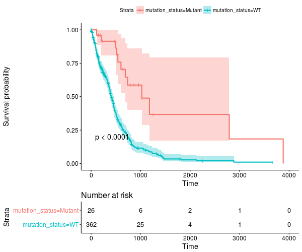

The results for the TCGA-LGG cohort are also quite striking -- go have a look!

------------------

.. _July2017:

July, 2017
###########

Way back in December we started talking about the new
`NCI-GDC Data Portal <https://gdc-portal.nci.nih.gov/>`_
which includes both hg19 and hg38 alignments. At that time, those were part of
isb-cgc:hg19_data_previews and isb-cgc:hg38_data_previews. Now, at this point they've matured into three data sets:

- isb-cgc:TCGA_bioclin_v0
- isb-cgc:TCGA_hg19_data_v0
- isb-cgc:TCGA_hg38_data_v0

And, as you'll discover, there's been some changes to the "standard" column
names that we used previously. This was done to better align with the GDC, and
make things more universal across data sources.

For one, barcode column names (and most column names) have become all lower case
and underscore_separated. So 'AliquotBarcode' has become 'aliquot_barcode'. Same with
SampleBarcode (sample_barcode). However, ParticipantBarcode has become case_barcode.
Also 'Study' is now refered to as 'project_short_name'. So if you're having
trouble getting an 'old' query to work, make sure the column names haven't changed,
and check whether it's in Legacy SQL or Standard SQL.

As we `transition to standard SQL <https://cloud.google.com/bigquery/docs/reference/standard-sql/migrating-from-legacy-sql>`_
and the new GDC datasets, one question that's
come up around here relates to records. Overall, in the isb-cgc datasets, there's very few data types
other than STRINGs, INTEGERs, and FLOATs. But occasionally you'll bump into something
that needs a different query structure, and the RECORD type is one of those.
One place to find this rare beast is in the methylation probe annotation
(`isb-cgc:platform_reference.methylation_annotation <https://bigquery.cloud.google.com/table/isb-cgc:platform_reference.methylation_annotation>`_).

Each methylation probe has a specified genomic location, given as a chromosome and
the base position on that chromosome.
An analytical question that often arises is something like
"does methylation in this region of the genome affect RNA transcription?". It's
a good question, and can actually be pretty hard to determine. But here, we'll focus
on one of the first steps in the analysis, mapping probes to genes.

In the **isb-cgc:platform_reference.methylation_annotation** table schema, we find a
RECORD called 'UCSC'. If we look at the details of the table (via the web interface)
we see that the table has 485,577 rows and has the following description:

::

  This table is based on the Illumina DNA methylation platform annotation information
  found in the file HumanMethylation450_15017482_v.1.2.csv which can be obtained
  from Illumina.  This information has been loaded into a BigQuery table and made
  available to the public with permission from Illumina.

Sounds good! A couple important columns are going to be the IlmnID, which
is the probe ID (example: cg10232580), and the UCSC RECORD, where we'll find
the gene symbol, RefGene accession ID, and the portion of the gene the probe is
closest to (approximately).

Let's start with an easy one:

.. code-block:: sql

  SELECT
    Infinium_Design_Type,
    COUNT(Infinium_Design_Type) as type_count
  FROM
    `isb-cgc.platform_reference.methylation_annotation`
  GROUP BY
    Infinium_Design_Type

::

  Row Infinium_Design_Type  type_count
  1   I                     135501
  2   II                    350076

Why does that matter? Well, the array was actually a blend of two different
technologies. This `paper <https://www.ncbi.nlm.nih.gov/pubmed/22126295>`_
and this `paper <https://www.ncbi.nlm.nih.gov/pmc/articles/PMC3740789/>`_
show that the performance of the two probes is very different, and that type II
probes appear to be less useful than the type I probes.

Now, let's suppose we are interested in a particular pathway, and we'd like to know
the distribution of probe types across the pathway genes. Using our previous
'Query of the Month' data set (isb-cgc:QotM.WikiPathways_20170425_Annotated),
we can get a list of functionally related genes.

.. code-block:: sql

  SELECT
    DISTINCT(Symbol) as gene_symbol
  FROM
    `isb-cgc.QotM.WikiPathways_20170425_Annotated`
  WHERE
    pathway = 'Oxidative Damage'

and we get 40 genes. So now we're going to join the annotation table, to our
table of pathway related genes, and get the probe types.

.. code-block:: sql

  WITH
  pathway AS (
  SELECT
    DISTINCT(Symbol) as gene_symbol
  FROM
    `isb-cgc.QotM.WikiPathways_20170425_Annotated`
  WHERE
    pathway = 'Oxidative Damage'
    )
  SELECT
      Infinium_Design_Type,
      COUNT(Infinium_Design_Type)
  FROM
      `isb-cgc.platform_reference.methylation_annotation` as m
  JOIN
      pathway
  ON
      pathway.gene_symbol = m.UCSC.RefGene_Name
  GROUP BY
    Infinium_Design_Type

::

  Query Failed
  Error: Cannot access field RefGene_Name on a value with type
  ARRAY<STRUCT<RefGene_Group STRING, RefGene_Accession STRING, RefGene_Name STRING>> at [18:34]

What happened?  It's that darned RECORD, which in our error, actually looks to be an
ARRAY of STRUCTS! We have previously
used arrays in our queries in past months where we took a list of values and created
an array to be passed to a JavaScript function. The result of the function gave us
back an array, and we had to UNNEST it, to get back one row per entry. It's similar
in this instance. Some probes are mapped to multiple RefGene_Accession IDs. For example,
cg10241718 maps to NM_033302, NM_033303, NM_033304, and NM_000680. Interestingly, you
see this same set as part of the HG-U133A probe annotations (Thanks, genecard-geneannot webservice).
These are representing four different transcripts of the same gene ADRA1A, the methylation
probe has the same relationship to three of the isoforms (the gene body), but for one isoform,
NM_000680, the probe is positioned 3'-UTR, which could change its effect. In light of that, we might want
to group by gene symbol (mostly the same) and the refgene_group, which tells us the
relative position of the probe to the gene.

To (finally!) address the problem of RECORDS, we need to check the BigQuery
`docs <https://cloud.google.com/bigquery/docs/reference/standard-sql/migrating-from-legacy-sql>`_
There, we see that the RECORD in Legacy SQL has becomes a STRUCT in Standard SQL. In order
to flatten the table, in Legacy SQL we would use FLATTEN, but now, in Standard SQL we are
going to use UNNEST.

So what's the difference between an ARRAY and a STRUCT?
Well an ARRAY is "an ordered list of zero or more elements of non-ARRAY values,"
and a STRUCT is a "container of ordered fields each with a type."
Hmmm, sounds pretty similar,
the difference being that a STRUCT can be a collection of different data types (STRINGS and INTs for
example), while ARRAYs have to be a single data type.

To get around that, we are going to flatten the table using UNNEST.

.. code-block:: sql

  SELECT
    RefGene_Name,
    RefGene_Group
  FROM
    `isb-cgc.platform_reference.methylation_annotation`,
    UNNEST(UCSC)
  LIMIT
    1000

::

  Row	RefGene_Name	RefGene_Group
  1	  null	        null
  2	  null	        null
  3	  IQCE	        Body
  4	  IQCE	        Body
  5	  CRYGN	        3'UTR
  6	  IQCE	        Body
  7	  IQCE	        Body
  8	  ELFN1	        5'UTR

That's more like it! Now we can write our final query.

.. code-block:: sql

  WITH
    -- first we'll UNNEST our probes
    --
    probes AS (
    SELECT
      RefGene_Name,
      RefGene_Group,
      Infinium_Design_Type
    FROM
      `isb-cgc.platform_reference.methylation_annotation`,
      UNNEST(UCSC) ),
    --
    -- Then we'll select genes taking part in our pathway of interest
    --
    genes AS (
    SELECT
      DISTINCT(Symbol) AS gene_symbol
    FROM
      `isb-cgc.QotM.WikiPathways_20170425_Annotated`
    WHERE
      pathway = 'Oxidative Damage' ),
    --
    -- We can join the unnested table to our table of genes.
    --
    join_table AS (
    SELECT
      genes.gene_symbol,
      probes.RefGene_Group,
      probes.Infinium_Design_Type
    FROM
      probes
    JOIN
      genes
    ON
      genes.gene_symbol = probes.RefGene_Name
    GROUP BY
      genes.gene_symbol,
      probes.RefGene_Group,
      probes.Infinium_Design_Type )
  --
  -- And summarize on the probe type.
  --
  SELECT
    Infinium_Design_Type,
    COUNT(Infinium_Design_Type),
    RefGene_Group
  FROM
    join_table
  GROUP BY
    RefGene_Group,
    Infinium_Design_Type

::

    Row	Infinium_Design_Type  type_count  RefGene_Group
    1   I                     3           3'UTR
    2   I                     17          TSS1500
    3   I                     20          TSS200
    4   I                     20          Body
    5   I                     20          1stExon
    6   I                     23          5'UTR
    7   II                    25          5'UTR
    8   II                    25          1stExon
    9   II                    29          TSS200
    10  II                    31          3'UTR
    11  II                    38          TSS1500
    12  II                    39          Body

OK! So, this pathway is covered by probes of both types, and we do see more
of the type II probes (which lack in performance), but there's also a good
number of type I probes that should be useful.

So, in summary, when using the ISB-CGC tables, you probably won't run into too many
RECORD data types, but if you do, you'll be prepared.

As an exercise for the reader, you might want to try and join the
information explored above with the information in the one of the
GENCODE tables -- try using the methylation probe coordinates and
the GENCODE gene coordinates to see if the information in the UCSC
record in the methylation table is completely accurate, or check to
see if there are important differences between hg19/GRCh37 and hg38/Grch38.
If you come up with some useful queries, feel free to email us and
we'll feature you on this page!

.. _May2017:

May, 2017
###########

This month we are going to extend the query from April and focus on estimating the
distance between samples based on shared mutations in pathways. To clarify, we want to know, given
a particular pathway, such as the WNT signaling pathway, whether two samples
share deleterious mutations within that pathway. In April, we were comparing samples
based on shared mutations, but in considering all genes simultaneously, we had
some pretty low Jaccard indices.

A second goal will be to create a set of pathways, for each sample, where pathways
contain at least one potentially harmful mutation. Then we will again estimate the
distance between samples based on the set of (potentially) altered pathways.

New for this month, we also have a whole host of new BigQuery tables from
`COSMIC <http://isb-cancer-genomics-cloud.readthedocs.io/en/latest/sections/COSMIC.html>`_.

For our query this month, we downloaded 381 pathways from
`WikiPathways <http://data.wikipathways.org/current/gmt/wikipathways-20170410-gmt-Homo_sapiens.gmt>`_.
In the BQ table, each row contains a pathway and a gene associated with that pathway.

For this portion of the work, I wrote a small python script to parse .gmt files to
output a 'tidy' (format), which is required for
uploading to BigQuery. Then with this file, I used the BQ web interface uploader.
To upload a table, clicking the '+' symbol next to a dataset
reveals the 'Create Table' interface. For smaller files, we can upload it directly,
whereas with larger files, we need to move it to cloud storage first. After giving it a table
name, and with some luck, we can just click the 'Automatically detect' schema check box.
I've been having good luck with it, but you might run into trouble if the 'top' of a column
looks like an integer, but the actual type is a 'string'.

I've created a table with a column listing the pathway name, and a second
column listing the genes associated with the pathway. I used the org.Hs.eg.db
human database of gene identifiers found in Bioconductor to map the gene IDs to a few often
used variants.

For this analysis, first I will select a few pathways that are well known and often important in cancer
processes, then we'll move to using all pathways. And towards the end, we'll look at all pathways and all
studies!

.. code-block:: sql

  SELECT
    Symbol
  FROM
    `isb-cgc:QotM.WikiPathways_20170425_Annotated`
  WHERE
    pathway = 'Notch Signaling Pathway'
  GROUP BY
    Symbol

The above query returns 79 gene symbols. Let's see how many variants are found
in this pathway.

.. code-block:: sql

  WITH
    pathGenes AS (
      SELECT
        Symbol
      FROM
        `isb-cgc.QotM.WikiPathways_20170425_Annotated`
      WHERE
        pathway = 'Notch Signaling Pathway'
      GROUP BY
        Symbol
    ),
    varsMC3 AS (
      SELECT
        project_short_name,
        case_barcode,
        Hugo_Symbol
      FROM
        `isb-cgc.TCGA_hg19_data_v0.Somatic_Mutation_MC3`
      WHERE
        Variant_Type = 'SNP'
        AND Consequence = 'missense_variant'
        AND biotype = 'protein_coding'
        AND SWISSPROT IS NOT NULL
        AND REGEXP_CONTAINS(PolyPhen, 'damaging')
        AND REGEXP_CONTAINS(SIFT, 'deleterious')
        AND Hugo_Symbol IN (select Symbol as Hugo_Symbol from pathGenes)
      GROUP BY
        project_short_name,
        case_barcode,
        Hugo_Symbol
    )
  --
  --
  SELECT
    project_short_name,
    COUNT(*) AS N_vars
  FROM
    varsMC3
  GROUP BY
    project_short_name
  ORDER BY
    N_vars DESC

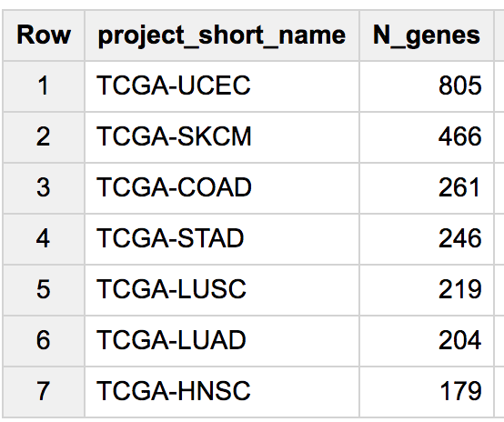

So there are quite a few variants found in this pathway.
Let's find out a little more information about them.
I'm going to replace the last 'select' statement of the above query
to look at the returned rows. Also, similar to last month,
we're going to look at a small subset of cancer types to ensure the queries come back quickly.

.. code-block:: sql

  SELECT
    Hugo_Symbol,
    count(Hugo_Symbol) as gene_count
  FROM
    varsMC3
  WHERE
    project_short_name = 'TCGA-COAD'
  group by
    Hugo_Symbol
  order by
    gene_count dESC

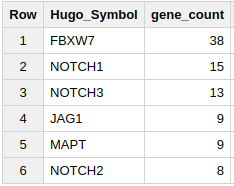

These counts show that some genes are mutated more often
than others. In COAD, FBXW7 is mutated more than twice as often as the next
most mutated gene, NOTCH1. Both of these genes are well known among cancer
researchers.

OK, let's compute a Jaccard index based on this pathway!

.. code-block:: sql

  WITH
    --
    -- First we define our pathway of interest.
    --
    pathGenes AS (
      SELECT
        Symbol as Hugo_Symbol
      FROM
        `isb-cgc.QotM.WikiPathways_20170425_Annotated`
      WHERE
        pathway = 'Notch Signaling Pathway'
      GROUP BY
        Symbol
    ),
    --
    -- Then we're going to extract just the project names, cases, and gene symbols,
    -- using the "GROUP BY" to make sure we only count one mutation per gene per case
    -- and we'll just take genes that are in the pathway.
    --
    firstVars AS (
    SELECT
      project_short_name,
      case_barcode,
      Hugo_Symbol
    FROM
      `isb-cgc.TCGA_hg19_data_v0.Somatic_Mutation_MC3`
    WHERE
      Variant_Type = 'SNP'
      AND Hugo_Symbol IN (select Hugo_Symbol from pathGenes)
      AND Consequence = 'missense_variant'
      AND biotype = 'protein_coding'
      AND ( REGEXP_CONTAINS(PolyPhen, 'damaging')
        OR REGEXP_CONTAINS(SIFT, 'deleterious') )
      AND project_short_name IN ('TCGA-PAAD', 'TCGA-GBM', 'TCGA-LGG')
      -- We could remove the above line to compute using all samples,
      -- but to speed things up, let's just look at 3 studies.
    GROUP BY
      project_short_name,
      case_barcode,
      Hugo_Symbol ),
    --
    -- Next we transform resulting table using the ARRAY_AGG function
    -- to create a list of mutated genes for each case
    --
    arrayMC3 AS (
    SELECT
      project_short_name,
      case_barcode,
      ARRAY_AGG(DISTINCT Hugo_Symbol) AS geneArray
    FROM
      firstVars
    GROUP BY
      project_short_name,
      case_barcode ),
    --
    -- Now we can do some "set operations" on these gene-lists:  a self-join
    -- of the previously created table with itself will allow for a pairwise
    -- pairwise comparison (notice the inequality in the JOIN ... ON clause)
    --
    setOpsTable AS (
    SELECT
      a.case_barcode AS case1,
      a.project_short_name AS study1,
      ARRAY_LENGTH(a.geneArray) AS length1,
      b.case_barcode AS case2,
      b.project_short_name AS study2,
      ARRAY_LENGTH(b.geneArray) AS length2,
      --
      -- here's the intersection
      (SELECT
        COUNT(1) FROM UNNEST(a.geneArray) AS ga JOIN UNNEST(b.geneArray) AS gb ON ga = gb)
          AS gene_intersection,
      --
      -- and here's the union
      (SELECT
        COUNT(DISTINCT gx) FROM UNNEST(ARRAY_CONCAT(a.geneArray,b.geneArray)) AS gx)
          AS gene_union
    FROM
      arrayMC3 AS a
    JOIN
      arrayMC3 AS b
    ON
      a.case_barcode < b.case_barcode )
    --
    -- and finally, we can compute the Jaccard index, and
    -- do a little bit of filtering and then output a list of
    -- pairs, sorted based on the Jaccard index:
  SELECT
    case1,
    study1,
    length1 AS geneCount1,
    case2,
    study2,
    length2 AS geneCount2,
    gene_intersection,
    gene_union,
    (gene_intersection / gene_union) AS jaccard_index
  FROM
    setOpsTable
  WHERE
    (gene_intersection / gene_union) > 0.1
    AND gene_intersection > 5
  ORDER BY
    jaccard_index DESC

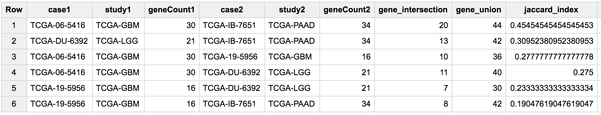

So, it's very interesting that we are getting samples from GBM (brain) and PAAD
(pancreas) with high overlaps in the gene sets. But it makes sense since the
Notch signaling pathway was been implciated in both of these cancer types.

https://www.ncbi.nlm.nih.gov/pmc/articles/PMC4283135/

https://www.ncbi.nlm.nih.gov/pmc/articles/PMC4621772/

Now we'll move on to the COSMIC data, where we will compare a GBM sample
to various non-TCGA samples in COSMIC.

.. code-block:: sql

  WITH
    --
    -- First we define our pathway of interest.
    --
    pathGenes AS (
      SELECT
        Symbol as Hugo_Symbol
      FROM
        `isb-cgc.QotM.WikiPathways_20170425_Annotated`
      WHERE
        pathway = 'Notch Signaling Pathway'
      GROUP BY
        Symbol
    ),
    --
    -- Then we'll select a single TCGA sample, with filters similar to the above.
    --
    tcgaSample AS (
    SELECT
      sample_barcode_tumor,
      Hugo_Symbol
    FROM
      `isb-cgc.TCGA_hg19_data_v0.Somatic_Mutation_MC3`
    WHERE
      sample_barcode_tumor = 'TCGA-06-5416-01A'
      AND Hugo_Symbol IN (select Hugo_Symbol from pathGenes)
      AND Variant_Type = 'SNP'
      AND Consequence = 'missense_variant'
      AND biotype = 'protein_coding'
      AND ( REGEXP_CONTAINS(PolyPhen, 'damaging')
        OR REGEXP_CONTAINS(SIFT, 'deleterious') )
    GROUP BY
      sample_barcode_tumor,
      Hugo_Symbol),
    --
    -- Then we'll create a sub-table of COSMIC samples, sans TCGA.
    --
    cosmicSample AS (
    SELECT
      Sample_name,
      Primary_site,
      Primary_histology,
      Sample_source,
      Gene_name
    FROM
      `isb-cgc.COSMIC.grch37_v80`
    WHERE
      STARTS_WITH(Sample_name, "TCGA") = FALSE
      AND Mutation_Description = 'Substitution - Missense'
      AND FATHMM_prediction = "PATHOGENIC"
      AND Gene_name IN (select Hugo_symbol from pathGenes)
    GROUP BY
      Sample_name,
      Primary_site,
      Primary_histology,
      Sample_source,
      Gene_name ),
    --
    -- Then we make the array of genes for the TCGA sample.
    --
    tcgaSampleArray AS (
    SELECT
      sample_barcode_tumor,
      ARRAY_AGG(DISTINCT Hugo_Symbol) AS geneArray
    FROM
      tcgaSample
    GROUP BY
      sample_barcode_tumor ),
    --
    -- Then we make the array of genes for each cosmic sample.
    --
    cosmicSampleArray AS (
    SELECT
      Sample_name,
      Primary_site,
      Primary_histology,
      Sample_source,
      ARRAY_AGG(DISTINCT Gene_name) AS geneArray
    FROM
      cosmicSample
    GROUP BY
      Sample_name,
      Primary_site,
      Primary_histology,
      Sample_source ),
    --
    -- Next we can perform our set operations on the arrays.
    --
    setOpsTable AS (
    SELECT
      a.sample_barcode_tumor AS tcgaSample,
      b.Sample_name AS cosmicSample,
      b.Primary_site,
      b.Primary_histology,
      b.Sample_source,
      ARRAY_LENGTH(a.geneArray) AS length1,
      ARRAY_LENGTH(b.geneArray) AS length2,
      (SELECT COUNT(1) FROM UNNEST(a.geneArray) AS ga JOIN UNNEST(b.geneArray) AS gb ON ga = gb) AS gene_intersection,
      (SELECT COUNT(DISTINCT gx) FROM UNNEST(ARRAY_CONCAT(a.geneArray,b.geneArray)) AS gx) AS gene_union
    FROM
      tcgaSampleArray AS a
    JOIN
      cosmicSampleArray AS b
    ON
      a.sample_barcode_tumor < b.Sample_name )
    --
    -- And build our final results.
    --
  SELECT
    tcgaSample,
    length1 AS geneCount1,
    cosmicSample,
    Primary_site,
    Primary_histology,
    length2 AS geneCount2,
    gene_intersection AS intersection,
    gene_union,
    (gene_intersection / gene_union) AS jaccard_index
  FROM
    setOpsTable
  WHERE
    (gene_intersection / gene_union) > 0.00
    AND gene_intersection > 1
    AND gene_union > 1
  ORDER BY
    jaccard_index DESC

.. figure:: query_figs/may_cosmic_1.png
   :scale: 85
   :align: center

So, for this particular pathway, the Jaccard indices are not spectacular.
But(!), what we really want is to look at *all* pathways simultaneously.
Then for any given pair of samples, we could rank the mutation overlap by pathway.
To do that, instead of selecting a pathway in the first subtable... we build a
table containing all pathways, and join on that further down in the query.

Just note, this is a longer running query (takes about 2 minutes).

.. code-block:: sql

  WITH
    --
    -- First we make a table with pathways and genes.
    --
    pathGenes AS (
      SELECT
        pathway,
        Symbol as Hugo_Symbol
      FROM
        `isb-cgc.QotM.WikiPathways_20170425_Annotated`
      GROUP BY
        Symbol,
        pathway
    ),
    --
    -- Then we're going to extract just the project names, cases, and gene symbols,
    -- using the "GROUP BY" to make sure we only count one mutation per gene per case
    -- and we'll join to the above pathway table.
    --
    firstVars AS (
    SELECT
      a.project_short_name,
      a.case_barcode,
      a.Hugo_Symbol,
      b.pathway
    FROM
      `isb-cgc.TCGA_hg19_data_v0.Somatic_Mutation_MC3` as a
    join
      pathGenes as b
    on
      a.Hugo_Symbol = b.Hugo_Symbol
    WHERE
      Variant_Type = 'SNP'
      AND Consequence = 'missense_variant'
      AND biotype = 'protein_coding'
      AND ( REGEXP_CONTAINS(PolyPhen, 'damaging')
        OR REGEXP_CONTAINS(SIFT, 'deleterious') )
      AND project_short_name IN ('TCGA-PAAD', 'TCGA-GBM', 'TCGA-LGG', 'TCGA-BRCA', 'TCGA-KIRC')
      -- We could remove the above line to compute using all samples,
      -- but to speed things up, let's just look at 3 studies.
    GROUP BY
      project_short_name,
      case_barcode,
      Hugo_Symbol,
      pathway
      ),
    --
    -- Next we transform resulting table using the ARRAY_AGG function
    -- to create a list of mutated genes for each case
    --
    arrayMC3 AS (
    SELECT
      project_short_name,
      case_barcode,
      pathway,
      ARRAY_AGG(DISTINCT Hugo_Symbol) AS geneArray
    FROM
      firstVars
    GROUP BY
      project_short_name,
      case_barcode,
      pathway
      ),
    --
    -- Now we can do some "set operations" on these gene-lists:  a self-join
    -- of the previously created table with itself will allow for a pairwise
    -- pairwise comparison (notice the inequality in the JOIN ... ON clause)
    --
    setOpsTable AS (
    SELECT
      a.case_barcode AS case1,
      a.project_short_name AS study1,
      a.pathway as pathway,
      ARRAY_LENGTH(a.geneArray) AS length1,
      b.case_barcode AS case2,
      b.project_short_name AS study2,
      ARRAY_LENGTH(b.geneArray) AS length2,
      --
      -- here's the intersection
      (SELECT
        COUNT(1) FROM UNNEST(a.geneArray) AS ga JOIN UNNEST(b.geneArray) AS gb ON ga = gb)
          AS gene_intersection,
      --
      -- and here's the union
      (SELECT
        COUNT(DISTINCT gx) FROM UNNEST(ARRAY_CONCAT(a.geneArray,b.geneArray)) AS gx)
          AS gene_union
    FROM
      arrayMC3 AS a
    JOIN
      arrayMC3 AS b
    ON
      a.case_barcode < b.case_barcode AND
      a.pathway = b.pathway
      )
    --
    -- and finally, we can compute the Jaccard index, and
    -- do a little bit of filtering and then output a list of
    -- pairs, sorted based on the Jaccard index:
  SELECT
    pathway,
    case1,
    study1,
    length1 AS geneCount1,
    case2,
    study2,
    length2 AS geneCount2,
    gene_intersection,
    gene_union,
    (gene_intersection / gene_union) AS jaccard_index
  FROM
    setOpsTable
  WHERE
    (gene_intersection / gene_union) > 0.3
    AND gene_intersection > 10
  ORDER BY
    jaccard_index DESC

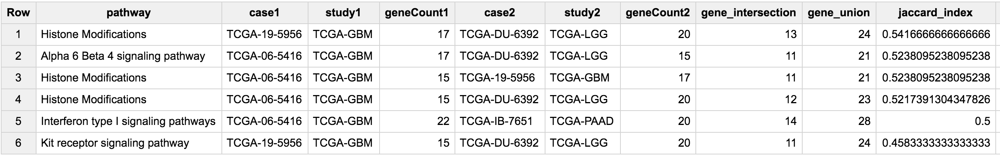

OK! Now we've got some pretty decent overlaps. We now have a way to search for
similarities among groups of samples based on functionally based shared mutation
profiles.

Turning this question around a little bit,
what if we looked at the overlap on the pathway level instead?

.. code-block:: sql

  WITH
    --
    -- First we'll join the filtered somatic mutation table to the
    -- table of pathways.
    --
    vars AS (
    SELECT
      mc3.project_short_name,
      mc3.case_barcode,
      mc3.Hugo_Symbol,
      wikip.pathway
    FROM
      `isb-cgc.TCGA_hg19_data_v0.Somatic_Mutation_MC3` as mc3
    join
      `isb-cgc.QotM.WikiPathways_20170425_Annotated` as wikip
    ON
      mc3.Hugo_Symbol = wikip.Symbol
    WHERE
      mc3.Variant_Type = 'SNP'
      AND mc3.Consequence = 'missense_variant'
      AND mc3.biotype = 'protein_coding'
      AND ( REGEXP_CONTAINS(mc3.PolyPhen, 'damaging')
        OR REGEXP_CONTAINS(mc3.SIFT, 'deleterious') )
      AND mc3.project_short_name IN ('TCGA-BRCA', 'TCGA-GBM')
      -- We could remove the above line to compute using all samples,
      -- but to speed things up, let's just look at 3 studies.
    GROUP BY
      mc3.project_short_name,
      mc3.case_barcode,
      mc3.Hugo_Symbol,
      wikip.pathway),
    --
    -- Next we transform resulting table using the ARRAY_AGG function
    -- to create a list of pathways for each case, where each pathway
    -- contains at least one mutated gene.
    --
    arrayPath AS (
    SELECT
      project_short_name,
      case_barcode,
      ARRAY_AGG(DISTINCT pathway) AS pathArray
    FROM
      vars
    GROUP BY
      project_short_name,
      case_barcode ),

    --
    -- Now we can do some "set operations" on these pathway-lists:  a self-join
    -- of the previously created table with itself will allow for a pairwise
    -- pairwise comparison (notice the inequality in the JOIN ... ON clause)
    --
    setOpsTable AS (
    SELECT
      a.case_barcode AS case1,
      a.project_short_name AS study1,
      ARRAY_LENGTH(a.pathArray) AS length1,
      b.case_barcode AS case2,
      b.project_short_name AS study2,
      ARRAY_LENGTH(b.pathArray) AS length2,
      --
      -- here's the intersection
      (SELECT
        COUNT(1) FROM
          UNNEST(a.pathArray) AS ga JOIN UNNEST(b.pathArray) AS gb ON ga = gb)
            AS path_intersection,
      --
      -- and here's the union
      (SELECT
        COUNT(DISTINCT gx) FROM
          UNNEST(ARRAY_CONCAT(a.pathArray,b.pathArray)) AS gx)
            AS path_union
    FROM
      arrayPath AS a
    JOIN
      arrayPath AS b
    ON
      a.case_barcode < b.case_barcode )
    --

    --
    -- and finally, we can compute the Jaccard index, and
    -- do a little bit of filtering and then output a list of
    -- pairs, sorted based on the Jaccard index:
  SELECT
    case1,
    study1,
    length1 AS pathCount1,
    case2,
    study2,
    length2 AS pathCount2,
    path_intersection,
    path_union,
    (path_intersection / path_union) AS jaccard_index
  FROM
    setOpsTable
  WHERE
    (path_intersection / path_union) > 0.8
    AND path_intersection > 10
  ORDER BY
    jaccard_index DESC

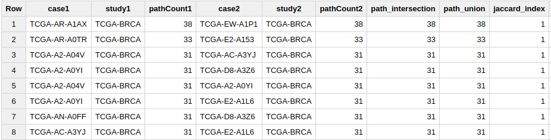

.. figure:: query_figs/may_brca_pathways_jaccard_2.png
  :scale: 85
  :align: center

Wow, those are some excellent jaccard indices!  Considering that we started
with just over 300 pathways, we have samples perfectly or nearly perfectly
in agreement.

Next, let's see how the samples are associating on a tissue level.  I'm going to add
this query to the end of the above query, to tabulate how often study1 and study2
agree regarding tissue of origin (between BRCA and GBM).

.. code-block:: sql

  SELECT
    table_cell,
    COUNT(*) AS n
  FROM (
    SELECT (
      CASE
        WHEN study1 = 'TCGA-BRCA' AND study2 = 'TCGA-BRCA' THEN 'BRCA-BRCA'
        WHEN study1 = 'TCGA-BRCA' AND study2 = 'TCGA-GBM' THEN 'BRCA-GBM'
        WHEN study1 = 'TCGA-GBM' AND study2 = 'TCGA-BRCA' THEN 'GBM-BRCA'
        WHEN study1 = 'TCGA-GBM' AND study2 = 'TCGA-GBM' THEN 'GBM-GBM'
        ELSE 'None'
      END ) AS table_cell
    FROM
      jtable )
  GROUP BY
    table_cell
  ORDER BY
    n DESC

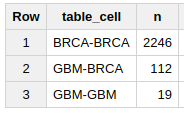

So, we see that the really high Jaccard indices are coming (mostly) from
BRCA-BRCA sample comparisons.

With one additional change to the above query we can query across all TCGA studies
rather than just a few.  The change involves removing the
``mc3.project_short_name IN ('TCGA-BRCA', 'TCGA-GBM')`` conditional. This is a
good trick that works in many cases. By removing the conditional, instead of
querying on just a few, we query across all studies, letting each sample be
paired with every other. Doing this, and setting the Jaccard index threshold
to 0.5, we get > 800K rows of results back, where each sample pair is
compared on the similarity of their potentially disrupted pathways. Bringing
the results into R, I created a heatmap showing how many TCGA study pairs were
among the results.  We see some tissue types are most similar to only that type
of tissue, whereas other tissue types share patterns of disrupted pathways.

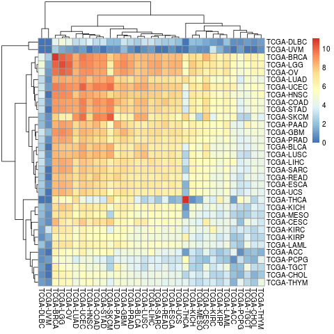

------------------

.. _April2017:

April, 2017
###########

In this month's query, we are going to look at two new data sources. The first
is the MC3 somatic mutation table, and the second is the
`COSMIC mutation database <http://isb-cancer-genomics-cloud.readthedocs.io/en/latest/sections/COSMIC.html>`_.
The objective is to compute a similarity metric based on
overlapping mutations between samples. First we'll look at pairwise similarity
among TCGA samples, and then we'll pick a single TCGA sample and search for a
matching COSMIC sample.

The MC3 table comes from the TCGA Pan-Cancer effort, a multi-center project aiming
to analyze all 33 TCGA tumor-types together. This somatic mutation calls table is
based on the unified call set recently published by the TCGA Network.
(For more details or the original source file, please
`check Synapse <https://www.synapse.org/#!Synapse:syn7214402/wiki/405297>`_.)

The COSMIC
(`Catalogue Of Somatic Mutations In Cancer <http://cancer.sanger.ac.uk/cosmic>`_)
data comes from the Wellcome Trust Sanger Institue and represents the
*"the world's largest and most comprehensive resource for exploring the impact of somatic mutations in human cancer"*.

To compute a similarity score between any two samples, we'll use the
Jaccard index, in which the intersection is divided by the union, so that
samples with no overlap in mutations will have a Jaccard index of 0, while
samples with some overlap will have a Jaccard index between 0 and 1.

We'll start with the MC3 table -- which includes the predicted effect
of each mutation call.  The mutation might result in a
change in the amino acid sequence (non-synonomous), or introduce a new stop
codon (stop insert), or no amino-acid change (synonomous). In this work
we're going to focus on single nucleotide polymorphisms (SNPs).

First, lets see what kind of "consequences" are present in this table:

.. code-block:: sql

  SELECT
    Consequence,
    count (1) AS n
  FROM
    `isb-cgc.TCGA_hg19_data_v0.Somatic_Mutation_MC3`
  WHERE
    Variant_Type = 'SNP'
  GROUP BY
    Consequence
  ORDER BY
    n DESC

===  ==================================  =======
Row          Consequence                    n
===  ==================================  =======
1    missense_variant                    1921705
2    synonymous_variant                  781564
3    3_prime_UTR_variant                 253582
4    stop_gained                         156768
5    intron_variant                      86347
6    5_prime_UTR_variant                 77069
7    non_coding_transcript_exon_variant  46761
8    splice_acceptor_variant             29658
9    downstream_gene_variant             19048
10   splice_donor_variant                18239
11   splice_region_variant               15231
12   upstream_gene_variant               14990
13   start_lost                          2718
14   stop_lost                           2038
15   stop_retained_variant               1077
===  ==================================  =======

For the sake of simplicity, we're going to focus on the most common type of
variant, the missense_variant which is more likely to have a functional impact
through an alteration of the amino acid sequence.

Another question we might ask is: how are variants distributed across the
tumor types (aka "studies" or "projects" within TCGA).

.. code-block:: sql

  WITH
    firstMC3 AS (
    SELECT
      project_short_name,
      case_barcode,
      Hugo_Symbol
    FROM
      `isb-cgc.TCGA_hg19_data_v0.Somatic_Mutation_MC3`
    WHERE
      Variant_Type = 'SNP'
      AND Consequence = 'missense_variant'
      AND biotype = 'protein_coding'
      AND SWISSPROT IS NOT NULL
      AND REGEXP_CONTAINS(PolyPhen, 'damaging')
      AND REGEXP_CONTAINS(SIFT, 'deleterious')
    GROUP BY
      project_short_name,
      case_barcode,
      Hugo_Symbol )
  --
  --
  SELECT
    project_short_name,
    COUNT(*) AS N_genes
  FROM
    firstMC3
  GROUP BY
    project_short_name
  ORDER BY
    N_genes DESC

Wow! The very high mutation counts for SKCM (melanoma) and LUAD
(lung adenocarcinoma) may not be surprising, but the high mutation
rate in endometial cancer (UCEC) may be less well known.

===  ==================  =======
Row  project_short_name  N_genes
===  ==================  =======
1       TCGA-UCEC         156877
2       TCGA-SKCM         112324
3       TCGA-LUAD          53119
4       TCGA-COAD          51072
5       TCGA-LUSC          44260
6       TCGA-STAD          44229
.       .........          .....
===  ==================  =======

OK, let's compute a Jaccard index across all samples in a few selected tumor-specific projects.
Look for how the 'array' gets used.

.. code-block:: sql

  WITH
    --
    -- first we're going to extract just the project names, cases, and gene symbols,
    -- using the "GROUP BY" to make sure we only count one mutation per gene per case
    firstMC3 AS (
    SELECT
      project_short_name,
      case_barcode,
      Hugo_Symbol
    FROM
      `isb-cgc.TCGA_hg19_data_v0.Somatic_Mutation_MC3`
    WHERE
      Variant_Type = 'SNP'
      AND Consequence = 'missense_variant'
      AND biotype = 'protein_coding'
      AND ( REGEXP_CONTAINS(PolyPhen, 'damaging')
        OR REGEXP_CONTAINS(SIFT, 'deleterious') )
      AND project_short_name IN ('TCGA-PAAD', 'TCGA-GBM', 'TCGA-LGG')
      -- We could remove the above line to compute using all samples,
      -- but to speed things up, let's just look at 3 studies.
    GROUP BY
      project_short_name,
      case_barcode,
      Hugo_Symbol ),
    --
    -- next we transform resulting table using the ARRAY_AGG function
    -- to create a list of mutated genes for each case
    arrayMC3 AS (
    SELECT
      project_short_name,
      case_barcode,
      ARRAY_AGG(DISTINCT Hugo_Symbol) AS geneArray
    FROM
      firstMC3
    GROUP BY
      project_short_name,
      case_barcode ),
    --
    -- now we can do some "set operations" on these gene-lists:  a self-join
    -- of the previously created table with itself will allow for a pairwise
    -- pairwise comparison (notice the inequality in the JOIN ... ON clause)
    setOpsTable AS (
    SELECT
      a.case_barcode AS case1,
      a.project_short_name AS study1,
      ARRAY_LENGTH(a.geneArray) AS length1,
      b.case_barcode AS case2,
      b.project_short_name AS study2,
      ARRAY_LENGTH(b.geneArray) AS length2,
      --
      -- here's the intersection
      (
      SELECT
        COUNT(1)
      FROM
        UNNEST(a.geneArray) AS ga
      JOIN
        UNNEST(b.geneArray) AS gb
      ON
        ga = gb) AS gene_intersection,
      --
      -- and here's the union
      (
      SELECT
        COUNT(DISTINCT gx)
      FROM
        UNNEST(ARRAY_CONCAT(a.geneArray,b.geneArray)) AS gx) AS gene_union
    FROM
      arrayMC3 AS a
    JOIN
      arrayMC3 AS b
    ON
      a.case_barcode < b.case_barcode )
    --
    -- and finally, we can compute the Jaccard index, and
    -- do a little bit of filtering and then output a list of
    -- pairs, sorted based on the Jaccard index:
  SELECT
    case1,
    study1,
    length1 AS geneCount1,
    case2,
    study2,
    length2 AS geneCount2,
    gene_intersection,
    gene_union,
    (gene_intersection / gene_union) AS jaccard_index
  FROM
    setOpsTable
  WHERE
    (gene_intersection / gene_union) > 0.1
    AND gene_intersection > 10
  ORDER BY
    jaccard_index DESC

The top 5 results from the above query surprisingly find the highest similarity
between a GBM (glioblastoma) sample and PAAD (pancreatic adenocarcinoma) sample.
The net highest similarity is between a LGG (lower-grade glioma) sample and the
same PAAD sample.  (Recall that our query above had, somewhat randomly, chosen
only GBM, LGG, and PAAD tumor-specific projects.)

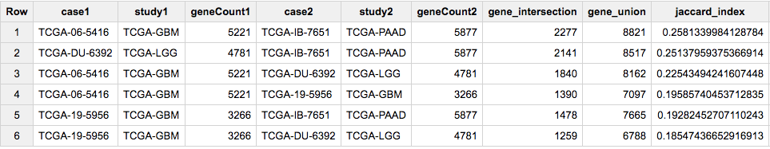

.. figure:: query_figs/april_plot2.png
   :scale: 30
   :align: center

   Fig1. Each dot represents a pair of cases and the associated Jaccard index.  The blue points show the pairs that involve the GBM case TCGA-06-5416.

Those unions look high to me.  Let's double check them.

.. code-block:: sql

  --
  --
  WITH
    g1 AS (
    SELECT
      Hugo_Symbol
    FROM
      `isb-cgc.TCGA_hg19_data_v0.Somatic_Mutation_MC3`
    WHERE
      Variant_Type = 'SNP'
      AND Consequence = 'missense_variant'
      AND biotype = 'protein_coding'
      AND (REGEXP_CONTAINS(PolyPhen, 'damaging')
        OR REGEXP_CONTAINS(SIFT, 'deleterious'))
      AND case_barcode = 'TCGA-06-5416'
    GROUP BY
      Hugo_Symbol),
  --
  --
  --
    g2 AS (
    SELECT
      Hugo_Symbol
    FROM
      `isb-cgc.TCGA_hg19_data_v0.Somatic_Mutation_MC3`
    WHERE
      Variant_Type = 'SNP'
      AND Consequence = 'missense_variant'
      AND biotype = 'protein_coding'
      AND (REGEXP_CONTAINS(PolyPhen, 'damaging')
         OR REGEXP_CONTAINS(SIFT, 'deleterious'))
      AND case_barcode = 'TCGA-IB-7651'
    GROUP BY
      Hugo_Symbol)

  --
  -- First the intersection,
  --
  SELECT
    count ( distinct a.Hugo_Symbol ) AS n
  FROM
    g1 AS a
  JOIN
    g2 AS b
  ON
    a.Hugo_Symbol = b.Hugo_Symbol

  UNION ALL -- to bring the intersection and union queries together

  --
  -- then the union.
  --
  SELECT
    count ( distinct Hugo_Symbol ) AS n
  FROM
    (select * from  g1
       union all
     select * from g2)

  ORDER BY n

The above query returns 2277 (intersection) and 8821 (union), which is
what we were expecting given the first row in the previous set of results.

Next we'll turn our attention to the COSMIC catalog. We will select a single
sample, and perform the same Jaccard index across all samples in COSMIC
(removing TCGA samples in COSMIC), and see what comes up.
The sample we've selected for this next analysis is from the COAD project
(Colon Adenocarcinoma).

Similar to the MC3 table, variants in COSMIC have been annotated.
Let's take a look at what types of variants are present.

.. code-block:: sql

  --
  -- What kind of mutations are found in COSMIC?
  --
  SELECT
    Mutation_Description,
    count(1) AS n
  FROM
    `isb-cgc.COSMIC.grch37_v80`
  GROUP BY
    Mutation_Description
  ORDER BY n DESC

===  ============================  =========
Row  Mutation_Description            n
===  ============================  =========
1    Substitution - Missense       3115431
2    Substitution - coding silent  1017162
3    Substitution - Nonsense       204293
4    Unknown                       167135
5    Deletion - Frameshift         113237
6    Insertion - Frameshift        51345
7    Deletion - In frame           37833
8    Insertion - In frame          24870
9    Complex - deletion inframe    3212
10   Nonstop extension             2751
...  ...                           ...
===  ============================  =========

So, like above, we will focus on the most common type of variant, the Missense.

.. code-block:: sql

    --
    -- First we'll select a single TCGA sample, with filters similar to the above.
    --
  WITH
    --
    tcgaSample AS (
    SELECT
      sample_barcode_tumor,
      Hugo_Symbol
    FROM
      `isb-cgc.TCGA_hg19_data_v0.Somatic_Mutation_MC3`
    WHERE
      sample_barcode_tumor = 'TCGA-CA-6718-01A'
      AND Variant_Type = 'SNP'
      AND Consequence = 'missense_variant'
      AND biotype = 'protein_coding'
      AND ( REGEXP_CONTAINS(PolyPhen, 'damaging')
        OR REGEXP_CONTAINS(SIFT, 'deleterious') )
    GROUP BY
      sample_barcode_tumor,
      Hugo_Symbol),
    --
    -- Then we'll create a sub-table of COSMIC samples, sans TCGA.
    --
    cosmicSample AS (
    SELECT
      Sample_name,
      Primary_site,
      Primary_histology,
      Sample_source,
      Gene_name
    FROM
      `isb-cgc.COSMIC.grch37_v80`
    WHERE
      STARTS_WITH(Sample_name, "TCGA") = FALSE
      AND Mutation_Description = 'Substitution - Missense'
      AND FATHMM_prediction = "PATHOGENIC"
    GROUP BY
      Sample_name,
      Primary_site,
      Primary_histology,
      Sample_source,
      Gene_name ),
    --
    -- Then we make the array of genes for the TCGA sample.
    --
    tcgaSampleArray AS (
    SELECT
      sample_barcode_tumor,
      ARRAY_AGG(DISTINCT Hugo_Symbol) AS geneArray
    FROM
      tcgaSample
    GROUP BY
      sample_barcode_tumor ),
    --
    -- Then we make the array of genes for each cosmic sample.
    --
    cosmicSampleArray AS (
    SELECT
      Sample_name,
      Primary_site,
      Primary_histology,
      Sample_source,
      ARRAY_AGG(DISTINCT Gene_name) AS geneArray
    FROM
      cosmicSample
    GROUP BY
      Sample_name,
      Primary_site,
      Primary_histology,
      Sample_source ),
    --
    -- Next we can perform our set operations on the arrays.
    --
    setOpsTable AS (
    SELECT
      a.sample_barcode_tumor AS tcgaSample,
      b.Sample_name AS cosmicSample,
      b.Primary_site,
      b.Primary_histology,
      b.Sample_source,
      ARRAY_LENGTH(a.geneArray) AS length1,
      ARRAY_LENGTH(b.geneArray) AS length2,
      (SELECT COUNT(1) FROM UNNEST(a.geneArray) AS ga JOIN UNNEST(b.geneArray) AS gb ON ga = gb) AS gene_intersection,
      (SELECT COUNT(DISTINCT gx) FROM UNNEST(ARRAY_CONCAT(a.geneArray,b.geneArray)) AS gx) AS gene_union
    FROM
      tcgaSampleArray AS a
    JOIN
      cosmicSampleArray AS b
    ON
      a.sample_barcode_tumor < b.Sample_name )
    --
    -- And build our final results.
    --
  SELECT
    tcgaSample,
    length1 AS geneCount1,
    cosmicSample,
    Primary_site,
    Primary_histology,
    Sample_source,
    length2 AS geneCount2,
    gene_intersection AS intersection,
    gene_union,
    (gene_intersection / gene_union) AS jaccard_index
  FROM
    setOpsTable
  WHERE
    (gene_intersection / gene_union) > 0.00
    AND gene_intersection > 5
    AND gene_union > 5
  ORDER BY
    jaccard_index DESC

Recall that the TCGA-CA-6718-01A sample is from the COAD (colon adenocarcinoma) TCGA project.

------------

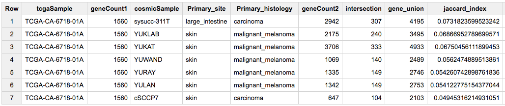

-------------

Cool -- the top COSMIC (non-TCGA) hit is from a very similar tumor type!
The other close matches are all from melanoma, a cancer with a very high
mutation rate which might result in "noisy" associations at this level.

Since the two mutation tables that we are comparing here (TCGA MC3 and COSMIC) use different
scores for assessing the implications of each somatic mutation, another idea would be
to integrate the
`Tute Genomics <https://en.wikipedia.org/wiki/Tute_Genomics>`_
`hg19 annotation table <https://bigquery.cloud.google.com/table/silver-wall-555:TuteTable.hg19?pli=1&tab=schema>`_
so that a single score can be used
in assessing the intersection of mutated genes between two cancer samples.

Thanks for joining us this month!

------------------

.. _March2017:

March, 2017
###########

This month we're going to compute a pairwise distance matrix and visualize
it using a heatmap in R. Many methods, such as clustering, depend on having a
distance matrix, and although I would not recommend using BigQuery to download
large tables, this works well for smaller feature sets (10s-100s).

In this example, we will be selecting primary tumor samples from both BRCA
and STAD cohorts, along with a list of the top 50 most variable miRNAs.
Then we'll compute a pairwise distance metric on samples. The distance will
be based on Spearman's correlation.

As usual, we are going to be using standard SQL, so make sure to select that
option.

.. code-block:: sql

  WITH
    --
    -- *sample_lists*
    -- First, start by defining the list of BRCA TP samples.
    -- (TP == tumor, primary)
    --
    brca_sample_list AS (
    SELECT
      SampleBarcode
    FROM
      `isb-cgc.tcga_201607_beta.Biospecimen_data`
    WHERE
      SampleTypeLetterCode='TP'
      AND Study='BRCA'
    LIMIT
      50),
    --
    -- Then let's create a list of STAD samples.
    --
    stad_sample_list AS (
    SELECT
      SampleBarcode
    FROM
      `isb-cgc.tcga_201607_beta.Biospecimen_data`
    WHERE
      SampleTypeLetterCode='TP'
      AND Study='STAD'
    LIMIT
      50),
    --
    -- Now, we are going to merge the two sample tables using a UNION ALL.
    --
    sample_list AS (
    select * from stad_sample_list
    UNION ALL
    select * from brca_sample_list
    ),
    --
    -- *miRNA_list*
    -- Next, we define the miRNAs of interest. We order the miRNAs by standard
    -- deviation, then take the top 50. Notice we select value from the
    -- subset defined above.
    --
    miRNA_list AS (
    SELECT
      mirna_accession,
      STDDEV(normalized_count) AS sigma_count
    FROM
      `isb-cgc.tcga_201607_beta.miRNA_Expression`
    WHERE
      SampleBarcode IN (
      SELECT
        SampleBarcode
      FROM
        sample_list )
    GROUP BY
      mirna_accession
    ORDER BY
      sigma_count DESC
    LIMIT
      50 ),
    --
    -- *miRNA_data*
    -- Now that we have the sample_list and the mirna_list, we can select our
    -- data of interest from the larger miRNA_Expression table.
    --
    miRNA_data AS (
    SELECT
      SampleBarcode,
      Study,
      mirna_id,
      mirna_accession,
      LOG10(normalized_count+1) AS log10_count
    FROM
      `isb-cgc.tcga_201607_beta.miRNA_Expression`
    WHERE
      SampleBarcode IN (
      SELECT
        SampleBarcode
      FROM
        sample_list )
      AND mirna_accession IN (
      SELECT
        mirna_accession
      FROM
        miRNA_list ) ),
    --
    -- *pairs*
    -- Now, we JOIN the miRNA_data matrix with *itself*, creating all possible pairs of samples
    -- (excluding self-comparisons which are unnecessary) combined with a dense-ranking of
    -- the miRNA expression values. By computing the Pearson correlation on ranks, we
    -- end up with Spearman's correlation!
    --
    pairs AS (
    SELECT
      lhs.mirna_id,
      lhs.mirna_accession,
      lhs.SampleBarcode AS SampleA,
      rhs.SampleBarcode AS SampleB,
      lhs.Study AS StudyA,
      rhs.Study as StudyB,
      DENSE_RANK() OVER (PARTITION BY lhs.mirna_accession ORDER BY lhs.log10_count ASC) AS ExpA,
      DENSE_RANK() OVER (PARTITION BY rhs.mirna_accession ORDER BY rhs.log10_count ASC) AS ExpB
    FROM
      miRNA_data AS lhs
    JOIN
      miRNA_data AS rhs
    ON
      lhs.mirna_accession=rhs.mirna_accession
      AND lhs.SampleBarcode < rhs.SampleBarcode )
    --
    -- **Finally**, we compute the pairwise distance between each pair of samples.
    --
  SELECT
    SampleA,
    SampleB,
    StudyA,
    StudyB,
    COUNT(mirna_accession) AS numObs,
    (1.-CORR(ExpA, ExpB))  AS sampleDistance
  FROM
    pairs
  GROUP BY
    SampleA,StudyA,
    SampleB,StudyB
  ORDER BY
    sampleDistance ASC

Now, let's see that distance matrix in R!

.. code-block:: R

  library(bigrquery) # make sure it's a recent version with the useLegacySql param!#

  q <- "The Query From Above"

  corrs <- query_exec(q, project="YOUR PROJECT ID", useLegacySql=F)

  # Use bigrquery to get the results or export the results to cloud storage and
  # download them like so.
  # gcs_url <- "gs://MY-BUCKET/MY-FILE.csv"
  # corrs <- read.csv(pipe(sprintf("gsutil cat %s", gcs_url)))

  library(dplyr)
  library(ggplot2)
  library(pheatmap)

  mat <- xtabs(sampleDistance~SampleA+SampleB, data=corrs)
  # or tidyr::spread(data=corrs, key=SampleA, value=sampleDistance, fill=0)

  dim(mat) # 99 x 99

  # Make the matrix symmetric.
  mat2 <- mat + t(mat)

  # Let's make an annotation matrix for cancer type
  studyMat <- unique(corrs[,c("StudyA", "SampleA")])
  studyMat$color <- ifelse(studyMat$Study == "BRCA", "blue", "red")
  rownames(studyMat) <- studyMat$SampleA

  # We can show the distances between samples as a dendrogram
  # install.packages("dendextend")
  library(dendextend)
  hc <- hclust(as.dist(mat2), method="ward.D2")
  dend <- as.dendrogram(hc)
  labels_colors(dend) <- studyMat[labels(dend), "color"]
  dend <- set(dend, "labels_cex", 0.5)

  ## Fig1 ##
  plot(dend, main="BRCA in clue and STAD in red")

  # If we want to make two groups, then we cut the dendrogram
  # leaving two branches.
  cas <- cutree(tree=hc, k=2)

  # Then we can use our cluster labels to annotate the heatmap.
  annotMat <- data.frame(cluster=cas)
  annotMat$SampleID <- names(cas)
  rownames(annotMat) <- names(cas)
  annotMat <- merge(x=annotMat, by.x="SampleID", y=studyMat, by.y="SampleA")
  rownames(annotMat) <- annotMat$SampleID

  # And we can plot cluster assignments on a heatmap
  # to see how hclust-default and pheatmap-defaults compare.

  ## Fig2 ##
  pheatmap(mat2, fontsize=6, annotation=annotMat[,-1])

  # Or we can use the dendsort library (from pheatmap examples)
  library(dendsort)
  callback = function(hc, ...){dendsort(hc)}

  ## Fig3 ##
  pheatmap(mat2, fontsize=6, annotation=annotMat[,-1], clustering_callback = callback)

  # Modify ordering of the clusters using clustering callback option
  callback = function(hc, mat){
      sv = svd(t(mat))$v[,1]
      dend = reorder(as.dendrogram(hc), wts = sv)
      as.hclust(dend)
  }
  ## Fig4 ##
  pheatmap(mat2, clustering_callback = callback, annotation=annotMat[,-1],
      fontsize_row=4, fontsize_col=4, border_color=NA)

------------

.. figure:: query_figs/brca_vs_stad_dendrogram.png
   :scale: 25
   :align: center

   Fig1. Dendrogram showing the sample-wise relationships based on miRNA expression.

-------------

.. figure:: query_figs/brca_vs_stad_heatmap.png
   :scale: 25
   :align: center

   Fig2. Heatmap of pairwise distances, using pheatmap default clustering.

-------------

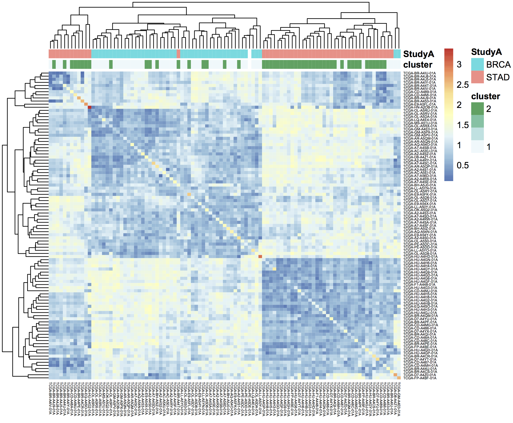

   Fig3. Heatmap of pairwise distances, using the dendsort library.

-------------

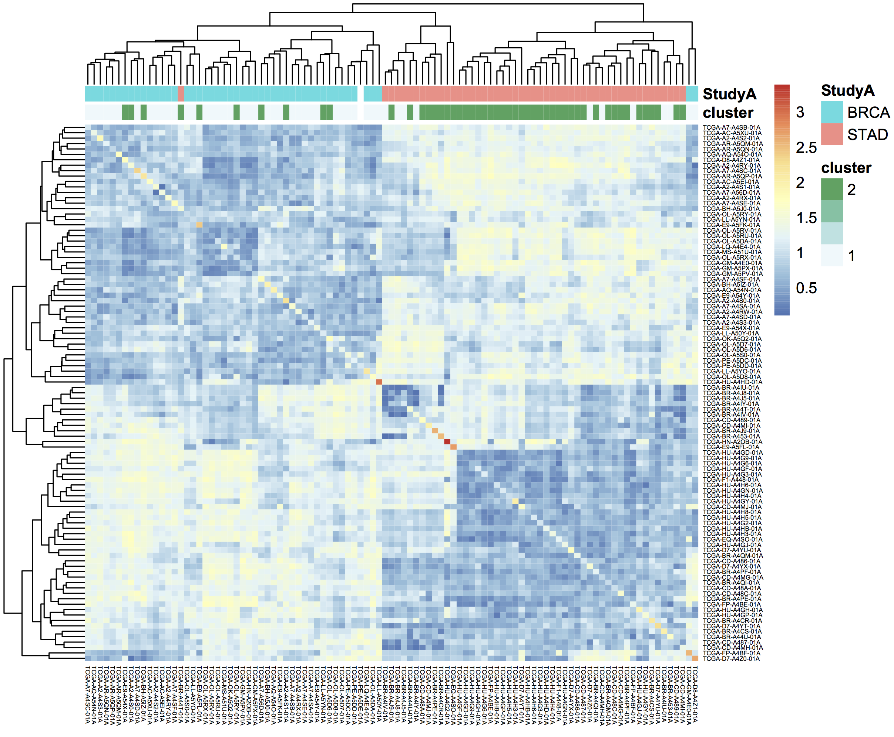

   Fig4. Ordering the samples after singular value decomposition.

-------------

.. _February2017:

February, 2017
##############

This month, we explore user defined functions or UDFs. BigQuery allows
you to define custom functions, things that you can't easily do in standard SQL, using JavaScript.
These functions are defined as
part of the SQL and then called within the query.

UDFs take a set of parameters, and return a value. They are strongly typed functions,
which means that we need to define the types of inputs and outputs. For example,
we might have FLOAT64 and BOOL input types and return a STRING.
See the official
`Google documentation <https://cloud.google.com/bigquery/docs/reference/standard-sql/user-defined-functions>`_
for the complete list of available types.  (Note in particular that there is
no INT64 type, so you will need to use either FLOAT64 or STRING when
working with integers, depending on your needs.)

In our first example, we'll define two new functions. The first classifies a sample
as having a higher expression value than a given input level. And second, a function
that glues three strings together. Then, in the SQL query we call both functions.
These initial queries will be starting points for a more complicated example below.

These queries use *Standard* SQL, so if you're in the web interface,
remember to open the options panel and uncheck the 'Use Legacy SQL' button.

.. code-block:: sql

  -- this next line tells BigQuery that a UDF is coming
  CREATE TEMPORARY FUNCTION
    -- followed by the function name and parameter names/types:
    BiggerThan (x FLOAT64, y FLOAT64)
    -- and then the return type
    RETURNS BOOL
    -- and the language
    LANGUAGE js AS """
      // careful to use this delimiter for comments inside the function
      return (x > y);
    """;

  -- now let's create another function that takes 3 input strings
  -- combines them, using underscores and returns a single string:
  CREATE TEMPORARY FUNCTION
    Combiner (x STRING, y STRING, z STRING)
    RETURNS STRING
    LANGUAGE js AS """
      return (x + "_" + y + "_" + z);
    """;

  --
  -- Now that we've defined our two UDFs, we can use them.
  -- But first we're going to create an intermediate table
  -- with the expression of ESR1 in the BRCA samples:
  --
  WITH
    gene1 AS (
    SELECT
      AliquotBarcode AS barcode1,
      Study AS study1,
      SampleTypeLetterCode AS code1,
      HGNC_gene_symbol AS gene_id1,
      AVG(LOG(normalized_count+1, 2)) AS count1
    FROM
      `isb-cgc.tcga_201607_beta.mRNA_UNC_RSEM`
    WHERE
      Study = 'BRCA'
      AND SampleTypeLetterCode = 'TP'
      AND HGNC_gene_symbol = 'ESR1'
      AND normalized_count >= 0
    GROUP BY
      AliquotBarcode,
      gene_id1,
      study1,
      code1)

  --
  --
  -- Now we can call our functions,
  -- processing the subtable.
  --
  SELECT
    Combiner(barcode1, study1, code1) AS cString,
    BiggerThan(count1, 5.1) AS overExp
  FROM
    gene1

OK, so that was just warm-up, and obviously what was being done with
the UDFs could have been done in SQL as well.  But now we're going to
do something a bit more complicated(!), and estimate cluster assignments
using a K-means algorithm
(`wikipedia <https://en.wikipedia.org/wiki/K-means_clustering>`_),
implemented in JavaScript, as a UDF!

We're going to try to cluster each BRCA sample based on the expression of
two genes: ESR1 and EGFR.  This type of clustering is implemented as an iterative process
that starts with two random cluster centers.  In each iteration, each sample is labeled
according to the nearest cluster-center, and then we recompute the locations of the
cluster centers.

.. code-block:: sql

  CREATE TEMPORARY FUNCTION

    -- In this function, we're going to be working on arrays of values.
    -- we're also going to define a set of functions 'inside' the kMeans.

    -- *heavily borrowing from https://github.com/NathanEpstein/clusters* --

    kMeans(x ARRAY<FLOAT64>,  -- ESR1 gene expression
           y ARRAY<FLOAT64>,  -- EGFR gene expression
           iterations FLOAT64,  -- the number of iterations
           k FLOAT64)           -- the number of clusters

    RETURNS ARRAY<FLOAT64>  -- returns the cluster assignments

    LANGUAGE js AS """
    'use strict'

    function sumOfSquareDiffs(oneVector, anotherVector) {
      // the sum of squares error //
      var squareDiffs = oneVector.map(function(component, i) {
        return Math.pow(component - anotherVector[i], 2);
      });
      return squareDiffs.reduce(function(a, b) { return a + b }, 0);
    };

  function mindex(array) {
    // returns the index to the minimum value in the array
    var min = array.reduce(function(a, b) {
      return Math.min(a, b);
    });
    return array.indexOf(min);
  };

  function sumVectors(a, b) {
    // The map function gets used frequently in JavaScript
    return a.map(function(val, i) { return val + b[i] });
  };

  function averageLocation(points) {
    // Take all the points assigned to a cluster
    // and find the averge center point.
    // This gets used to update the cluster centroids.
    var zeroVector = points[0].location.map(function() { return 0 });
    var locations = points.map(function(point) { return point.location });
    var vectorSum = locations.reduce(function(a, b) { return sumVectors(a, b) }, zeroVector);
    return vectorSum.map(function(val) { return val / points.length });
  };

  function Point(location) {
    // A point object, each sample is represented as a point //
    var self = this;
    this.location = location;
    this.label = 1;
    this.updateLabel = function(centroids) {
      var distancesSquared = centroids.map(function(centroid) {
        return sumOfSquareDiffs(self.location, centroid.location);
      });
      self.label = mindex(distancesSquared);
    };
  };

  function Centroid(initialLocation, label) {
    // The cluster centroids //
    var self = this;
    this.location = initialLocation;
    this.label = label;
    this.updateLocation = function(points) {
      var pointsWithThisCentroid = points.filter(function(point) { return point.label == self.label });
      if (pointsWithThisCentroid.length > 0) {
        self.location = averageLocation(pointsWithThisCentroid);
      }
    };
  };

  var data = [];

  // Our data list is list of lists. The small list being each (x,y) point
  for (var i = 0; i < x.length; i++) {
    data.push([x[i],y[i]])
  }

  // initialize point objects with data
  var points = data.map(function(vector) { return new Point(vector) });

  // intialize centroids
  var centroids = [];
  for (var i = 0; i < k; i++) {
    centroids.push(new Centroid(points[i % points.length].location, i));
  };

  // update labels and centroid locations until convergence
  for (var iter = 0; iter < iterations; iter++) {
    points.forEach(function(point) { point.updateLabel(centroids) });
    centroids.forEach(function(centroid) { centroid.updateLocation(points) });
  };

  // return the cluster labels.
  var labels = []
  for (var i = 0; i < points.length; i++) {
    labels.push(points[i].label)
  }

  return labels;

  """;
  --
  -- *** In this query, we create two subtables, one for each gene of
  --     interest, then create a set of arrays in joining the two tables.
  --     We call the UDF using the arrays, and get a result back
  --     made of arrays.
  --
  --     Due to a technical issue we save the table of arrays to
  --     to a personal dataset, then unpack it. ***
  --
  WITH
    -- gene1, the first subtable
    --
    gene1 AS (
    SELECT
      ROW_NUMBER() OVER() row_number,
      AliquotBarcode AS barcode1,
      HGNC_gene_symbol AS gene_id1,
      AVG(LOG(normalized_count+1, 2)) AS count1
    FROM
      `isb-cgc.tcga_201607_beta.mRNA_UNC_RSEM`
    WHERE
      Study = 'BRCA'
      AND SampleTypeLetterCode = 'TP'
      AND HGNC_gene_symbol = 'ESR1'
      AND normalized_count >= 0
    GROUP BY
      AliquotBarcode,
      gene_id1),
    --
    -- gene2, the second subtable
    --
    gene2 AS (
    SELECT
      AliquotBarcode AS barcode2,
      HGNC_gene_symbol AS gene_id2,
      AVG(LOG(normalized_count+1, 2)) AS count2
    FROM
      `isb-cgc.tcga_201607_beta.mRNA_UNC_RSEM`
    WHERE
      Study = 'BRCA'
      AND SampleTypeLetterCode = 'TP'
      AND HGNC_gene_symbol = 'EGFR'
      AND normalized_count >= 0
    GROUP BY
      AliquotBarcode,
      HGNC_gene_symbol),
    --
    -- Then we create a table of arrays
    -- and join the two gene tables.
    -- ** We need to make sure all the arrays are constructed using the same index. **
    --
    arrayTable AS (
    SELECT
      ARRAY_AGG(m1.row_number ORDER BY m1.barcode1) AS arrayn,
      ARRAY_AGG(m1.barcode1 ORDER BY m1.barcode1) AS barcode,
      ARRAY_AGG(count1 ORDER BY m1.barcode1) AS esr1,
      ARRAY_AGG(count2 ORDER BY m1.barcode1) AS egfr
    FROM
      gene1 AS m1
    JOIN
      gene2 AS m2
    ON
      m1.barcode1 = m2.barcode2 )
    --
    -- Now we call the k-means UDF.
    --
  SELECT
    arrayn,
    barcode,
    esr1,
    egfr,
    kMeans(esr1, egfr, 200.0, 2.0) AS cluster
  FROM
    arrayTable
    --
    -- save the resulting table to a personal dataset

We need to save the above results to an intermediate table.  You will
need to have a dataset that you have write-access to in BigQuery
to do this.  For your convenience, we've saved the query above as
a public `gist <https://gist.github.com/smrgit/c80fd361603f8a7efa5d0444757c990b>`_
and also created a bitly link to it.  Rather than pasting the entire
script into the BigQuery web UI, you can us the **bq** command line
(part of the `cloud SDK <https://cloud.google.com/sdk/>`_)
and run the query and automatically save the outputs as shown below.

.. code-block:: none

   #!/bin/bash

   qFile="kMeans_in_BQ.sql"
   ## get the lengthy query from the bitly link, and rename
   wget -O $qFile http://bit.ly/2mn1R5D

   ## before you can run this you will need to modify
   ## the destination table to be in a project and dataset
   ## that you have write-access to,
   ## eg:  dTable="isb-cgc:scratch_dataset.kMeans_out"
   dTable="YOUR_PROJECT:DATASET_NAME.TMP_TABLE"

   ## run the query using the 'bq' command line tool
   ## not all of the options are strictly necessary -- with
   ## the exception of "nouse_legacy_sql"
   bq query --allow_large_results \
            --destination_table=$dTable \
            --replace \
            --nouse_legacy_sql \
            --nodry_run \
            "$(cat $qFile)" > /dev/null

The results of the kMeans query is *one* row of arrays.
It's a little tricky to unpack the arrays into rows, which is what the next query does.
(Again you'll need to edit it to select from the intermediate table you created
in the previous step.  Remember that in Standard SQL, the delimiter between the
project name and the dataset name is just a '.' whereas the bq command-line
requres a ':' as a separator.)

.. code-block:: sql

   WITH
     resultTable AS (
     SELECT
       *
     FROM
       `YOUR_PROJECT.DATASET_NAME.TMP_TABLE` )
   SELECT
     index row_idx,
     barcode[OFFSET(index_offset)] AS AliquotBarcode,
     esr1[OFFSET(index_offset)] AS ESR1,
     egfr[OFFSET(index_offset)] AS EGFR,
     cluster[OFFSET(index_offset)] AS Cluster
   FROM
     resultTable,
     UNNEST(resultTable.arrayn) AS index
   WITH
   OFFSET
     index_offset
   ORDER BY
     index

Finall let's visualize the resulting clusters!
Save the cluster assignments to a csv file, and read it into R.

.. code-block:: R

  library(ggplot2)
  res0 <- read.table("results-from-the-k-means.csv", sep=",", header=T, stringsAsFactors=F)
  qplot(data=res0, x=EGFR, y=ESR1, col=as.factor(Cluster))

------------

.. figure:: query_figs/kmeans_plot.png
   :scale: 25
   :align: center

-------------

.. _January2017:

January, 2017
#############

This month we'll be comparing Standard SQL and Legacy SQL. It's possible to write
queries using either form, but as we'll see, using standard SQL can be easier to write
and improves readability.

In order to 'activate' standard SQL in the web browser, just under the
'New Query' text window, click the 'Show Options' button, and towards the bottom of the
options you'll find the 'Use Legacy SQL' check box -- uncheck that, and then you can
'Hide Options' to collapse the options away again.

To use R and bigrquery to execute
standard SQL, you'll need to make sure you're using the most up-to-date
version of the R package. I would recommend installing it from the github page
using devtools. Please see `bigrquery <https://github.com/rstats-db/bigrquery>`_ for more information
on installation. The important bit: there's now support for sending a parameter
called 'useLegacySql' in the REST calls.

Our task this month will be to compute correlations between copy number variants and gene expression, over
all genes, using only BRCA samples. The copy number data is expressed in a series
of segments, each with a chromosome, start-point, end-point, and value
indicating whether a duplication or deletion event (or neither) has taken place.

Note that the mean copy-number values are not discrete because these data represent
heterogeneous mixtures of cells -- only a fraction of the cells might include an
amplification or a deletion, so the 'mean copy-number' value represents the
effect of the discrete amplifications or deletions of a specific genomic segment,
averaged over the heterogenous population of cells.

One might hypothesize that a copy number *amplified* gene would have higher expression levels
than when *not* amplified. However, our gene expression data has no location information, making it
necessary to join the genomic locations from an appropriate reference.
The resulting annotated expression table can then be joined to the copy number segments.
But computing the overlap of DNA segments and genes locations can get tricky!
Below we show two different ways of accomplishing the task.

Data Tables
-----------

You can get familiar with the data sources by opening the BigQuery web interface
and taking a preview of the tables.

- isb-cgc.tcga_cohorts.BRCA ... Curated cohort table for TCGA BRCA study:  1087 unique patients and 2236 unique samples.

- isb-cgc.genome_reference.GENCODE_v19 ... This table is based on release 19 of the GENCODE reference gene set.  Note that these annotations are based on the hg19/GRCh37 reference genome.

- isb-cgc.tcga_201607_beta.mRNA_UNC_HiSeq_RSEM ... This table contains all mRNA expression data produced by the UNC-LCCC (Lineberger Comprehensive Cancer Center) using the Illumina HiSeq platform and processed through their RNASeqV2 / RSEM pipeline.

- isb-cgc.tcga_201607_beta.Copy_Number_segments ... This table contains one row for each copy-number segment identified for each TCGA aliquot. Affymetrix SNP6 data is used in making the calls.

Legacy SQL
-----------

.. code-block:: sql

    # This query makes use of a legacy UDF or 'user defined function'.
    # To define UDFs in R, we need to define it 'inline'.
    # For another example of inline definitions, see:
    # https://github.com/googlegenomics/bigquery-examples/blob/master/pgp/sql/schema-comparisons/missingness-udf.sql

    # Big legacy SQL queries grow like onions, they start in the center,
    # and grow in layers, until the outer-most select statement returns the result.
    # And like onions, they will make you cry.

    SELECT
      # Here's the final select statement, computing Pearson's correlation
      # on the avgCNsegMean, the copy number mean for a particular gene
      # and avglogExp, the average expression for the same gene.
      gene,
      chr,
      CORR(avgCNsegMean,avglogExp) AS corr,
      COUNT(*) AS n
    FROM (

      SELECT
        # This is the select statement on the joined CN and expr tables,
        # where averages are computed on copy number and expression.
        annotCN.gene AS gene,
        annotCN.chr AS chr,
        annotCN.SampleBarcode AS SampleBarcode,
        AVG(annotCN.CNsegMean) AS avgCNsegMean,
        AVG(exp.logExp) AS avgLogExp
      FROM (

        SELECT
          # This is the select statement that annotates the CN segments via binning.
          # To annotate the segments, the CN segment start and end positions are binned,
          # as well as the gene reference information.
          # The bins provide a sort of grid that can be used for aligning the segments
          # to gene locations.
          geneInfo.gene AS gene,
          geneInfo.chr AS chr,
          geneInfo.region_start AS gene_start,
          geneInfo.region_end AS gene_end,
          geneInfo.bin AS bin,
          cnInfo.SampleBarcode AS SampleBarcode,
          cnInfo.Segment_Mean AS CNsegMean,
          cnInfo.region_start AS cn_start,
          cnInfo.region_end AS cn_end
        FROM (
          SELECT
            label AS gene,
            chr,
            region_start,
            region_end,
            bin
          FROM js (  # This User-defined function bins the genome making the join possible.

              (SELECT
                gene_name AS label,
                FLOAT(start) AS value,
                LTRIM(seq_name,\"chr\") AS chr,
                start AS region_start,
                END AS region_end
              FROM
                [isb-cgc:genome_reference.GENCODE_v19]
              WHERE
                feature=\"gene\"
                AND gene_status=\"KNOWN\"
                AND source=\"HAVANA\"),

                label, value, chr, region_start, region_end,

                \"[{'name': 'label', 'type': 'string'},   // Output schema
                 {'name': 'value', 'type': 'float'},
                 {'name': 'chr',   'type': 'string'},
                 {'name': 'region_start', 'type': 'integer'},
                 {'name': 'region_end',   'type': 'integer'},
                 {'name': 'bin',   'type': 'integer'}]\",

                 \"function binIntervals(row, emit) {
                   // This is JavaScript ... here we use '//' for comments
                   // Legacy UDFs take a single row as input.
                   // and return a row.. can be a different number of columns.
                   var binSize = 10000;  // Make sure this matches the value in the SQL (if necessary)
                   var startBin = Math.floor(row.region_start / binSize);
                   var endBin = Math.floor(row.region_end / binSize);

                   // Since an interval can span multiple bins, emit
                   // a record for each bin it spans.
                   for(var bin = startBin; bin <= endBin; bin++) {
                     emit({label: row.label,
                           value: row.value,
                           chr: row.chr,
                           region_start: row.region_start,
                           region_end: row.region_end,
                           bin: bin,
                          });
                   }
                }\")) AS geneInfo

        JOIN EACH (
          # This is the join between the binned CNs, and the binned gene reference. #

          SELECT
            # This is the select statement that bins the gene reference information
            label AS SampleBarcode,
            value AS Segment_Mean,
            chr,
            region_start,
            region_end,
            bin
          FROM ( js (
              (SELECT
                SampleBarcode AS label,
                Segment_Mean AS value,
                Chromosome AS chr,
                start AS region_start,
                END AS region_end
              FROM
                [isb-cgc:tcga_201607_beta.Copy_Number_segments]
              WHERE
                SampleBarcode IN (
                SELECT
                  SampleBarcode
                FROM
                  [isb-cgc:tcga_cohorts.BRCA] ) ),

              label,value,chr,region_start,region_end,

              \"[{'name': 'label', 'type': 'string'},
                {'name': 'value', 'type': 'float'},
                {'name': 'chr',   'type': 'string'},
                {'name': 'region_start', 'type': 'integer'},
                {'name': 'region_end',   'type': 'integer'},
                {'name': 'bin',   'type': 'integer'}]\",

               \"function binIntervals(row, emit) {
                 // This is JavaScript ... here we use '//' for comments
                 // Legacy UDFs take a single row as input.
                 var binSize = 10000;  // Make sure this matches the value in the SQL (if necessary)
                 var startBin = Math.floor(row.region_start / binSize);
                 var endBin = Math.floor(row.region_end / binSize);
                 // Since an interval can span multiple bins, emit
                 // a record for each bin it spans.
                 for(var bin = startBin; bin <= endBin; bin++) {
                   emit({label: row.label,
                         value: row.value,
                         chr: row.chr,
                         region_start: row.region_start,
                         region_end: row.region_end,
                         bin: bin,
                        });
                 }
              }\"
            ) ) ) AS cnInfo
        ON
          ( geneInfo.chr = cnInfo.chr )
          AND ( geneInfo.bin = cnInfo.bin ) ) AS annotCN

      JOIN EACH (
        # Here's the join between annotated copy number table and the gene expression table.

        SELECT
          # Here we get the gene expression data, and barcodes.
          # We join on the SampleBarcodes in each table.
          SampleBarcode,
          HGNC_gene_symbol,
          LOG2(normalized_count+1) AS logExp
        FROM
          [isb-cgc:tcga_201607_beta.mRNA_UNC_HiSeq_RSEM]
        WHERE
          SampleBarcode IN (
          SELECT
            SampleBarcode
          FROM
            [isb-cgc:tcga_cohorts.BRCA] ) ) AS exp
      ON
        ( exp.HGNC_gene_symbol = annotCN.gene )
        AND ( exp.SampleBarcode = annotCN.SampleBarcode )
      GROUP BY
        gene,
        chr,
        SampleBarcode )
    GROUP BY
      gene,
      chr
    HAVING
      corr IS NOT NULL
    ORDER BY
      corr DESC

Standard SQL
------------
.. code-block:: sql

    # In standard SQL, we define a list of tables, that can build
    # off earlier definitions, so it's a little more linear and modular.

    WITH
    # This says: "we're going to define a list of tables WITH which we will perform subsequent SELECTs..."

      geneInfo AS (
        # First table: the gene reference information
        SELECT
          gene_name AS gene,
          LTRIM(seq_name,'chr') AS chr,
          `start` as region_start,
          `end`   as region_end
        FROM
          `isb-cgc.genome_reference.GENCODE_v19`
        WHERE
          feature='gene'
          AND gene_status='KNOWN'
          AND source = 'HAVANA'),

    cnInfo AS(
      # Second: the copy number data, but only for the BRCA samples (note the sub-query).
      SELECT
        SampleBarcode,
        Segment_Mean,
        Chromosome AS chr,
        `start` AS region_start,
        `end`   AS region_end
      FROM
        `isb-cgc.tcga_201607_beta.Copy_Number_segments`
      WHERE
        SampleBarcode IN (
        SELECT
          SampleBarcode
        FROM
          `isb-cgc.tcga_cohorts.BRCA` )),

    gexp AS (
      # Third: we get the gene expression data, again only for the BRCA samples
      # included is a LOG() transform as well as an AVG() aggregation function
      # which will only be relevant if there are multiple expression values for
      # a single (gene,sample) pair.
      SELECT
        SampleBarcode,
        HGNC_gene_symbol,
        AVG(LOG(normalized_count+1,2)) AS logExp
      FROM
        `isb-cgc.tcga_201607_beta.mRNA_UNC_HiSeq_RSEM`
      WHERE
        SampleBarcode IN (
        SELECT
          SampleBarcode
        FROM
          `isb-cgc.tcga_cohorts.BRCA` )
      GROUP BY
        SampleBarcode,
        HGNC_gene_symbol),

    cnAnnot AS (
      # Now, we start to re-use previously defined tables.  Here, we annotate
      # the copy-number segments by JOINing on matching chromosomes and
      # looking for overlapping regions between the copy-number segments and
      # the gene regions previously obtained from the GENCODE_v19 table.
      SELECT
        geneInfo.gene AS gene,
        geneInfo.chr AS chr,
        geneInfo.region_start AS gene_start,
        geneInfo.region_end AS gene_end,
        cnInfo.SampleBarcode AS SampleBarcode,
        AVG(cnInfo.Segment_Mean) AS Avg_CNsegMean
      FROM
      cnInfo JOIN geneInfo
      ON
        (geneInfo.chr = cnInfo.chr)
      WHERE
      (cnInfo.region_start BETWEEN geneInfo.region_start AND geneInfo.region_end) OR
      (cnInfo.region_end   BETWEEN geneInfo.region_start AND geneInfo.region_end) OR
      (cnInfo.region_start < geneInfo.region_start AND cnInfo.region_end > geneInfo.region_end)
      GROUP BY
        gene,
        chr,
        gene_start,
        gene_end,
        SampleBarcode
    ),

    bigJoin AS (
      # This is essentially the final step: in this last table definition, we make
      # a big join between the annotated copy-number table with the gene-expression
      # table and use the built-in CORR() function to compute a Pearson correlation.
      SELECT
        cnAnnot.gene AS gene,
        cnAnnot.chr AS chr,
        CORR(cnAnnot.Avg_CNsegMean,gexp.logExp) AS corr_cn_gexp,
        count(*) as n
      FROM
        cnAnnot join gexp
      ON
        ( gexp.HGNC_gene_symbol = cnAnnot.gene )
        AND ( gexp.SampleBarcode = cnAnnot.SampleBarcode )
      GROUP BY
        gene,
        chr
    )

    # Finally, let's pull down all the rows!
    select *
    from bigJoin

R script
########

.. code-block:: r

  # Here, we're going to execute the two above queries, and see how
  # the correlations compare.

  library(bigrquery)
  library(ggplot2)

  my_project_id <- "xyz"

  q_legacy <- " ... first query above"

  q_std <- " ... second query from above ..."

  legacy_res <- query_exec(q_legacy, project=my_project_id, useLegacySql=T)

  std_res <- query_exec(q_std, project=my_project_id, useLegacySql=F)

  res0 <- merge(legacy_res, std_res, by="gene")

  dim(std_res)
  #[1] 18447     4

  dim(legacy_res)
  #[1] 18424     4

  dim(res0)
  #[1] 18424     7

  qplot(data=res0, x=corr_cn_gexp, y=corr, main="CN and Expr correlation in BRCA",
        xlab="Standard SQL", ylab="Legacy SQL")

------------

.. figure:: query_figs/jan_results.png
   :scale: 25
   :align: center

This plot shows the correlations found using the Legacy SQL solution (y-axis) compared
to the correlations found using the Standard SQL solution (x-axis).  Note that an exact
match between the two methods was not expected because the implementation is not identical.
The "legacy" solution bins the copy-number segment values into uniform length genomic
segments, while the "standard" solution takes a simpler approah.

------------------

.. _December2016:

December, 2016
##############

The ISB-CGC team is starting to add the new hg38-based TCGA data available from the
`NCI-GDC Data Portal <https://gdc-portal.nci.nih.gov/>`_ and one of the first obvious questions
might be: how does the new hg38 expression data compare to the hg19 data?

Description
-----------

This is exactly the type of question that the ISB-CGC resources and the BigQuery engine
were made to answer.  In a single SQL query, we will compare two sets of gene-level
expression estimates based on RNA-Seq data.
The first set consists of the hg19-based
`RSEM <http://bmcbioinformatics.biomedcentral.com/articles/10.1186/1471-2105-12-323>`_
normalized gene-level
expression values previously available from the TCGA DCC and now available in
an easy-to-use table in BigQuery (and also from the
`NCI-GDC Legacy Archive <https://gdc-portal.nci.nih.gov/legacy-archive>`_).
The second set was produced by the
`NCI-GDC mRNA Analysis Pipeline <https://gdc-docs.nci.nih.gov/Data/Bioinformatics_Pipelines/Expression_mRNA_Pipeline/>`_
which includes a STAR alignment to hg38, and gene expression quantification using
`HTSeq <http://www-huber.embl.de/HTSeq/doc/overview.html>`_
(with annotation based on
`GENCODE v22 <http://www.gencodegenes.org/releases/22.html>`_).

Rather than look at one gene at a time, it's easy (and fast!) to compute correlations
for all genes simultaneously.  Note that this is done in a *single* query.  You do **not**
want to *loop* over all of the genes, computing one correlation at a time because the
*cost* of a BigQuery query depends primarily on the amount of data scanned during the
query, and since the data for *all* genes across *all* TCGA samples are in a *single*
table, if you were to loop over 10,000 genes running one query per gene, your costs would
go *up* by a factor of 10,000! As we show below, BigQuery computes across all the genes
at once (one of its benefits), and thus keeps the costs low.

In addition to using the two gene-expression data tables, our SQL query also
uses the GENCODE_v22 table (one of many tables in the **isb-cgc.genome_reference** dataset)
to map from the HGNC gene symbol (used in the older hg19 expression table) to the
Ensembl gene identifier (used in the new hg38 expression table).

The query below performs both
Pearson and Spearman correlations for each gene.
The result is a table with 20,021 rows -- one for each gene, with the Ensembl gene
identifier, the gene symbol, the Pearson and Spearman correlation coefficients,
and the difference between the two.  The table has also been sorted by the
Spearman coefficient, in descending order.  This query executes in less than
one minute and processes a total of 34 GB of data. This is a great example of how cloud
computing can significantly enhance analytic capabilities beyond running large analytic
bioinformatics pipelines quickly!

Back in June, Google
`announced <https://cloud.google.com/blog/big-data/2016/06/bigquery-111-now-with-standard-sql-iam-and-partitioned-tables>`_
full support for Standard SQL in BigQuery.  The query below makes use of Standard SQL,
so if you want to try running this query yourself by cutting-and-pasting it into the
`BigQuery web UI <https://bigquery.cloud.google.com>`_ you'll need to go into the
**Show Options** section and uncheck the "Use Legacy SQL" box.  If you're used to
using Legacy SQL, one small change you'll need to make right away is in how
you refer to tables: rather than ``[isb-cgc:genome_reference.GENCODE_v22]`` for
example, you will instead write ``isb-cgc.genome_reference.GENCODE_v22`` inside single-quotes.

As a concrete example of what these data look like, we created plots of
the expression data for EGFR in R
(see below for the SQL and R code).

BigQuery SQL
------------

.. code-block:: sql

    WITH
    --
    -- *GdcGene*
    -- We start by extracting gene-expression data from the new NCI-GDC/hg38-based
    -- table in the isb-cgc:hg38_data_previews dataset.  For each row, we
    -- extract simply the SamplesSubmitterID (aka the TCGA sample barcode),
    -- the Ensembl gene ID (eg ENSG00000182253), and the FPKM value.  The input
    -- table has ~671M rows and many more fields, but we just need these 3.
    GdcGene AS (
    SELECT
      SamplesSubmitterID AS sampleID,
      Ensembl_gene_ID AS geneID,
      HTSeq__FPKM AS HTSeq_FPKM
    FROM
      `isb-cgc.hg38_data_previews.TCGA_GeneExpressionQuantification` ),
    --
    -- *GeneRef*
    -- Next, we're going to get the gene-id to gene-symbol mapping from the GENCODE
    -- reference table because the NCI-GDC table reference above contains only the gene-id
    -- while the expression data we want to compare that to contains gene symbols.
    GeneRef AS (
    SELECT
      gene_id,
      gene_name
    FROM
      `isb-cgc.genome_reference.GENCODE_v22`
    WHERE
      feature='gene' ),
    --
    -- *Hg38*
    -- Now we'll join the two tables above to annotate the NCI-GDC expression data with gene-symbols,
    -- and we'll call it Hg38.  We're also going to create a ranking of the expression values
    -- so that we can compute a Spearman correlation later on.
    Hg38 AS (
    SELECT
      GdcGene.sampleID,
      GdcGene.geneID,
      GeneRef.gene_name,
      GdcGene.HTSeq_FPKM,
      DENSE_RANK() OVER (PARTITION BY GdcGene.geneID ORDER BY GdcGene.HTSeq_FPKM ASC) AS rankHTSeq
    FROM
      GdcGene
    JOIN
      GeneRef
    ON
      GdcGene.geneID = GeneRef.gene_id ),
    --
    -- *Hg19*
    -- Now, we'll get the older hg19-based TCGA gene expression data that was generated
    -- by UNC using RSEM.  This table has ~228M rows and we're just going to extract
    -- the sample-barcode, the gene-symbol, the normalized-count, and the platform (since
    -- this data ws produced on two different platforms and this might be relevant later).
    -- As above, we will also create ranking of the expression values.
    Hg19 AS (
    SELECT
      SampleBarcode,
      HGNC_gene_symbol,
      normalized_count as RSEM_FPKM,
      DENSE_RANK() OVER (PARTITION BY HGNC_gene_symbol ORDER BY normalized_count ASC) AS rankRSEM,
      Platform
    FROM
      `isb-cgc.tcga_201607_beta.mRNA_UNC_RSEM`
    WHERE
      HGNC_gene_symbol IS NOT NULL ),
    --
    -- *JoinAndCorr*
    -- Finally, we join the two tables and compute correlations
    JoinAndCorr AS (
    SELECT
      hg38.geneID AS gene_id,
      hg38.gene_name AS gene_name,
      CORR(LOG10(hg38.HTSeq_FPKM+1),
        LOG10(hg19.RSEM_FPKM+1)) AS gexpPearsonCorr,
      CORR(hg38.rankHTSeq,
        hg19.rankRSEM) AS gexpSpearmanCorr
    FROM
      Hg19
    JOIN
      Hg38
    ON
      hg38.sampleID=hg19.SampleBarcode
      AND hg38.gene_name=hg19.HGNC_gene_symbol
    GROUP BY
      hg38.geneID,
      hg38.gene_name )
    --
    -- Lastly, we make one last select
    -- to get a difference between Pearson and Spearman correlations.
    SELECT
      gene_id,
      gene_name,
      gexpPearsonCorr,
      gexpSpearmanCorr,
      (gexpSpearmanCorr-gexpPearsonCorr) AS deltaCorr
    FROM
      JoinAndCorr
    WHERE
      IS_NAN(gexpSpearmanCorr) = FALSE
    ORDER BY
      gexpSpearmanCorr DESC

The results of any BigQuery query executed in the BigQuery web UI can easily be saved
to a table in case you want to perform follow-up queries on the result.  For example
we might want to ask what the distribution of the correlation coefficients produced
by the preceding query look like.  We can ask BigQuery to compute the deciles
on the saved results like this:

.. code-block:: sql

    SELECT
      APPROX_QUANTILES ( gexpPearsonCorr, 10 ) AS PearsonQ,
      APPROX_QUANTILES ( gexpSpearmanCorr, 10 ) AS SpearmanQ,
      APPROX_QUANTILES ( deltaCorr, 10 ) AS deltaQ
    FROM
      `<<insert your results table name here>>`

The result of the above query shows that 80% of genes have a Pearson correlation >= 0.84 and a
Spearman correlation >= 0.88, and that 80% of the time the difference between
these two correlations is between -0.012 and +0.098.  The median Pearson
correlation is nearly 0.93 and the median Spearman correlation is nearly 0.96.

Visualizations
--------------

.. figure:: query_figs/correlation_btw_hg19_hg38_v3.jpg
   :scale: 100
   :align: center

This plot shows the cumulative distribution of the Pearson correlation between
the hg19 RSEM expression and the hg38 HTSeq expression data.  Each point
represents one gene.

------------

.. figure:: query_figs/egfr_hg19_vs_hg38_v2.jpg
   :scale: 100
   :align: center

This plot shows the EGFR log10 expression, with the hg19 RSEM values on the x-axis and
the hg38 HTSeq values on the y-axis.  Note that overall, the difference between the RSEM
and HTSeq methods may have a more significant impact on the expression values than
the change in the genome build.

------------

.. figure:: query_figs/egfr_hg19_vs_hg38_ranked_v2.jpg
   :scale: 100
   :align: center

This plot shows the ranked EGFR expression, with the hg19 RSEM values on the x-axis
and the hg38 HTSeq values on the y-axis.

R Script
--------

Note that the latest version of the bigrquery package supports standard SQL, so make sure you're up to date.

.. code-block:: r

  library(devtools)
  devtools::install_github("rstats-db/bigrquery")

  library(bigrquery)
  library(ggplot2)
  library(stringr)

  # saving the above query as a string variable named 'q'

  res1 <- query_exec(q, project='isb-cgc-02-abcd', useLegacySql = FALSE)

  n <-  dim(res1)[1]
  ys <- c(0.5, 0.9, 0.95, 0.99)
  ls <- sapply(1:4, function(i) sum(res1$gexpPearsonCorr < ys[i]))

  qplot(x=1:n, y=sort(res1$gexpPearsonCorr)) + geom_line() +
  geom_hline(yintercept = ys, col='grey', lty=2) +
  geom_vline(xintercept = ls, col='grey', lty=2) +
  annotate(geom="text", label=ls[1], x=ls[1], y=0) +
  annotate(geom="text", label=ls[2], x=ls[2], y=0) +
  annotate(geom="text", label=ls[3], x=ls[3], y=0) +
  annotate(geom="text", label=ls[4], x=ls[4], y=0) +
  annotate(geom="text", label="50", y=ys[1], x=0) +
  annotate(geom="text", label="90", y=ys[2], x=0) +
  annotate(geom="text", label="95", y=ys[3], x=0) +
  annotate(geom="text", label="99", y=ys[4], x=0) +
  xlab("> 20K genes sorted by correlation value") +
  ylab("Pearson correlation between \nhg38.a.expFPKM and hg19.normalized_count") +
  ggtitle("Pearson correlation between \nhg38.a.expFPKM and hg19.normalized_count") +
  theme_bw() +
  theme(panel.grid.major = element_blank(), panel.grid.minor = element_blank(),
        panel.background = element_blank(), axis.line = element_line(colour = "black"))

  # As an exercise, you could make the above plot with Spearman's correlations.

  # Then let's take a look at one of our favorite genes, EGFR.

  q <- "
    WITH
    --
    Hg38 AS (
    SELECT
      SamplesSubmitterID AS sampleID,
      Ensembl_gene_ID AS geneID,
      DENSE_RANK() OVER (PARTITION BY Ensembl_gene_ID ORDER BY HTSeq__FPKM ASC) AS rankHTSeq,
      HTSeq__FPKM AS HTseq_FPKM
    FROM
      `isb-cgc.hg38_data_previews.TCGA_GeneExpressionQuantification`
    WHERE
      Ensembl_gene_ID = 'ENSG00000146648'),
    --
    Hg19 AS (
    SELECT
      SampleBarcode,
      HGNC_gene_symbol,
      normalized_count as RSEM_FPKM,
      DENSE_RANK() OVER (PARTITION BY HGNC_gene_symbol ORDER BY normalized_count ASC) AS rankRSEM,
      Platform
    FROM
      `isb-cgc.tcga_201607_beta.mRNA_UNC_RSEM`
    WHERE
      HGNC_gene_symbol = 'EGFR' )
    --
    -- *Join and Get Expr*
    SELECT
      hg38.geneID AS gene_id,
      hg19.HGNC_gene_symbol AS gene_name,
      LOG10(hg38.HTseq_FPKM+1) as Log10_hg38_HTSeq,
      LOG10(hg19.RSEM_FPKM+1) AS Log10_hg19_RSEM,
      rankRSEM,
      rankHTSeq
    FROM
      Hg19
    JOIN
      Hg38
    ON
      hg38.sampleID=hg19.SampleBarcode
    GROUP BY
      gene_id,
      gene_name,
      Log10_hg38_HTSeq,
      Log10_hg19_RSEM,
      rankRSEM,
      rankHTSeq"

  result <- query_exec(q, project="isb-cgc-02-abcd", useLegacySql=F)

  qplot(data=result, x=Log10_hg19_RSEM, y=Log10_hg38_HTSeq, main="EGFR, hg19 vs hg38, Pearson's = 0.93", xlab="Log10 RSEM hg19", ylab="Log10 HTSeq hg38")

  qplot(data=result, x=rankRSEM, y=rankHTSeq, main="EGFR, hg19 vs hg38, Spearman's = 0.96", xlab="Rank RSEM hg19", ylab="Rank HTSeq hg38")

  # As an exercise, try plotting some other genes. Maybe genes
  # with both high and low correlations. What do you notice?

------------

.. _Resources:

Let us know if you're having trouble! We're here to help.

**Additional Resources:**

- ISB-CGC `examples-R <https://github.com/isb-cgc/examples-R>`_ github repo
- ISB-CGC :ref:`R-workshop` workshop material
- BigQuery web UI `quickstart <https://cloud.google.com/bigquery/quickstart-web-ui>`_
- BigQuery 101 `video <https://www.youtube.com/watch?v=kKBnFsNWwYM>`_
- Fun with a Petabyte: Pushing the limits of Google BigQuery `video <https://www.youtube.com/watch?v=6Nv18xmJirs>`_
