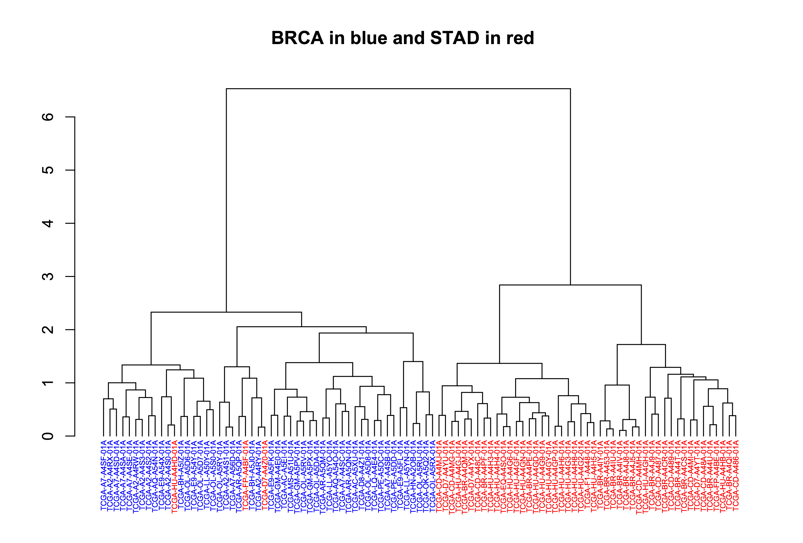

***********************
Query of the Month Club
***********************

Welcome to the 'Query of the Month Club' where we'll be creating a collection
of new and interesting queries to demonstrate the powerful combination of
BigData from the TCGA and BigQuery from Google.

Please let us know if you'd like to be featured on the "query-club"!
email: dgibbs (at) systemsbiology (dot) org

------------------

July, 2017
###########

Way back in December we started talking about the new
`NCI-GDC Data Portal <https://gdc-portal.nci.nih.gov/>`_
which was including the hg38 alignments. At that time, those were part of the
isb-cgc:hg38_data_previews. Now they've matured into three data sets:

- isb-cgc:TCGA_bioclin_v0
- isb-cgc:TCGA_hg19_data_v0
- isb-cgc:TCGA_hg19_data_v0

And, as you'll discover, there's been some changes to the "standard" column
names that we used previously. This is done to better align with the GDC, and
make things more universal across data sources.

For one, barcode column names (and most column names) have become all lower case
and underscore separated. So AliquotBarcode has become aliquot_barcode. Same with
SampleBarcode (sample_barcode). However, ParticipantBarcode has become case_barcode.
A big change comes in changing 'Study' to 'project_short_name'.  So if you're having
trouble getting a 'old' query to work, make sure the column names haven't changed.

As we transition to standard SQL and the new GDC datasets, one question that's
come up here relates to gene name records. Overall, there's very few data types
other than STRING, INTEGER, and FLOATs, but occasionally you'll bump into something
that needs a different query structure, and the RECORD type is one of those.
One place to find this rare beast is in the methylation probe annotation
(isb-cgc:platform_reference.methylation_annotation)

Each methylation probe has some genomic location, given as a chromosome and a
position in nucleotide bases. And a frequent question that arises takes the shape
"does methylation in this region of the genome affect RNA transcription?". It's
a good question, and actually can be pretty hard to determine. But we'll focus
on one of the first things in the analysis, mapping probes to genes.

In the isb-cgc:platform_reference.methylation_annotation table, we find our
RECORD, 'UCSC'. If we look in the details of the table (via the web interface)
we see that the table has 485,577 rows and has the following description:

::

  This table is based on the Illumina DNA methylation platform annotation information
  found in the file HumanMethylation450_15017482_v.1.2.csv which can be obtained
  from Illumina.  This information has been loaded into a BigQuery table and made
  available to the public with permission from Illumina.

Sounds good! A couple important columns are going to be the IlmnID, which
is the probe ID (example: cg10232580), and the UCSC RECORD, where we'll find
the gene symbol, RefGene accession ID, and the portion of the gene the probe is
closest to (nothing is certain though).

Let's start with a easy one:

.. code-block:: sql

  SELECT
    Infinium_Design_Type,
    COUNT(Infinium_Design_Type)
  FROM
    `isb-cgc.platform_reference.methylation_annotation`
  GROUP BY
    Infinium_Design_Type

::

  Row	Infinium_Design_Type	f0_
  1	  I	                    135501
  2	  II	                  350076

Why does that matter? Well, the array was actually a blend of two different
technologies. This `paper <https://www.ncbi.nlm.nih.gov/pubmed/22126295>_`
shows that the performance of the two probes is very different, and that type II
probes appear to be less useful than the type I probes. Unfortunate, considering
how many more type II probe exist compared to type I.

Now, let's suppose we are interested in a particular pathway, and we'd like to know
the distribution of probe types across the pathway genes. Using our previous
'Query of the Month' data set (isb-cgc:QotM.WikiPathways_20170425_Annotated),
we can get a list of functionally related genes.

.. code-block:: sql

  SELECT
    DISTINCT(Symbol)
  FROM
    `isb-cgc.QotM.WikiPathways_20170425_Annotated`
  WHERE
    pathway = 'Oxidative Damage'

and we get 40 genes. So now we're going to join the annotation table, to our
table of pathway related genes, and get the probe types.

.. code-block:: sql

  WITH
  pathway AS (
  SELECT
    DISTINCT(Symbol) as gene_symbol
  FROM
    `isb-cgc.QotM.WikiPathways_20170425_Annotated`
  WHERE
    pathway = 'Oxidative Damage'
    )
  SELECT
      Infinium_Design_Type,
      COUNT(Infinium_Design_Type)
  FROM
      `isb-cgc.platform_reference.methylation_annotation` as m
  JOIN
      pathway
  ON
      pathway.gene_symbol = m.UCSC.RefGene_Name
  GROUP BY
    Infinium_Design_Type

::

  Query Failed
  Error: Cannot access field RefGene_Name on a value with type
  ARRAY<STRUCT<RefGene_Group STRING, RefGene_Accession STRING, RefGene_Name STRING>> at [18:34]

What happened?  It's that darned RECORD, which in our error, actually looks to be an
ARRAY of STRUCTS! We have previously
used arrays in our queries in past months where we took a list of values and created
an array to be passed to a javascript function. The result of the function gave us
back an array, and we had to UNNEST it, to get back one row per entry. It's similar
in this instance. Some probes are mapped to multiple RefGene_Accession IDs. For example,
cg10241718 maps to NM_033302, NM_033303, NM_033304, and NM_000680. Interestingly, you
see this same set as part of the HG-U133A probe annotations (Thanks, genecard-geneannot webservice).
These are representing four different transcripts of the same gene ADRA1A, the methylation
probe has the same relationship to three of the isoforms (body), but for one isoform,
NM_000680, the probe is 3'-UTR, which could change its effect. In light of that, we might want
to group by gene symbol (mostly the same) and the refgene_group, which tells us the
relative position of the probe to the gene.

To (finally!) address the problem of RECORDS, we need to check the BigQuery
`docs <https://cloud.google.com/bigquery/docs/reference/standard-sql/migrating-from-legacy-sql>_`
So there, we see that the RECORD in Legacy SQL becomes a STRUCT in Standard SQL. In order
to flatten the table, in Legacy SQL we would use FLATTEN, but now, in Standard SQL we are
going to use UNNEST.

So what's the difference between an ARRAY and a STRUCT.

Well from the docs: an ARRAY is "an ordered list of zero or more elements of non-ARRAY values."
and a STRUCT is "Container of ordered fields each with a type..". Hmmm, sounds pretty similar,
the difference is that a STRUCT can be a collection of different data types (STRINGS and INTs for
example), while ARRAYs have to be a single data type.

To get around that, we are going to FLATTEN the table using UNNEST.

.. code-block:: sql

  SELECT
    RefGene_Name,
    RefGene_Group
  FROM
    `isb-cgc.platform_reference.methylation_annotation`,
    UNNEST(UCSC)
  LIMIT
    1000

::

  Row	RefGene_Name	RefGene_Group
  1	  null	        null
  2	  null	        null
  3	  IQCE	        Body
  4	  IQCE	        Body
  5	  CRYGN	        3'UTR
  6	  IQCE	        Body
  7	  IQCE	        Body
  8	  ELFN1	        5'UTR

That's more like it!

May, 2017
###########

This month we are going to extend the query from April and focus on estimating the
distance between samples based on shared mutations in pathways. To clarify, we want to know, given
a particular pathway, such as the WNT signaling pathway, whether two samples
share deleterious mutations within that pathway. In April, we were comparing samples
based on shared mutations, but in considering all genes simultaneously, we had
some pretty low Jaccard indices.

A second goal will be to create a set of pathways, for each sample, where pathways
contain at least one potentially harmful mutation. Then we will again estimate the
distance between samples based on the set of (potentially) altered pathways.

New for this month, we also have a whole host of new BigQuery tables from
`COSMIC <http://isb-cancer-genomics-cloud.readthedocs.io/en/latest/sections/COSMIC.html>`_.

For our query this month, we downloaded 381 pathways from
`WikiPathways <http://data.wikipathways.org/current/gmt/wikipathways-20170410-gmt-Homo_sapiens.gmt>`_.
In the BQ table, each row contains a pathway and a gene associated with that pathway.

For this portion of the work, I wrote a small python script to parse .gmt files to
output a 'tidy' (format), which is required for
uploading to BigQuery. Then with this file, I used the BQ web interface uploader.
To upload a table, clicking the '+' symbol next to a dataset
reveals the 'Create Table' interface. For smaller files, we can upload it directly,
whereas with larger files, we need to move it to cloud storage first. After giving it a table
name, and with some luck, we can just click the 'Automatically detect' schema check box.
I've been having good luck with it, but you might run into trouble if the 'top' of a column
looks like an integer, but the actual type is a 'string'.

I've created a table with a column listing the pathway name, and a second
column listing the genes associated with the pathway. I used the org.Hs.eg.db
human database of gene identifiers found in Bioconductor to map the gene IDs to a few often
used variants.

For this analysis, first I will select a few pathways that are well known and often important in cancer
processes, then we'll move to using all pathways. And towards the end, we'll look at all pathways and all
studies!

.. code-block:: sql

  SELECT
    Symbol
  FROM
    `isb-cgc:QotM.WikiPathways_20170425_Annotated`
  WHERE
    pathway = 'Notch Signaling Pathway'
  GROUP BY
    Symbol

The above query returns 79 gene symbols. Let's see how many variants are found
in this pathway.

.. code-block:: sql

  WITH
    pathGenes AS (
      SELECT
        Symbol
      FROM
        `isb-cgc.QotM.WikiPathways_20170425_Annotated`
      WHERE
        pathway = 'Notch Signaling Pathway'
      GROUP BY
        Symbol
    ),
    varsMC3 AS (
      SELECT
        project_short_name,
        case_barcode,
        Hugo_Symbol
      FROM
        `isb-cgc.TCGA_hg19_data_v0.Somatic_Mutation_MC3`
      WHERE
        Variant_Type = 'SNP'
        AND Consequence = 'missense_variant'
        AND biotype = 'protein_coding'
        AND SWISSPROT IS NOT NULL
        AND REGEXP_CONTAINS(PolyPhen, 'damaging')
        AND REGEXP_CONTAINS(SIFT, 'deleterious')
        AND Hugo_Symbol IN (select Symbol as Hugo_Symbol from pathGenes)
      GROUP BY
        project_short_name,
        case_barcode,
        Hugo_Symbol
    )
  --
  --
  SELECT
    project_short_name,
    COUNT(*) AS N_vars
  FROM
    varsMC3
  GROUP BY
    project_short_name
  ORDER BY
    N_vars DESC

.. figure:: query_figs/may_1.png
   :scale: 30
   :align: center

So there are quite a few variants found in this pathway.
Let's find out a little more information about them.
I'm going to replace the last 'select' statement of the above query
to look at the returned rows. Also, similar to last month,
we're going to look at a small subset of cancer types to ensure the queries come back quickly.

.. code-block:: sql

  SELECT
    Hugo_Symbol,
    count(Hugo_Symbol) as gene_count
  FROM
    varsMC3
  WHERE
    project_short_name = 'TCGA-COAD'
  group by
    Hugo_Symbol
  order by
    gene_count dESC

.. figure:: query_figs/may_2_2.png
   :scale: 75
   :align: center

These counts show that some genes are mutated more often
than others. In COAD, FBXW7 is mutated more than twice as often as the next
most mutated gene, NOTCH1. Both of these genes are well known among cancer
researchers.

OK, let's compute a Jaccard index based on this pathway!

.. code-block:: sql

  WITH
    --
    -- First we define our pathway of interest.
    --
    pathGenes AS (
      SELECT
        Symbol as Hugo_Symbol
      FROM
        `isb-cgc.QotM.WikiPathways_20170425_Annotated`
      WHERE
        pathway = 'Notch Signaling Pathway'
      GROUP BY
        Symbol
    ),
    --
    -- Then we're going to extract just the project names, cases, and gene symbols,
    -- using the "GROUP BY" to make sure we only count one mutation per gene per case
    -- and we'll just take genes that are in the pathway.
    --
    firstVars AS (
    SELECT
      project_short_name,
      case_barcode,
      Hugo_Symbol
    FROM
      `isb-cgc.TCGA_hg19_data_v0.Somatic_Mutation_MC3`
    WHERE
      Variant_Type = 'SNP'
      AND Hugo_Symbol IN (select Hugo_Symbol from pathGenes)
      AND Consequence = 'missense_variant'
      AND biotype = 'protein_coding'
      AND ( REGEXP_CONTAINS(PolyPhen, 'damaging')
        OR REGEXP_CONTAINS(SIFT, 'deleterious') )
      AND project_short_name IN ('TCGA-PAAD', 'TCGA-GBM', 'TCGA-LGG')
      -- We could remove the above line to compute using all samples,
      -- but to speed things up, let's just look at 3 studies.
    GROUP BY
      project_short_name,
      case_barcode,
      Hugo_Symbol ),
    --
    -- Next we transform resulting table using the ARRAY_AGG function
    -- to create a list of mutated genes for each case
    --
    arrayMC3 AS (
    SELECT
      project_short_name,
      case_barcode,
      ARRAY_AGG(DISTINCT Hugo_Symbol) AS geneArray
    FROM
      firstVars
    GROUP BY
      project_short_name,
      case_barcode ),
    --
    -- Now we can do some "set operations" on these gene-lists:  a self-join
    -- of the previously created table with itself will allow for a pairwise
    -- pairwise comparison (notice the inequality in the JOIN ... ON clause)
    --
    setOpsTable AS (
    SELECT
      a.case_barcode AS case1,
      a.project_short_name AS study1,
      ARRAY_LENGTH(a.geneArray) AS length1,
      b.case_barcode AS case2,
      b.project_short_name AS study2,
      ARRAY_LENGTH(b.geneArray) AS length2,
      --
      -- here's the intersection
      (SELECT
        COUNT(1) FROM UNNEST(a.geneArray) AS ga JOIN UNNEST(b.geneArray) AS gb ON ga = gb)
          AS gene_intersection,
      --
      -- and here's the union
      (SELECT
        COUNT(DISTINCT gx) FROM UNNEST(ARRAY_CONCAT(a.geneArray,b.geneArray)) AS gx)
          AS gene_union
    FROM
      arrayMC3 AS a
    JOIN
      arrayMC3 AS b
    ON
      a.case_barcode < b.case_barcode )
    --
    -- and finally, we can compute the Jaccard index, and
    -- do a little bit of filtering and then output a list of
    -- pairs, sorted based on the Jaccard index:
  SELECT
    case1,
    study1,
    length1 AS geneCount1,
    case2,
    study2,
    length2 AS geneCount2,
    gene_intersection,
    gene_union,
    (gene_intersection / gene_union) AS jaccard_index
  FROM
    setOpsTable
  WHERE
    (gene_intersection / gene_union) > 0.1
    AND gene_intersection > 5
  ORDER BY
    jaccard_index DESC

.. figure:: query_figs/may_3.png
   :scale: 40
   :align: center

So, it's very interesting that we are getting samples from GBM (brain) and PAAD
(pancreas) with high overlaps in the gene sets. But it makes sense since the
Notch signaling pathway was been implciated in both of these cancer types.

https://www.ncbi.nlm.nih.gov/pmc/articles/PMC4283135/

https://www.ncbi.nlm.nih.gov/pmc/articles/PMC4621772/

Now we'll move on to the COSMIC data, where we will compare a GBM sample
to various non-TCGA samples in COSMIC.

.. code-block:: sql

  WITH
    --
    -- First we define our pathway of interest.
    --
    pathGenes AS (
      SELECT
        Symbol as Hugo_Symbol
      FROM
        `isb-cgc.QotM.WikiPathways_20170425_Annotated`
      WHERE
        pathway = 'Notch Signaling Pathway'
      GROUP BY
        Symbol
    ),
    --
    -- Then we'll select a single TCGA sample, with filters similar to the above.
    --
    tcgaSample AS (
    SELECT
      sample_barcode_tumor,
      Hugo_Symbol
    FROM
      `isb-cgc.TCGA_hg19_data_v0.Somatic_Mutation_MC3`
    WHERE
      sample_barcode_tumor = 'TCGA-06-5416-01A'
      AND Hugo_Symbol IN (select Hugo_Symbol from pathGenes)
      AND Variant_Type = 'SNP'
      AND Consequence = 'missense_variant'
      AND biotype = 'protein_coding'
      AND ( REGEXP_CONTAINS(PolyPhen, 'damaging')
        OR REGEXP_CONTAINS(SIFT, 'deleterious') )
    GROUP BY
      sample_barcode_tumor,
      Hugo_Symbol),
    --
    -- Then we'll create a sub-table of COSMIC samples, sans TCGA.
    --
    cosmicSample AS (
    SELECT
      Sample_name,
      Primary_site,
      Primary_histology,
      Sample_source,
      Gene_name
    FROM
      `isb-cgc.COSMIC.grch37_v80`
    WHERE
      STARTS_WITH(Sample_name, "TCGA") = FALSE
      AND Mutation_Description = 'Substitution - Missense'
      AND FATHMM_prediction = "PATHOGENIC"
      AND Gene_name IN (select Hugo_symbol from pathGenes)
    GROUP BY
      Sample_name,
      Primary_site,
      Primary_histology,
      Sample_source,
      Gene_name ),
    --
    -- Then we make the array of genes for the TCGA sample.
    --
    tcgaSampleArray AS (
    SELECT
      sample_barcode_tumor,
      ARRAY_AGG(DISTINCT Hugo_Symbol) AS geneArray
    FROM
      tcgaSample
    GROUP BY
      sample_barcode_tumor ),
    --
    -- Then we make the array of genes for each cosmic sample.
    --
    cosmicSampleArray AS (
    SELECT
      Sample_name,
      Primary_site,
      Primary_histology,
      Sample_source,
      ARRAY_AGG(DISTINCT Gene_name) AS geneArray
    FROM
      cosmicSample
    GROUP BY
      Sample_name,
      Primary_site,
      Primary_histology,
      Sample_source ),
    --
    -- Next we can perform our set operations on the arrays.
    --
    setOpsTable AS (
    SELECT
      a.sample_barcode_tumor AS tcgaSample,
      b.Sample_name AS cosmicSample,
      b.Primary_site,
      b.Primary_histology,
      b.Sample_source,
      ARRAY_LENGTH(a.geneArray) AS length1,
      ARRAY_LENGTH(b.geneArray) AS length2,
      (SELECT COUNT(1) FROM UNNEST(a.geneArray) AS ga JOIN UNNEST(b.geneArray) AS gb ON ga = gb) AS gene_intersection,
      (SELECT COUNT(DISTINCT gx) FROM UNNEST(ARRAY_CONCAT(a.geneArray,b.geneArray)) AS gx) AS gene_union
    FROM
      tcgaSampleArray AS a
    JOIN
      cosmicSampleArray AS b
    ON
      a.sample_barcode_tumor < b.Sample_name )
    --
    -- And build our final results.
    --
  SELECT
    tcgaSample,
    length1 AS geneCount1,
    cosmicSample,
    Primary_site,
    Primary_histology,
    length2 AS geneCount2,
    gene_intersection AS intersection,
    gene_union,
    (gene_intersection / gene_union) AS jaccard_index
  FROM
    setOpsTable
  WHERE
    (gene_intersection / gene_union) > 0.00
    AND gene_intersection > 1
    AND gene_union > 1
  ORDER BY
    jaccard_index DESC

So, for this particular pathway, the Jaccard indices are not spectacular.
But(!), what we really want is to look at *all* pathways simultaneously.
Then for any given pair of samples, we could rank the mutation overlap by pathway.
To do that, instead of selecting a pathway in the first subtable... we build a
table containing all pathways, and join on that further down in the query.

Just note, this is a longer running query (takes about 2 minutes).

.. code-block:: sql

  WITH
    --
    -- First we make a table with pathways and genes.
    --
    pathGenes AS (
      SELECT
        pathway,
        Symbol as Hugo_Symbol
      FROM
        `isb-cgc.QotM.WikiPathways_20170425_Annotated`
      GROUP BY
        Symbol,
        pathway
    ),
    --
    -- Then we're going to extract just the project names, cases, and gene symbols,
    -- using the "GROUP BY" to make sure we only count one mutation per gene per case
    -- and we'll join to the above pathway table.
    --
    firstVars AS (
    SELECT
      a.project_short_name,
      a.case_barcode,
      a.Hugo_Symbol,
      b.pathway
    FROM
      `isb-cgc.TCGA_hg19_data_v0.Somatic_Mutation_MC3` as a
    join
      pathGenes as b
    on
      a.Hugo_Symbol = b.Hugo_Symbol
    WHERE
      Variant_Type = 'SNP'
      AND Consequence = 'missense_variant'
      AND biotype = 'protein_coding'
      AND ( REGEXP_CONTAINS(PolyPhen, 'damaging')
        OR REGEXP_CONTAINS(SIFT, 'deleterious') )
      AND project_short_name IN ('TCGA-PAAD', 'TCGA-GBM', 'TCGA-LGG', 'TCGA-BRCA', 'TCGA-KIRC')
      -- We could remove the above line to compute using all samples,
      -- but to speed things up, let's just look at 3 studies.
    GROUP BY
      project_short_name,
      case_barcode,
      Hugo_Symbol,
      pathway
      ),
    --
    -- Next we transform resulting table using the ARRAY_AGG function
    -- to create a list of mutated genes for each case
    --
    arrayMC3 AS (
    SELECT
      project_short_name,
      case_barcode,
      pathway,
      ARRAY_AGG(DISTINCT Hugo_Symbol) AS geneArray
    FROM
      firstVars
    GROUP BY
      project_short_name,
      case_barcode,
      pathway
      ),
    --
    -- Now we can do some "set operations" on these gene-lists:  a self-join
    -- of the previously created table with itself will allow for a pairwise
    -- pairwise comparison (notice the inequality in the JOIN ... ON clause)
    --
    setOpsTable AS (
    SELECT
      a.case_barcode AS case1,
      a.project_short_name AS study1,
      a.pathway as pathway,
      ARRAY_LENGTH(a.geneArray) AS length1,
      b.case_barcode AS case2,
      b.project_short_name AS study2,
      ARRAY_LENGTH(b.geneArray) AS length2,
      --
      -- here's the intersection
      (SELECT
        COUNT(1) FROM UNNEST(a.geneArray) AS ga JOIN UNNEST(b.geneArray) AS gb ON ga = gb)
          AS gene_intersection,
      --
      -- and here's the union
      (SELECT
        COUNT(DISTINCT gx) FROM UNNEST(ARRAY_CONCAT(a.geneArray,b.geneArray)) AS gx)
          AS gene_union
    FROM
      arrayMC3 AS a
    JOIN
      arrayMC3 AS b
    ON
      a.case_barcode < b.case_barcode AND
      a.pathway = b.pathway
      )
    --
    -- and finally, we can compute the Jaccard index, and
    -- do a little bit of filtering and then output a list of
    -- pairs, sorted based on the Jaccard index:
  SELECT
    pathway,
    case1,
    study1,
    length1 AS geneCount1,
    case2,
    study2,
    length2 AS geneCount2,
    gene_intersection,
    gene_union,
    (gene_intersection / gene_union) AS jaccard_index
  FROM
    setOpsTable
  WHERE
    (gene_intersection / gene_union) > 0.3
    AND gene_intersection > 10
  ORDER BY
    jaccard_index DESC

.. figure:: query_figs/may_5.png
   :scale: 40
   :align: center

OK! Now we've got some pretty decent overlaps. We now have a way to search for
similarities among groups of samples based on functionally based shared mutation
profiles.

Turning this question around a little bit,
what if we looked at the overlap on the pathway level instead?

.. code-block:: sql

  WITH
    --
    -- First we'll join the filtered somatic mutation table to the
    -- table of pathways.
    --
    vars AS (
    SELECT
      mc3.project_short_name,
      mc3.case_barcode,
      mc3.Hugo_Symbol,
      wikip.pathway
    FROM
      `isb-cgc.TCGA_hg19_data_v0.Somatic_Mutation_MC3` as mc3
    join
      `isb-cgc.QotM.WikiPathways_20170425_Annotated` as wikip
    ON
      mc3.Hugo_Symbol = wikip.Symbol
    WHERE
      mc3.Variant_Type = 'SNP'
      AND mc3.Consequence = 'missense_variant'
      AND mc3.biotype = 'protein_coding'
      AND ( REGEXP_CONTAINS(mc3.PolyPhen, 'damaging')
        OR REGEXP_CONTAINS(mc3.SIFT, 'deleterious') )
      AND mc3.project_short_name IN ('TCGA-BRCA', 'TCGA-GBM')
      -- We could remove the above line to compute using all samples,
      -- but to speed things up, let's just look at 3 studies.
    GROUP BY
      mc3.project_short_name,
      mc3.case_barcode,
      mc3.Hugo_Symbol,
      wikip.pathway),
    --
    -- Next we transform resulting table using the ARRAY_AGG function
    -- to create a list of pathways for each case, where each pathway
    -- contains at least one mutated gene.
    --
    arrayPath AS (
    SELECT
      project_short_name,
      case_barcode,
      ARRAY_AGG(DISTINCT pathway) AS pathArray
    FROM
      vars
    GROUP BY
      project_short_name,
      case_barcode ),

    --
    -- Now we can do some "set operations" on these pathway-lists:  a self-join
    -- of the previously created table with itself will allow for a pairwise
    -- pairwise comparison (notice the inequality in the JOIN ... ON clause)
    --
    setOpsTable AS (
    SELECT
      a.case_barcode AS case1,
      a.project_short_name AS study1,
      ARRAY_LENGTH(a.pathArray) AS length1,
      b.case_barcode AS case2,
      b.project_short_name AS study2,
      ARRAY_LENGTH(b.pathArray) AS length2,
      --
      -- here's the intersection
      (SELECT
        COUNT(1) FROM
          UNNEST(a.pathArray) AS ga JOIN UNNEST(b.pathArray) AS gb ON ga = gb)
            AS path_intersection,
      --
      -- and here's the union
      (SELECT
        COUNT(DISTINCT gx) FROM
          UNNEST(ARRAY_CONCAT(a.pathArray,b.pathArray)) AS gx)
            AS path_union
    FROM
      arrayPath AS a
    JOIN
      arrayPath AS b
    ON
      a.case_barcode < b.case_barcode )
    --

    --
    -- and finally, we can compute the Jaccard index, and
    -- do a little bit of filtering and then output a list of
    -- pairs, sorted based on the Jaccard index:
  SELECT
    case1,
    study1,
    length1 AS pathCount1,
    case2,
    study2,
    length2 AS pathCount2,
    path_intersection,
    path_union,
    (path_intersection / path_union) AS jaccard_index
  FROM
    setOpsTable
  WHERE
    (path_intersection / path_union) > 0.8
    AND path_intersection > 10
  ORDER BY
    jaccard_index DESC

.. figure:: query_figs/may_brca_pathway_jaccard.png
   :scale: 85
   :align: center

Wow, those are some excellent jaccard indices!  Considering that we started
with just over 300 pathways, we have samples perfectly or nearly perfectly
in agreement.

Next, let's see how the samples are associating on a tissue level.  I'm going to add
this query to the end of the above query, to tabulate how often study1 and study2
agree regarding tissue of origin (between BRCA and GBM).

.. code-block:: sql

  SELECT
    table_cell,
    COUNT(*) AS n
  FROM (
    SELECT (
      CASE
        WHEN study1 = 'TCGA-BRCA' AND study2 = 'TCGA-BRCA' THEN 'BRCA-BRCA'
        WHEN study1 = 'TCGA-BRCA' AND study2 = 'TCGA-GBM' THEN 'BRCA-GBM'
        WHEN study1 = 'TCGA-GBM' AND study2 = 'TCGA-BRCA' THEN 'GBM-BRCA'
        WHEN study1 = 'TCGA-GBM' AND study2 = 'TCGA-GBM' THEN 'GBM-GBM'
        ELSE 'None'
      END ) AS table_cell
    FROM
      jtable )
  GROUP BY
    table_cell
  ORDER BY
    n DESC

.. figure:: query_figs/may_brca_jaccard_table.png
  :scale: 85
  :align: center

So, we see that the really high Jaccard indices are coming (mostly) from
BRCA-BRCA sample comparisons.

With one additional change to the above query we can query across all TCGA studies
rather than just a few.  The change involves removing the
``mc3.project_short_name IN ('TCGA-BRCA', 'TCGA-GBM')`` conditional. This is a
good trick that works in many cases. By removing the conditional, instead of
querying on just a few, we query across all studies, letting each sample be
paired with every other. Doing this, and setting the Jaccard index threshold
to 0.5, we get > 800K rows of results back, where each sample pair is
compared on the similarity of their potentially disrupted pathways. Bringing
the results into R, I created a heatmap showing how many TCGA study pairs were
among the results.  We see some tissue types are most similar to only that type
of tissue, whereas other tissue types share patterns of disrupted pathways.

.. figure:: query_figs/all_tcga_jaccard_by_pathways_log_counts.png
  :scale: 85
  :align: center

================

================

April, 2017
###########

In this month's query, we are going to look at two new data sources. The first
is the MC3 somatic mutation table, and the second is the
`COSMIC mutation database <http://isb-cancer-genomics-cloud.readthedocs.io/en/latest/sections/COSMIC.html>`_.
The objective is to compute a similarity metric based on
overlapping mutations between samples. First we'll look at pairwise similarity
among TCGA samples, and then we'll pick a single TCGA sample and search for a
matching COSMIC sample.

The MC3 table comes from the TCGA Pan-Cancer effort, a multi-center project aiming
to analyze all 33 TCGA tumor-types together. This somatic mutation calls table is
based on the unified call set recently published by the TCGA Network.
(For more details or the original source file, please
`check Synapse <https://www.synapse.org/#!Synapse:syn7214402/wiki/405297>`_.)

The COSMIC
(`Catalogue Of Somatic Mutations In Cancer <http://cancer.sanger.ac.uk/cosmic>`_)
data comes from the Wellcome Trust Sanger Institue and represents the
*"the world's largest and most comprehensive resource for exploring the impact of somatic mutations in human cancer"*.

To compute a similarity score between any two samples, we'll use the
Jaccard index, in which the intersection is divided by the union, so that
samples with no overlap in mutations will have a Jaccard index of 0, while
samples with some overlap will have a Jaccard index between 0 and 1.

We'll start with the MC3 table -- which includes the predicted effect
of each mutation call.  The mutation might result in a
change in the amino acid sequence (non-synonomous), or introduce a new stop
codon (stop insert), or no amino-acid change (synonomous). In this work
we're going to focus on single nucleotide polymorphisms (SNPs).

First, lets see what kind of "consequences" are present in this table:

.. code-block:: sql

  SELECT
    Consequence,
    count (1) AS n
  FROM
    `isb-cgc.TCGA_hg19_data_v0.Somatic_Mutation_MC3`
  WHERE
    Variant_Type = 'SNP'
  GROUP BY
    Consequence
  ORDER BY
    n DESC

===  ==================================  =======
Row          Consequence                    n
===  ==================================  =======
1    missense_variant                    1921705
2    synonymous_variant                  781564
3    3_prime_UTR_variant                 253582
4    stop_gained                         156768
5    intron_variant                      86347
6    5_prime_UTR_variant                 77069
7    non_coding_transcript_exon_variant  46761
8    splice_acceptor_variant             29658
9    downstream_gene_variant             19048
10   splice_donor_variant                18239
11   splice_region_variant               15231
12   upstream_gene_variant               14990
13   start_lost                          2718
14   stop_lost                           2038
15   stop_retained_variant               1077
===  ==================================  =======

For the sake of simplicity, we're going to focus on the most common type of
variant, the missense_variant which is more likely to have a functional impact
through an alteration of the amino acid sequence.

Another question we might ask is: how are variants distributed across the
tumor types (aka "studies" or "projects" within TCGA).

.. code-block:: sql

  WITH
    firstMC3 AS (
    SELECT
      project_short_name,
      case_barcode,
      Hugo_Symbol
    FROM
      `isb-cgc.TCGA_hg19_data_v0.Somatic_Mutation_MC3`
    WHERE
      Variant_Type = 'SNP'
      AND Consequence = 'missense_variant'
      AND biotype = 'protein_coding'
      AND SWISSPROT IS NOT NULL
      AND REGEXP_CONTAINS(PolyPhen, 'damaging')
      AND REGEXP_CONTAINS(SIFT, 'deleterious')
    GROUP BY
      project_short_name,
      case_barcode,
      Hugo_Symbol )
  --
  --
  SELECT
    project_short_name,
    COUNT(*) AS N_genes
  FROM
    firstMC3
  GROUP BY
    project_short_name
  ORDER BY
    N_genes DESC

Wow! The very high mutation counts for SKCM (melanoma) and LUAD
(lung adenocarcinoma) may not be surprising, but the high mutation
rate in endometial cancer (UCEC) may be less well known.

===  ==================  =======
Row  project_short_name  N_genes
===  ==================  =======
1       TCGA-UCEC         156877
2       TCGA-SKCM         112324
3       TCGA-LUAD          53119
4       TCGA-COAD          51072
5       TCGA-LUSC          44260
6       TCGA-STAD          44229
.       .........          .....
===  ==================  =======

OK, let's compute a Jaccard index across all samples in a few selected tumor-specific projects.
Look for how the 'array' gets used.

.. code-block:: sql

  WITH
    --
    -- first we're going to extract just the project names, cases, and gene symbols,
    -- using the "GROUP BY" to make sure we only count one mutation per gene per case
    firstMC3 AS (
    SELECT
      project_short_name,
      case_barcode,
      Hugo_Symbol
    FROM
      `isb-cgc.TCGA_hg19_data_v0.Somatic_Mutation_MC3`
    WHERE
      Variant_Type = 'SNP'
      AND Consequence = 'missense_variant'
      AND biotype = 'protein_coding'
      AND ( REGEXP_CONTAINS(PolyPhen, 'damaging')
        OR REGEXP_CONTAINS(SIFT, 'deleterious') )
      AND project_short_name IN ('TCGA-PAAD', 'TCGA-GBM', 'TCGA-LGG')
      -- We could remove the above line to compute using all samples,
      -- but to speed things up, let's just look at 3 studies.
    GROUP BY
      project_short_name,
      case_barcode,
      Hugo_Symbol ),
    --
    -- next we transform resulting table using the ARRAY_AGG function
    -- to create a list of mutated genes for each case
    arrayMC3 AS (
    SELECT
      project_short_name,
      case_barcode,
      ARRAY_AGG(DISTINCT Hugo_Symbol) AS geneArray
    FROM
      firstMC3
    GROUP BY
      project_short_name,
      case_barcode ),
    --
    -- now we can do some "set operations" on these gene-lists:  a self-join
    -- of the previously created table with itself will allow for a pairwise
    -- pairwise comparison (notice the inequality in the JOIN ... ON clause)
    setOpsTable AS (
    SELECT
      a.case_barcode AS case1,
      a.project_short_name AS study1,
      ARRAY_LENGTH(a.geneArray) AS length1,
      b.case_barcode AS case2,
      b.project_short_name AS study2,
      ARRAY_LENGTH(b.geneArray) AS length2,
      --
      -- here's the intersection
      (
      SELECT
        COUNT(1)
      FROM
        UNNEST(a.geneArray) AS ga
      JOIN
        UNNEST(b.geneArray) AS gb
      ON
        ga = gb) AS gene_intersection,
      --
      -- and here's the union
      (
      SELECT
        COUNT(DISTINCT gx)
      FROM
        UNNEST(ARRAY_CONCAT(a.geneArray,b.geneArray)) AS gx) AS gene_union
    FROM
      arrayMC3 AS a
    JOIN
      arrayMC3 AS b
    ON
      a.case_barcode < b.case_barcode )
    --
    -- and finally, we can compute the Jaccard index, and
    -- do a little bit of filtering and then output a list of
    -- pairs, sorted based on the Jaccard index:
  SELECT
    case1,
    study1,
    length1 AS geneCount1,
    case2,
    study2,
    length2 AS geneCount2,
    gene_intersection,
    gene_union,
    (gene_intersection / gene_union) AS jaccard_index
  FROM
    setOpsTable
  WHERE
    (gene_intersection / gene_union) > 0.1
    AND gene_intersection > 10
  ORDER BY
    jaccard_index DESC

The top 5 results from the above query surprisingly find the highest similarity
between a GBM (glioblastoma) sample and PAAD (pancreatic adenocarcinoma) sample.
The net highest similarity is between a LGG (lower-grade glioma) sample and the
same PAAD sample.  (Recall that our query above had, somewhat randomly, chosen
only GBM, LGG, and PAAD tumor-specific projects.)

.. figure:: query_figs/april_table1.png
   :scale: 100
   :align: center

.. figure:: query_figs/april_plot2.png
   :scale: 30
   :align: center

   Fig1. Each dot represents a pair of cases and the associated Jaccard index.  The blue points show the pairs that involve the GBM case TCGA-06-5416.

Those unions look high to me.  Let's double check them.

.. code-block:: sql

  --
  --
  WITH
    g1 AS (
    SELECT
      Hugo_Symbol
    FROM
      `isb-cgc.TCGA_hg19_data_v0.Somatic_Mutation_MC3`
    WHERE
      Variant_Type = 'SNP'
      AND Consequence = 'missense_variant'
      AND biotype = 'protein_coding'
      AND (REGEXP_CONTAINS(PolyPhen, 'damaging')
        OR REGEXP_CONTAINS(SIFT, 'deleterious'))
      AND case_barcode = 'TCGA-06-5416'
    GROUP BY
      Hugo_Symbol),
  --
  --
  --
    g2 AS (
    SELECT
      Hugo_Symbol
    FROM
      `isb-cgc.TCGA_hg19_data_v0.Somatic_Mutation_MC3`
    WHERE
      Variant_Type = 'SNP'
      AND Consequence = 'missense_variant'
      AND biotype = 'protein_coding'
      AND (REGEXP_CONTAINS(PolyPhen, 'damaging')
         OR REGEXP_CONTAINS(SIFT, 'deleterious'))
      AND case_barcode = 'TCGA-IB-7651'
    GROUP BY
      Hugo_Symbol)

  --
  -- First the intersection,
  --
  SELECT
    count ( distinct a.Hugo_Symbol ) AS n
  FROM
    g1 AS a
  JOIN
    g2 AS b
  ON
    a.Hugo_Symbol = b.Hugo_Symbol

  UNION ALL -- to bring the intersection and union queries together

  --
  -- then the union.
  --
  SELECT
    count ( distinct Hugo_Symbol ) AS n
  FROM
    (select * from  g1
       union all
     select * from g2)

  ORDER BY n

The above query returns 2277 (intersection) and 8821 (union), which is
what we were expecting given the first row in the previous set of results.

Next we'll turn our attention to the COSMIC catalog. We will select a single
sample, and perform the same Jaccard index across all samples in COSMIC
(removing TCGA samples in COSMIC), and see what comes up.
The sample we've selected for this next analysis is from the COAD project
(Colon Adenocarcinoma).

Similar to the MC3 table, variants in COSMIC have been annotated.
Let's take a look at what types of variants are present.

.. code-block:: sql

  --
  -- What kind of mutations are found in COSMIC?
  --
  SELECT
    Mutation_Description,
    count(1) AS n
  FROM
    `isb-cgc.COSMIC.grch37_v80`
  GROUP BY
    Mutation_Description
  ORDER BY n DESC

===  ============================  =========
Row  Mutation_Description            n
===  ============================  =========
1    Substitution - Missense       3115431
2    Substitution - coding silent  1017162
3    Substitution - Nonsense       204293
4    Unknown                       167135
5    Deletion - Frameshift         113237
6    Insertion - Frameshift        51345
7    Deletion - In frame           37833
8    Insertion - In frame          24870
9    Complex - deletion inframe    3212
10   Nonstop extension             2751
...  ...                           ...
===  ============================  =========

So, like above, we will focus on the most common type of variant, the Missense.

.. code-block:: sql

    --
    -- First we'll select a single TCGA sample, with filters similar to the above.
    --
  WITH
    --
    tcgaSample AS (
    SELECT
      sample_barcode_tumor,
      Hugo_Symbol
    FROM
      `isb-cgc.TCGA_hg19_data_v0.Somatic_Mutation_MC3`
    WHERE
      sample_barcode_tumor = 'TCGA-CA-6718-01A'
      AND Variant_Type = 'SNP'
      AND Consequence = 'missense_variant'
      AND biotype = 'protein_coding'
      AND ( REGEXP_CONTAINS(PolyPhen, 'damaging')
        OR REGEXP_CONTAINS(SIFT, 'deleterious') )
    GROUP BY
      sample_barcode_tumor,
      Hugo_Symbol),
    --
    -- Then we'll create a sub-table of COSMIC samples, sans TCGA.
    --
    cosmicSample AS (
    SELECT
      Sample_name,
      Primary_site,
      Primary_histology,
      Sample_source,
      Gene_name
    FROM
      `isb-cgc.COSMIC.grch37_v80`
    WHERE
      STARTS_WITH(Sample_name, "TCGA") = FALSE
      AND Mutation_Description = 'Substitution - Missense'
      AND FATHMM_prediction = "PATHOGENIC"
    GROUP BY
      Sample_name,
      Primary_site,
      Primary_histology,
      Sample_source,
      Gene_name ),
    --
    -- Then we make the array of genes for the TCGA sample.
    --
    tcgaSampleArray AS (
    SELECT
      sample_barcode_tumor,
      ARRAY_AGG(DISTINCT Hugo_Symbol) AS geneArray
    FROM
      tcgaSample
    GROUP BY
      sample_barcode_tumor ),
    --
    -- Then we make the array of genes for each cosmic sample.
    --
    cosmicSampleArray AS (
    SELECT
      Sample_name,
      Primary_site,
      Primary_histology,
      Sample_source,
      ARRAY_AGG(DISTINCT Gene_name) AS geneArray
    FROM
      cosmicSample
    GROUP BY
      Sample_name,
      Primary_site,
      Primary_histology,
      Sample_source ),
    --
    -- Next we can perform our set operations on the arrays.
    --
    setOpsTable AS (
    SELECT
      a.sample_barcode_tumor AS tcgaSample,
      b.Sample_name AS cosmicSample,
      b.Primary_site,
      b.Primary_histology,
      b.Sample_source,
      ARRAY_LENGTH(a.geneArray) AS length1,
      ARRAY_LENGTH(b.geneArray) AS length2,
      (SELECT COUNT(1) FROM UNNEST(a.geneArray) AS ga JOIN UNNEST(b.geneArray) AS gb ON ga = gb) AS gene_intersection,
      (SELECT COUNT(DISTINCT gx) FROM UNNEST(ARRAY_CONCAT(a.geneArray,b.geneArray)) AS gx) AS gene_union
    FROM
      tcgaSampleArray AS a
    JOIN
      cosmicSampleArray AS b
    ON
      a.sample_barcode_tumor < b.Sample_name )
    --
    -- And build our final results.
    --
  SELECT
    tcgaSample,
    length1 AS geneCount1,
    cosmicSample,
    Primary_site,
    Primary_histology,
    Sample_source,
    length2 AS geneCount2,
    gene_intersection AS intersection,
    gene_union,
    (gene_intersection / gene_union) AS jaccard_index
  FROM
    setOpsTable
  WHERE
    (gene_intersection / gene_union) > 0.00
    AND gene_intersection > 5
    AND gene_union > 5
  ORDER BY
    jaccard_index DESC

Recall that the TCGA-CA-6718-01A sample is from the COAD (colon adenocarcinoma) TCGA project.

------------

.. figure:: query_figs/april_table2.png
   :scale: 100
   :align: center

-------------

Cool -- the top COSMIC (non-TCGA) hit is from a very similar tumor type!
The other close matches are all from melanoma, a cancer with a very high
mutation rate which might result in "noisy" associations at this level.

Since the two mutation tables that we are comparing here (TCGA MC3 and COSMIC) use different
scores for assessing the implications of each somatic mutation, another idea would be
to integrate the
`Tute Genomics <https://en.wikipedia.org/wiki/Tute_Genomics>`_
`hg19 annotation table <https://bigquery.cloud.google.com/table/silver-wall-555:TuteTable.hg19?pli=1&tab=schema>`_
so that a single score can be used
in assessing the intersection of mutated genes between two cancer samples.

Thanks for joining us this month!

------------------

March, 2017
###########

This month we're going to compute a pairwise distance matrix and visualize
it using a heatmap in R. Many methods, such as clustering, depend on having a
distance matrix, and although I would not recommend using BigQuery to download
large tables, this works well for smaller feature sets (10s-100s).

In this example, we will be selecting primary tumor samples from both BRCA
and STAD cohorts, along with a list of the top 50 most variable miRNAs.
Then we'll compute a pairwise distance metric on samples. The distance will
be based on Spearman's correlation.

As usual, we are going to be using standard SQL, so make sure to select that
option.

.. code-block:: sql

  WITH
    --
    -- *sample_lists*
    -- First, start by defining the list of BRCA TP samples.
    -- (TP == tumor, primary)
    --
    brca_sample_list AS (
    SELECT
      SampleBarcode
    FROM
      `isb-cgc.tcga_201607_beta.Biospecimen_data`
    WHERE
      SampleTypeLetterCode='TP'
      AND Study='BRCA'
    LIMIT
      50),
    --
    -- Then let's create a list of STAD samples.
    --
    stad_sample_list AS (
    SELECT
      SampleBarcode
    FROM
      `isb-cgc.tcga_201607_beta.Biospecimen_data`
    WHERE
      SampleTypeLetterCode='TP'
      AND Study='STAD'
    LIMIT
      50),
    --
    -- Now, we are going to merge the two sample tables using a UNION ALL.
    --
    sample_list AS (
    select * from stad_sample_list
    UNION ALL
    select * from brca_sample_list
    ),
    --
    -- *miRNA_list*
    -- Next, we define the miRNAs of interest. We order the miRNAs by standard
    -- deviation, then take the top 50. Notice we select value from the
    -- subset defined above.
    --
    miRNA_list AS (
    SELECT
      mirna_accession,
      STDDEV(normalized_count) AS sigma_count
    FROM
      `isb-cgc.tcga_201607_beta.miRNA_Expression`
    WHERE
      SampleBarcode IN (
      SELECT
        SampleBarcode
      FROM
        sample_list )
    GROUP BY
      mirna_accession
    ORDER BY
      sigma_count DESC
    LIMIT
      50 ),
    --
    -- *miRNA_data*
    -- Now that we have the sample_list and the mirna_list, we can select our
    -- data of interest from the larger miRNA_Expression table.
    --
    miRNA_data AS (
    SELECT
      SampleBarcode,
      Study,
      mirna_id,
      mirna_accession,
      LOG10(normalized_count+1) AS log10_count
    FROM
      `isb-cgc.tcga_201607_beta.miRNA_Expression`
    WHERE
      SampleBarcode IN (
      SELECT
        SampleBarcode
      FROM
        sample_list )
      AND mirna_accession IN (
      SELECT
        mirna_accession
      FROM
        miRNA_list ) ),
    --
    -- *pairs*
    -- Now, we JOIN the miRNA_data matrix with *itself*, creating all possible pairs of samples
    -- (excluding self-comparisons which are unnecessary) combined with a dense-ranking of
    -- the miRNA expression values. By computing the Pearson correlation on ranks, we
    -- end up with Spearman's correlation!
    --
    pairs AS (
    SELECT
      lhs.mirna_id,
      lhs.mirna_accession,
      lhs.SampleBarcode AS SampleA,
      rhs.SampleBarcode AS SampleB,
      lhs.Study AS StudyA,
      rhs.Study as StudyB,
      DENSE_RANK() OVER (PARTITION BY lhs.mirna_accession ORDER BY lhs.log10_count ASC) AS ExpA,
      DENSE_RANK() OVER (PARTITION BY rhs.mirna_accession ORDER BY rhs.log10_count ASC) AS ExpB
    FROM
      miRNA_data AS lhs
    JOIN
      miRNA_data AS rhs
    ON
      lhs.mirna_accession=rhs.mirna_accession
      AND lhs.SampleBarcode < rhs.SampleBarcode )
    --
    -- **Finally**, we compute the pairwise distance between each pair of samples.
    --
  SELECT
    SampleA,
    SampleB,
    StudyA,
    StudyB,
    COUNT(mirna_accession) AS numObs,
    (1.-CORR(ExpA, ExpB))  AS sampleDistance
  FROM
    pairs
  GROUP BY
    SampleA,StudyA,
    SampleB,StudyB
  ORDER BY
    sampleDistance ASC

Now, let's see that distance matrix in R!

.. code-block:: R

  library(bigrquery) # make sure it's a recent version with the useLegacySql param!#

  q <- "The Query From Above"

  corrs <- query_exec(q, project="YOUR PROJECT ID", useLegacySql=F)

  # Use bigrquery to get the results or export the results to cloud storage and
  # download them like so.
  # gcs_url <- "gs://MY-BUCKET/MY-FILE.csv"
  # corrs <- read.csv(pipe(sprintf("gsutil cat %s", gcs_url)))

  library(dplyr)
  library(ggplot2)
  library(pheatmap)

  mat <- xtabs(sampleDistance~SampleA+SampleB, data=corrs)
  # or tidyr::spread(data=corrs, key=SampleA, value=sampleDistance, fill=0)

  dim(mat) # 99 x 99

  # Make the matrix symmetric.
  mat2 <- mat + t(mat)

  # Let's make an annotation matrix for cancer type
  studyMat <- unique(corrs[,c("StudyA", "SampleA")])
  studyMat$color <- ifelse(studyMat$Study == "BRCA", "blue", "red")
  rownames(studyMat) <- studyMat$SampleA

  # We can show the distances between samples as a dendrogram
  # install.packages("dendextend")
  library(dendextend)
  hc <- hclust(as.dist(mat2), method="ward.D2")
  dend <- as.dendrogram(hc)
  labels_colors(dend) <- studyMat[labels(dend), "color"]
  dend <- set(dend, "labels_cex", 0.5)

  ## Fig1 ##
  plot(dend, main="BRCA in clue and STAD in red")

  # If we want to make two groups, then we cut the dendrogram
  # leaving two branches.
  cas <- cutree(tree=hc, k=2)

  # Then we can use our cluster labels to annotate the heatmap.
  annotMat <- data.frame(cluster=cas)
  annotMat$SampleID <- names(cas)
  rownames(annotMat) <- names(cas)
  annotMat <- merge(x=annotMat, by.x="SampleID", y=studyMat, by.y="SampleA")
  rownames(annotMat) <- annotMat$SampleID

  # And we can plot cluster assignments on a heatmap
  # to see how hclust-default and pheatmap-defaults compare.

  ## Fig2 ##
  pheatmap(mat2, fontsize=6, annotation=annotMat[,-1])

  # Or we can use the dendsort library (from pheatmap examples)
  library(dendsort)
  callback = function(hc, ...){dendsort(hc)}

  ## Fig3 ##
  pheatmap(mat2, fontsize=6, annotation=annotMat[,-1], clustering_callback = callback)

  # Modify ordering of the clusters using clustering callback option
  callback = function(hc, mat){
      sv = svd(t(mat))$v[,1]
      dend = reorder(as.dendrogram(hc), wts = sv)
      as.hclust(dend)
  }
  ## Fig4 ##
  pheatmap(mat2, clustering_callback = callback, annotation=annotMat[,-1],
      fontsize_row=4, fontsize_col=4, border_color=NA)

------------

   Fig1. Dendrogram showing the sample-wise relationships based on miRNA expression.

-------------

   Fig2. Heatmap of pairwise distances, using pheatmap default clustering.

-------------

.. figure:: query_figs/brca_vs_stad_heatmap_2.png
   :scale: 25
   :align: center

   Fig3. Heatmap of pairwise distances, using the dendsort library.

-------------

.. figure:: query_figs/brca_vs_stad_heatmap_3.png
   :scale: 25
   :align: center

   Fig4. Ordering the samples after singular value decomposition.

-------------

February, 2017
##############

This month, we explore user defined functions or UDFs. BigQuery allows
you to define custom functions, things that you can't easily do in standard SQL, using JavaScript.
These functions are defined as
part of the SQL and then called within the query.

UDFs take a set of parameters, and return a value. They are strongly typed functions,
which means that we need to define the types of inputs and outputs. For example,
we might have FLOAT64 and BOOL input types and return a STRING.
See the official
`Google documentation <https://cloud.google.com/bigquery/docs/reference/standard-sql/user-defined-functions>`_
for the complete list of available types.  (Note in particular that there is
no INT64 type, so you will need to use either FLOAT64 or STRING when
working with integers, depending on your needs.)

In our first example, we'll define two new functions. The first classifies a sample
as having a higher expression value than a given input level. And second, a function
that glues three strings together. Then, in the SQL query we call both functions.
These initial queries will be starting points for a more complicated example below.

These queries use *Standard* SQL, so if you're in the web interface,
remember to open the options panel and uncheck the 'Use Legacy SQL' button.

.. code-block:: sql

  -- this next line tells BigQuery that a UDF is coming
  CREATE TEMPORARY FUNCTION
    -- followed by the function name and parameter names/types:
    BiggerThan (x FLOAT64, y FLOAT64)
    -- and then the return type
    RETURNS BOOL
    -- and the language
    LANGUAGE js AS """
      // careful to use this delimiter for comments inside the function
      return (x > y);
    """;

  -- now let's create another function that takes 3 input strings
  -- combines them, using underscores and returns a single string:
  CREATE TEMPORARY FUNCTION
    Combiner (x STRING, y STRING, z STRING)
    RETURNS STRING
    LANGUAGE js AS """
      return (x + "_" + y + "_" + z);
    """;

  --
  -- Now that we've defined our two UDFs, we can use them.
  -- But first we're going to create an intermediate table
  -- with the expression of ESR1 in the BRCA samples:
  --
  WITH
    gene1 AS (
    SELECT
      AliquotBarcode AS barcode1,
      Study AS study1,
      SampleTypeLetterCode AS code1,
      HGNC_gene_symbol AS gene_id1,
      AVG(LOG(normalized_count+1, 2)) AS count1
    FROM
      `isb-cgc.tcga_201607_beta.mRNA_UNC_RSEM`
    WHERE
      Study = 'BRCA'
      AND SampleTypeLetterCode = 'TP'
      AND HGNC_gene_symbol = 'ESR1'
      AND normalized_count >= 0
    GROUP BY
      AliquotBarcode,
      gene_id1,
      study1,
      code1)

  --
  --
  -- Now we can call our functions,
  -- processing the subtable.
  --
  SELECT
    Combiner(barcode1, study1, code1) AS cString,
    BiggerThan(count1, 5.1) AS overExp
  FROM
    gene1

OK, so that was just warm-up, and obviously what was being done with
the UDFs could have been done in SQL as well.  But now we're going to
do something a bit more complicated(!), and estimate cluster assignments
using a K-means algorithm
(`wikipedia <https://en.wikipedia.org/wiki/K-means_clustering>`_),
implemented in JavaScript, as a UDF!

We're going to try to cluster each BRCA sample based on the expression of
two genes: ESR1 and EGFR.  This type of clustering is implemented as an iterative process
that starts with two random cluster centers.  In each iteration, each sample is labeled
according to the nearest cluster-center, and then we recompute the locations of the
cluster centers.

.. code-block:: sql

  CREATE TEMPORARY FUNCTION

    -- In this function, we're going to be working on arrays of values.
    -- we're also going to define a set of functions 'inside' the kMeans.

    -- *heavily borrowing from https://github.com/NathanEpstein/clusters* --

    kMeans(x ARRAY<FLOAT64>,  -- ESR1 gene expression
           y ARRAY<FLOAT64>,  -- EGFR gene expression
           iterations FLOAT64,  -- the number of iterations
           k FLOAT64)           -- the number of clusters

    RETURNS ARRAY<FLOAT64>  -- returns the cluster assignments

    LANGUAGE js AS """
    'use strict'

    function sumOfSquareDiffs(oneVector, anotherVector) {
      // the sum of squares error //
      var squareDiffs = oneVector.map(function(component, i) {
        return Math.pow(component - anotherVector[i], 2);
      });
      return squareDiffs.reduce(function(a, b) { return a + b }, 0);
    };

  function mindex(array) {
    // returns the index to the minimum value in the array
    var min = array.reduce(function(a, b) {
      return Math.min(a, b);
    });
    return array.indexOf(min);
  };

  function sumVectors(a, b) {
    // The map function gets used frequently in JavaScript
    return a.map(function(val, i) { return val + b[i] });
  };

  function averageLocation(points) {
    // Take all the points assigned to a cluster
    // and find the averge center point.
    // This gets used to update the cluster centroids.
    var zeroVector = points[0].location.map(function() { return 0 });
    var locations = points.map(function(point) { return point.location });
    var vectorSum = locations.reduce(function(a, b) { return sumVectors(a, b) }, zeroVector);
    return vectorSum.map(function(val) { return val / points.length });
  };

  function Point(location) {
    // A point object, each sample is represented as a point //
    var self = this;
    this.location = location;
    this.label = 1;
    this.updateLabel = function(centroids) {
      var distancesSquared = centroids.map(function(centroid) {
        return sumOfSquareDiffs(self.location, centroid.location);
      });
      self.label = mindex(distancesSquared);
    };
  };

  function Centroid(initialLocation, label) {
    // The cluster centroids //
    var self = this;
    this.location = initialLocation;
    this.label = label;
    this.updateLocation = function(points) {
      var pointsWithThisCentroid = points.filter(function(point) { return point.label == self.label });
      if (pointsWithThisCentroid.length > 0) {
        self.location = averageLocation(pointsWithThisCentroid);
      }
    };
  };

  var data = [];

  // Our data list is list of lists. The small list being each (x,y) point
  for (var i = 0; i < x.length; i++) {
    data.push([x[i],y[i]])
  }

  // initialize point objects with data
  var points = data.map(function(vector) { return new Point(vector) });

  // intialize centroids
  var centroids = [];
  for (var i = 0; i < k; i++) {
    centroids.push(new Centroid(points[i % points.length].location, i));
  };

  // update labels and centroid locations until convergence
  for (var iter = 0; iter < iterations; iter++) {
    points.forEach(function(point) { point.updateLabel(centroids) });
    centroids.forEach(function(centroid) { centroid.updateLocation(points) });
  };

  // return the cluster labels.
  var labels = []
  for (var i = 0; i < points.length; i++) {
    labels.push(points[i].label)
  }

  return labels;

  """;
  --
  -- *** In this query, we create two subtables, one for each gene of
  --     interest, then create a set of arrays in joining the two tables.
  --     We call the UDF using the arrays, and get a result back
  --     made of arrays.
  --
  --     Due to a technical issue we save the table of arrays to
  --     to a personal dataset, then unpack it. ***
  --
  WITH
    -- gene1, the first subtable
    --
    gene1 AS (
    SELECT
      ROW_NUMBER() OVER() row_number,
      AliquotBarcode AS barcode1,
      HGNC_gene_symbol AS gene_id1,
      AVG(LOG(normalized_count+1, 2)) AS count1
    FROM
      `isb-cgc.tcga_201607_beta.mRNA_UNC_RSEM`
    WHERE
      Study = 'BRCA'
      AND SampleTypeLetterCode = 'TP'
      AND HGNC_gene_symbol = 'ESR1'
      AND normalized_count >= 0
    GROUP BY
      AliquotBarcode,
      gene_id1),
    --
    -- gene2, the second subtable
    --
    gene2 AS (
    SELECT
      AliquotBarcode AS barcode2,
      HGNC_gene_symbol AS gene_id2,
      AVG(LOG(normalized_count+1, 2)) AS count2
    FROM
      `isb-cgc.tcga_201607_beta.mRNA_UNC_RSEM`
    WHERE
      Study = 'BRCA'
      AND SampleTypeLetterCode = 'TP'
      AND HGNC_gene_symbol = 'EGFR'
      AND normalized_count >= 0
    GROUP BY
      AliquotBarcode,
      HGNC_gene_symbol),
    --
    -- Then we create a table of arrays
    -- and join the two gene tables.
    -- ** We need to make sure all the arrays are constructed using the same index. **
    --
    arrayTable AS (
    SELECT
      ARRAY_AGG(m1.row_number ORDER BY m1.barcode1) AS arrayn,
      ARRAY_AGG(m1.barcode1 ORDER BY m1.barcode1) AS barcode,
      ARRAY_AGG(count1 ORDER BY m1.barcode1) AS esr1,
      ARRAY_AGG(count2 ORDER BY m1.barcode1) AS egfr
    FROM
      gene1 AS m1
    JOIN
      gene2 AS m2
    ON
      m1.barcode1 = m2.barcode2 )
    --
    -- Now we call the k-means UDF.
    --
  SELECT
    arrayn,
    barcode,
    esr1,
    egfr,
    kMeans(esr1, egfr, 200.0, 2.0) AS cluster
  FROM
    arrayTable
    --
    -- save the resulting table to a personal dataset

We need to save the above results to an intermediate table.  You will
need to have a dataset that you have write-access to in BigQuery
to do this.  For your convenience, we've saved the query above as
a public `gist <https://gist.github.com/smrgit/c80fd361603f8a7efa5d0444757c990b>`_
and also created a bitly link to it.  Rather than pasting the entire
script into the BigQuery web UI, you can us the **bq** command line
(part of the `cloud SDK <https://cloud.google.com/sdk/>`_)
and run the query and automatically save the outputs as shown below.

.. code-block:: none

   #!/bin/bash

   qFile="kMeans_in_BQ.sql"
   ## get the lengthy query from the bitly link, and rename
   wget -O $qFile http://bit.ly/2mn1R5D

   ## before you can run this you will need to modify
   ## the destination table to be in a project and dataset
   ## that you have write-access to,
   ## eg:  dTable="isb-cgc:scratch_dataset.kMeans_out"
   dTable="YOUR_PROJECT:DATASET_NAME.TMP_TABLE"

   ## run the query using the 'bq' command line tool
   ## not all of the options are strictly necessary -- with
   ## the exception of "nouse_legacy_sql"
   bq query --allow_large_results \
            --destination_table=$dTable \
            --replace \
            --nouse_legacy_sql \
            --nodry_run \
            "$(cat $qFile)" > /dev/null

The results of the kMeans query is *one* row of arrays.
It's a little tricky to unpack the arrays into rows, which is what the next query does.
(Again you'll need to edit it to select from the intermediate table you created
in the previous step.  Remember that in Standard SQL, the delimiter between the
project name and the dataset name is just a '.' whereas the bq command-line
requres a ':' as a separator.)

.. code-block:: sql

   WITH
     resultTable AS (
     SELECT
       *
     FROM
       `YOUR_PROJECT.DATASET_NAME.TMP_TABLE` )
   SELECT
     index row_idx,
     barcode[OFFSET(index_offset)] AS AliquotBarcode,
     esr1[OFFSET(index_offset)] AS ESR1,
     egfr[OFFSET(index_offset)] AS EGFR,
     cluster[OFFSET(index_offset)] AS Cluster
   FROM
     resultTable,
     UNNEST(resultTable.arrayn) AS index
   WITH
   OFFSET
     index_offset
   ORDER BY
     index

Finall let's visualize the resulting clusters!
Save the cluster assignments to a csv file, and read it into R.

.. code-block:: R

  library(ggplot2)
  res0 <- read.table("results-from-the-k-means.csv", sep=",", header=T, stringsAsFactors=F)
  qplot(data=res0, x=EGFR, y=ESR1, col=as.factor(Cluster))

------------

.. figure:: query_figs/kmeans_plot.png
   :scale: 25
   :align: center

-------------

January, 2017
#############

This month we'll be comparing standard SQL and legacy SQL. It's possible to write
queries using either form, but as we'll see, using standard SQL can be easier to write
and improves readability.

In order to 'activate' standard SQL in the web browser, just under the
'New Query' text window, click the 'Show Options' button, and towards the bottom of the
options you'll find the 'Use Legacy SQL' check box -- uncheck that, and then you can
'Hide Options' to collapse the options away again.

To use R and bigrquery to execute
standard SQL, you'll need to make sure you're using the most up-to-date
version of the R package. I would recommend installing it from the github page
using devtools. Please see `bigrquery <https://github.com/rstats-db/bigrquery>`_ for more information
on installation. The important bit: there's now support for sending a parameter
called 'useLegacySql' in the REST calls.

Our task this month will be to compute correlations between copy number variants and gene expression, over
all genes, using only BRCA samples. The copy number data is expressed in a series
of segments, each with a chromosome, start-point, end-point, and value
indicating whether a duplication or deletion event (or neither) has taken place.

Note that the mean copy-number values are not discrete because these data represent
heterogeneous mixtures of cells -- only a fraction of the cells might include an
amplification or a deletion, so the 'mean copy-number' value represents the
effect of the discrete amplifications or deletions of a specific genomic segment,
averaged over the heterogenous population of cells.

One might hypothesize that a copy number *amplified* gene would have higher expression levels
than when *not* amplified. However, our gene expression data has no location information, making it
necessary to join the genomic locations from an appropriate reference.
The resulting annotated expression table can then be joined to the copy number segments.
But computing the overlap of DNA segments and genes locations can get tricky!
Below we show two different ways of accomplishing the task.

Data Tables
-----------

You can get familiar with the data sources by opening the BigQuery web interface
and taking a preview of the tables.

- isb-cgc.tcga_cohorts.BRCA ... Curated cohort table for TCGA BRCA study:  1087 unique patients and 2236 unique samples.

- isb-cgc.genome_reference.GENCODE_v19 ... This table is based on release 19 of the GENCODE reference gene set.  Note that these annotations are based on the hg19/GRCh37 reference genome.

- isb-cgc.tcga_201607_beta.mRNA_UNC_HiSeq_RSEM ... This table contains all mRNA expression data produced by the UNC-LCCC (Lineberger Comprehensive Cancer Center) using the Illumina HiSeq platform and processed through their RNASeqV2 / RSEM pipeline.

- isb-cgc.tcga_201607_beta.Copy_Number_segments ... This table contains one row for each copy-number segment identified for each TCGA aliquot. Affymetrix SNP6 data is used in making the calls.

Legacy SQL
-----------

.. code-block:: sql

    # This query makes use of a legacy UDF or 'user defined function'.
    # To define UDFs in R, we need to define it 'inline'.
    # For another example of inline definitions, see:
    # https://github.com/googlegenomics/bigquery-examples/blob/master/pgp/sql/schema-comparisons/missingness-udf.sql

    # Big legacy SQL queries grow like onions, they start in the center,
    # and grow in layers, until the outer-most select statement returns the result.
    # And like onions, they will make you cry.

    SELECT
      # Here's the final select statement, computing Pearson's correlation
      # on the avgCNsegMean, the copy number mean for a particular gene
      # and avglogExp, the average expression for the same gene.
      gene,
      chr,
      CORR(avgCNsegMean,avglogExp) AS corr,
      COUNT(*) AS n
    FROM (

      SELECT
        # This is the select statement on the joined CN and expr tables,
        # where averages are computed on copy number and expression.
        annotCN.gene AS gene,
        annotCN.chr AS chr,
        annotCN.SampleBarcode AS SampleBarcode,
        AVG(annotCN.CNsegMean) AS avgCNsegMean,
        AVG(exp.logExp) AS avgLogExp
      FROM (

        SELECT
          # This is the select statement that annotates the CN segments via binning.
          # To annotate the segments, the CN segment start and end positions are binned,
          # as well as the gene reference information.
          # The bins provide a sort of grid that can be used for aligning the segments
          # to gene locations.
          geneInfo.gene AS gene,
          geneInfo.chr AS chr,
          geneInfo.region_start AS gene_start,
          geneInfo.region_end AS gene_end,
          geneInfo.bin AS bin,
          cnInfo.SampleBarcode AS SampleBarcode,
          cnInfo.Segment_Mean AS CNsegMean,
          cnInfo.region_start AS cn_start,
          cnInfo.region_end AS cn_end
        FROM (
          SELECT
            label AS gene,
            chr,
            region_start,
            region_end,
            bin
          FROM js (  # This User-defined function bins the genome making the join possible.

              (SELECT
                gene_name AS label,
                FLOAT(start) AS value,
                LTRIM(seq_name,\"chr\") AS chr,
                start AS region_start,
                END AS region_end
              FROM
                [isb-cgc:genome_reference.GENCODE_v19]
              WHERE
                feature=\"gene\"
                AND gene_status=\"KNOWN\"
                AND source=\"HAVANA\"),

                label, value, chr, region_start, region_end,

                \"[{'name': 'label', 'type': 'string'},   // Output schema
                 {'name': 'value', 'type': 'float'},
                 {'name': 'chr',   'type': 'string'},
                 {'name': 'region_start', 'type': 'integer'},
                 {'name': 'region_end',   'type': 'integer'},
                 {'name': 'bin',   'type': 'integer'}]\",

                 \"function binIntervals(row, emit) {
                   // This is JavaScript ... here we use '//' for comments
                   // Legacy UDFs take a single row as input.
                   // and return a row.. can be a different number of columns.
                   var binSize = 10000;  // Make sure this matches the value in the SQL (if necessary)
                   var startBin = Math.floor(row.region_start / binSize);
                   var endBin = Math.floor(row.region_end / binSize);

                   // Since an interval can span multiple bins, emit
                   // a record for each bin it spans.
                   for(var bin = startBin; bin <= endBin; bin++) {
                     emit({label: row.label,
                           value: row.value,
                           chr: row.chr,
                           region_start: row.region_start,
                           region_end: row.region_end,
                           bin: bin,
                          });
                   }
                }\")) AS geneInfo

        JOIN EACH (
          # This is the join between the binned CNs, and the binned gene reference. #

          SELECT
            # This is the select statement that bins the gene reference information
            label AS SampleBarcode,
            value AS Segment_Mean,
            chr,
            region_start,
            region_end,
            bin
          FROM ( js (
              (SELECT
                SampleBarcode AS label,
                Segment_Mean AS value,
                Chromosome AS chr,
                start AS region_start,
                END AS region_end
              FROM
                [isb-cgc:tcga_201607_beta.Copy_Number_segments]
              WHERE
                SampleBarcode IN (
                SELECT
                  SampleBarcode
                FROM
                  [isb-cgc:tcga_cohorts.BRCA] ) ),

              label,value,chr,region_start,region_end,

              \"[{'name': 'label', 'type': 'string'},
                {'name': 'value', 'type': 'float'},
                {'name': 'chr',   'type': 'string'},
                {'name': 'region_start', 'type': 'integer'},
                {'name': 'region_end',   'type': 'integer'},
                {'name': 'bin',   'type': 'integer'}]\",

               \"function binIntervals(row, emit) {
                 // This is JavaScript ... here we use '//' for comments
                 // Legacy UDFs take a single row as input.
                 var binSize = 10000;  // Make sure this matches the value in the SQL (if necessary)
                 var startBin = Math.floor(row.region_start / binSize);
                 var endBin = Math.floor(row.region_end / binSize);
                 // Since an interval can span multiple bins, emit
                 // a record for each bin it spans.
                 for(var bin = startBin; bin <= endBin; bin++) {
                   emit({label: row.label,
                         value: row.value,
                         chr: row.chr,
                         region_start: row.region_start,
                         region_end: row.region_end,
                         bin: bin,
                        });
                 }
              }\"
            ) ) ) AS cnInfo
        ON
          ( geneInfo.chr = cnInfo.chr )
          AND ( geneInfo.bin = cnInfo.bin ) ) AS annotCN

      JOIN EACH (
        # Here's the join between annotated copy number table and the gene expression table.

        SELECT
          # Here we get the gene expression data, and barcodes.
          # We join on the SampleBarcodes in each table.
          SampleBarcode,
          HGNC_gene_symbol,
          LOG2(normalized_count+1) AS logExp
        FROM
          [isb-cgc:tcga_201607_beta.mRNA_UNC_HiSeq_RSEM]
        WHERE
          SampleBarcode IN (
          SELECT
            SampleBarcode
          FROM
            [isb-cgc:tcga_cohorts.BRCA] ) ) AS exp
      ON
        ( exp.HGNC_gene_symbol = annotCN.gene )
        AND ( exp.SampleBarcode = annotCN.SampleBarcode )
      GROUP BY
        gene,
        chr,
        SampleBarcode )
    GROUP BY
      gene,
      chr
    HAVING
      corr IS NOT NULL
    ORDER BY
      corr DESC

Standard SQL
------------
.. code-block:: sql

    # In standard SQL, we define a list of tables, that can build
    # off earlier definitions, so it's a little more linear and modular.

    WITH
    # This says: "we're going to define a list of tables WITH which we will perform subsequent SELECTs..."

      geneInfo AS (
        # First table: the gene reference information
        SELECT
          gene_name AS gene,
          LTRIM(seq_name,'chr') AS chr,
          `start` as region_start,
          `end`   as region_end
        FROM
          `isb-cgc.genome_reference.GENCODE_v19`
        WHERE
          feature='gene'
          AND gene_status='KNOWN'
          AND source = 'HAVANA'),

    cnInfo AS(
      # Second: the copy number data, but only for the BRCA samples (note the sub-query).
      SELECT
        SampleBarcode,
        Segment_Mean,
        Chromosome AS chr,
        `start` AS region_start,
        `end`   AS region_end
      FROM
        `isb-cgc.tcga_201607_beta.Copy_Number_segments`
      WHERE
        SampleBarcode IN (
        SELECT
          SampleBarcode
        FROM
          `isb-cgc.tcga_cohorts.BRCA` )),

    gexp AS (
      # Third: we get the gene expression data, again only for the BRCA samples
      # included is a LOG() transform as well as an AVG() aggregation function
      # which will only be relevant if there are multiple expression values for
      # a single (gene,sample) pair.
      SELECT
        SampleBarcode,
        HGNC_gene_symbol,
        AVG(LOG(normalized_count+1,2)) AS logExp
      FROM
        `isb-cgc.tcga_201607_beta.mRNA_UNC_HiSeq_RSEM`
      WHERE
        SampleBarcode IN (
        SELECT
          SampleBarcode
        FROM
          `isb-cgc.tcga_cohorts.BRCA` )
      GROUP BY
        SampleBarcode,
        HGNC_gene_symbol),

    cnAnnot AS (
      # Now, we start to re-use previously defined tables.  Here, we annotate
      # the copy-number segments by JOINing on matching chromosomes and
      # looking for overlapping regions between the copy-number segments and
      # the gene regions previously obtained from the GENCODE_v19 table.
      SELECT
        geneInfo.gene AS gene,
        geneInfo.chr AS chr,
        geneInfo.region_start AS gene_start,
        geneInfo.region_end AS gene_end,
        cnInfo.SampleBarcode AS SampleBarcode,
        AVG(cnInfo.Segment_Mean) AS Avg_CNsegMean
      FROM
      cnInfo JOIN geneInfo
      ON
        (geneInfo.chr = cnInfo.chr)
      WHERE
      (cnInfo.region_start BETWEEN geneInfo.region_start AND geneInfo.region_end) OR
      (cnInfo.region_end   BETWEEN geneInfo.region_start AND geneInfo.region_end) OR
      (cnInfo.region_start < geneInfo.region_start AND cnInfo.region_end > geneInfo.region_end)
      GROUP BY
        gene,
        chr,
        gene_start,
        gene_end,
        SampleBarcode
    ),

    bigJoin AS (
      # This is essentially the final step: in this last table definition, we make
      # a big join between the annotated copy-number table with the gene-expression
      # table and use the built-in CORR() function to compute a Pearson correlation.
      SELECT
        cnAnnot.gene AS gene,
        cnAnnot.chr AS chr,
        CORR(cnAnnot.Avg_CNsegMean,gexp.logExp) AS corr_cn_gexp,
        count(*) as n
      FROM
        cnAnnot join gexp
      ON
        ( gexp.HGNC_gene_symbol = cnAnnot.gene )
        AND ( gexp.SampleBarcode = cnAnnot.SampleBarcode )
      GROUP BY
        gene,
        chr
    )

    # Finally, let's pull down all the rows!
    select *
    from bigJoin

R script
########

.. code-block:: r

  # Here, we're going to execute the two above queries, and see how
  # the correlations compare.

  library(bigrquery)
  library(ggplot2)

  my_project_id <- "xyz"

  q_legacy <- " ... first query above"

  q_std <- " ... second query from above ..."

  legacy_res <- query_exec(q_legacy, project=my_project_id, useLegacySql=T)

  std_res <- query_exec(q_std, project=my_project_id, useLegacySql=F)

  res0 <- merge(legacy_res, std_res, by="gene")

  dim(std_res)
  #[1] 18447     4

  dim(legacy_res)
  #[1] 18424     4

  dim(res0)
  #[1] 18424     7

  qplot(data=res0, x=corr_cn_gexp, y=corr, main="CN and Expr correlation in BRCA",
        xlab="Standard SQL", ylab="Legacy SQL")

------------

.. figure:: query_figs/jan_results.png
   :scale: 25
   :align: center

This plot shows the correlations found using the Legacy SQL solution (y-axis) compared
to the correlations found using the Standard SQL solution (x-axis).  Note that an exact
match between the two methods was not expected because the implementation is not identical.
The "legacy" solution bins the copy-number segment values into uniform length genomic
segments, while the "standard" solution takes a simpler approah.

------------------

December, 2016
##############

The ISB-CGC team is starting to add the new hg38-based TCGA data available from the
`NCI-GDC Data Portal <https://gdc-portal.nci.nih.gov/>`_ and one of the first obvious questions
might be: how does the new hg38 expression data compare to the hg19 data?

Description
-----------

This is exactly the type of question that the ISB-CGC resources and the BigQuery engine
were made to answer.  In a single SQL query, we will compare two sets of gene-level
expression estimates based on RNA-Seq data.
The first set consists of the hg19-based
`RSEM <http://bmcbioinformatics.biomedcentral.com/articles/10.1186/1471-2105-12-323>`_
normalized gene-level
expression values previously available from the TCGA DCC and now available in
an easy-to-use table in BigQuery (and also from the
`NCI-GDC Legacy Archive <https://gdc-portal.nci.nih.gov/legacy-archive>`_).
The second set was produced by the
`NCI-GDC mRNA Analysis Pipeline <https://gdc-docs.nci.nih.gov/Data/Bioinformatics_Pipelines/Expression_mRNA_Pipeline/>`_
which includes a STAR alignment to hg38, and gene expression quantification using
`HTSeq <http://www-huber.embl.de/HTSeq/doc/overview.html>`_
(with annotation based on
`GENCODE v22 <http://www.gencodegenes.org/releases/22.html>`_).

Rather than look at one gene at a time, it's easy (and fast!) to compute correlations
for all genes simultaneously.  Note that this is done in a *single* query.  You do **not**
want to *loop* over all of the genes, computing one correlation at a time because the
*cost* of a BigQuery query depends primarily on the amount of data scanned during the
query, and since the data for *all* genes across *all* TCGA samples are in a *single*
table, if you were to loop over 10,000 genes running one query per gene, your costs would
go *up* by a factor of 10,000! As we show below, BigQuery computes across all the genes
at once (one of its benefits), and thus keeps the costs low.

In addition to using the two gene-expression data tables, our SQL query also
uses the GENCODE_v22 table (one of many tables in the **isb-cgc.genome_reference** dataset)
to map from the HGNC gene symbol (used in the older hg19 expression table) to the
Ensembl gene identifier (used in the new hg38 expression table).

The query below performs both
Pearson and Spearman correlations for each gene.
The result is a table with 20,021 rows -- one for each gene, with the Ensembl gene
identifier, the gene symbol, the Pearson and Spearman correlation coefficients,
and the difference between the two.  The table has also been sorted by the
Spearman coefficient, in descending order.  This query executes in less than
one minute and processes a total of 34 GB of data. This is a great example of how cloud
computing can significantly enhance analytic capabilities beyond running large analytic
bioinformatics pipelines quickly!

Back in June, Google
`announced <https://cloud.google.com/blog/big-data/2016/06/bigquery-111-now-with-standard-sql-iam-and-partitioned-tables>`_
full support for Standard SQL in BigQuery.  The query below makes use of Standard SQL,
so if you want to try running this query yourself by cutting-and-pasting it into the
`BigQuery web UI <https://bigquery.cloud.google.com>`_ you'll need to go into the
**Show Options** section and uncheck the "Use Legacy SQL" box.  If you're used to
using Legacy SQL, one small change you'll need to make right away is in how
you refer to tables: rather than ``[isb-cgc:genome_reference.GENCODE_v22]`` for
example, you will instead write ``isb-cgc.genome_reference.GENCODE_v22`` inside single-quotes.

As a concrete example of what these data look like, we created plots of
the expression data for EGFR in R
(see below for the SQL and R code).

BigQuery SQL
------------

.. code-block:: sql

    WITH
    --
    -- *GdcGene*
    -- We start by extracting gene-expression data from the new NCI-GDC/hg38-based
    -- table in the isb-cgc:hg38_data_previews dataset.  For each row, we
    -- extract simply the SamplesSubmitterID (aka the TCGA sample barcode),
    -- the Ensembl gene ID (eg ENSG00000182253), and the FPKM value.  The input
    -- table has ~671M rows and many more fields, but we just need these 3.
    GdcGene AS (
    SELECT
      SamplesSubmitterID AS sampleID,
      Ensembl_gene_ID AS geneID,
      HTSeq__FPKM AS HTSeq_FPKM
    FROM
      `isb-cgc.hg38_data_previews.TCGA_GeneExpressionQuantification` ),
    --
    -- *GeneRef*
    -- Next, we're going to get the gene-id to gene-symbol mapping from the GENCODE
    -- reference table because the NCI-GDC table reference above contains only the gene-id
    -- while the expression data we want to compare that to contains gene symbols.
    GeneRef AS (
    SELECT
      gene_id,
      gene_name
    FROM
      `isb-cgc.genome_reference.GENCODE_v22`
    WHERE
      feature='gene' ),
    --
    -- *Hg38*
    -- Now we'll join the two tables above to annotate the NCI-GDC expression data with gene-symbols,
    -- and we'll call it Hg38.  We're also going to create a ranking of the expression values
    -- so that we can compute a Spearman correlation later on.
    Hg38 AS (
    SELECT
      GdcGene.sampleID,
      GdcGene.geneID,
      GeneRef.gene_name,
      GdcGene.HTSeq_FPKM,
      DENSE_RANK() OVER (PARTITION BY GdcGene.geneID ORDER BY GdcGene.HTSeq_FPKM ASC) AS rankHTSeq
    FROM
      GdcGene
    JOIN
      GeneRef
    ON
      GdcGene.geneID = GeneRef.gene_id ),
    --
    -- *Hg19*
    -- Now, we'll get the older hg19-based TCGA gene expression data that was generated
    -- by UNC using RSEM.  This table has ~228M rows and we're just going to extract
    -- the sample-barcode, the gene-symbol, the normalized-count, and the platform (since
    -- this data ws produced on two different platforms and this might be relevant later).
    -- As above, we will also create ranking of the expression values.
    Hg19 AS (
    SELECT
      SampleBarcode,
      HGNC_gene_symbol,
      normalized_count as RSEM_FPKM,
      DENSE_RANK() OVER (PARTITION BY HGNC_gene_symbol ORDER BY normalized_count ASC) AS rankRSEM,
      Platform
    FROM
      `isb-cgc.tcga_201607_beta.mRNA_UNC_RSEM`
    WHERE
      HGNC_gene_symbol IS NOT NULL ),
    --
    -- *JoinAndCorr*
    -- Finally, we join the two tables and compute correlations
    JoinAndCorr AS (
    SELECT
      hg38.geneID AS gene_id,
      hg38.gene_name AS gene_name,
      CORR(LOG10(hg38.HTSeq_FPKM+1),
        LOG10(hg19.RSEM_FPKM+1)) AS gexpPearsonCorr,
      CORR(hg38.rankHTSeq,
        hg19.rankRSEM) AS gexpSpearmanCorr
    FROM
      Hg19
    JOIN
      Hg38
    ON
      hg38.sampleID=hg19.SampleBarcode
      AND hg38.gene_name=hg19.HGNC_gene_symbol
    GROUP BY
      hg38.geneID,
      hg38.gene_name )
    --
    -- Lastly, we make one last select
    -- to get a difference between Pearson and Spearman correlations.
    SELECT
      gene_id,
      gene_name,
      gexpPearsonCorr,
      gexpSpearmanCorr,
      (gexpSpearmanCorr-gexpPearsonCorr) AS deltaCorr
    FROM
      JoinAndCorr
    WHERE
      IS_NAN(gexpSpearmanCorr) = FALSE
    ORDER BY
      gexpSpearmanCorr DESC

The results of any BigQuery query executed in the BigQuery web UI can easily be saved
to a table in case you want to perform follow-up queries on the result.  For example
we might want to ask what the distribution of the correlation coefficients produced
by the preceding query look like.  We can ask BigQuery to compute the deciles
on the saved results like this:

.. code-block:: sql

    SELECT
      APPROX_QUANTILES ( gexpPearsonCorr, 10 ) AS PearsonQ,
      APPROX_QUANTILES ( gexpSpearmanCorr, 10 ) AS SpearmanQ,
      APPROX_QUANTILES ( deltaCorr, 10 ) AS deltaQ
    FROM
      `<<insert your results table name here>>`

The result of the above query shows that 80% of genes have a Pearson correlation >= 0.84 and a
Spearman correlation >= 0.88, and that 80% of the time the difference between
these two correlations is between -0.012 and +0.098.  The median Pearson
correlation is nearly 0.93 and the median Spearman correlation is nearly 0.96.

Visualizations
--------------

.. figure:: query_figs/correlation_btw_hg19_hg38_v3.jpg
   :scale: 100
   :align: center

This plot shows the cumulative distribution of the Pearson correlation between
the hg19 RSEM expression and the hg38 HTSeq expression data.  Each point
represents one gene.

------------

.. figure:: query_figs/egfr_hg19_vs_hg38_v2.jpg
   :scale: 100
   :align: center

This plot shows the EGFR log10 expression, with the hg19 RSEM values on the x-axis and
the hg38 HTSeq values on the y-axis.  Note that overall, the difference between the RSEM
and HTSeq methods may have a more significant impact on the expression values than
the change in the genome build.

------------

.. figure:: query_figs/egfr_hg19_vs_hg38_ranked_v2.jpg
   :scale: 100
   :align: center

This plot shows the ranked EGFR expression, with the hg19 RSEM values on the x-axis
and the hg38 HTSeq values on the y-axis.

R Script
--------

Note that the latest version of the bigrquery package supports standard SQL, so make sure you're up to date.

.. code-block:: r

  library(devtools)
  devtools::install_github("rstats-db/bigrquery")

  library(bigrquery)
  library(ggplot2)
  library(stringr)

  # saving the above query as a string variable named 'q'

  res1 <- query_exec(q, project='isb-cgc-02-abcd', useLegacySql = FALSE)

  n <-  dim(res1)[1]
  ys <- c(0.5, 0.9, 0.95, 0.99)
  ls <- sapply(1:4, function(i) sum(res1$gexpPearsonCorr < ys[i]))

  qplot(x=1:n, y=sort(res1$gexpPearsonCorr)) + geom_line() +
  geom_hline(yintercept = ys, col='grey', lty=2) +
  geom_vline(xintercept = ls, col='grey', lty=2) +
  annotate(geom="text", label=ls[1], x=ls[1], y=0) +
  annotate(geom="text", label=ls[2], x=ls[2], y=0) +
  annotate(geom="text", label=ls[3], x=ls[3], y=0) +
  annotate(geom="text", label=ls[4], x=ls[4], y=0) +
  annotate(geom="text", label="50", y=ys[1], x=0) +
  annotate(geom="text", label="90", y=ys[2], x=0) +
  annotate(geom="text", label="95", y=ys[3], x=0) +
  annotate(geom="text", label="99", y=ys[4], x=0) +
  xlab("> 20K genes sorted by correlation value") +
  ylab("Pearson correlation between \nhg38.a.expFPKM and hg19.normalized_count") +
  ggtitle("Pearson correlation between \nhg38.a.expFPKM and hg19.normalized_count") +
  theme_bw() +
  theme(panel.grid.major = element_blank(), panel.grid.minor = element_blank(),
        panel.background = element_blank(), axis.line = element_line(colour = "black"))

  # As an exercise, you could make the above plot with Spearman's correlations.

  # Then let's take a look at one of our favorite genes, EGFR.

  q <- "
    WITH
    --
    Hg38 AS (
    SELECT
      SamplesSubmitterID AS sampleID,
      Ensembl_gene_ID AS geneID,
      DENSE_RANK() OVER (PARTITION BY Ensembl_gene_ID ORDER BY HTSeq__FPKM ASC) AS rankHTSeq,
      HTSeq__FPKM AS HTseq_FPKM
    FROM
      `isb-cgc.hg38_data_previews.TCGA_GeneExpressionQuantification`
    WHERE
      Ensembl_gene_ID = 'ENSG00000146648'),
    --
    Hg19 AS (
    SELECT
      SampleBarcode,
      HGNC_gene_symbol,
      normalized_count as RSEM_FPKM,
      DENSE_RANK() OVER (PARTITION BY HGNC_gene_symbol ORDER BY normalized_count ASC) AS rankRSEM,
      Platform
    FROM
      `isb-cgc.tcga_201607_beta.mRNA_UNC_RSEM`
    WHERE
      HGNC_gene_symbol = 'EGFR' )
    --
    -- *Join and Get Expr*
    SELECT
      hg38.geneID AS gene_id,
      hg19.HGNC_gene_symbol AS gene_name,
      LOG10(hg38.HTseq_FPKM+1) as Log10_hg38_HTSeq,
      LOG10(hg19.RSEM_FPKM+1) AS Log10_hg19_RSEM,
      rankRSEM,
      rankHTSeq
    FROM
      Hg19
    JOIN
      Hg38
    ON
      hg38.sampleID=hg19.SampleBarcode
    GROUP BY
      gene_id,
      gene_name,
      Log10_hg38_HTSeq,
      Log10_hg19_RSEM,
      rankRSEM,
      rankHTSeq"

  result <- query_exec(q, project="isb-cgc-02-abcd", useLegacySql=F)

  qplot(data=result, x=Log10_hg19_RSEM, y=Log10_hg38_HTSeq, main="EGFR, hg19 vs hg38, Pearson's = 0.93", xlab="Log10 RSEM hg19", ylab="Log10 HTSeq hg38")

  qplot(data=result, x=rankRSEM, y=rankHTSeq, main="EGFR, hg19 vs hg38, Spearman's = 0.96", xlab="Rank RSEM hg19", ylab="Rank HTSeq hg38")

  # As an exercise, try plotting some other genes. Maybe genes
  # with both high and low correlations. What do you notice?

------------

Let us know if you're having trouble! We're here to help.

**Additional Resources:**

- ISB-CGC `examples-R <https://github.com/isb-cgc/examples-R>`_ github repo
- ISB-CGC :ref:`R-workshop` workshop material
- BigQuery web UI `quickstart <https://cloud.google.com/bigquery/quickstart-web-ui>`_
- BigQuery 101 `video <https://www.youtube.com/watch?v=kKBnFsNWwYM>`_
- Fun with a Petabyte: Pushing the limits of Google BigQuery `video <https://www.youtube.com/watch?v=6Nv18xmJirs>`_
