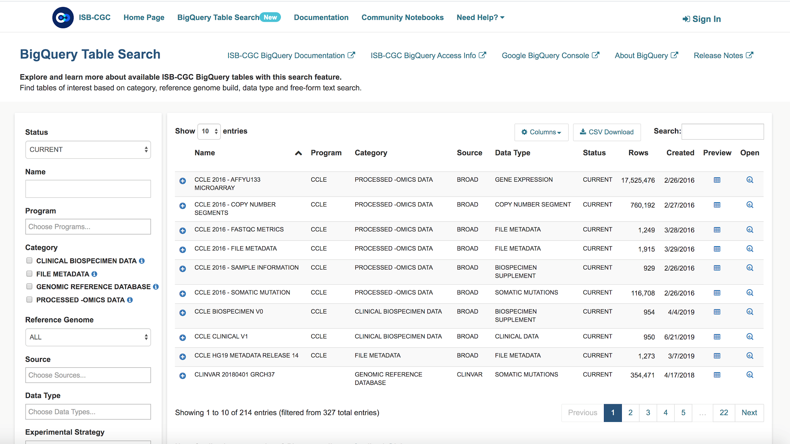

***************************************************
A guided tour of cancer data analysis using ISB-CGC
***************************************************

**Demo Use-Case**

We are interested in analyzing gene expression and protein abundance differences between two types of TCGA kidney cancers, Kidney Renal Clear Cell Carcinoma (KIRC) and Kidney Renal Papillary Carcinoma (KIRP). In this demo, we build our cohort of patients with these cancer types and extract their respective gene expression and protein abundance data all from Google BigQuery. We will demonstrate how to: 

- Identify tables of interest using ISB-CGC BigQuery Table Search UI 
- Navigate to tables and build queries in Google BigQuery Console directly from the ISB-CGC BigQuery Table Search page 
- Link to R notebooks in the Google AI Platform for data interrogation and plot visualization 
- Use Bioconductor packages designed for TCGA data on ISB-CGC BigQuery tables

1)	Navigate to the ISB-CGC homepage: https://isb-cgc.org and click on the BigQuery Table Search.

.. image:: ISB-homepage.png

2)	For this demo, we will search for ISB-CGC hosted BigQuery tables that contain information for TCGA gene expression, protein expression and clinical data. 

3)	We want to build a cohort of TCGA patients for which both gene expression and protein abundance data exists. Let’s search for TCGA in the Program filter and Clinical Data, Gene Expression, and Protein Expression in the Data Type filter. 

4)	We can preview the clinical table and see the table schema by clicking the (+) icon.

.. image:: BQTableSearch-TCGA.png

5)	We can navigate to the Google Cloud Platform (GCP) BigQuery Console by clicking on the “open” button under the table preview or on the “magnifying glass” icon on the right hand side of the Table Search row. 

.. image:: BQTableSearch-Open.png

6)	On the GCP BigQuery Console we can preview the table, look at the schema, and perform queries. The image below shows the preview of the contents of the TCGA Clinical BigQuery table. 

.. image:: BQConsole-TCGA.png

7)	Here’s an example short SQL query that completes in 0.3 seconds to identify how many patients there are with TCGA kidney cancers. SQL query to input: 

.. code-block:: sql

   SELECT distinct (case_barcode)  
   FROM `isb-cgc.TCGA_bioclin_v0.clinical_v1`
   WHERE project_short_name LIKE "TCGA-KIR%"
   
.. image:: BQConsole-Barcodes.png

8)	From here, we’ll use either R or Python to perform higher level analyses. We will be running our notebook in the Google Cloud AI Platform notebook environment. But we have also provided R scripts of the code which can be run in local R environments as well. 

.. image:: AI-Platform.png

9)	Users can create notebook instances in both R or Python. We’ll create our notebook in R. 

.. image:: GCP-Notebooks.png

10)	 The Google Cloud AI platform R notebook environment looks very similar to other Jupyter notebook environments. Users can create interactive R notebooks or simpler R console notebooks. 

.. image:: GCP-R-environment.png

Here’s an example of an interactive R notebook. 

.. image:: GCP-R-notebook.png

