***************************************************
A guided tour of cancer data analysis using ISB-CGC
***************************************************

We are interested in analyzing gene expression and protein abundance differences between two types of TCGA kidney cancers, Kidney Renal Clear Cell Carcinoma (KIRC) and Kidney Renal Papillary Carcinoma (KIRP). In this demo, we build our cohort of patients with these cancer types and extract their respective gene expression and protein abundance data all from Google BigQuery. We will demonstrate how to: 

- Identify tables of interest using ISB-CGC BigQuery Table Search UI 
- Navigate to tables and build queries in Google BigQuery Console directly from the ISB-CGC BigQuery Table Search page 
- Link to R notebooks in the Google AI Platform for data interrogation and plot visualization 
- Use Bioconductor packages designed for TCGA data on ISB-CGC BigQuery tables

1)	Navigate to the ISB-CGC homepage: https://isb-cgc.org and click on the BigQuery Table Search.

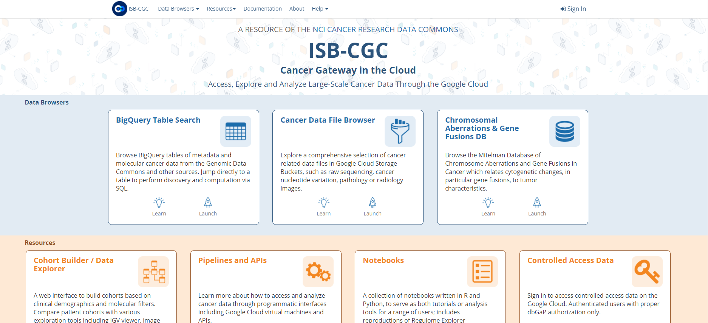

2)	For this demo, we will search for ISB-CGC hosted BigQuery tables that contain information for TCGA gene expression, protein expression and clinical data. We want to build a cohort of TCGA patients for which both gene expression and protein abundance data exists. Let’s search for **TCGA** in the **Program** filter and **Clinical Data**, **Gene Expression**, and **Protein Expression** in the **Data Type** filter. 

To see the table schema of the clinical table, click on the (+) icon.

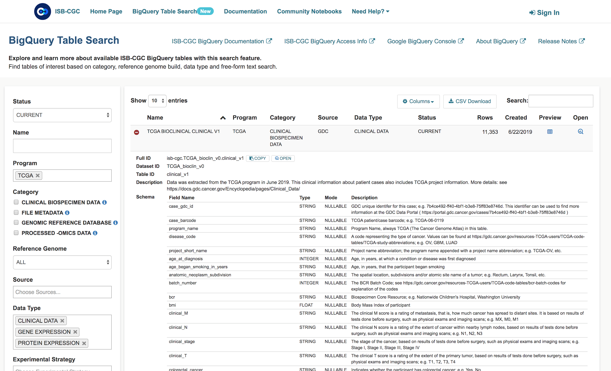

3)	Navigate to the Google Cloud Platform (GCP) BigQuery Console by clicking on the “open” button under the table preview or on the “magnifying glass” icon on the right hand side of the Table Search row. 

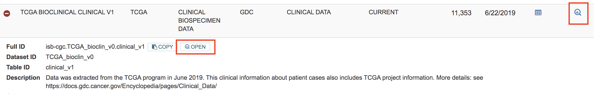

4)	On the GCP BigQuery Console we can preview the table, look at the schema, and perform queries. The image below shows the preview of the contents of the TCGA Clinical BigQuery table. 

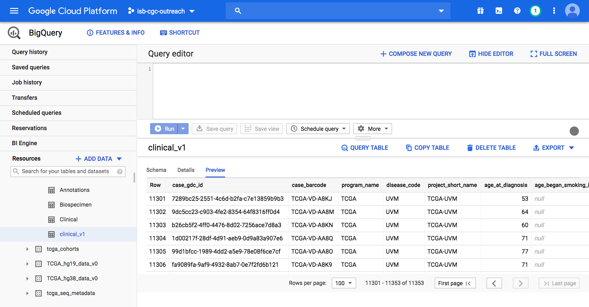

5)	Here’s an example short SQL query that completes in 0.3 seconds to identify how many patients there are with TCGA kidney cancers. 
Enter this SQL query in the BigQuery Console and click Run: 

.. code-block:: sql

   SELECT distinct (case_barcode)  
   FROM `isb-cgc.TCGA_bioclin_v0.clinical_v1`
   WHERE project_short_name LIKE "TCGA-KIR%"
   
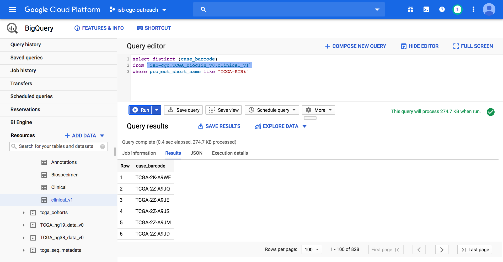

6)	From here, we’ll use either R or Python to perform higher level analyses. We will be running our notebook in the Google Cloud AI Platform Notebooks environment. But we have also provided R scripts of the code which can be run in local R environments as well. 

To use Google Cloud AI Platform Notebooks, on the Google Cloud Platform Navigation menu, select AI Platform -> Notebooks under the Artificial Intelligence section.

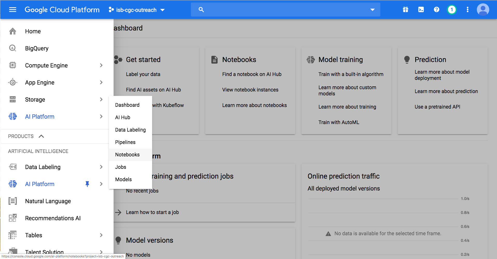

7)	Users can create notebook instances in both R or Python. We’ll create our notebook in R. 

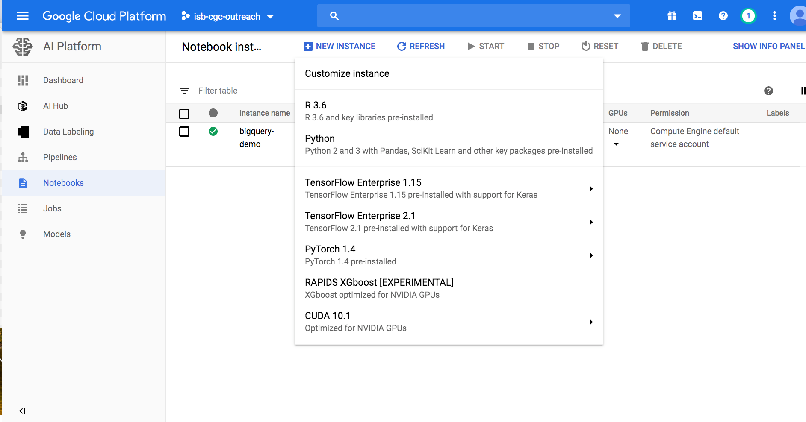

8) The Google Cloud AI platform R notebook environment looks very similar to other Jupyter notebook environments. Users can create interactive R notebooks or simpler R console notebooks. 

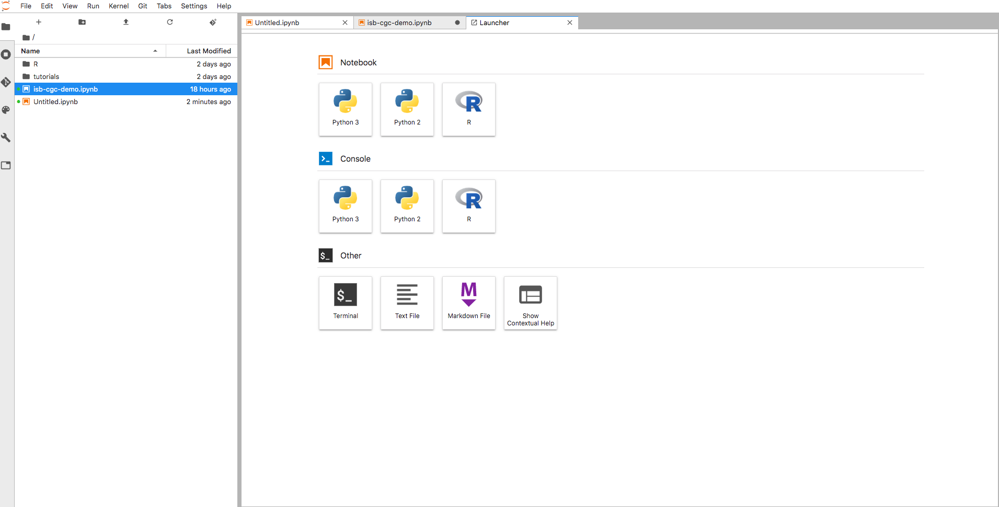

Here’s an example of an interactive R notebook. Click the image to enlarge it.

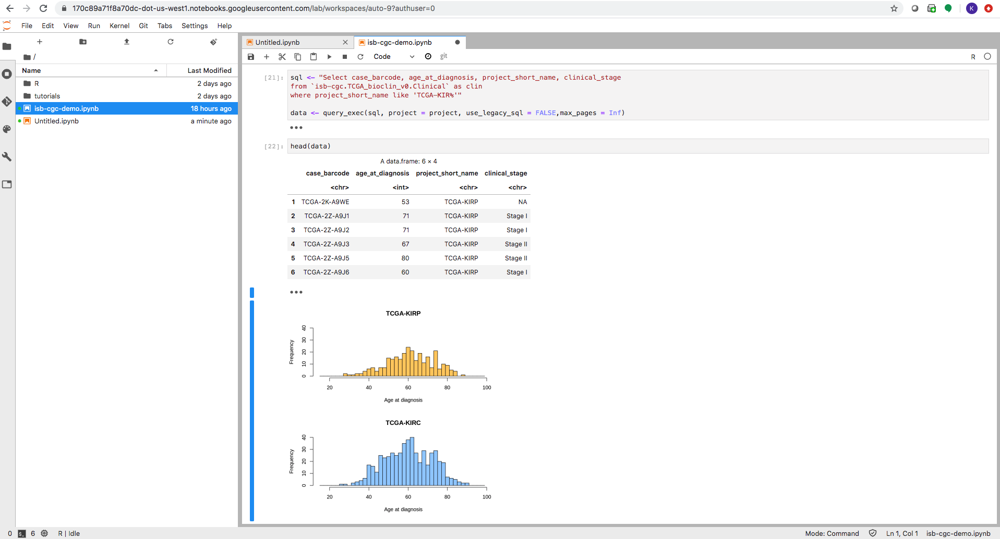

Enter or copy each block into the R terminal. Click **Run** after each block to see the results.

.. code-block:: R

   install.packages("bigrquery")
   library(bigrquery)
   project <- "your project" #Replace with your project name
   
.. code-block:: R

   # Query the clinical table for our cohort.
   # Retrieve Age at Diagnosis and Clinical Stage for Kidney Cancer data.
   sql <- "Select case_barcode, age_at_diagnosis, project_short_name, clinical_stage
           from `isb-cgc.TCGA_bioclin_v0.Clinical` as clin
           where project_short_name like 'TCGA-KIR%'"

   clinical_tbl <- bq_project_query (project, query = sql) #Put data in temporary BQ table
   clinical_data <- bq_table_download(clinical_tbl) #Put data into a dataframe
   head(clinical_data)

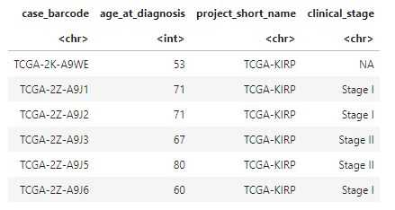

.. code-block:: R

   # Plot two histograms of age of diagnosis data of our cohort.
   layout(matrix(1:2, 2, 1))
   hist(clinical_data[clinical_data$project_short_name == "TCGA-KIRP",]$age_at_diagnosis, 
       xlim=c(15,100), ylim=c(0,40), breaks=seq(15,100,2),
       col="#FFCC66", main='TCGA-KIRP', xlab='Age at diagnosis')

   hist(clinical_data[clinical_data$project_short_name == "TCGA-KIRC",]$age_at_diagnosis, 
       xlim=c(15,100), ylim=c(0,40), breaks=seq(15,100,2), 
       col="#99CCFF", main='TCGA-KIRC', xlab='Age at diagnosis')
       
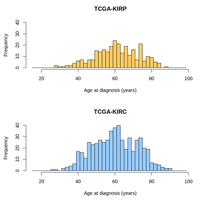

.. code-block:: R

   # Create SQL query to retrieve the mean gene expression and mean protein expression per project/case.
   # Load it into a dataframe.
   sql_expression <- "with gexp as (
       select project_short_name, case_barcode, gene_name, avg(HTSeq__FPKM) as mean_gexp
       from `isb-cgc.TCGA_hg38_data_v0.RNAseq_Gene_Expression`
       where project_short_name like 'TCGA-KIR%' and gene_type = 'protein_coding'
       group by project_short_name, case_barcode, gene_name
   ), pexp as (
       select project_short_name, case_barcode, gene_name, avg(protein_expression) as mean_pexp
       from `isb-cgc.TCGA_hg38_data_v0.Protein_Expression`
       where project_short_name like 'TCGA-KIR%'
       group by project_short_name, case_barcode, gene_name
   )
   select gexp.project_short_name, gexp.case_barcode, gexp.gene_name, gexp.mean_gexp, pexp.mean_pexp 
   from gexp inner join pexp 
   on gexp.project_short_name = pexp.project_short_name 
     and gexp.case_barcode = pexp.case_barcode 
     and gexp.gene_name = pexp.gene_name"

   expression_data <- bq_table_download(bq_project_query (project, query = sql_expression)) #Put data into a dataframe
   head(expression_data)

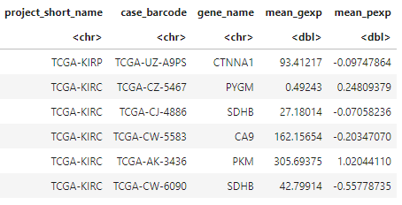

.. code-block:: R

   # Determine the number of cases from each project.
   length(unique(expression_data$case_barcode[expression_data$project_short_name == "TCGA-KIRP"]))
   length(unique(expression_data$case_barcode[expression_data$project_short_name == "TCGA-KIRC"]))

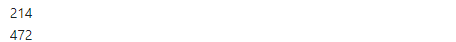

.. code-block:: R

   #Create a dataframe that lists all the cases.
   expression_data$id <- paste(expression_data$project_short_name, expression_data$case_barcode, sep='.')
   cases <- unique(expression_data$id)

   # Transform the expression_data data frame, so that columns are samples, rows are genes.
   list_exp <- lapply(cases, function(case){
       temp <- expression_data[expression_data$id == case, c('gene_name', 'mean_gexp')]
       names(temp) <- c('gene_name', case)
       return(temp)
   })

   gene_exps <- Reduce(function(x, y) merge(x, y, all=T, by="gene_name"), list_exp)
   head(gene_exps)
   dim(gene_exps)

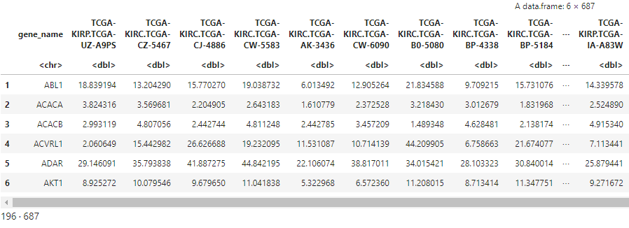

.. code-block:: R

   # Perform the same transform for protein abundance.
     list_abun <- lapply(cases, function(case){
         temp <- expression_data[expression_data$id == case, c('gene_name', 'mean_pexp')]
         names(temp) <- c('gene_name', case)
         return(temp)
     })
     pep_abun <- Reduce(function(x, y) merge(x, y, all=T, by="gene_name"), list_abun)
     head(pep_abun)
     dim(pep_abun)

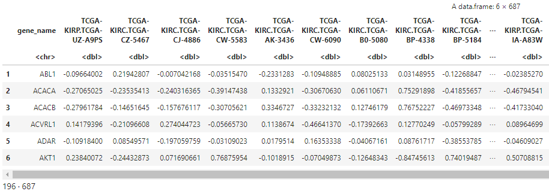

.. code-block:: R

   # Separate the cohorts (types of kidney cancer) into two dataframes and 
   # generate a scatterplot of gene expression and protein abundance.
   # Gene expression first.
   exp_p <- gene_exps[,grep('KIRP', names(gene_exps))]
   exp_c <- gene_exps[,grep('KIRC', names(gene_exps))]
   plot(log(rowMeans(exp_p)), log(rowMeans(exp_c)), 
       xlab='log(FPKM KIRP)', ylab='log(FPKM KIRC)', 
       xlim=c(-3.5,7.5), ylim=c(-3.5,7.5), pch=19, cex=2,
       col=rgb(178,34,34,max=255,alpha=150))
       
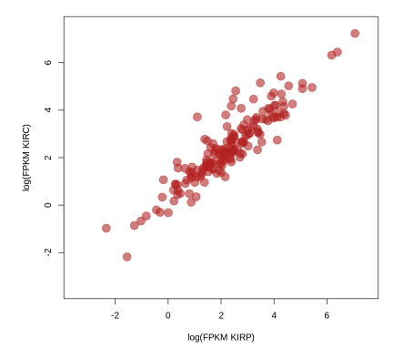

.. code-block:: R

   # Peptide expression second.
   abun_p <- pep_abun[,grep('KIRP', names(pep_abun))]
   abun_c <- pep_abun[,grep('KIRC', names(pep_abun))]
   plot(rowMeans(abun_p), rowMeans(abun_c), 
      xlab='KIRP protein abundance', ylab="KIRC protein abundance", 
      xlim=c(-0.25,0.3), ylim=c(-0.25,0.3), pch=19, cex=2,
      col=rgb(140,140,230,max=255,alpha=150))
      
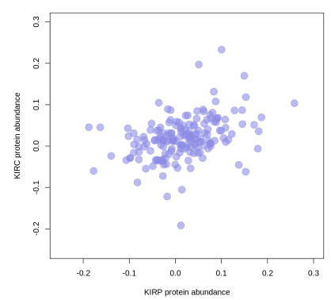

.. code-block:: R

   # load the Bioconductor package maftools
   install.packages("maftools")
   library("maftools")

.. code-block:: R

   # Use BigQuery to load maf data for our cancers of interest.
   sql_kirc<-"SELECT Hugo_Symbol, Chromosome, Start_Position, End_Position, Reference_Allele, 
   Tumor_Seq_Allele2, Variant_Classification, Variant_Type, sample_barcode_tumor FROM 
   `isb-cgc.TCGA_hg38_data_v0.Somatic_Mutation` WHERE project_short_name = 'TCGA-KIRC'"

   sql_kirp<-"SELECT Hugo_Symbol, Chromosome, Start_Position, End_Position, Reference_Allele, 
   Tumor_Seq_Allele2, Variant_Classification, Variant_Type, sample_barcode_tumor FROM 
   `isb-cgc.TCGA_hg38_data_v0.Somatic_Mutation` WHERE project_short_name = 'TCGA-KIRP'"

   maf_kirc <- bq_table_download(bq_project_query (project, query = sql_kirc)) #Put data into a dataframe
   maf_kirp <- bq_table_download(bq_project_query (project, query = sql_kirp)) #Put data into a dataframe

   colnames(maf_kirc)[9] <- "Tumor_Sample_Barcode"
   colnames(maf_kirp)[9] <- "Tumor_Sample_Barcode"

   head(maf_kirc)
   head(maf_kirp)
   
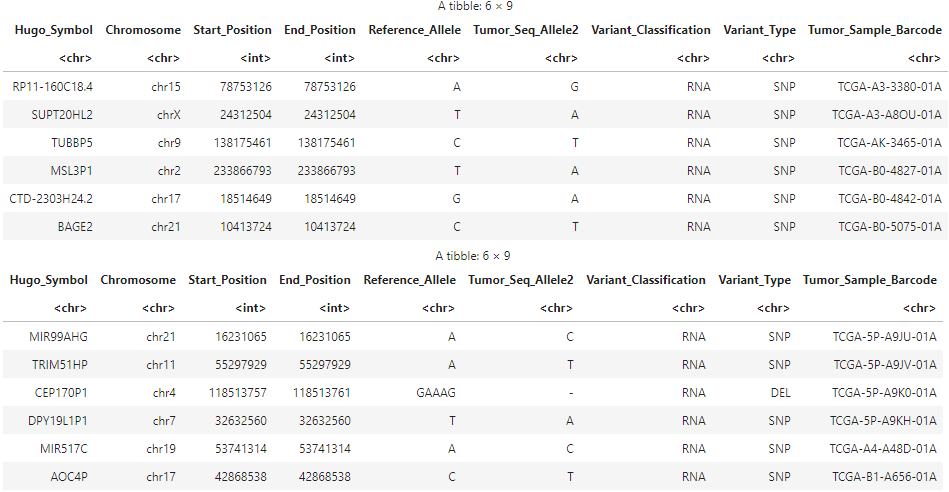

.. code-block:: R

   # Convert data frames to maftools objects.
   kirc <- read.maf(maf_kirc)
   kirp <- read.maf(maf_kirp)
   # Leverage maftools plotting functionality.
   plotmafSummary(maf = kirp, rmOutlier = TRUE, addStat = 'median', dashboard = TRUE, titvRaw = FALSE)
   plotmafSummary(maf = kirc, rmOutlier = TRUE, addStat = 'median', dashboard = TRUE, titvRaw = FALSE)

.. image:: plotmafSummary-kirp.png
   :scale: 35
   :align: center

.. code-block:: R

   oncoplot(maf = kirp, top = 10)
   oncoplot(maf = kirc, top = 10)

Here is the oncoplot for Kidney Renal Papillary Carcinoma.

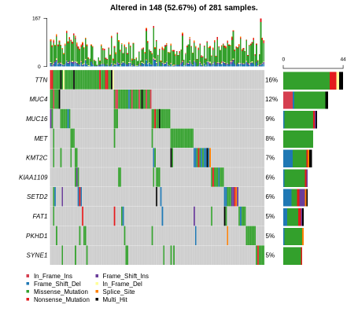

