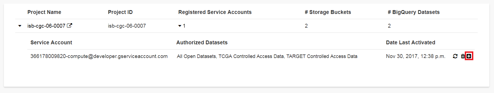
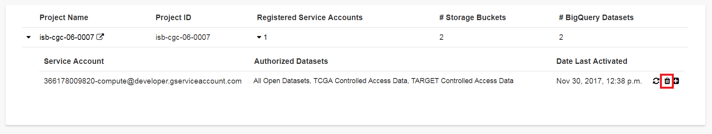

----------------------------------------------------
Registering a Google Cloud Project & Service Account
----------------------------------------------------
This section will show you how to register a Google Cloud Project (GCP) and a Service Account for the GCP, thereby gaining access to controlled data which you can use programmatically. Users need to have access to a Google Cloud Project to perform the steps in this section. If you don't, see the the  `ISB-CGC Quick-Start Guide <../HowToGetStartedonISB-CGC.html>`_.

GCP projects are automatically configured with a "Compute Engine default service account" which you can find on the
`IAM & Admin page <https://console.cloud.google.com/iam-admin/iam/project>`_ of the `Cloud Console <https://console.cloud.google.com/home/dashboard>`_.  When running on a Google Compute Engine (GCE) virtual machine (VM), a service account associated with your Google Cloud Project (GCP) is acting on your behalf and those are the credentials being
used rather than your personal credentials.  

In order for this **service account** to access controlled data, you must register it with ISB-CGC. Once this process has completed successfully, this service account will be able to access controlled data for up to seven days. If the service account (*ie* any program running on a VM using the service account's credentials) tries to access controlled data
after the seven day expiration, it will get an Access Denied error. To prevent this from causing problems with long-running jobs, you can extend access by another seven days (see below).

To allow flexibility while working with different research teams and different processes, you can have many GCPs registered with ISB-CGC, as well as many service accounts registered per GCP.

Requirements for Registering a Google Cloud Project Service Account
--------------------------------------------------------------------
To be able to register your GCP and at least one service account to access controlled data, the following must all be true:

.. list-table:: 

   * - You must have the role of "owner" on the Google Cloud Project, because you will need to add an ISB-CGC service account as a new project member and a DCF service account as a new project member. The screenshots below will show you how to add these service accounts to your project:
        - ISB-CGC service account -- 907668440978-oskt05du3ao083cke14641u35deokgjj@developer.gserviceaccount.com
        - DCF service account --  fence-service@dcf-prod.iam.gserviceaccount.com
        
   * - ALL members of the Google Cloud project:
        - Must be authorized to use the data set; that is, each of them must be a registered dbGaP "PI" or "downloader". (See dbGap Data Access `Request Portal <http://dbgap.ncbi.nlm.nih.gov/aa/wga.cgi?login=&page=login>`_, and `Understanding Data Security <http://isb-cancer-genomics-cloud.readthedocs.org/en/latest/sections/data//TCGA_Data_Security.html>`_ for more details).
        - Must have `linked their NIH/eRA identity to their Google identity <Controlled-data-Interactive.html>`_ via the ISB-CGC Web App, and therefore have been authenticated *at least once*.
        
   * - The Google Cloud project:     
         - Cannot be associated with an Organization.
         - Cannot have Google Groups or other multi-member identifiers (e.g. all authenticated Google users) which have been provided with a project role
         - Must have the ISB-CGC monitoring service account (SA) assigned to an Editor role. (See instructions below.)
   
   * - Service Accounts on the GCP:   
         - All SAs with roles in the project must belong to the project, with the exception of the ISB-CGC monitoring SA; this means that all Google-managed SAs with project roles must belong to the project as well
         - The SA you are registering cannot be the ISB-CGC monitoring SA, or SAs from other projects
         - You have not created any keys for any SAs in the project
         - No IDs have been assigned roles on any SAs in the project

If any of these requirements are not met, your GCP and any associated service accounts will **not** be able to access controlled data.  An automated email will be sent to the GCP project owner(s) if data access is revoked.

Registering your Google Cloud Project Service Account
--------------------------------------------------------------
Click on screen shots to enlarge them.

To register your Google Cloud Project and its service account with ISB-CGC, go to the Account Details page. After signing into the ISB-CGC Web App, 
either select the "persona" icon next to your login name or select **Account Details** from the drop down menu under your login name, 
which takes you to the following page:

.. image:: ../webapp/RegisteredGCPs.png
   :scale: 35
   :align: center
   
Click the **Register** button in the Google Cloud Platform section.  That takes you to the following page:

.. image:: ../webapp/RegisterAGCPForm.png
   :scale: 35
   :align: center
   
The instructions will walk you through how to add the necessary ISB-CGC and DCF service accounts to your project. Go to the `Google Cloud Platform <https://console.cloud.google.com/>`_ and follow these steps.
You can hide the instructions by selecting the blue **Instructions** button.  

Please be sure to add both service accounts listed below. If you don't add both service accounts you will run into issues viewing the controlled data in ISB-CGC.
Then return to the ISB-CGC Register a Google Cloud Project page, enter your Google Cloud Project ID and, click **Verify**.

.. image:: ../webapp/RegisterServiceAccountsList.png
   :scale: 35
   :align: center

Once you have completed these steps, a listing of the Google Cloud Project members will display:

   
Click the **Register** button to go to the next screen:

.. image:: ../webapp/0007projectregistered.PNG
   :scale: 35
   :align: center
   
Select **Register Service Account** from the drop down menu on the left of the GCP to which you want to add a service account.  By default, there will be the 
Compute Engine Default service account in the **Enter the service account ID** text box (see screenshot below).  Under **Which dataset(s) would you like to use?**, select the programs for which you would like to have controlled access.

.. image:: ../webapp/RegisterAServiceAccountFirstScreen.PNG
   :scale: 35
   :align: center

If you receive the error message listed below, this signifies you need to enable the Default Compute Engine API for your Google Cloud Project.  
For more information on how to enable all the API's you will need to work on a Google Cloud Project please go
`here <https://isb-cancer-genomics-cloud.readthedocs.io/en/latest/sections/DIYWorkshop.html#enabling-required-google-apis>`_.

.. image:: ../webapp/EnableComputeEngineError.PNG
   :scale: 30
   :align: center

Once you click the **Verify Service Account Users** at the bottom of the page, you will be presented with multiple lists. You will be presented with the
Verification Results, Google Cloud Project User ISB-CGC Registration and Identity Linkages, Dataset Permissions Verification, Registered Service Account Verification
Results, Google Cloud Project Verification Results, and the Google Cloud Project Service Account Verification Results (see screenshots below). 
All columns must have a green checkmark in them for each user before your service account can be registered.

.. image:: ../webapp/ServiceAcctRegTable.png
   :scale: 30
   :align: center
   
.. image:: ../webapp/ServiceAcctRegTable2.png
   :scale: 30
   :align: center

If all the requirements for registering a service account are met, the account will be registered for controlled access.  If not, the service account can only use
open access data.  View the registered data set name by selecting the drop down menu next to the number of service accounts (see below).

.. image:: ../webapp/ServiceAcctRegSuccess.png
   :scale: 30
   :align: center

Managing your Google Cloud Projects & Service Accounts
---------------------------------------------------
Once your GCP and Service Account are registered, you can add or remove additional service accounts by following the instructions below.
You can also extend the use of a service account for another seven days, or reauthorize a service account after you have corrected errors that
previously caused it to have its permissions revoked.

Adding additional Google Cloud Projects
~~~~~~~~~~~~~~~~~~~~~~~~~~~~~~~~~~~~~~~~~~~
To register additional Google Cloud Projects, select the **+ Register New Google Cloud Project** button from the "Registered Google Cloud Projects" page (see screenshot below).

.. image:: ../webapp/RegisterAnotherGCP.PNG
   :scale: 35
   :align: center

Deleting Google Cloud Projects
~~~~~~~~~~~~~~~~~~~~~~~~~~~~~~~~~~~~
To unregister a GCP, select the **Unregister Project** button from the drop down menu beside the project on the "Registered Google Cloud Projects" page (see screenshot below).

.. image:: ../webapp/UnregisterAGCP.PNG
   :scale: 35
   :align: center

Adding additional service accounts to a Google Cloud Project
~~~~~~~~~~~~~~~~~~~~~~~~~~~~~~~~~~~~~~~~~~~~~~~~~~~~~~~~~~~~~~~~~~~~~~~~~
To add additional service accounts to a GCP, select **Register Service Account** from the drop down menu beside the project (see screenshot below). 

.. image:: ../webapp/0007projectregistered.PNG
   :scale: 35
   :align: center

Adjusting a Service Account using the Adjust Service Account page
~~~~~~~~~~~~~~~~~~~~~~~~~~~~~~~~~~~~~~~~~~~~~~~~~~~~~~~~~~~~~~~~~~~~
Add or remove a controlled data set from one specific service account using this feature. Selecting the drop down menu next to the number of service accounts to view 
the service account names, then select the plus "+" sign icon next to the trash can (see screenshot below).

Deleting Service Accounts from Google Cloud Projects
~~~~~~~~~~~~~~~~~~~~~~~~~~~~~~~~~~~~~~~~~~~~~~~~~~~~~~~~~~~
To delete a service account from a GCP (not allowing it to be used for programmatic access to controlled data), click the "trash can" icon beside the service account
(see screenshot below).

Extending Your Service Account Access by Seven Days 
~~~~~~~~~~~~~~~~~~~~~~~~~~~~~~~~~~~~~~~~~~~~~~~~~~~~~~~~
Once you have registered a Service Account, you have seven days before the access is automatically revoked.  To extend the service account access for another seven days
(*e.g.* if your program is still running), select the "refresh" icon beside the service account (see screenshot below).

.. image:: ../webapp/RefreshServiceAccount.png
   :scale: 40
   :align: center

Reauthorizing a Google Cloud Project(s) Service Account(s)
~~~~~~~~~~~~~~~~~~~~~~~~~~~~~~~~~~~~~~~~~~~~~~~~~~~~~~~~~~~~~~~~~~~~~~~~~
Your service account may have its permissions revoked (because, for example, the 7-day limit has expired, or you have added a member to the GCP who is not
authorized to use that controlled data). If permissions were revoked because an unauthorized user was added to the project,  
the Google Cloud Project owner will be sent an email specifying the Service Account, GCP Project, and the user who caused access to be revoked. 

To reauthorize the service account: 
1) Remedy the problem that resulted in access being denied, and
2) Select the "adjust" icon beside the service account (see screenshot below) and add the controlled datasets to the service account.

Google Cloud Project Associated to an Organization Will NOT Work with controlled data
~~~~~~~~~~~~~~~~~~~~~~~~~~~~~~~~~~~~~~~~~~~~~~~~~~~~~~~~~~~~~~~~~~~~~~~~~~~~~~~~~~~~~
If your Google Cloud Project is associated to an organization, you will be unable to register the service account to controlled data.  An error message
similar to this one will display: "GCP cgc-08-0126 was found to be in organization ID 8784632854871; its service accounts cannot be registered for use with
controlled data."  This is mainly because ISB-CGC cannot see the permissions associated to the organization's project; therefore, it is considered a security risk.
We are currently working with Google to resolve this issue.

.. image:: ../webapp/OrganizationFound.PNG
   :scale: 45
   :align: center

