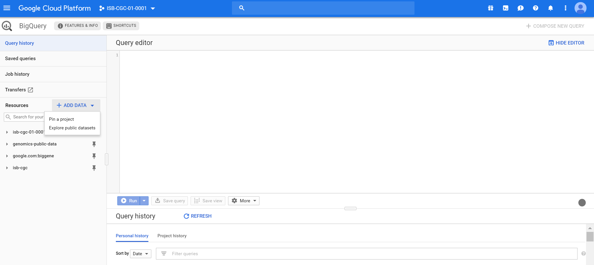
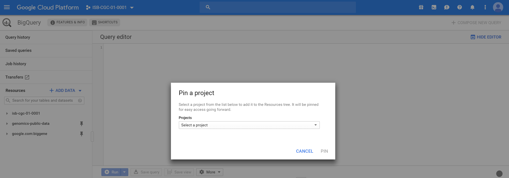
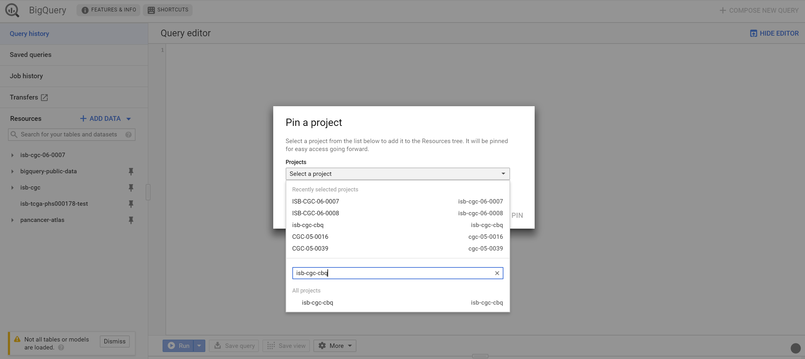
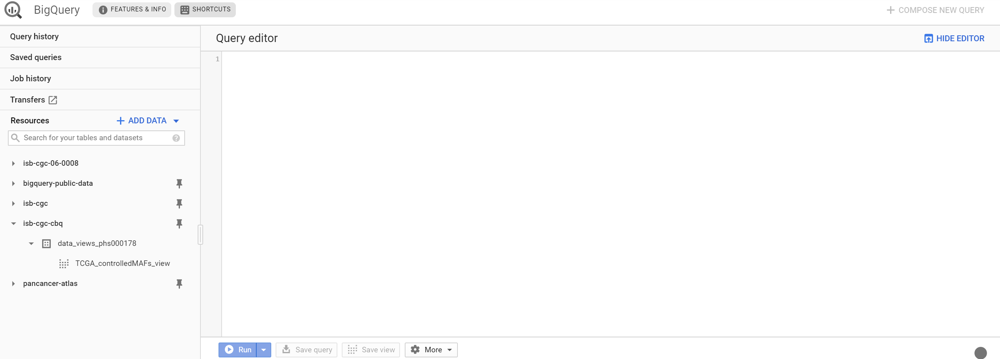

-----------------------------------------------
How to link your NIH/eRA & Google identities
-----------------------------------------------

This section shows you how to associate your Google identity to your NIH or eRA identity through the Web App. (Your NIH/eRA identity is the one associated
with dbGaP, authorizing you to work with controlled data.) This is a necessary step for gaining access to controlled data. When you are done, you'll be able to access controlled
data via your personal user credentials. If you are looking to access controlled data via a service account, this is a prerequisite step.

At the bottom of this section, there are also instructions for pinning the ISB-CGC controlled access BigQuery project "isb-cgc-cbq" to your Google BigQuery Console.

Some screenshots can be enlarged by clicking on them.
 
To link your NIH/eRA identity with your Google identity (the Google account you use to login to the ISB-CGC system), 
select the "persona" icon next to your login name after you have signed in to the ISB-CGC Web App. 
Or, you can click on the drop down menu next to your name, and click on **Account Details**.

You will then see the following page:

.. image:: ../webapp/AccountDetails.png
   :scale: 40
   :align: center

Click the **Associate with eRA Account** button.

.. image:: ../webapp/AssociateWithERA.png
   :align: center

You will see a pop up describing all the steps needed to link your Google identy (email address) to your NIH identity via the Data Commons Framework (DCF).
In this case, 'NIH identity' also refers to your eRA Commons account identity. Click on the **Go to DCF** button.

.. image:: ../webapp/LinkNIHIDInstructions.png
   :align: center

You will then be redirected to an NIH login page, in order to be authenticated by NIH:

.. image:: ../webapp/NIHLogin.png
   :align: center

If you have an eRA identification, use your eRA Commons username and password to log in.  
If you have an NIH PIV card, use the Smart Card Login.  

Once you have been authenticated by NIH, and your NIH identity has been verified to be on
the current dbGaP whitelist, you will have access to controlled data for 24 hours.  

.. image:: ../webapp/GEN3-DCF-RAS.png
   :align: center
   
Select the **Yes, I Authorize** button at the bottom right of the page to authorize the Data Commons Framework to associate your Google identity with controlled data.

When presented with a "Sign in with Google" page, select the email that you used when you logged into the ISB-CGC web application.

You will be redirected back to the ISB-CGC Web App. A Warning Notice displays, indicating that you must abide by the rules and regulations provided by the DUCA Use Agreement. In the **Data Access** panel, it will indicate "dbGaP Access Authorized".  

.. image:: ../webapp/DataAccess-WarningMsg.png
   :scale: 40
   :align: center

Note that the ISB-CGC system will enforce a one-to-one relationship between NIH/eRA identities and Google identities.  In other words, a single NIH or eRA identity may not be used to gain access to controlled data by multiple, different Google identities.

Unlink Google identity from NIH/eRA identity
--------------------------------------------

If you need to *unlink* your eRA account from your Google account (for example if you want to change which Google identity you use to sign in to the ISB-CGC platform), you may do so by clicking on the **Unlink** button below "<GoogleID> is linked to NIH identity <NIH/eRA Commons ID>".

.. image:: DataAccessPanel.png
   :align: center

In the unusual circumstance that your NIH identity has been registered with another Google identity (*eg* with another Google identity that you have), you will see a message, "You tried to link your email address to NIH account <username>, but it is already linked to <Google identity email address>."
   
If this happens, please sign in with that other Google identity and "unlink" your NIH/eRA account from that identity, as described above.  You will then be able to register your NIH/eRA account with the desired Google identity.  
If you are not able to resolve the issue, contact us at feedback@isb-cgc.org and we will help you resolve it.   

Extending Your Access by 24 hours 
-----------------------------------
If you need to extend your access to controlled data for another 24 hours from now (*eg* if you have a compute job which is using these Google credentials to access 
controlled data and it is still running), click the **Extend** button on the Data Access panel on the Account Details screen (pictured above).
Your access will be extended by 24 hours from the time that you click the button. 

Linking controlled access data to your Google BigQuery Console
-----------------------------------------------------

To obtain access to the ISB-CGC project tables in BigQuery you must link these tables to your project so that they will show up in the left panel of your BigQuery web UI. 

When you access BigQuery from your Google Cloud Platform Console (see `here <../progapi/bigqueryGUI/HowToAccessBigQueryFromTheGoogleCloudPlatform.html>`_ for more information on this), you will be presented with the following page:

The blue arrow will produce a drop down list; select 'Switch to Project'; then click 'display project...'

You will then be presented with the following page:

As shown in the image below you will need to type in "isb-cgc-cbq" in the project id and then click okay. The BigQuery project "isb-cgc-cbq" contains the ISB-CGC controlled access data which is stored in BigQuery tables.

Once this has been completed you will be able to the appropriate controlled access ISB-CGC BigQuery data sets on the left hand side (see screenshot below).

