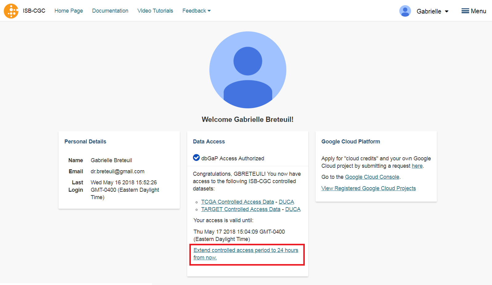

-----------------------------------------------
How to linking your NIH/eRA & Google identities
-----------------------------------------------

This section shows you how to associate your Google identity to your NIH or eRA identity through the Web App. (Your NIH/eRA identity is the one associated
with dbGaP, authorizing you to work with controlled data.) This is a necessary step for gaining access to controlled data.

Click on screen shots to enlarge them.

To link your NIH/eRA identity with your Google identity (the Google account you use to login to the ISB-CGC system), 
select the "persona" icon next to your login name (A in the image below) after you have signed in to the ISB-CGC Web App. 
Or, you can click on the drop down menu next to your name, and click on **Account Details**.

.. image:: ../webapp/personaeicon-NIHLoginAssoc.png
   :scale: 50
   :align: center

You will then see the following page:

.. image:: ../webapp/NIHAssociationPage.png
   :scale: 30
   :align: center

Click the **Associate with eRA Commons Account** link.

You will see a pop up describing all the steps needed to link your NIH Identity to the Data Commons Framework (DCF).
In this case, 'NIH Identity' also refers to your eRA Commons account identity.

Click on the **Go to DCF** button.

You will then be redirected to an NIH login page, in order to be authenticated by NIH:

.. image:: ../webapp/iTrust.png
   :scale: 30
   :align: center

If you have an eRA identification, use this to sign in through panel A (see example above).  
If you have an NIH PIV card, use that to sign in through panel B on this page (see above).  

Once you have been authenticated by NIH, and your NIH identity has been verified to be on
the current dbGaP whitelist, you will have access to controlled data for 24 hours.  

.. image:: ../webapp/Gen3authPage.PNG
   :scale: 30
   :align: center
   
Select the **Yes, I Authorize** button at the bottom right of the page to authorize the Data Commons Framework to associate your Google identity with controlled data.

.. image:: ../webapp/datacommons.ioLogIn.PNG
   :scale: 30
   :align: center

To finalize the authorization, select the email you used when you logged into the ISB-CGC web application.

You are redirected back to the ISB-CGC Web App. A Warning Notice displays, indicating that you must abide by the rules and regulations provided by the DUCA Use Agreement. In the **Data Access** panel, it will indicate "dbGaP Access Authorized".  

.. image:: ../webapp/warningNotice.png
   :scale: 30
   :align: center

Note that the ISB-CGC system will enforce a one-to-one relationship between NIH/eRA identities
and Google identities.  In other words, a single NIH or eRA identity may not be used to
gain access to controlled data by multiple, different Google identities.

Unlink Google identity from NIH/eRA identity
--------------------------------------------

If you need to *unlink* your eRA account from your Google account (for example if you want to
change which Google identity you use to sign in to the ISB-CGC platform), you may do so by
clicking on "Unlink <GoogleID> from the NIH identity <eRA Commons ID>".

.. image:: DataAccessPanel.png
   :align: center

In the unusual instance that your NIH identity has been registered with another Google identity 
(*eg* with another Google identity that you have), you will see the screen below:

.. image:: ../webapp/eRAlinkedtoAnotherGoogle.png
   :scale: 30
   :align: center
   
If this happens, please sign in with that other account and "unlink" your NIH/eRA from that account
(see description above).  You will then be able to register your NIH/eRA account with the desired Google identity.  
If you are not able to resolve the issue, contact us at feedback@isb-cgc.org and we will help you resolve it.   

Extending Your Access by 24 hours 
-----------------------------------
Once you have received permission to view controlled access data, your user login page will look 
like the screenshot below. If you need to extend your access to controlled data for another 24 
hours from now (*eg* if you have a compute job which is using these Google credentials to access 
controlled data and it is still running), select the link "Extend controlled access 
period to 24 hours from now" (red box on figure below).  
Your access will be extended by 24 hours from the time that you push the link. 

