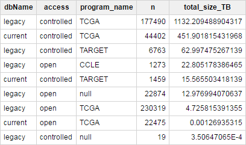

*****************
NCI-GDC Overview
*****************

The `NCI's Genomic Data Commons <https://gdc.cancer.gov/>`_ 
(NCI-GDC) provides the cancer research community with a 
unified data repository that enables data sharing across cancer genomic studies in 
support of precision medicine.

The `NCI-GDC Data Portal <https://portal.gdc.cancer.gov/>`_ allows users to search for
and download data directly via your web browser or using the 
`NCI-GDC Data Transfer Tool <https://gdc.cancer.gov/access-data/gdc-data-transfer-tool>`_.
So-called "legacy" data that the NCI-GDC "inherited" from previous data coordinating
centers (*eg* the TCGA-DCC and CGHub), is available in the 
`Legacy Archive <https://portal.gdc.cancer.gov/legacy-archive/search/f>`_, while a 
`"harmonized" <https://gdc.cancer.gov/about-data/gdc-data-harmonization>`_ 
data set (re-aligned to GRCh38/hg38 and re-processed by the NCI-GDC) is available
at the main `Data Portal <https://portal.gdc.cancer.gov/>`_.  (We will generally
refer to the harmonized/default archive available from the main NCI-GDC Data Portal
as the "current" archive.)

The ISB-CGC is hosting much of this data (both "legacy" and "harmonized" in
Google Cloud Storage (GCS), meaning that you may *not* need to download any
data from the NCI-GDC if you're planning on running your analyses on the Google
Cloud Platform.  These tables can be previewed and queried conveniently and
interactively from the `BigQuery web UI <https://bigquery.cloud.google.com>`_
or from scripting languages such as **R** and **Python**, or from the command-line using the 
`cloud SDK <https://cloud.google.com/sdk/>`_ utility **bq**.  If you have used the NCI-GDC portal to create cohorts or filelists, you can follow `these tutorials <../GDCTutorials/FromGDCtoISBCGC.html>`__ to bring that information into ISB-CGC for use.

In order to help users determine which data at the NCI-GDC is available on the
ISB-CGC platform, we have created a set of metadata tables in BigQuery
(based on `NCI-GDC Data Release 8.0 <https://docs.gdc.cancer.gov/Data/Release_Notes/Data_Release_Notes/>`_)
in the `isb-cgc:GDC_metadata <https://bigquery.cloud.google.com/dataset/isb-cgc:GDC_metadata>`_ dataset:

- `rel8_caseData <https://bigquery.cloud.google.com/table/isb-cgc:GDC_metadata.rel8_caseData>`_:  contains a complete list of all 17268 cases existing in either the legacy or current archives.  The following query, for example will return a count of the number of cases by program, together with the number of data files for those cases in the two archives:

.. code-block:: sql

   SELECT
     project__program__name AS program,
     COUNT(*) AS numCases,
     SUM(legacy_file_count) AS totLegacyFiles,
     SUM(current_file_count) AS totCurrentFiles
   FROM
     `isb-cgc.GDC_metadata.rel8_caseData`
   GROUP BY
     project__program__name
   ORDER BY
     numCases DESC

..

   =======   ========   ==============   ===============
   program   numCases   totLegacyFiles   totCurrentFiles
   =======   ========   ==============   ===============
   TCGA        11315       4000803           351699
   TARGET       5003         19042            12491
   CCLE          950          1273                0
   =======   ========   ==============   ===============
   
   (Note that some files contain data from *multiple* cases, and these types of files will be counted multiple times in the above query on this case-oriented table, resulting in an over-count of the number of unique files.)

- `rel8_fileData_current <https://bigquery.cloud.google.com/table/isb-cgc:GDC_metadata.rel8_fileData_current>`_: contains a complete list of the 274724 files in the current archive (268541 TCGA files and 6183 TARGET files)

.. code-block:: sql

   SELECT
     cases__project__program__name AS program_name,
     experimental_strategy,
     data_category,
     data_format,
     data_type,
     COUNT(*) AS numFiles,
     SUM(file_size)/1000000000 AS totFileSize_GB
   FROM
     `isb-cgc.GDC_metadata.rel8_fileData_current`
   GROUP BY
     1, 2, 3, 4, 5
   ORDER BY
     totFileSize_GB DESC

..

   results of this query can be viewed 
   `here <https://docs.google.com/spreadsheets/d/1GOGPnRpmHn8iGfMabUpC5MZfxOXvcfqq8aVBBve5r9c/edit?usp=sharing>`_. 
   The top three rows in the result are the TCGA WXS, TCGA RNA-Seq, and TARGET WXS BAM files, 
   which total approx 350 TB, 100 TB, and 10 TB respectively.

- `rel8_fileData_legacy <https://bigquery.cloud.google.com/table/isb-cgc:GDC_metadata.rel8_fileData_legacy>`_: contains a complete list of the 805907 files in the legacy archive (718064 TCGA files, 10154 TARGET files, 1273 CCLE files, and 76416 files which are not currently linked to any program or project -- 15386 of these are controlled-access files with the TCGA dbGaP identifier, and the remaining 61030 open-access files include ~17k coverage WIG files, ~12k diagnostic SVS images, ~11k clinical/biospecimen xml files).  The results of the same query as above (but directed at this table) can be viewed `here <https://docs.google.com/spreadsheets/d/1DoyyazK2scq3usp9m48R2-Fc-DJ2aWTVy2-XafNxr3Q/edit?usp=sharing>`_.  The top two rows in the result are the TARGET and TCGA WGS BAM files, totaling over 600 TB and 500 TB respectively. 

..

- `rel8_aliquot2caseIDmap <https://bigquery.cloud.google.com/table/isb-cgc:GDC_metadata.rel8_aliquot2caseIDmap>`_: is a "helper" table in case you need to be able to map between identifiers at different levels.  A total of 164911 unique aliquots are identified in this table.  The intrinsic hierarchy is program > project > case > sample > portion > analyte > aliquot.  We use the term "barcode" where the NCI-GDC uses the term "submitter id", "gdc_id" for the NCI-GDC's uuid-style identifier.  If a portion was not further divided into analytes or if an analyte was not further divided into aliquots, some of the fields in this table may simply have the string "NA".  For example, this query for a single TCGA case will return 24 rows of results for 2 unique samples, 1 portion from each sample, 5 analytes from the tumor sample and 3 analytes from the blood-normal sample, and finally 24 unique aliquots total.

.. code-block:: sql

   SELECT
     *
   FROM
     `isb-cgc.GDC_metadata.rel8_aliquot2caseIDmap`
   WHERE
     case_barcode="TCGA-23-1029"
   ORDER BY
     aliquot_barcode

..

- `rel8_slide2caseIDmap <https://bigquery.cloud.google.com/table/isb-cgc:GDC_metadata.rel8_slide2caseIDmap>`_:  is another very similar "helper" table, but for the tissue slide data.  A total of 18682 slide identifers are included.  In this table the hierarchy is program > project > case > sample > portion > slide.

..

- `rel8_GDCfileID_to_GCSurl <https://bigquery.cloud.google.com/table/isb-cgc:GDC_metadata.rel8_GDCfileID_to_GCSurl>`_: is the table to use to determine whether and where a particular NCI-GDC file is available in Google Cloud Storage (GCS).  Between the two NCI-GDC archives (legacy and current), there are over one million files.  Of these, over 500000 files, totaling over 1700 TB, are available in ISB-CGC buckets in GCS.  This `SQL query <https://gist.github.com/smrgit/b7177d455a04c1bf70a2d910223c9000>`_, for example, can be used to get summaries of the NCI-GDC data that is available in GCS (sorted according to the total size in TB):

..

   Let's take a closer look
   (`SQL <https://gist.github.com/smrgit/f2eca7b6009598b543d6bfaf4205efa3>`_)
   at the large number of open-access files that are *not* available 
   in GCS, looking specifically at files where the ``data_format`` is either ``TXT`` or ``TSV``
   and see what types of data that represents.  The complete results of this query can be found
   `here <https://docs.google.com/spreadsheets/d/1wV1nf5KXTHCMgRxkAWyJ_d4VKhMNjFbDmLyJRzJgMwA/edit?usp=sharing>`_.

   Much of this type of data is provided by ISB-CGC in BigQuery tables rather than
   the raw flat files, where the data is more easily explored using Standard SQL
   backed a massively-parallel analytics engine and also accessible from R or Python.
   Fore more details, please see our 
   `Data in BigQuery <http://isb-cancer-genomics-cloud.readthedocs.io/en/latest/sections/data/data2/data_in_BQ.html>`_ 
   section.

   Conversely, if we take a `look <https://docs.google.com/spreadsheets/d/1Nmd99sFbZ8GUrumZ4Y831kIqIrxBp3_EmDGaJr7lqKE/edit?usp=sharing>`_ 
   at data that is *not* available in GCS, and is *not* of
   the ``TXT`` or ``TSV`` type which would be amenable to putting into BigQuery tables.
   We find that the single largest category of data at the NCI-GDC which is not currently 
   available in any ISB-CGC buckets consists "raw" Methylation array data, DNA-Seq coverage (WIG) files,
   "raw" Protein expression array data, clinical  pathology reports, etc.
   
   Please let us know if there are any important data sets at the GDC that you would like to 
   see made available in ISB-CGC cloud buckets.

