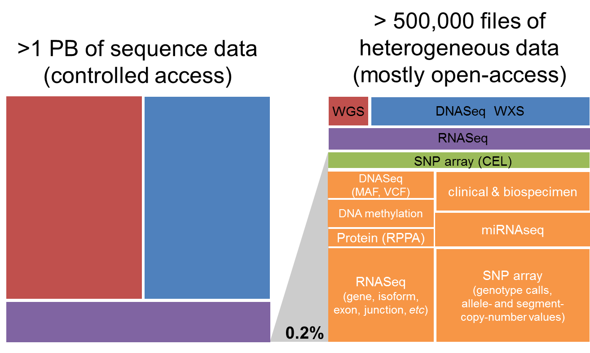

*******************
About the TCGA Data
*******************

The ISB-CGC hosts approximately 1 petabyte of TCGA_ data in Google Cloud
Storage (GCS_) and in BigQuery_.  

.. _TCGA: http://cancergenome.nih.gov/
.. _GCS: https://cloud.google.com/storage/
.. _BigQuery: https://cloud.google.com/bigquery/

The ISB-CGC platform is one of NCI's 
`Cancer Genomics Cloud Pilots <https://cbiit.nci.nih.gov/ncip/nci-cancer-genomics-cloud-pilots/nci-cloud-initiative>`_ 
and our mission is to host the TCGA data in the cloud so that researchers around the world 
may work with the data without needing 
to download and store the data at their own local institutions.

The vast majority (over 99%) of this **petabyte** of data consists of low-level sequence data, 
currently stored as files in Google Cloud Storage (see figure below).  Over the course of the TCGA project, 
this low-level (*"Level 1"*) data has been processed through a set of standardized pipelines and 
the the resulting high-level (*"Level 3"*) data is frequently the data that is used
in most downstream analyses.  The ISB-CGC platform aims to make these different types of data 
accessible to the widest possible variety of users within the cancer research community, 
using the most appropriate Google Cloud Platform technologies.

More details about the TCGA data-generating platforms, data-types, and levels and can be found in the sections below:

.. toctree::
   :maxdepth: 1

   data2/TCGA_Data_Platforms
   data2/TCGA_Data_Types
   data2/TCGA_Data_Levels

In addition, we recommend that you review important information about data security and data access
in these sections:

.. toctree::
   :maxdepth: 1

   data2/TCGA_Data_Security
   data2/TCGA_Access

Historically, the data being hosted by the ISB-CGC was obtained from two former TCGA data
repositories:

* **TCGA DCC**: the TCGA Data Coordinating Center which provided a `Data Portal <https://tcga-data.nci.nih.gov/docs/publications/tcga/>`_ from which users could download open-access or controlled-access data.  This portal provided access to all TCGA data *except* for the low-level sequence data. 
* **CGHub**:  the `Cancer Genomics Hub <https://cghub.ucsc.edu>`_ was NCI's current secure data repository for all TCGA BAM and FASTQ sequence data files.

As of June 2016, the official data repository for all TCGA and other NCI CCG data is
the `NCI Genomic Data Commons <https://gdc.cancer.gov/>`_.  The original TCGA data,
aligned to the hg19 human reference genome is available from the NCI-GDC's 
`legacy archive <https://gdc-portal.nci.nih.gov/legacy-archive/search/f>`_ 
while the new "harmonized" data, realigned to hg38 is available from
the NCI-GDC's main `data portal <https://gdc-portal.nci.nih.gov/>`_.

For more information about the original data source repository and data access classes (open *vs* controlled),
please refer to these sections:

.. toctree::
   :maxdepth: 1

   data2/byAccessClass
   data2/bySourceRepo

