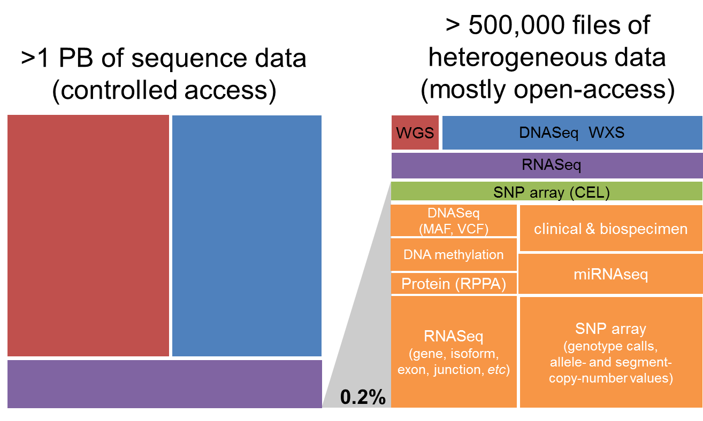

*************
TCGA Data Set
*************

About The Cancer Genome Atlas
------------------------------

`The Cancer Genome Atlas <https://cancergenome.nih.gov/>`_ (TCGA) is a comprehensive and coordinated effort to accelerate the understanding of the molecular basis of cancer through the application of genome analysis technologies, including large-scale genome sequencing.

The overarching goal of TCGA is to improve our ability to diagnose, treat and prevent cancer. To achieve this goal in a scientifically rigorous manner, the National Cancer Institute (NCI) and the National Human Genome Research Institute (NHGRI) used a phased-in strategy to launch TCGA. A pilot project developed and tested the research framework needed to systematically explore the entire spectrum of genomic changes involved in more than 20 types of human cancer.

This massive effort was launched in 2006. The final samples were shipped in mid-2014, and analysis of the data produced by this program continues to this day.

About The Cancer Genome Atlas Data
-----------------------------------

The ISB-CGC hosts several TCGA datasets in BigQuery_ and more data is available through the `Genomic Data Commons <https://gdc.cancer.gov/>`_ (GDC).

.. _TCGA: http://cancergenome.nih.gov/
.. _BigQuery: https://cloud.google.com/bigquery/

The vast majority (over 99%) of this **petabyte** of data consists of low-level sequence data, currently stored as files in the GDC (see figure below).  Over the course of the TCGA project, this low-level (*"Level 1"*) data has been processed through a set of standardized pipelines and the resulting high-level (*"Level 3"*) data is frequently the data that is used in most downstream analyses.  The ISB-CGC platform aims to make these different types of data accessible to the widest possible variety of users within the cancer research community.

The Cancer Genome Atlas Data Platforms
++++++++++++++++++++++++++++++++++++++++

When working with any of the data types, it is important to also be aware of both the *platform* that was used to generate the underlying raw data as well as the *pipeline* that was used to process the data.  For example, over the course of the TCGA study, DNA methylation data were obtained using first the Illumina HumanMethylation27 platform, and later using the HumanMethylation450 platform.  Any analysis that combines data from these two platforms across a cohort of samples should take this into consideration.  Another example where multiple platforms and/or pipelines were used to produce a single data type is the Level-3 gene expression data: most tumor samples were processed at UNC and the normalized gene-expression values are based on the RSEM method, while some tumor samples were processed at BCGSC and the normalized gene-expression values are based on RPKM.

The Cancer Genome Atlas Data Levels
++++++++++++++++++++++++++++++++++++

For each *type* of data, there are typically three *levels* of data:

* Level 1 typically represents raw, unnormalized data
* Level 2 typically represents an intermediate level of processing and/or normalization of the data
* Level 3 typically represents aggregated, normalized, and/or segmented data

The results of integrative or pan-cancer analyses are sometimes referred to as "Level 4" data.  More information about `Data Level Classification <https://gdc.cancer.gov/resources-tcga-users/tcga-code-tables/data-levels>`_ can be found on the NCI page.

The Cancer Genome Atlas Data Types
+++++++++++++++++++++++++++++++++++

The TCGA data set is unique in that the tumor samples were assayed using a standard set of platforms and pipelines in order to produce a comprehensive data set including:

* DNA sequencing of tumor samples and matched-normals (typically blood samples) in order to detect somatic mutations
* SNP array-based DNA copy-number and genotyping analysis of tumor samples and matched-normals
* DNA methylation of tumor samples
* messenger RNA (mRNA) expression analysis of the tumor samples to capture the gene expression profile
* microRNA (miRNA) expression profiling of the tumor samples

In addition, protein expression for a significant fraction (~20%) of all tumor samples was obtained using RPPA (reverse phase protein array).

Open-Access The Cancer Genome Atlas Data
=========================================

The open-access TCGA data includes:

* Clinical (de-identified) and Biospecimen data: these data were originally provided in XML files (Level-1)
* Somatic mutation data:  these data were originally provided in MAF files (Level-2)
* DNA copy-number segments:  these data were originally provided as segmentation files (Level-3)
* DNA methylation data:  these data were originally provided as TSV files (Level-3)
* Gene (mRNA) expression data:  these data were originally provided as TSV files (Level-3)
* microRNA expression data:  these data were originally provided as TSV files (Level-3)
* Protein expression data:  these data were originally provided as TSV files (Level-3)
* TCGA Annotations data:  annotations were originally obtained from the TCGA Annotations Manager, and can be found on the `GDC Data Portal <https://portal.gdc.cancer.gov/annotations>`_

The information scattered over tens of thousands of XML and TSV files at the GDC is provided in a *much more accessible* form in a series of BigQuery tables; see the *Accessing the TCGA Data in Google BigQuery* section below.

For more details, please see our `Community Notebook Repository <https://github.com/isb-cgc/Community-Notebooks>`_ for tutorials and code examples in Python and R.

Controlled-Access The Cancer Genome Atlas Data
===============================================

The controlled-access TCGA data includes:

* SNP array CEL files:  these Level-1 data files were provided by the DCC and include over 22,000 files for both tumor and matched-normal samples
* VCF files:  these Level-2 data files were provided by the DCC and include over 15,000 files produced by several different centers (primarily Broad and BCGSC)
* MAF files:  these "protected" mutation files (Level-2) were provided by the DCC (note that these files were not generated uniformly for all tumor types)
* DNA-seq BAM files:  these Level-1 data files were provided by CGHub

   - over 37,000 of these files are available in Google Cloud Storage (GCS)
   - roughly 90% of these BAM files contain exome data, the remaining 10% contain whole-genome data
   - BAM index (BAI) files are also available for all BAM files
* mRNA- and microRNA-seq BAM files:  these Level-1 data files were provided by CGHub

   - over 13,000 mRNA-seq BAM files are available in GCS
   - over 16,000 miRNA-seq BAM files are available in GCS
* mRNA-seq FASTQ files:  these Level-1 data files were provided by CGHub and include over 11,000 tar files

The Cancer Genome Atlas Data Repository History
++++++++++++++++++++++++++++++++++++++++++++++++

Historically, the data was obtained from two former TCGA data repositories:

* **TCGA DCC**: the TCGA Data Coordinating Center which provided a **Data Portal** from which users could download open-access or controlled-access data.  This portal provided access to all TCGA data *except* for the low-level sequence data. 
* **CGHub**:  the **Cancer Genomics Hub** was NCI's secure data repository for all TCGA BAM and FASTQ sequence data files.

In June of 2016, the official data repository for all TCGA and other NCI CCG data is the NCI's `Genomic Data Commons <https://gdc.cancer.gov/>`_ (GDC).  The original TCGA data, aligned to the hg19 human reference genome is available from the GDC's `legacy archive <https://portal.gdc.cancer.gov/legacy-archive/search/f>`_ while the new "harmonized" data, realigned to hg38 is available from the GDC's main `data portal <https://portal.gdc.cancer.gov/>`_.

Accessing The Cancer Genome Atlas Data on the Cloud
----------------------------------------------------

Besides accessing the files on the GDC Data Portal, you can also access them from the GDC Google Cloud Storage Bucket, which means that you don’t need to download them to perform analysis. ISB-CGC stores the cloud file locations in tables in the ``isb-cgc-bq.GDC_case_file_metadata`` data set in BigQuery.

- To access these metadata files, go to the Google BigQuery console.
- Perform SQL queries to find the TCGA files. Here is an example:

.. code-block:: sql

  SELECT active.*, file_gdc_url
  FROM `isb-cgc-bq.GDC_case_file_metadata.fileData_active_current` as active, `isb-cgc-bq.GDC_case_file_metadata.GDCfileID_to_GCSurl_current` as GCSurl
  WHERE program_name = 'TCGA'
  AND active.file_gdc_id = GCSurl.file_gdc_id

Accessing the TCGA Data in Google BigQuery
------------------------------------------------

ISB-CGC has TCGA data, such as clinical, biospecimen, miRNA and RNA-seq, stored in Google BigQuery tables. Information about these tables can be found using the `ISB-CGC BigQuery Table Search <https://isb-cgc.appspot.com/bq_meta_search/>`_ with TCGA selected for filter PROGRAM. To learn more about this tool, see the `ISB-CGC BigQuery Table Search documentation <../BigQueryTableSearchUI.html>`_.

The TCGA tables are in project isb-cgc-bq. To learn more about how to view and query tables in the Google BigQuery console, see the `ISB-CGC BigQuery Tables documentation <../BigQuery.html>`_.

- Data set ``isb-cgc-bq.TCGA`` contains the latest tables for each data type.
- Data set ``isb-cgc-bq.TCGA_versioned`` contains previously released tables, as well as the most current table.

Note that some of the tables in the isb-cgc-bq project were migrated from the isb-cgc project. If you were using data sets ``isb-cgc.TCGA_bioclin_v0``, ``isb-cgc.TCGA_hg19_data_v0`` and ``isb-cgc.TCGA_hg38_data_v0``, they still exist but are deprecated.

