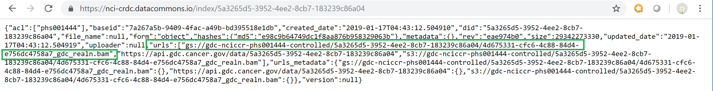

New Program Data Available in Google Cloud Storage
=======================================

We have new program data available via Google Cloud Storage. While we work on adding all the new programs to other parts of our systems we have created this document as a work around.  This tutorial will enable you to find files in Google Cloud Storage via the Data Commons' Framework tool IndexD. If you have any additional questions or comments please feel free to contact feedback@systemsbiology.org. 

New Programs
-------------

Foundation Medicine Adult Cancer Clinical Dataset (FM-AD)
^^^^^^^^^^^^^^^^^^^^^^^^^^^^^^^^^^^^^^^^^^^^^^^^^^^^^^^^^^

The Foundation Medicine adult cancer clinical dataset consists of 18,004 unique solid tumor samples that underwent genomic profiling on a single uniform platform as part of standard clinical care. The dataset is derived from the FoundationOne® genomic profiling assay version 2 that interrogates exonic regions of 287 cancer-related genes and selected introns from 19 genes known to undergo rearrangements in human cancer. For more information please `visit <https://www.ncbi.nlm.nih.gov/projects/gap/cgi-bin/study.cgi?study_id=phs001179.v1.p1/>`_. 

The Data Use Aggreement for Foundation Medicine can be found `here <https://dbgap.ncbi.nlm.nih.gov/aa/wga.cgi?view_pdf&stacc=phs001179.v1.p1>`_. 

Clinical Trial Sequencing Project (CTSP) 
^^^^^^^^^^^^^^^^^^^^^^^^^^^^^^^^^^^^^^^^^^

For the Clinical Trials Sequencing Project (CTSP), National Cancer Institute (NCI) will utilize whole genome sequencing and/or whole exome sequencing in conjunction with transcriptome sequencing to try to identify recurrent genetic alterations (mutations, deletions, amplifications, rearrangements) and/or gene expression signatures that would be important to the hypothesis(es) submitted by the investigators. The samples will be processed and submitted for genomic characterization using pipelines and procedures established within The Cancer Genome Analysis (TCGA) project. For more information please `visit <https://www.ncbi.nlm.nih.gov/projects/gap/cgi-bin/study.cgi?study_id=phs001175.v2.p2>`_. 

The Data Use Aggreement for The Clinical Trial Sequencing Project can be found `here <https://dbgap.ncbi.nlm.nih.gov/aa/wga.cgi?view_pdf&stacc=phs001175.v2.p2>`_. 

VA APOLLO Project - Research for Precision Oncology (VAREPOP)
^^^^^^^^^^^^^^^^^^^^^^^^^^^^^^^^^^^^^^^^^^^^^^^^^^^^^^^^^^^^^^

The Research for Precision Oncology Program (RePOP) is a research activity that establishes a cohort of Veterans diagnosed with cancer and who have had genomic analyses performed on their tumor tissue as part of standard of care. All data relevant to a patient's cancer and cancer care will be collected under RePOP, including patient demographics, co-morbidities, genomic analysis, treatments, medications, lab values, imaging studies, and outcomes. All RePOP participants will have signed/verbal informed consent and signed HIPAA authorization to have their data stored and shared from RePOP's Precision Oncology Program Data Repository (PODR). For more information please `visit <https://www.ncbi.nlm.nih.gov/projects/gap/cgi-bin/study.cgi?study_id=phs001374.v1.p1>`_. 

The Data Use Aggreement for The VA Apollo Research for Precision Oncology Program can be found `here <https://dbgap.ncbi.nlm.nih.gov/aa/wga.cgi?view_pdf&stacc=phs001374.v1.p1>`_.

Genomic Variation in Diffuse Large B Cell Lymphomas (NCICCR)
^^^^^^^^^^^^^^^^^^^^^^^^^^^^^^^^^^^^^^^^^^^^^^^^^^^^^^^^^^^^^^

Integrative analysis of genetic lesions in 574 diffuse large B cell lymphomas (DLBCL). The study investigates genomic structural variation, genetic alteration and its effect on the development and biology of lymphomas by using high throughput sequencing, gene expression, and methylation status.

Study Type: Case Set
Number of study subjects that have individual level data available through Authorized Access: 489
489 phenotyped subjects

For more information please `visit <https://www.ncbi.nlm.nih.gov/projects/gap/cgi-bin/study.cgi?study_id=phs001444.v1.p1>`_. 

The Data Use Aggreement for The Genomic Variation in Diffuse Large B Cell Lymphoma can be found `here <https://dbgap.ncbi.nlm.nih.gov/aa/wga.cgi?view_pdf&stacc=phs001444.v1.p1>`_.

Login via NIH ID to ISB-CGC
-----------------------------

To access the controlled data files you will first need to be authoenticated with your NIH ID and you Google ID using the DCF's fence.  For information on how to set up access to controlled data please go `here <https://isb-cancer-genomics-cloud.readthedocs.io/en/latest/sections/webapp/Gaining-Access-To-Contolled-Access-Data.html#linking-your-nih-and-google-identities>`_.

How to find files via IndexD
-----------------------------

This tutorial will go thorough how to find the GDC UUID needed to find for all four new programs FM, CTSP, VAREPOP, and NCICCR via the Genomic Data Commons. 

Find GDC UUID in Genomic Data Portal
^^^^^^^^^^^^^^^^^^^^^^^^^^^^^^^^^^^^^

Foundation Medicine (FM)
"""""""""""""""""""""""""

The Genomic Data Commons currently has VCF, TSV, and MAF data available. To see the GDC data portal with Foudation Medicine as program selected please select `here <https://portal.gdc.cancer.gov/repository?facetTab=files&filters=%7B%22op%22%3A%22and%22%2C%22content%22%3A%5B%7B%22op%22%3A%22in%22%2C%22content%22%3A%7B%22field%22%3A%22cases.project.program.name%22%2C%22value%22%3A%5B%22FM%22%5D%7D%7D%5D%7D&searchTableTab=cases>`_.

VCF: 36,008 files
TSV: 84 files
MAF: 42 files

Controlled Access: 36,050
Open Access: 84 files

For this tutorial we will use GDC UUID: 85d93d5a-f6a6-49a0-8d97-7d73bd471c69

   
Above Screenshot of the Genomic Data Commons portal with program : FM as filter   
   

File details page UUID is serial number needed for IndexD highlighted in green.

Clinical Trial Sequencing Project (CTSP)
""""""""""""""""""""""""""""""""""""""""""

The Genomic Data Commons currently has only bam files currently available. To see the GDC data portal with Clinical Trial Sequencing Project please select `here <https://portal.gdc.cancer.gov/repository?facetTab=files&filters=%7B%22op%22%3A%22and%22%2C%22content%22%3A%5B%7B%22op%22%3A%22in%22%2C%22content%22%3A%7B%22field%22%3A%22cases.project.program.name%22%2C%22value%22%3A%5B%22CTSP%22%5D%7D%7D%5D%7D&searchTableTab=cases>`_.

BAM: 89 files

ALL CONTROLLED

For this tutorial we will use GDC ID: e7f2edd8-bd89-40b1-9fe4-103183cb1a5f

   
Above Screenshot of the Genomic Data Commons portal with program : CTSP as filter   
   

File details page UUID is serial number needed for IndexD highlighted in green.

VA APOLLO Project - Research for Precision Oncology (VAREPOP)
"""""""""""""""""""""""""""""""""""""""""""""""""""""""""""""""

The Genomic Data Commons currently has bam and vcf files.  To see the GDC data portal with Research for Precision Oncology Project please select `here <https://portal.gdc.cancer.gov/repository?facetTab=files&filters=%7B%22op%22%3A%22and%22%2C%22content%22%3A%5B%7B%22op%22%3A%22in%22%2C%22content%22%3A%7B%22field%22%3A%22cases.project.program.name%22%2C%22value%22%3A%5B%22VAREPOP%22%5D%7D%7D%5D%7D>`_. 

VCF: 14 files
BAM: 7 files

ALL CONTROLLED

For this tutorial we will use GDC ID: a4aba10a-f420-45a0-a8fc-875fbab0915b

   
Above Screenshot of the Genomic Data Commons portal with program : VAREPOP as filter   
   

File details page UUID is serial number needed for IndexD highlighted in green.

Genomic Variation in Diffuse Large B Cell Lymphomas (NCICCR)
"""""""""""""""""""""""""""""""""""""""""""""""""""""""""""""

The Genomic Data Commons currently has only bam files currently available.  To see the GDC data portal with Genomic Variation in Diffuse Large B Cell Lymphomas Project please select `here <https://portal.gdc.cancer.gov/repository?facetTab=files&filters=%7B%22op%22%3A%22and%22%2C%22content%22%3A%5B%7B%22op%22%3A%22in%22%2C%22content%22%3A%7B%22field%22%3A%22cases.project.program.name%22%2C%22value%22%3A%5B%22NCICCR%22%5D%7D%7D%5D%7D>`_. 

BAM: 957 files

ALL CONTROLLED

For this tutorial we will use GDC ID: 5a3265d5-3952-4ee2-8cb7-183239c86a04

   
Above Screenshot of the Genomic Data Commons portal with program : NCICCR as filter   
   

File details page UUID is serial number needed for IndexD highlighted in green.

URL to find file information in IndexD
^^^^^^^^^^^^^^^^^^^^^^^^^^^^^^^^^^^^^^

We are currently able to use IndexD via a URL. Default URL is https://nci-crdc.datacommons.io/index/ 

You add the GDC UUID at the end of URL at the moment. Highlited in green below is where the Google Cloud Storage path is via the JSON return. 

Foundation Medicine (FM)
"""""""""""""""""""""""""

Clinical Trial Sequencing Project (CTSP)
""""""""""""""""""""""""""""""""""""""""""

VA APOLLO Project - Research for Precision Oncology (VAREPOP)
"""""""""""""""""""""""""""""""""""""""""""""""""""""""""""""""

Genomic Variation in Diffuse Large B Cell Lymphomas (NCICCR)
"""""""""""""""""""""""""""""""""""""""""""""""""""""""""""""

How to use Google Cloud Storage
^^^^^^^^^^^^^^^^^^^^^^^^^^^^^^^^

We have available tutorials and guides on how to access data in Google Cloud Storage and can be found  `here <https://isb-cancer-genomics-cloud.readthedocs.io/en/latest/sections/HowToGetStartedonISB-CGC.html#iii-accessing-and-analyzing-data-stored-in-gcs>`_. 

Cheat sheets available `here <https://isb-cancer-genomics-cloud.readthedocs.io/en/latest/sections/DIYWorkshop.html#isb-cancer-genomics-cloud-isb-cgc>`_.

Using multiple GDC UUUIDs with IndexD
^^^^^^^^^^^^^^^^^^^^^^^^^^^^^^^^^^^^^^

For this example we will show how to find the URLs when using multiple UUID's with IndexD.  The URL needed when using multiple UUIDs is https://nci-crdc.datacommons.io/index/index/?ids= each UUID should be comma seperated. 

example URL: https://nci-crdc.datacommons.io/index/index/?ids=a3e62c00-9cd0-4662-aefc-0559dab3bb1c,e916a56f-9d64-4172-829d-03ee2fe2d704

In example below we will have four UUIDs called from IndexD.  We will then use the control + F button feature in web browser to find the Google Cloud Storage path we are looking for in JSON file return. 

URL used is: https://nci-crdc.datacommons.io/index/index/?ids=a3e62c00-9cd0-4662-aefc-0559dab3bb1c,e7b41733-c0b8-4104-834a-234fb9f8caa2,243b3398-5b1c-4530-8903-1cc6275ba8be,e916a56f-9d64-4172-829d-03ee2fe2d704

GDC UUIDs used: 

- a3e62c00-9cd0-4662-aefc-0559dab3bb1c
- e7b41733-c0b8-4104-834a-234fb9f8caa2
- 243b3398-5b1c-4530-8903-1cc6275ba8be
- e916a56f-9d64-4172-829d-03ee2fe2d704

Above is IndexD json return when using four UUIDs.

If you select control + F button then search for term urls you will be able to find the GCS paths you are looking for in json return. 

