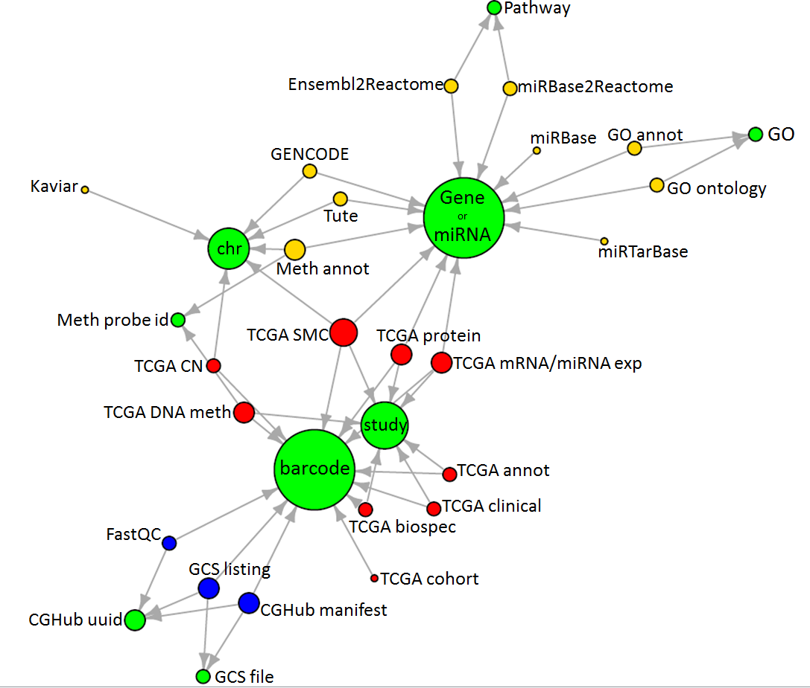
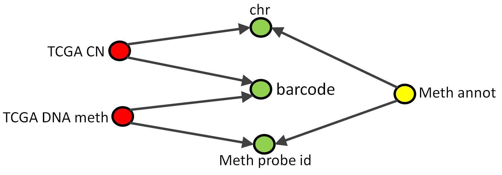

*********************
TCGA Data in BigQuery
*********************

The information scattered over tens of thousands of XML and TSV files at the DCC is provided in a 
*much more accessible* form in a series of *open-access* BigQuery tables.  
For more details, including tutorials 
and code examples in `Python <https://github.com/isb-cgc/examples-Python>`_ or 
`R <https://github.com/isb-cgc/examples-R>`_, 
please see our `github repositories <https://github.com/isb-cgc>`_.
Note that dbGaP authorization is **not** required to access these tables!

This `introductory tutorial <https://github.com/isb-cgc/examples-Python/blob/master/notebooks/The%20ISB-CGC%20open-access%20TCGA%20tables%20in%20BigQuery.ipynb>`_
gives a great overview of all of the tables and pointers on how to get started exploring them.  
Be sure to check it out!

If you have suggestions or requests for additional data (*eg* TCGA isoform expression data,
or other reference data sources) that you would like to see made available as BigQuery tables,
please let us know (feedback@isb-cgc.org) and we will try to make that happen.

BigQuery Data Overview
######################

The diagram below illustrates some of the important relationships between our BigQuery 
tables.  The yellow, red and blue nodes all represent tables in BigQuery.  The green
nodes represent fields that are common to two or more tables and can be used in "JOIN"
operations if you want to link information found in one table with relevant information
found in another table.  These same fields may also be useful in "GROUP BY" operations.

The nodes are color-coded as follows:
  - **green** indicates a common field in the schemas of one or more tables
  - **red** indicates a TCGA table
  - **yellow** indicates a reference table (*eg* genomic or platform reference)
  - **blue** indicates a metadata table (*eg* file manifest, or other metadata)

All of the TCGA tables include patient, sample, and/or aliquot 
`barcodes <https://wiki.nci.nih.gov/display/TCGA/TCGA+barcode>`_ on each row.
(The actual field names are typically ``ParticipantBarcode``, ``SampleBarcode``, or ``AliquotBarcode``.) 
Almost all of these tables also include a field called ``Study`` which contains the 
TCGA tumor-type abbreviation (*eg* BRCA for breast cancer, GBM for glioblastoma multiforme, *etc*).
Most of the molecular data tables include gene (or miRNA) symbols or identifiers, some include
chromosomal coordinates, and some include both (*eg* the somatic mutation calls (SMC) table).

..

If you want to map DNA methylation data onto copy-number data, you will need to perform
multiple JOINs.  The figure below isolates these two specific TCGA data tables 
from the larger diagram above to make the relationships easier to see.

Both TCGA data tables (the red nodes) contain sample barcodes, allowing 
information from each table that pertains to the same sample to be merged into
a single output row by a JOIN operation.
However, neither the copy-number nor the methylation table schemas include a
field with a gene symbol which is another common way to JOIN one molecular data
table to another.  
Instead, the methylation annotation table (yellow node) can be used to find the 
chromosomal coordinate for each methylation probe (by performing a JOIN operation 
on the probe id), and then the chromosomal coordinate of the probe can be used to 
find relevant copy-number segments in the copy-number table.

..

BigQuery Datasets and Tables
============================

Data made available by the ISB-CGC through BigQuery is organized into several *open-access* 
datasets, where a dataset is made up of multiple tables.  
Datasets are uniquely identified based on the project name and the dataset name, separated by a colon, 
*eg* ``isb-cgc:tcga_201510_alpha``.  Tables are uniquely identified by appending the table name,
preceded by a period, *eg* ``isb-cgc:tcga_201510_alpha.Clinical_data``.
The following sections describe each of the major datasets that are currently publicly-accessible, 
and the tables that each one contains.

TCGA Data and Metadata
======================

- `isb-cgc:tcga_201510_alpha <https://bigquery.cloud.google.com/dataset/isb-cgc:tcga_201510_alpha>`_: 
  This dataset contains one table for each of the major datatypes and/or platforms, is based on 
  all available data at the TCGA DCC in October, 2015, and is the same data used by our 
  Web App and APIs. (An updated set of tables will be released in 
  July or August of 2016.)  All tables include one or more of the following identifiers which can be 
  used for performing cross-table JOINs: ``ParticipantBarcode``, ``SampleBarcode``, and ``AliquotBarcode``.  
  In addition, most tables contain a ``Study`` field which contains the tumor-type abbreviation 
  (*eg* LUAD, BRCA, *etc*). (The table ordering below is alphabetical, since that is the order 
  you will see if you view this dataset using the 
  `BigQuery web UI <https://bigquery.cloud.google.com/welcome>`_.  
  To view this dataset in the web UI, click on the link at the begining of this paragraph.) 

.. 

  + `Annotations <https://bigquery.cloud.google.com/table/isb-cgc:tcga_201510_alpha.Annotations>`_: 
    This table contains annotations and related information obtained from the 
    `TCGA Annotations Manager <https://wiki.nci.nih.gov/display/TCGA/TCGA+Annotations+Manager+User's+Guide>`_
    (formerly available at the TCGA DCC).

..  

  + `Biospecimen_data <https://bigquery.cloud.google.com/table/isb-cgc:tcga_201510_alpha.Biospecimen_data>`_: 
    This table is a *sample-centric* table, and contains one row of information for each of the (over 23,000) 
    TCGA samples.  Any given field in this table may be ``null`` for many samples, depending on the 
    sample-type or the tumor-type.

..  

  + `Clinical_data <https://bigquery.cloud.google.com/table/isb-cgc:tcga_201510_alpha.Clinical_data>`_: 
    This table is a *patient-centric* table, and contains one row of information for each of the 
    (over 11,000) patients who graciously donated samples to the TCGA project.  Any given field in 
    this table may be ``null`` for many patients, depending on tumor-type or data-availability.  
    For example, the field ``tobacco_smoking_history`` is available for only about 3,000 patients.

..  

  + `Copy_Number_segments <https://bigquery.cloud.google.com/table/isb-cgc:tcga_201510_alpha.Copy_Number_segments>`_: 
    This table contains all available Copy Number segmentation data across all TCGA samples.  
    Each row in the table describes a single copy-number segment for a single aliquot.  
    The fields ``Chromosome``, ``Start``, and ``End`` specify the chromosomal coordinates (1-based) 
    for the segment, the ``Num_Probes`` field specifies the number of probes on the SNP chip that 
    went into estimating the mean copy-number for this segment, and finally the ``Segment_Mean`` 
    provides the ``log2(CN/2)`` mean value estimate.  Values near 0 represent "normal" copy-number, 
    while larger positive values indicate *amplifications* and negative values indicate *deletions*.

..  

  + `DNA_Methylation_betas <https://bigquery.cloud.google.com/table/isb-cgc:tcga_201510_alpha.DNA_Methylation_betas>`_: 
    This table contains **all** of the DNA methlyation data for all TCGA samples assayed on either the 
    HumanMethylation 27k or 450k platforms.  Please note that this is a very **large** table 
    (with close to 4 billion rows), so query it with caution -- a *single* query will cost *your* GCP project $2-3.  
    Each row contains the methylation "beta" for a particular aliquot at a particular probe.  
    Details about a particular probe, based on the ``Probe_Id`` field value (*eg* ``cg03879918``) 
    can be obtained from the ``methylation_annotation`` table described below.

..  

  + `miRNA_expression <https://bigquery.cloud.google.com/table/isb-cgc:tcga_201510_alpha.miRNA_expression>`_: 
    This table contains "mature microRNA" expression estimates based on the "premature miRNA" Level-3 data files.  
    (This transform was performed using a 
    `perl script <https://github.com/isb-cgc/ISB-CGC-data-proc/blob/master/tcga_etl_pipeline/feature_matrix/expression_matrix_mimat.pl>`_ 
    originally obtained from Andy Chu, BCGSC.)  Each row in the table represents the expression estimate 
    for one mature miRNA in one aliquot.  The microRNAs are identified by ``mirna_id`` (*eg* hsa-mir-143) 
    and by ``mirna_accession`` (*eg* MIMAT0000435).  These fields correspond to the ``mature_miR_name`` 
    and ``accession_ID`` fields in the ``miRBase_v20`` table described below.

..  

  + `mRNA_BCGSC_HiSeq_RPKM <https://bigquery.cloud.google.com/table/isb-cgc:tcga_201510_alpha.mRNA_BCGSC_HiSeq_RPKM>`_: 
    This table contains gene expression data from samples that were originally processed at BCGSC on the Illumina 
    HiSeq platform.  The gene expression estimates are based on the BCGSC pipeline and are in RPKM.  Note that 
    only about 900 TCGA samples were processed in this way.  Most of the mRNA gene expression data was instead 
    produced by the UNC RSEM pipeline (see next table).

..  

  + `mRNA_UNC_HiSeq_RSEM <https://bigquery.cloud.google.com/table/isb-cgc:tcga_201510_alpha.mRNA_UNC_HiSeq_RSEM>`_: 
    This table contains gene expression data from the ~10,000 samples assayed on the Illumina HiSeq platform and 
    processed through the UNC "RNASeqV2" RSEM pipeline.  Each row in this table contains the RSEM expression 
    estimate for a single gene in a single aliquot.  The gene symbol can be found in the fields 
    ``original_gene_symbol`` (as originally given in the file submitted by UNC to the TCGA DCC), and 
    ``HGNC_gene_symbol`` (the most current HGNC-approved gene symbol at the time this table was created).  
    More details about specific genes can be obtained from the ``GENCODE_r19`` table described below.

..  

  + `Protein_RPPA_data <https://bigquery.cloud.google.com/table/isb-cgc:tcga_201510_alpha.Protein_RPPA_data>`_: 
    This table contains protein expression quantification estimates based on the RPPA (reverse phase protein array) 
    platform.  Note that only a subset (~70%) of the TCGA tumor samples were assayed on this platform.  This 
    technology uses antibodies which bind (sometimes non-specifically) to the target protein.  In certain cases, 
    an antibody may target a specific phosphorylated protein.  Each row in this table
    includes an estimate of the ``Protein_Expression``, with the following fields specifying the 
    protein: ``Gene_Name`` (aka symbol), ``Protein_Name``, ``Protein_Basename``, and ``Phospho``.  
    Additional fields include the ``antibodySource`` and ``validationStatus``.

..  

  + `Somatic_Mutation_calls <https://bigquery.cloud.google.com/table/isb-cgc:tcga_201510_alpha.Somatic_Mutation_calls>`_: 
    This table contains all somatic mutations called across all TCGA tumor samples, based on aggregating all 
    of the MAF files available when this table was created.  Each mutation call was annotated using 
    `Oncotator <https://www.broadinstitute.org/cancer/cga/oncotator>`_, 
    and many (though not all) of the resulting annotation fields were included in this table.  Since multiple
    MAF files are sometimes available for a single tumor type, duplicate mutation calls may exist in this table.
    The next iteration of this table should correct this known issue.

..  
   
- `isb-cgc:tcga_cohorts <https://bigquery.cloud.google.com/dataset/isb-cgc:tcga_cohorts>`_: 
  This dataset contains a series of curated cohorts, one for each of the 33 TCGA tumor types, named 
  according to the tumor abbreviation, *eg* BRCA.  A "cohort" is defined as a paired list of patient- 
  and sample-barcodes.  In order to be included, molecular data from at least one of the main platforms 
  must be available for that sample, and there must be no disqualifying annotation for that sample or 
  the patient.  For example, the 
  `BRCA cohort table <https://bigquery.cloud.google.com/table/isb-cgc:tcga_cohorts.BRCA>`_ 
  contains 1086 unique patients and 2221 unique samples, but a query of the Clinical_data table for all 
  BRCA patients will return 1097 patients, and a similar query of the Biospecimen_data table for all 
  BRCA samples will return 2293 samples.  The Annotation table contains annotations of one type or 
  another for 39 BRCA patients, 2 BRCA samples, 18 BRCA analytes, and 71 BRCA aliquots.

..  
   
- `isb-cgc:tcga_seq_metadata <https://bigquery.cloud.google.com/dataset/isb-cgc:tcga_seq_metadata>`_: 
  This dataset contains several tables that provide metadata associated with TCGA *sequence* data files.  
  In alphabetical order by name, these tables are:

..  

  + `CGHub_Manifest_24jun2016 <https://bigquery.cloud.google.com/table/isb-cgc:tcga_seq_metadata.CGHub_Manifest_24jun2016>`_: 
    This table is based on the final "LATEST_MANIFEST" table obtained from CGHub prior to the shutdown of 
    that data repository, and includes information about over 128,000 files.  Most of these files are TCGA 
    data files, but other projects are represented as well, such as TARGET, and the "TCGA MC3 VARIANT CALLING PROJECT".  
    The presence of information about data from these other projects in this table does *not* mean that the ISB-CGC 
    is currently hosting the data.  The *complete* contents of the final CGHub LATEST_MANIFEST file are being provided 
    here for reference purposes.  The important identifier in this table is the ``analysis_id`` -- 
    this is the UUID assigned by CGHub to this particular data file.

..  

  + `GCS_listing_24jun2016 <https://bigquery.cloud.google.com/table/isb-cgc:tcga_seq_metadata.GCS_listing_24jun2016>`_: 
    This table contains metadata about all TCGA sequence data files (bam and fastq) that *are* being hosted by the 
    ISB-CGC in Google Cloud Storage (GCS).  The important identifiers in this table include the ``CGHubAnalysisID`` 
    and the ``AliquotBarcode``.  You can also find the full url to the object in GCS in this table 
    (field name ``GCSobject``) as well as the size of the file in bytes (``objectSizeBytes``).  
    **Note** that you will *not* be able to *access* the raw sequence data in these files without prior 
    dbGaP authorization.
    (Metadata *about* controlled-access data files is open-access and can therefore be included in these tables.)

..  

  + `RNAseq_FastQC <https://bigquery.cloud.google.com/table/isb-cgc:tcga_seq_metadata.RNAseq_FastQC>`_: 
    This table contains metrics derived from running FastQC on all TCGA RNAseq fastq data files hosted by 
    the ISB-CGC.  Included in this table are urls to the FastQC html reports that you can copy-and-paste 
    directly into your browser (field name ``FastQC_html_url``, 
    `example <https://storage.cloud.google.com/isb-cgc-open/tcga-qc/KIRP/RNA/RNA-Seq/UNC-LCCC/ILLUMINA/00065a62-5e18-4223-a884-12fca053a109-140516_UNC12-SN629_0369_AC4GGKACXX_GGCTAC_L002_1_fastqc.html>`_). 
    (As mentioned above, although these summary statistics and associated metrics describe 
    *controlled-access* data files, they are themselves considered *open-access* data.)

..  

  + `WXS_FastQC <https://bigquery.cloud.google.com/table/isb-cgc:tcga_seq_metadata.WXS_FastQC>`_: 
    This table contains metrics derived from running FastQC on all TCGA WXS bam files hosted by the ISB-CGC.  
    Included in this table are urls to the FastQC html reports that you can copy-and-paste directly into your 
    browser (field name ``FastQC_html_url``, 
    `example <https://storage.cloud.google.com/isb-cgc-open/tcga-qc/BRCA/DNA/WXS/BI/ILLUMINA/0004c5c4-a571-4eb2-93ab-58cd1cc24cc4-TCGA_MC3.TCGA-GM-A3XG-01A-31D-A243-09_fastqc.html>`_).  
    (As mentioned above, although these summary statistics and associated metrics describe 
    *controlled-access* data files, they are themselves considered *open-access* data.)
    (Note that a similar table based on running Picard across all TCGA bam files will be available in July or August 2016.)

Reference Data
==============

- `isb-cgc:genome_reference <https://bigquery.cloud.google.com/dataset/isb-cgc:genome_reference>`_: 
  This dataset contains tables derived from a variety of reference sources that are likely to be
  useful when performing analyses of the TCGA data in BigQuery.  For now we will simply list them
  here, with links to the view in the BigQuery web UI.  Each table should include a description
  and reference to the original information source.

  + `GENCODE_r19 <https://bigquery.cloud.google.com/table/isb-cgc:tcga_seq_metadata.GENCODE_r19>`_ 

  + `GENCODE_r24 <https://bigquery.cloud.google.com/table/isb-cgc:tcga_seq_metadata.GENCODE_r24>`_ 

  + `GO_Annotations <https://bigquery.cloud.google.com/table/isb-cgc:tcga_seq_metadata.GO_Annotations>`_ 

  + `GO_Ontology <https://bigquery.cloud.google.com/table/isb-cgc:tcga_seq_metadata.GO_Ontology>`_ 

  + `mirBase_v20 <https://bigquery.cloud.google.com/table/isb-cgc:tcga_seq_metadata.mirBase_v20>`_ 

  + `miRTarBase <https://bigquery.cloud.google.com/table/isb-cgc:tcga_seq_metadata.miRTarBase>`_ 

  + `miRBase2Reactome <https://bigquery.cloud.google.com/table/isb-cgc:tcga_seq_metadata.miRBase2Reactome>`_ 

  + `Ensembl2Reactome <https://bigquery.cloud.google.com/table/isb-cgc:tcga_seq_metadata.Ensembl2Reactome>`_ 

  + `Ensembl2Reactome_plusN <https://bigquery.cloud.google.com/table/isb-cgc:tcga_seq_metadata.Ensembl2Reactome_plusN>`_ 

  + `Kaviar_160113_Public_hg19 <https://bigquery.cloud.google.com/table/isb-cgc:tcga_seq_metadata.Kaviar_160113_Public_hg19>`_ 

..  
    
- `isb-cgc:platform_reference <https://bigquery.cloud.google.com/dataset/isb-cgc:platform_reference>`_: 
  This dataset currently contains only one table: the ``methylation_annotation`` table which contains
  detailed information about the Illumina HumanMethylation 27k and 450k platforms.  The ``Probe_id``
  field in the ``DNA_Methlyation_betas`` table described above can be looked up in this reference
  table using the ``IlmnID`` field.

CCLE Data
=========

- `isb-cgc:ccle_201602_alpha <https://bigquery.cloud.google.com/dataset/isb-cgc:ccle_201602_alpha>`_: 
  This dataset contains a series of tables based on various 
  CCLE (`Cancer Cell Line Encylopedia <http://portals.broadinstitute.org/ccle/home>`_) data sources.  
  Our goal is to provide a companion set of tables as similar as possible to the TCGA data tables.  

  + `AffyU133_RMA_expression <https://bigquery.cloud.google.com/table/isb-cgc:ccle_201602_alpha.AffyU133_RMA_expression>`_ contains gene expression data for 926 cell-line samples, across ~18,000 genes.

  + `Copy_Number_segments <https://bigquery.cloud.google.com/table/isb-cgc:ccle_201602_alpha.Copy_Number_segments>`_ contains copy-number segments identified based on SNP-array data for 909 cell-line samples.

  + `DataFile_info <https://bigquery.cloud.google.com/table/isb-cgc:ccle_201602_alpha.DataFile_info>`_ contains information about the various CCLE datafiles available in Google Cloud Storage (GCS).  All files, both SNP CEL files and bam files are open-access.  Comparable TCGA data files required dbGaP authorization.

  + `fastqc_metrics <https://bigquery.cloud.google.com/table/isb-cgc:ccle_201602_alpha.fastqc_metrics>`_ contains metrics obtained from FastQC.

  + `Mutation_calls <https://bigquery.cloud.google.com/table/isb-cgc:ccle_201602_alpha.Mutation_calls>`_ contains mutations and indels in 1651 genes, determined from targeted sequencing.

  + `Sample_information <https://bigquery.cloud.google.com/table/isb-cgc:ccle_201602_alpha.Sample_information>`_ contains cell-line metadata (*eg* gender, histology, source, *etc*).

Other Publicly Available Tables
===============================

Google and other institutions also host datasets of interest in BigQuery.  This is not an exhaustive
list, but a few datasets that may be of particular interest are owned by the following projects:
   
- `genomics-public-data <https://bigquery.cloud.google.com/queries/genomics-public-data>`_ 
  which includes, for example, the 
  `platinum_genomics.variants table <https://bigquery.cloud.google.com/table/genomics-public-data:platinum_genomes.variants>`_
   
- `google.com:biggene <https://bigquery.cloud.google.com/queries/google.com:biggene>`_
  which includes, for example, the
  `ExAC 0.2 variants table <https://bigquery.cloud.google.com/table/google.com:biggene:ExAC_release_0_2.reshaped_variants>`_
   
- `silver-wall-555 <https://bigquery.cloud.google.com/queries/silver-wall-555>`_ 
  which includes a 
  `table <https://bigquery.cloud.google.com/table/silver-wall-555:TuteTable.hg19>`_ 
  with over 8.5 billion annotations compiled by Tute Genomics and publicly
  `released <https://www.tutegenomics.com/news/tute-genomics-shares-genetic-variants-database-on-google-genomics/>`_ in March 2015.

ETL Details for TCGA Data
#########################

The open-access TCGA data has been uploaded into a set of consistent tables
in the publicly-accessible BigQuery dataset called ``isb-cgc:tcga_201510_alpha``,
`tables <https://bigquery.cloud.google.com/dataset/isb-cgc:tcga_201510_alpha>`_
which can be accessed
via the BigQuery web interface (by anyone with an active GCP project).

In general, the data in the BigQuery tables is identical to the information that
you can also access via the TCGA Data Coordinating Center (DCC)
`Data Portal <https://tcga-data.nci.nih.gov/tcga/>`_, 
but for users
interested in the nitty-gritty details, information is provided here about the ETL
(extract, transform and load) steps that were performed for each of the data types.

Before we go into data-type-specific details, a few general notes on
formatting and data curation:

-  All data uploaded into ISB-CGC BigQuery tables use a consistent
   UTF-8 character set. If the encoding of a character from
   the original file could not be detected, that character was ignored.
   Character encodings were detected using the Python
   library `Chardet <https://www.google.com/url?q=https://pypi.python.org/pypi/chardet&sa=D&usg=AFQjCNEqIpFiwf3f-ynJmNtP1ZqXe-TvRg>`_.

-  All missing information value strings such as: ``none``, ``None``,
   ``NONE``, ``null``, ``Null``, ``NULL``, , ``NA``, ``\_\_UNKNOWN\_\_``, ``<blank>``
   , and ``?``; are represented as NULL values in the BigQuery
   tables (or may not appear at all, depending on the table schema).

-  Numbers are stored as integer or floating point values.  The original ASCII
   files sometimes used scientific notation or included comma separators, but
   these are not preserved in the BigQuery tables.

-  End of File (EOF) and End of Line (EOL) delimiters, including
   CTRL-M characters, were all removed when the raw files were originally parsed.

-  Single and double quotes around the values were removed, but in cases where
   there were quotation marks within a string, they were not removed.

-  Whenever necessary, the SDRF file (in the mage-tab archive associated with each
   data archive) was parsed to find the correct association between the
   aliquot barcode and the Level-3 data file(s).

Data-Type Specific ETL
======================

.. toctree::
   :maxdepth: 1

   ETL_Clinical
   ETL_Biospecimen
   ETL_somaticMutations
   ETL_DNAcopyNumber
   ETL_DNAmethylation
   ETL_mRNAexpression
   ETL_microRNAexpression
   ETL_proteinExpression
   ETL_annotations

