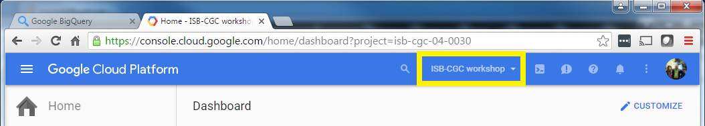

****************
ISB-CGC Workshop 
****************

This information is currently intended only for attendees who have
signed up for the 
`workshops at NCI on May 24th and 25th <https://cbiit.nci.nih.gov/ncip/nci-cancer-genomics-cloud-pilots/nci-cancer-genomics-cloud-workshop>`_.  
After the workshops, all materials will be made available as part of the
ISB-CGC documentation here on readthedocs.

Before we get started ...
#########################

As soon as you've found a seat and opened up your laptop, please do the 
following:

* sign into your Chrome browser using the Google identity you provided to us last week (if you did not send us your Google identity, please **alert one of our team now**)

* check your email for the link to the WebEx for this workshop, and the link to these materials

* go to the Google Cloud Platform `Console <https://console.cloud.google.com>`_

  + you should not have to sign in again, but if you are asked to, use the Google identity you gave us 
  + in the top blue bar, towards the right, you chould be able to select between (at least) two projects: the "ISB-CGC Workshop" project and your own project -- if you do not see and/or cannot select between two or more projects, please **alert one of our team now**

..

* did you `enable the APIs <https://raw.githubusercontent.com/isb-cgc/readthedocs/master/docs/include/enabling_new_APIs.pdf>`_ for your project (your *personal* project, not the workshop project)?  if not, **please do this now**

..

* just for fun, if you have time: in a separate browser tab, open up the BigQuery `Web UI <https://bigquery.cloud.google.com>`_

  + click on the red *COMPOSE QUERY* button in the upper left corner, and then cut and paste the SQL below into the **New Query** box and then click on the red **RUN QUERY** button
  + try out the *Format Query* button, and the *Explanation* button above the Results
  + try modifying the query to make it invalid and then click on the red exclamation mark (below the query box on the far right)
  + you can find additional information about accessing and working with the ISB-CGC BigQuery tables `here <progapi/bigqueryGUI/LinkingBigQueryToIsb-cgcProject.rst>`_ and `here <progapi/bigqueryGUI/WalkthroughOfGoogleBigQuery.rst>`_
  + at the bottom of this page are links to several quickstart tutorials -- one of them is all about BigQuery

.. code-block:: sql

   SELECT COUNT(*) AS n, Study, Gender
   FROM [isb-cgc:tcga_201510_alpha.Clinical_data]
   GROUP BY Gender, Study
   ORDER BY n DESC, Study, Gender

Workshop Outline & Links
########################

* `Introduction to the ISB-CGC Platform <https://github.com/isb-cgc/readthedocs/raw/master/docs/include/workshop-intro.pdf>`_
* Introduction to the Google Cloud Platform

  + `A Quick Tour of the Google Cloud Console <https://raw.githubusercontent.com/isb-cgc/readthedocs/master/docs/include/intro_to_Console.pdf>`_
  + `How to Enable APIs for your GCP Project <https://raw.githubusercontent.com/isb-cgc/readthedocs/master/docs/include/enabling_new_APIs.pdf>`_

* Integrative Analysis Tutorial

  + `Web-App Tutorial <workshop/WebApp_tut.html>`_
  + `BigQuery SQL Tutorial <workshop/BQ_SQL_tut.html>`_
  + `Analysis using R and RStudio <workshop/Workshop_R_tut.html>`_

* `Compute Pipelines Tutorial <https://docs.google.com/presentation/d/1IQkwbePfzj5qoCzqX-EV_UTbse075chzDINm5ZXGB5I/edit?usp=sharing>`_
* `SMC-RNA DREAM challenge <https://docs.google.com/presentation/d/1NPZhxXtC_QuVhpVGmTGgvJKhaYtDxNxSqeoZA4ySGLo/edit#slide=id.g13fd37f827_0_1>`_
* `Workshop Wrap-Up <https://github.com/isb-cgc/readthedocs/raw/master/docs/include/workshop-intro.pdf>`_

Other Quickstart Tutorials
##########################

* `An Introduction to BigQuery <https://raw.githubusercontent.com/isb-cgc/readthedocs/master/docs/include/intro_to_BigQuery.pdf>`_
* `An Introduction to Cloud Datalab <https://raw.githubusercontent.com/isb-cgc/readthedocs/master/docs/include/intro_to_Cloud_Datalab.pdf>`_
* `An Introduction to Cloud Shell <https://raw.githubusercontent.com/isb-cgc/readthedocs/master/docs/include/intro_to_Cloud_Shell.pdf>`_

