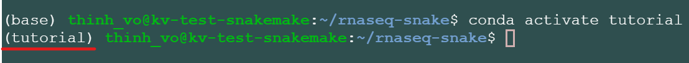
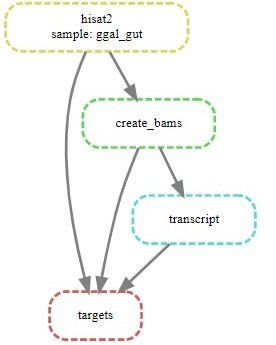

======================================================================
Your First Workflow on Google Cloud Virtual Machine (Snakemake RNA-seq)
======================================================================

This Snakemake workflow maps read-pairs to a reference genome and produces a transcript. `Snakemake <https://snakemake.readthedocs.io/en/stable/workflows>`_ workflows are Python based, extended by declarative code which defines rules. The rules indicate how the output files are created from the input files.

Requirements:

-  `Anaconda/Miniconda <https://conda.io/projects/conda/en/latest/user-guide/install/index.html>`_

Download this tutorial:
::

  $sudo add-apt-repository universe
  $sudo apt update
  $sudo apt install subversion

  #cloning this tutorial
  $svn checkout https://github.com/isb-cgc/RunningWorkflows-on-the-GoogleCloud/trunk/Snakemake-RNAseq

Starting folder:

::

   rnaseq-snakemake
   |_________data
   |           |_________ggal_gut_1.fq
   |           |_________ggal_gut_2.fq
   |           |_________ggal.gtf
   |           |_________reference.fa
   |_________step1
   |           |_________indexing.smk
   |           |_________Snakefile
   |_________step2
   |           |_________therest.smk
   |           |_________Snakefile
   |_________environment.yml

Setting up your Conda environment using the environment.yml file
================================================================
The file **environment.yml** contains a list of all the softwares required to run this tutorial
::

  $cd rnaseq-snakemake
  $conda env create --name tutorial --file environment.yml
  $conda activate tutorial

.. note:: Syntax: conda env create --name <yourEnvironmentName> --file environment.yml. For this tutorial <yourEnvironmentName> = tutorial

It should look like this:

Congratulations! You are now ready to run your first workflow using snakemake.

Step 1: Creating Index files from reference genome using hisat2-build
=====================================================================

From folder rnaseq-snake:
::

  $cd step1

Let's take a look at the 2 files in this folder: **Snakefile** and **indexing.smk**

::

  |_________step1
             |_________indexing.smk
             |_________Snakefile

Snakefile is the default name for snakemake's script. The "$snakemake"
command will automatically find a file name Snakefile and execute it;  **indexing.smk** is a helper file that will be called within the Snakefile.

Let's run it by using:

::

  $snakemake

Snakemake will run and use hisat2 to build index files from file rnaseq-snake/data/**reference.fa**. All the index files will be moved to rnaseq-snake/step1/**reference**.

Let's take a quick look at the code:

::

  #Snakefile
  rule targets:
    input:
        "index.done"
  include: "indexing.smk"

The first rule's input of a Snakefile (rule targets) will determine what's the output of that workflow. In this case, index.done is the target file that snakemake will look for. **Include: "indexing.smk"** will call the following helper script:

.. note:: Only the very first Snakefile rule's input behaves like this; other input will be the actual inputs of your workflow.

::

  #Indexing.smk
  rule indexing:
    input:
        "../data/reference.fa"
    output:
        touch('index.done')
    shell:
        """
        mkdir reference
        hisat2-build {input} index
        mv index.* reference/
        """

In **Indexing.smk** file we have an actual input "../data/reference.fa" and the output section tells snakemake to create an empty file "index.done", which is the file that the first rule will check to make sure that this helper script actually run. Then the shell script is executed as follows: a folder called reference got created, then Hisat2 created index files from the fasta file, and then all the index files got moved to the reference folder.

After **Step 1**:

::

   rnaseq-snakemake
   |_________data
   |           |_________ggal_gut_1.fq
   |           |_________ggal_gut_2.fq
   |           |_________ggal.gtf
   |           |_________reference.fa
   |_________step1
   |           |_________indexing.smk
   |           |_________Snakefile
   |           |_________[index.done]
   |           |_________[reference]
   |                           |_________[index.1.ht2]
   |                           |              [(2-7)]
   |                           |_________[index.8.ht2]
   |_________step2
   |           |_________therest.smk
   |           |_________Snakefile
   |_________environment.yml

Step 2: Creating the BAM file and the Transcript from reads and index files
==========================================================================

Step 2 is similar to Step 1.

From folder step1, to run step 2:

::

   $cd ..
   $cd step2
   $snakemake

After **Step 2**:

::

   rnaseq-snakemake
   |_________data
   |           |_________ggal_gut_1.fq
   |           |_________ggal_gut_2.fq
   |           |_________ggal.gtf
   |           |_________reference.fa
   |_________step1
   |           |_________indexing.smk
   |           |_________Snakefile
   |           |_________index.done
   |           |_________reference
   |                           |_________index.1.ht2
   |                           |              (2-7)
   |                           |_________index.8.ht2
   |_________step2
   |           |_________therest.smk
   |           |_________Snakefile
   |           |_________[ggal_gut.cutadapt.sam]
   |           |_________[e2t.ctab]
   |           |_________[i_data.ctab]
   |           |_________[i2t.ctab]
   |           |_________[t_data.ctab]
   |           |_________[e_data.ctab]
   |           |_________[ggal_gut.tsv]
   |           |_________[ggal_gut_ref.gtf]
   |           |_________[ggal_gut_transcript.gtf]
   |           |_________[ggal_gut.cutadapt.bam]
   |           |_________[ggal_gut.cutadapt.bam.bai]
   |_________environment.yml

The script will call hisat2, samtools, and stringtie to do the work.

Creating a visualization for your workflow
==========================================

In the step2 folder:
::

 $snakemake --dag | dot -Tsvg > visual.svg

A file named **visual.svg** will be created in the same folder; it can be downloaded and open with any web browser. It should look like this:

About environment.yml
---------------------

::

 channels:
  - conda-forge
  - bioconda
  - main
  - r
 dependencies:
  #snakemake and python will be included
  - snakemake-minimal =5.10.0
  - python =3.7.6
  #all other bioinformatics tools
  - samtools =1.9
  - bowtie2 =2.3.5.1
  - hisat2 =2.2.0
  - stringtie =2.1.2
  - gffread =0.11.7
  #visualization tool
  - graphviz =2.42.3e
