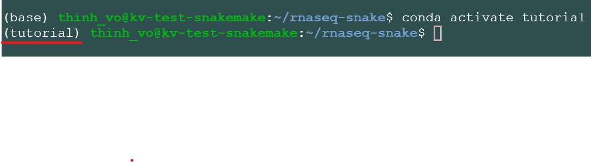

===================================================
Your First Workflow on Google Cloud Virtual Machine
===================================================
Requirements:

-  `Anaconda/Miniconda <https://conda.io/projects/conda/en/latest/user-guide/install/index.html>`_

Download this tutorial:
::

   $insert git link
    ===============

Starting folder:

::

   rnaseq-snake
   |_________data
   |           |_________ggal_gut_1.fq
   |           |_________ggal_gut_2.fq
   |           |_________ggal.gtf
   |           |_________reference.fa
   |_________step1
   |           |_________indexing.smk
   |           |_________Snakefile
   |_________step2
   |           |_________therest.smk
   |           |_________Snakefile
   |_________environment.yml

Setting up your Conda environment using the environment.yml file
================================================================
The file **environment.yml** contains a list of all the softwares required to run this tutorial
::

  $cd rnaseq-snake
  $conda env create --name tutorial --file environment.yml
  $conda activate tutorial

.. note:: Syntax: conda env create --name <yourEnvironmentName> --file environment.yml. For this tutorial <yourEnvironmentName> = tutorial

It should look like this:

Congratulations! you are now ready to run your first workflow using snakemake

Step 1: Creating Index files from reference genome using hisat2-build
---------------------------------------------------------------------

From folder rnaseq-snake:
::

  $cd step1

Let's take a look at the 2 files in this folder: **Snakefile** and **indexing.smk**

::

  |_________step1
             |_________indexing.smk
             |_________Snakefile

Snakefile is the default name for snakemake's script, "$snakemake"
command will automatically find a file name Snakefile and execute it. While **indexing.smk** is a helper file that will be called within the Snakefile.

Let's run it by using:

::

  $snakemake

snakemake will run and use hisat2 to build index files from file rnaseq-snake/data/**reference.fa** . And all the index files will be moved to rnaseq-snake/step1/**reference**

Let's take a quick look at the code:

After **Step 1**:

::

   rnaseq-snake
   |_________data
   |           |_________ggal_gut_1.fq
   |           |_________ggal_gut_2.fq
   |           |_________ggal.gtf
   |           |_________reference.fa
   |_________step1
   |           |_________indexing.smk
   |           |_________Snakefile
   |           |_________[index.done]
   |           |_________reference
   |                           |_________[index.1.ht2]
   |                           |              [(2-7)]
   |                           |_________[index.8.ht2]
   |_________step2
   |           |_________therest.smk
   |           |_________Snakefile
   |_________environment.yml

After **Step 2**:

::

   rnaseq-snake
   |_________data
   |           |_________ggal_gut_1.fq
   |           |_________ggal_gut_2.fq
   |           |_________ggal.gtf
   |           |_________reference.fa
   |_________step1
   |           |_________indexing.smk
   |           |_________Snakefile
   |           |_________index.done
   |           |_________reference
   |                           |_________index.1.ht2
   |                           |              (2-7)
   |                           |_________index.8.ht2
   |_________step2
   |           |_________therest.smk
   |           |_________Snakefile
   |           |_________[ggal_gut.cutadapt.sam]
   |           |_________[e2t.ctab]
   |           |_________[i_data.ctab]
   |           |_________[i2t.ctab]
   |           |_________[t_data.ctab]
   |           |_________[e_data.ctab]
   |           |_________[ggal_gut.tsv]
   |           |_________[ggal_gut_ref.gtf]
   |           |_________[ggal_gut_transcript.gtf]
   |           |_________[ggal_gut.cutadapt.bam]
   |           |_________[ggal_gut.cutadapt.bam.bai]
   |_________environment.yml
