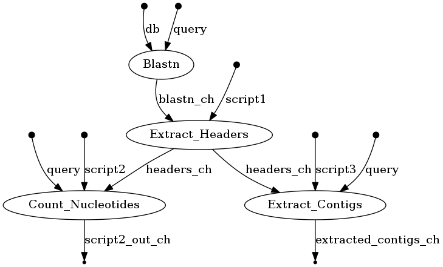

======================
Running NEXTFLOW Blast
======================

This workflow extracts contigs of interest from a mixed library of DNA; it uses Blastn and Python.

Requirements:
=============

- Docker
- Java (required to install Nextflow)
- Python (to run the scripts)
- Nextflow
- Graphviz

To install Docker, Java, Python, Graphviz and Nextflow, you can visit our **Cheatsheet**.

- `Cheatsheet <https://isb-cancer-genomics-cloud.readthedocs.io/en/kyle-staging/sections/gcp-info/Cheatsheet.html>`_

.. note:: The requirements above are crucial to running this workflow. Please make sure you have them installed properly prior to running this workflow.

Download this tutorial:
=======================

::

 $ sudo add-apt-repository universe
 $ sudo apt update
 $ sudo apt install subversion

 #cloning this tutorial
 $ svn checkout https://github.com/isb-cgc/RunningWorkflows-on-the-GoogleCloud/trunk/Nextflow-Blast

Rationale
==========

The input of this workflow (**sample.fa**) is produced by genome assembly software. It contains contigs from multiple organisms (eukaryote, prokaryotes) because of the way the sample was prepared and sequenced.
In this example, we are interested in the prokaryote genome only, and will separate their contigs from the eukaryote ones. In order to do that, Blastn will do sequence alignment between the contigs and the prepared blast database (files in the folder **db**).
The output of Blastn will be a table, which maps the contig header to the appropriate species. Here, we also demonstrate how to incorporate the use of python helper scripts in our pipeline to extract the prokaryotes' headers (**scripts/Extract_Headers.py**), contigs (**scripts/Extract_Contigs.py**), and nucleotide count (**scripts/Count_Nucleotides.py**) from the original Fasta file using the Blastn result.
The final output of the workflow will be 3 text files: **extracted_contigs.txt**, **Headers.txt**, **NucleoCount.txt**.

Running Nextflow
================
You should have a **Nextflow-Blast** directory :

 ::

    Nextflow-Blast
        ├── data
        │   └── sample.fa
        ├── db
        │   ├── SampleDB.nhr
        │   ├── SampleDB.nin
        │   └── SampleDB.nsq
        ├── main.nf
        ├── nextflow.config
        └── scripts
            ├── Count_Nucleotides.py
            ├── Extract_Contigs.py
            └── Extract_Headers.py

The file **main.nf** contains all the code necessary to execute the workflow, and **nextflow.config** provides the name of docker image that contains all the tools for this run.
To run:
::

 #Assume the executable file "nextflow" is installed in the same directory with the folder you download "Nextflow-Blast"
 $ ./nextflow run Nextflow-Blast

Once complete, the folder should look like this:

::

  Nextflow-Blast
        ├── data
        │   └── sample.fa
        ├── db
        │   ├── SampleDB.nhr
        │   ├── SampleDB.nin
        │   └── SampleDB.nsq
        ├── main.nf
        ├── nextflow.config
        ├── [results]
        │   ├── [Blastn.out]
        │   ├── [extracted_contigs.txt]
        │   ├── [Headers.txt]
        │   └── [NucleoCount.txt]
        └── scripts
            ├── Count_Nucleotides.py
            ├── Extract_Contigs.py
            └── Extract_Headers.py

Running Nextflow with the Visualization Option
==============================================

Use the following command:
::

 #Assume the executable file "nextflow" is installed in the same directory with the folder you download "Nextflow-Blast"
 $ ./nextflow run Nextflow-Blast -with-dag flowchart.png

An image file with the name **flowchart.png** will be available to download.
It should look like this:

To see the result of this workflow, you can check it `here <https://github.com/isb-cgc/RunningWorkflows-on-the-GoogleCloud/tree/master/Results/Blast>`_
