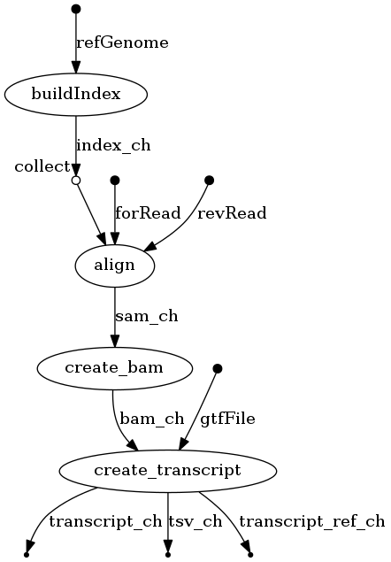

=======================
Running Nextflow RNA-seq
=======================

This Nextflow `RNA-seq <https://www.technologynetworks.com/genomics/articles/rna-seq-basics-applications-and-protocol-299461#:~:text=RNA%2Dseq%20(RNA%2Dsequencing,patterns%20encoded%20within%20our%20RNA.>`_ workflow maps read-pairs to a reference genome and produces a transcript. 

By using software containers, `Nextflow <https://www.nextflow.io>`_ enables scalable and reproducible scientific workflows. Pipelines can be written in any common scripting language.

Requirements:
=============

- Docker
- Java (required to install Nextflow)
- Nextflow
- Graphviz

To install Docker, Graphviz and Nextflow, see our `VM Workflow Tools Installation Cheatsheet <Cheatsheet.html>`_ for instructions.

.. note:: The requirements above are crucial to running this workflow. Please make sure you have them installed properly prior to running this workflow.

Download this tutorial:
=======================
::

 $ sudo add-apt-repository universe
 $ sudo apt update
 $ sudo apt install subversion

 #cloning this tutorial
 $ svn checkout https://github.com/isb-cgc/RunningWorkflows-on-the-GoogleCloud/trunk/Nextflow-RNAseq

Running Nextflow
================
You should have a **Nextflow-RNAseq** directory :
::

   Nextflow-RNAseq
            ├── data
            │   ├── sample_1.fq
            │   ├── sample_2.fq
            │   ├── sample.fa
            │   └── sample.gtf
            ├── main.nf
            └── nextflow.config

The file **main.nf** contains all the code to execute the workflow, and **nextflow.config** provides the name of the Docker image that contains all of the tools for this run.

Let's take a look at the contents of the file **main.nf**.
The first block contains all the parameters (denoted by "params") that are required to input into the workflow.

::

  #!/usr/bin/env nextflow

  params.outdir = "$baseDir/results"
  params.indexDir = "$baseDir/reference"
  params.refGenome = "$baseDir/data/sample.fa"
  params.forRead = "$baseDir/data/sample_1.fq"
  params.revRead = "$baseDir/data/sample_2.fq"
  params.gtfFile = "$baseDir/data/sample.gtf"

The process block contains 3 basic parts: **input**, **output**, and **command** (contained in the pairs of quotations """ some commands """). The variable **refGenome** with type **path** is created to hold the value of **params.refGenome**.

In the **command** (""") block, the hisat2 build command will be executed with the previously created variable **refGenome** denoted as **${refGenome}**. The name of the final output files from hisat2 build in this case will follow the pattern **index.#.ht2**.

In the output section, in order to catch the outputs of hisat2, the wildcard 'index*' was used, and those outputs will become a list assigned to the channel **index_ch*** variable. The **index_ch*** channel can be used by downstream processes. The other 3 processes have similar syntax.

::

  process buildIndex {
   publishDir params.indexDir, mode: 'copy'
   echo true
   input:
   path refGenome from params.refGenome

   output:
   path 'index*' into index_ch

   """
   echo "Building Indices"
   hisat2-build ${refGenome} index
   """
  }

To run:
::

 #Assume the executable file "nextflow" is installed in the same directory with the folder you downloaded "Nextflow-RNAseq".
 $ ./nextflow run Nextflow-RNAseq

After the workflow finishes running, the folder should look like this:

::

  Nextflow-RNAseq
            ├── data
            │   ├── sample_1.fq
            │   ├── sample_2.fq
            │   ├── sample.fa
            │   └── sample.gtf
            ├── main.nf
            ├── nextflow.config
            ├── [reference]
            │   ├── [index.1.ht2]
            │   ├── [index.2.ht2]
            │   ├── [index.3.ht2]
            │   ├── [index.4.ht2]
            │   ├── [index.5.ht2]
            │   ├── [index.6.ht2]
            │   ├── [index.7.ht2]
            │   └── [index.8.ht2]
            └── [results]
                ├── [final_ref.gtf]
                ├── [final_transcript.gtf]
                ├── [sample.bam]
                ├── [sample.sam]
                └── [sample.tsv]

The script will call `hisat2 <http://daehwankimlab.github.io/hisat2/>`_ , `samtools <http://www.htslib.org/>`_, and `stringtie <https://ccb.jhu.edu/software/stringtie/>`_ to do the work. **sample.sam** file will contain the sequence alignment data produced by mapping reads to the reference genome, **sample.bam** file will contain the compressed binary alignment data. Additional information about the gtf and tsv outputs of StringTie can be found `here <http://ccb.jhu.edu/software/stringtie/index.shtml?t=manual>`_. The **final_transcript.gtf** contains details of the transcripts that StringTie assembles from RNA-Seq data, while **final.tsv** contains gene abundances.

Running Nextflow with visualization
===================================

Use the following command:
::

 #Assume the executable file "nextflow" is installed in the same directory with the folder you downloaded "Nextflow-RNAseq".
 $ ./nextflow run Nextflow-RNAseq -with-dag flowchart.png

An image file with the name **flowchart.png** will be available to download.
It should look like this:

To see the result of this workflow, you can check it `here <https://github.com/isb-cgc/RunningWorkflows-on-the-GoogleCloud/tree/master/Results/RNAseq>`_.
