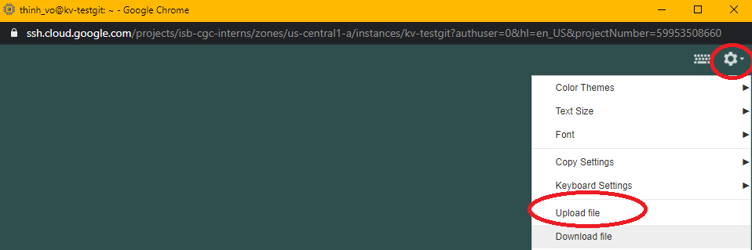
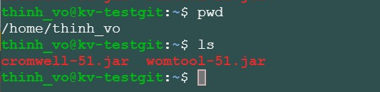
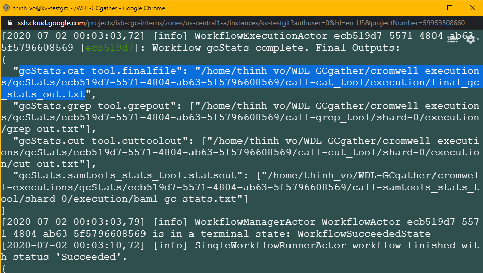
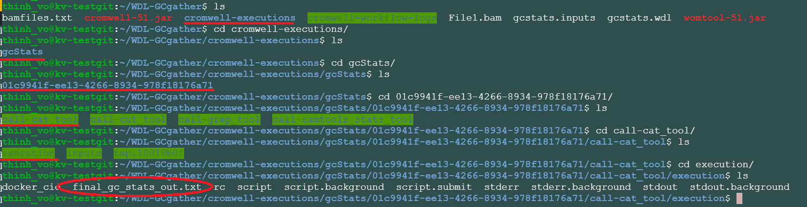

====================================================
Running WDL pipeline on public Bam file from ISB-CGC
====================================================

Requirements:
=============

- Java
- Graphviz
- Docker
- Gcsfuse
- WDL (Cromwell and Womtool)
- A public bam file from ISB-CGC at the address: gs://gdc-ccle-open/692a845c-7957-41f2-b679-5434c69ba25b/G27328.Calu-6.1.bam

To install Java, Docker, Graphviz and WDL, you can visit our **Cheatsheet**, and to set up the gcsfuse to get access to the bam file please visit **Running Workflow with GCSFUSE** listed below:

- `Cheatsheet <https://isb-cancer-genomics-cloud.readthedocs.io/en/kyle-staging/sections/gcp-info/Cheatsheet.html>`_
- `WorkflowWithGCSFUSE <https://isb-cancer-genomics-cloud.readthedocs.io/en/kyle-staging/sections/gcp-info/WorkflowWithGCSFUSE.html>`_
- `RunningSnakemakeWithBam <https://isb-cancer-genomics-cloud.readthedocs.io/en/kyle-staging/sections/gcp-info/RunningSnakemakeWithBam.html>`_
- `RunningCWLWithBam <https://isb-cancer-genomics-cloud.readthedocs.io/en/kyle-staging/sections/gcp-info/RunningCWLWithBam.html>`_
- `RunningNextflowWithBam <https://isb-cancer-genomics-cloud.readthedocs.io/en/kyle-staging/sections/gcp-info/RunningNextflowWithBam.html>`_

Installing Cromwell and Womtool:
================================

Download the **cromwell-XY.jar** and **womtool-XY.jar** at https://github.com/broadinstitute/cromwell/releases to your local machine

.. note:: "XY" in **cromwell-XY.jar** and **womtool-XY.jar** is the version of the software. At the time of this tutorial, the latest version is "51". For all the code from here "XY" will be "51" e.g. **cromwell-XY.jar** becomes **cromwell-51.jar**. Please change the code accordingly to reflect the version that you have.

Upload them to your VM:

It should look like this after uploading:

Download this tutorial:
=======================
::

  $sudo add-apt-repository universe
  $sudo apt update
  $sudo apt install subversion

  #cloning this tutorial
  $svn checkout https://github.com/isb-cgc/RunningWorkflows-on-the-GoogleCloud/trunk/WDL-GCgather

Running WDL
===========
You should have a **WDL-GCgather** directory with 3 files inside.
to simplify the command, I will move the **cromwell-51.jar** and **womtool-51.jar**  into the *WDL-GCgather** directory:

::

  $mv *-51.jar WDL-GCgather/

We are going to change the address in **bamfiles.txt** file to the one you created in the **Running Workflow with GCSFUSE** tutorial

::

  #go into the folder
  $cd WDL-GCgather
  $nano bamfiles.txt

At the top of the file you will see this:

::

  /opt/testGcsfuse/G27328.Calu-6.1.bam	bam1

Replace "/opt/testGcsfuse/G27328.Calu-6.1.bam" with your new address from the gcsfuse tutorial for example: "/opt/testGcsfuse/G27328.Calu-6.1.bam". Now the script is ready to run with CWLtool.
Save the change, then run the script with this command:

::

  $java -jar cromwell-51.jar run gcstats.wdl -i gcstats.inputs

.. note:: This Bam file is quite large, it may take about 15 mins ~ 20 mins to run. Also make sure you have installed Java.

Once the Cromwell finished, the result will be located inside the folder called **cromwell-executions** (also they will announce right before they stop running where the output is (see image below))

It should look like this, the **final_gc_stats_out.txt** is the final output of this workflow :

Creating visualization with Womtool
-----------------------------------

Run this command:

::

  $java -jar womtool-51.jar graph gcstats.wdl | dot -Tpng > visual.png

A file named "visual.png" will be created and ready to be downloaded

It should look like this:

.. image:: images/RunningWDLWithBam_5.png
   :align: left
