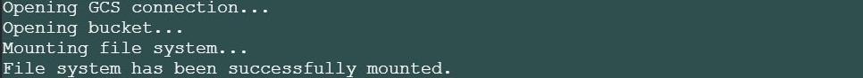
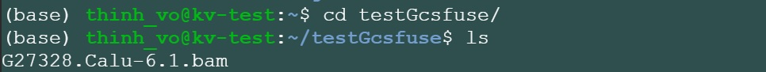
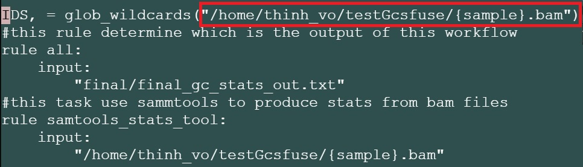

==================
Setting up GCSFuse 
==================

When you are running workflow on a virtual machine (VM), often your input files are stored in Google Cloud Storage buckets. One way to access them is to mount the Cloud Storage buckets as file systems on your VM. Google Cloud Storage FUSE (GCSFuse) allows you to mount Cloud Storage buckets to easily read and write from your VM to your Cloud Storage buckets. More detailed information can be found on the `Google Cloud documentation page <https://cloud.google.com/storage/docs/gcs-fuse>`_.

`How-to video <https://www.youtube.com/watch?v=mE6dLYOf8BA>`_ | `Installing Page <https://github.com/GoogleCloudPlatform/gcsfuse/blob/master/docs/installing.md>`_

Step 1: create a Virtual Machine (VM) instance big enough to hold your data
===========================================================================

This guide recommends your VM be created with: **Ubuntu 16.04 LTS**, and with the **Allow full access to all Cloud APIs** option.

.. note:: It's very important to have a VM big enough, or your gcsfuse will not mount properly.

Step 2: installing gcsfuse
==========================
The following commands can be used to install gcsfuse:
::

   $ sudo -i
   $ cd /
   $ cd opt
   $ export GCSFUSE_REPO=gcsfuse-`lsb_release -c -s`
   $ echo "deb http://packages.cloud.google.com/apt $GCSFUSE_REPO main" | sudo tee /etc/apt/sources.list.d/gcsfuse.list
   $ curl https://packages.cloud.google.com/apt/doc/apt-key.gpg | sudo apt-key add -
   $ sudo apt-get update
   $ sudo apt-get install gcsfuse
   #### Close the VM console and reopen #####

Step 3: mounting/ linking the target bucket to your VM directory
================================================================
Making a directory to hold your bucket:
::

   ### at your home directory and not in opt ###
   ### in this tutorial yourNewDirectory will be testGcsfuse ###

   $ mkdir <yourNewDirectory>

.. note:: To access restricted data with your Google credential, before going further, use this command: $gcloud auth application-default login

Mount a bucket to your folder:

::

   $ gcsfuse <bucketname> <myfolder/to/mount>

Example: gs://gdc-ccle-open/ is the bucket you want to mount to your VM

::

   $ gcsfuse gdc-ccle-open testGcsfuse

Mount a subdirectory from your bucket to your VM folder:

::

   $ gcsfuse --only-dir <subdirectory> <bucketName> <myFolder/to/mount>

Example: you have a bam file with the address gs://gdc-ccle-open/692a845c-7957-41f2-b679-5434c69ba25b/G27328.Calu-6.1.bam,
and you only need to mount the directory that holds that bam file:

::

   $ gcsfuse --only-dir 692a845c-7957-41f2-b679-5434c69ba25b gdc-ccle-open testGcsfuse

You should see something like this:

   
Step 4: running your workflow with a local VM directory
=======================================================
Write your workflow with the input pointing to that directory, as follows:

