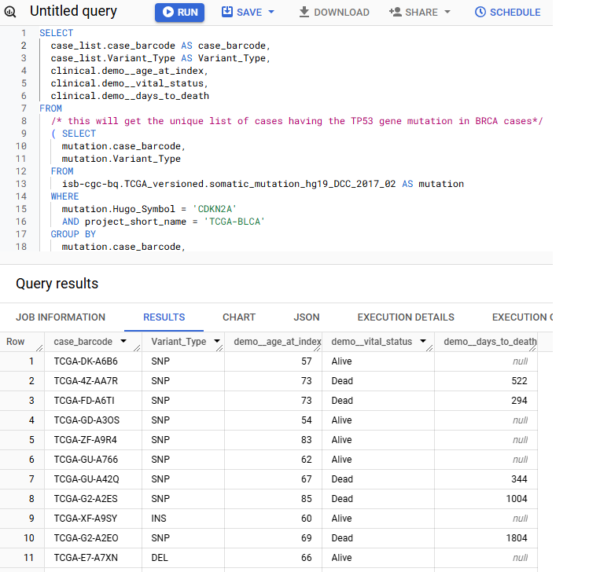
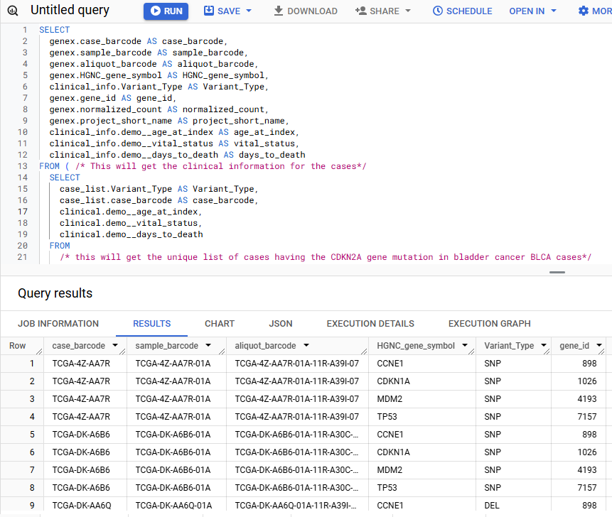

***************
BigQuery SQL Examples
***************

.. figure:: BigQuery-menuItem.png
    :align: right
    :figwidth: 185px

You can write SQL queries to retrieve data from ISB-CGC BigQuery tables directly in the `Google BigQuery console <https://console.cloud.google.com/bigquery>`_. To get to the console from within the Google Cloud Platform, click the Navigation menu in the upper left-hand corner. Expand PRODUCTS and find BigQuery in the BIG DATA section. (If you pin BigQuery, BigQuery will also display in the upper part of the navigation menu, making it easier to find next time.)

These `instructions <https://cloud.google.com/bigquery/docs/bigquery-web-ui>`_ from Google will tell you more about using the BigQuery console.

Query versus Preview
======================

Here is a simple query which retrieves all columns in a table.

.. code-block:: sql

    SELECT * 
    FROM `isb-cgc-bq.TCGA_versioned.clinical_gdc_r24` 
    LIMIT 1000

You can use the "Preview" feature in the BigQuery web UI, at no cost, instead of doing a SELECT * which will do a full table scan! See the picture below.

.. image:: BQ-console-tablePreview.png
   :scale: 65 
   :align: center

Simple Query Examples
======================
Let's start with a few simple examples to get some practice using BigQuery. You can copy and paste any of the SQL queries on this page into the BigQuery web console at https://console.cloud.google.com/bigquery.

**1. How many mutations have been observed in KRAS?**

.. code-block:: sql

   SELECT COUNT(DISTINCT(sample_barcode_tumor)) AS numSamples
   FROM `isb-cgc-bq.TCGA_versioned.somatic_mutation_hg38_gdc_r10`
   WHERE Hugo_Symbol="KRAS"

The screenshot below shows the query in the "Query Editor" box, and the results down below.  Just click on the "RUN QUERY" button to run the query. Notice the green checkmark indicating that the SQL query syntax looks good.

.. image:: SimpleSQLExample1.png
   :scale: 100
   :align: center

**2. What other information is available about these KRAS mutant tumors?**

In addition to answering the question above, this next query also illustrates usage of the **WITH** construct to create an intermediate table on the fly, and then use it in a follow-up **SELECT**:

.. code-block:: sql

   WITH temp1 AS (
      SELECT
        project_short_name,
        sample_barcode_tumor,
        Hugo_Symbol,
        Variant_Classification,
        Variant_Type,
        SIFT,
        PolyPhen
      FROM  `isb-cgc-bq.TCGA_versioned.somatic_mutation_hg38_gdc_r10`
      WHERE Hugo_Symbol="KRAS"
      GROUP BY
        project_short_name,
        sample_barcode_tumor,
        Hugo_Symbol,
        Variant_Classification,
        Variant_Type,
        SIFT,
        PolyPhen )
   SELECT
      COUNT(*) AS num,
      Hugo_Symbol,
      Variant_Classification,
      Variant_Type,
      SIFT,
      PolyPhen
   FROM temp1
   GROUP BY
      Hugo_Symbol,
      Variant_Classification,
      Variant_Type,
      SIFT,
      PolyPhen
   ORDER BY num DESC

.. image:: SimpleSQLExample2.png
   :scale: 100 
   :align: center

**3. What are the most frequently observed mutations and how often do they occur?**

.. code-block:: sql

    WITH temp1 AS (
       SELECT
         sample_barcode_tumor,
         Hugo_Symbol,
         Variant_Classification,
         Variant_Type,
         SIFT, 
         PolyPhen
       FROM `isb-cgc-bq.TCGA_versioned.somatic_mutation_hg38_gdc_r10`
       GROUP BY
         sample_barcode_tumor,
         Hugo_Symbol,
         Variant_Classification,
         Variant_Type,
         SIFT,
         PolyPhen)
    SELECT
      COUNT(*) AS num,
      Hugo_Symbol,
      Variant_Classification,
      Variant_Type,
      SIFT,
      PolyPhen
    FROM temp1
    GROUP BY
      Hugo_Symbol,
      Variant_Classification,
      Variant_Type,
      SIFT,
      PolyPhen
    ORDER BY num DESC

.. image:: SQLSimpleExample3.png
   :scale: 100
   :align: center

  
Querying from more than one table (Joining)
===========================================

**Q: For bladder cancer patients who have mutations in the CDKN2A (cyclin-dependent kinase inhibitor 2A) gene, what types of mutations are they, what is their gender, vital status, and days to death - and for three downstream genes (MDM2 (MDM2 proto-oncogene), TP53 (tumor protein p53), CDKN1A (cyclin-dependent kinase inhibitor 1A)), what are the gene expression levels for each patient?**

This question was chosen as an interesting example because the p53/Rb pathway is commonly involved in bladder cancer (see `TCGA Network paper <https://www.ncbi.nlm.nih.gov/pmc/articles/PMC3962515/>`_ "Comprehensive Molecular Characterization of Urothelial Bladder Carcinoma", Figure 4).

This is a complex question that requires information from four tables.  We will build up this complex query in three steps.

Step 1
++++++
Find the patients with bladder cancer who have mutations in the CDKN2A gene, and display the patient ID and the type of mutation.

.. code-block:: sql

    SELECT
      mutation.case_barcode,
      mutation.Variant_Type
    FROM
      `isb-cgc-bq.TCGA_versioned.somatic_mutation_hg19_DCC_2017_02` AS mutation
    WHERE
      mutation.Hugo_Symbol = 'CDKN2A'
      AND project_short_name = 'TCGA-BLCA'
    GROUP BY
      mutation.case_barcode,
      mutation.Variant_Type
    ORDER BY
      mutation.case_barcode

.. image:: BigQueryExample1.png
   :scale: 100
   :align: center  
   
We now have the list of patients who have a mutation in the CDKN2A gene and the type of mutation.

Notice that we have named the "isb-cgc-bq.TCGA_versioned.somatic_mutation_hg19_DCC_2017_02" table "mutation" using the AS statement.  This is useful for easier reading and composing of complex queries.

Step 2
+++++++
Bring in the patient data from the ISB-CGC TCGA Clinical table so that we can see each patient's gender, vital status and days to death.

.. code-block:: sql

    SELECT
      case_list.case_barcode AS case_barcode,
      case_list.Variant_Type AS Variant_Type,
      clinical.demo__gender,
      clinical.demo__vital_status,
      clinical.demo__days_to_death
    FROM
      /* this will get the unique list of cases having the TP53 gene mutation in BRCA cases*/     
      ( SELECT
        mutation.case_barcode,
        mutation.Variant_Type
      FROM
        isb-cgc-bq.TCGA_versioned.somatic_mutation_hg19_DCC_2017_02 AS mutation
      WHERE
        mutation.Hugo_Symbol = 'CDKN2A'
        AND project_short_name = 'TCGA-BLCA'
      GROUP BY
        mutation.case_barcode,
        mutation.Variant_Type
      ORDER BY
        mutation.case_barcode
        ) AS case_list /* end case_list */
    JOIN
      isb-cgc-bq.TCGA.clinical_gdc_current AS clinical
    ON
      case_list.case_barcode = clinical.submitter_id
  

   
We now have combined information from two tables through a join (inner join by default). The same information is stored in the case_barcode field
in the mutations table and in the submitter_id in the clinical table, which enables us to join on them. 

Step 3
+++++++
Show the gene expression levels for the four genes of interest, and order them by case id (Case Barcode) and gene name (HGNC_gene_symbol).  
  
.. code-block:: sql

    SELECT
      genex.case_barcode AS case_barcode,
      genex.sample_barcode AS sample_barcode,
      genex.aliquot_barcode AS aliquot_barcode,
      genex.HGNC_gene_symbol AS HGNC_gene_symbol,
      clinical_info.Variant_Type AS Variant_Type,
      genex.gene_id AS gene_id,
      genex.normalized_count AS normalized_count,
      genex.project_short_name AS project_short_name,
      clinical_info.demo__gender AS gender,
      clinical_info.demo__vital_status AS vital_status,
      clinical_info.demo__days_to_death AS days_to_death
    FROM ( /* This will get the clinical information for the cases*/
      SELECT
        case_list.Variant_Type AS Variant_Type,
        case_list.case_barcode AS case_barcode,
        clinical.demo__gender,
        clinical.demo__vital_status,
        clinical.demo__days_to_death
      FROM
        /* this will get the unique list of cases having the CDKN2A gene mutation in bladder cancer BLCA cases*/  
        (SELECT
          mutation.case_barcode,
          mutation.Variant_Type
        FROM
          isb-cgc-bq.TCGA_versioned.somatic_mutation_hg19_DCC_2017_02 AS mutation
        WHERE
          mutation.Hugo_Symbol = 'CDKN2A'
          AND project_short_name = 'TCGA-BLCA'
        GROUP BY
          mutation.case_barcode,
          mutation.Variant_Type
        ORDER BY
          mutation.case_barcode
          ) AS case_list /* end case_list */
      INNER JOIN
        isb-cgc-bq.TCGA.clinical_gdc_current AS clinical
      ON
        case_list.case_barcode = clinical.submitter_id /* end clinical annotation */ ) AS clinical_info
    INNER JOIN
      isb-cgc-bq.TCGA_versioned.RNAseq_hg19_gdc_2017_02 AS genex
    ON
      genex.case_barcode = clinical_info.case_barcode
    WHERE
      genex.HGNC_gene_symbol IN ('MDM2', 'TP53', 'CDKN1A','CCNE1')
    ORDER BY
      case_barcode,
      HGNC_gene_symbol

We now have all the data together in one table for further analysis. Note that the final join surrounds the previous join top and bottom.  This is a common method of performing table  joins.

Saving Query Results 
====================

You can download the results from a query in either CSV or JSON format, or save it for further analysis into a Google BigQuery table; see the options under SAVE RESULTS.  

.. image:: SaveResultsButton.png
   :scale: 75
   :align: center  

Running large queries combining multiple tables may be limited by cost and resources. If your query gets too complex it can take too long to run. Saving results as intermediate tables is a solution to these issues and can allow others to view and use them. Creating intermediate result tables can be a good approach to obtain the same result more quickly and at a lower cost. 

SQL Functions
=============

Standard SQL includes a large variety of built-in
`functions and operators <https://cloud.google.com/bigquery/docs/reference/standard-sql/functions-and-operators>`_
including logical and statistical aggregate functions, and mathematical functions, just to name a few.
`User-defined functions <https://cloud.google.com/bigquery/docs/reference/standard-sql/user-defined-functions>`_ (UDFs)
are also supported and can be used to further extend the types of analyses possible in BigQuery. ISB-CGC offers a set of UDFs that implement commonly used statistical tests and methods in cancer research and bioinformatics. Please refer to `this page <../../BigQuery/UserDefinedFunctions.html>`_ for information on how to use the ISB-CGC UDFs. 

Composing Queries Using the bq Command Line Tool
==============================================
The **bq** command line tool is part of the
`cloud SDK <https://cloud.google.com/sdk/>`_ and can be used to interact directly
with BigQuery from the command line.  The cloud SDK is easy to install and
is available for most operating systems.  It be can used to create and upload
your own tables into BigQuery (if you have your own GCP project) as well as 
run queries at the command-line like this:

.. code-block:: none

  bq query --use_legacy_sql=false \
 'SELECT COUNT(DISTINCT(sample_barcode_tumor)) AS numSamples
   FROM `isb-cgc-bq.TCGA_versioned.somatic_mutation_hg38_gdc_r10`
   WHERE Hugo_Symbol="KRAS"'

Using BigQuery from R
======================
There are a number of resources online as well as through ISB-CGC that demonstrate how to access BigQuery from R:

- BigQuery can be accessed from R using one of two powerful R packages; please refer to the documentation provided with these packages for more information:

   - `bigrquery <https://bigrquery.r-dbi.org/>`_ 
   - `dplyr <https://cran.r-project.org/web/packages/dplyr/>`_

- If you have a GCP, you can use R with BigQuery through the Google AI plaform. Please refer to the `Google documentation <https://cloud.google.com/ai-               platform/notebooks/docs/use-r-bigquery>`_ for more detail.

- Explore our `Community Notebook Repository <../../HowTos.html>`_ for examples on how to access BigQuery from R.

Using BigQuery from Python
==========================
- BigQuery `client libraries <https://cloud.google.com/bigquery/docs/reference/libraries#client-libraries-install-python>`_ are available that let you interact with BigQuery from Python or other languages.

- In addition, the `pandas.io.gbq <https://pandas.pydata.org/pandas-docs/version/0.19/generated/pandas.io.gbq.to_gbq.html>`_ module provides a wrapper for BigQuery. 

- Explore our `Community Notebook Repository <../../HowTos.html>`_ for examples on how to access BigQuery using Python.

Getting Help
============

Aside from the documentation, the best place to look for help using BigQuery and tips
and tricks with SQL is
`StackOverflow <http://stackoverflow.com/>`_.  If you tag your question with ``google-bigquery``
your question will quickly get the attention of Google BigQuery experts.  
