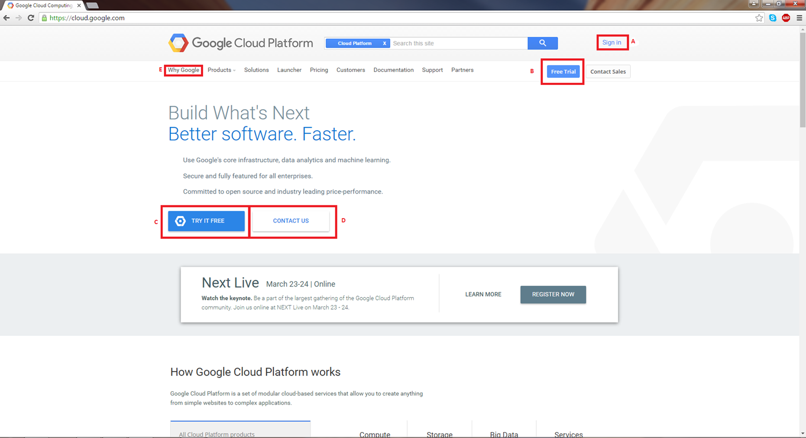
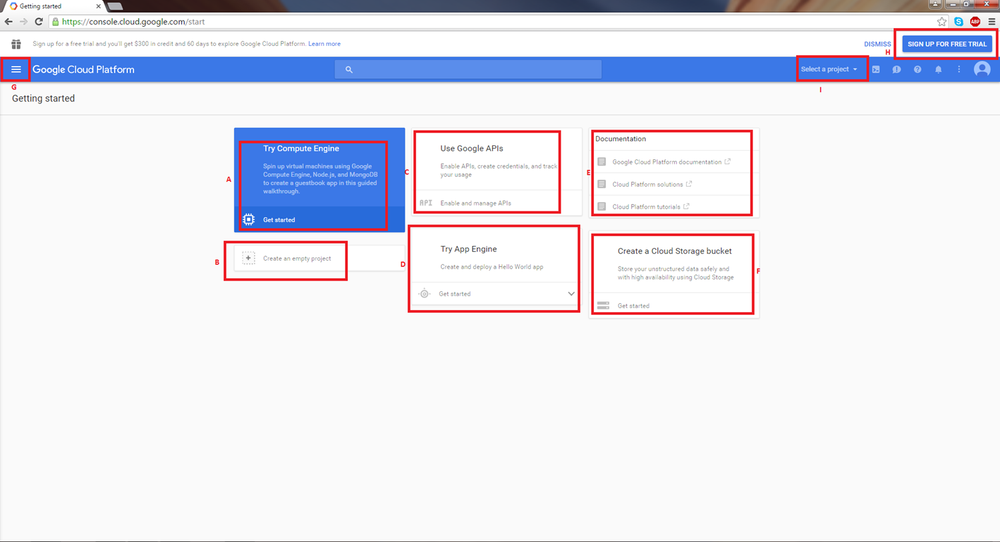
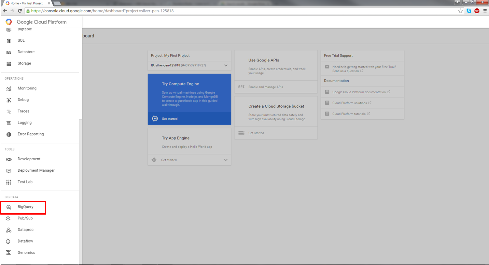

=======================================================
How to Access BigQuery from the Google Cloud Platform
=======================================================

In order to use BigQuery, you must have access to a Google Cloud Platform (GCP) project.  
You will also need a Google account identity (freely available with a new account or by linking to an existing email account). 
If you have not logged into the `Google Cloud Platform <http://cloud.google.com>`_ you will be presented with this page:

You login through the *Sign In* link at the upper right of the initial page (label *A* in the image above). Also on this page are links to a free-trail on the Google Cloud Platform (B) and (C), a link to contact google for any issues regarding the google cloud platform (D), a link to more information about the Google Cloud platform (E).  

Upon signing in with a Google account identity, you will be presented with the following page:

   
This is your personal *Dashboard* where your compute engine (A), Google APIs(C), App Engine(D), BigQuery, and Cloud Storage (F) components are readily accessible. Google also provides documentation for additional information if needed (E). Additional documentation describing how to use each component of this user interface are provided in the individual subsections of this documentation.
We encourage you to try the risk free trial for 60 days(H). Once you have a GCP project, you will have access to all of the products and services that make up the Google Cloud.

Google products and services may also be accessed through (G). Scroll down to BigQuery and open it (see screenshot below).

