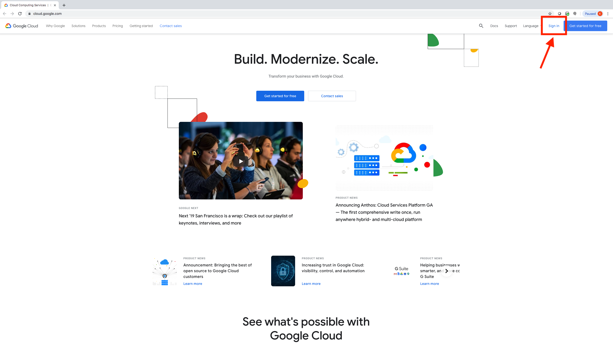
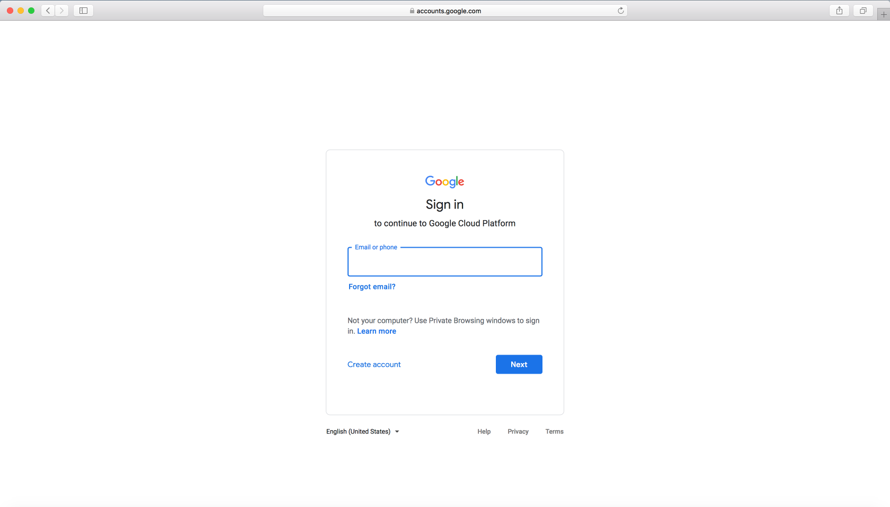
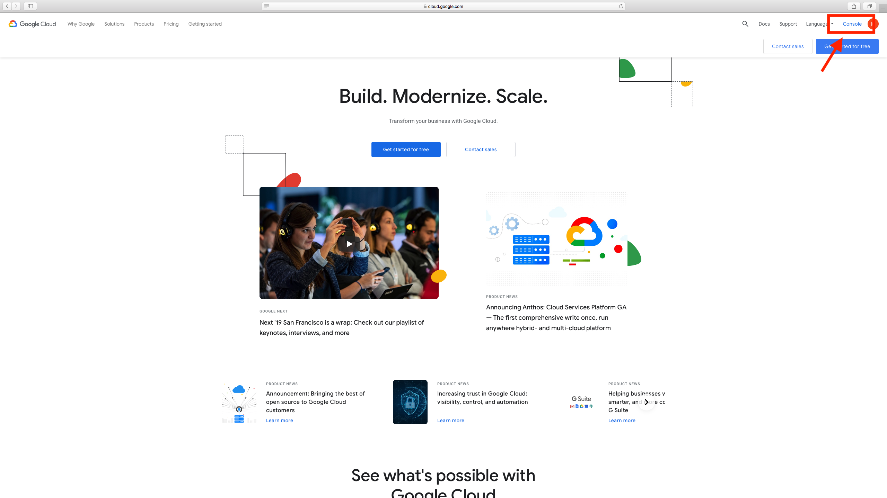
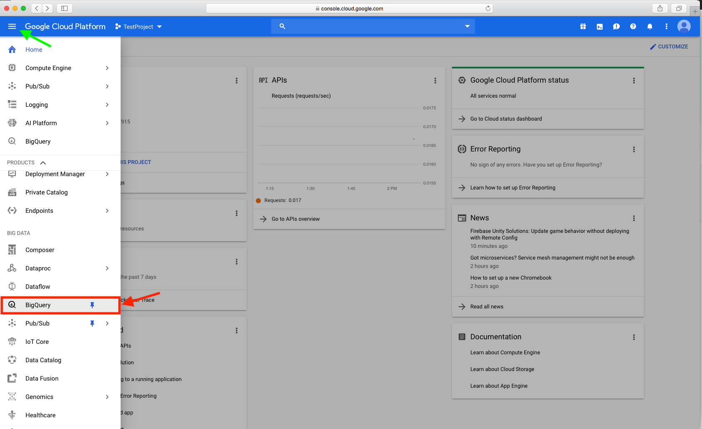

===================================
BigQuery on Google Cloud Platform
===================================

In order to use BigQuery, you must have access to a Google Cloud Platform (GCP) project. Your GCP project must be associated with a billing account in order to gain full access to all of products and services that make up the Google Cloud. Contact us at **request-gcp@isb-cgc.org** for more information on how to to request cloud credits. 

Additionally, you will need a Google account identity (freely available with a new account or by linking to an existing email account). 

When first logging into the `Google Cloud Platform <http://cloud.google.com>`_, you will be presented with this page:

You will be presented with the sign in page, prompting you to enter a Google account log in and password:

   
Once you sign in, click on Console at the top of the screen (see arrow in image below) to access a full range of Google cloud products and services including BigQuery.  

At the home button, scroll down to open BigQuery.

