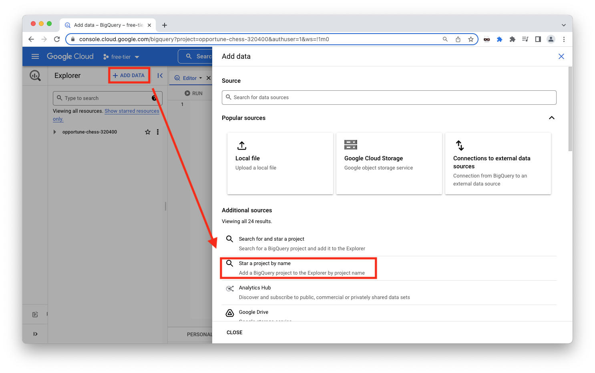
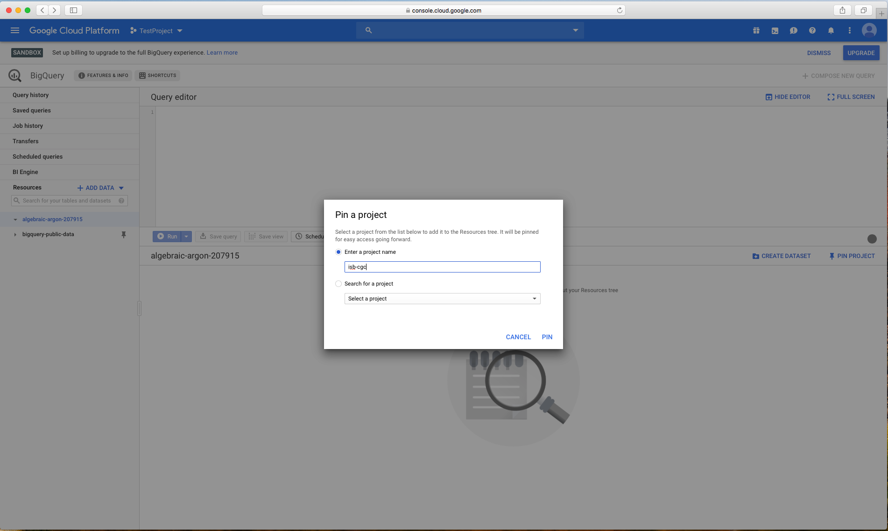
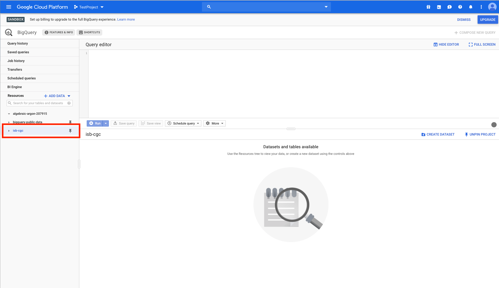

================================
Linking to ISB-CGC BigQuery tables
================================

Follow the images below to link the ISB-CGC BigQuery tables in projects **isb-cgc** and **isb-cgc-bq** to your Google Cloud Project. Click on image to zoom in.

When you access BigQuery from your Google Cloud Platform Console, you will see an "Add Data" box with a "Pin a Project option".

When you click on "Pin a Project", you will be presented with a pop-up box that allows you to either enter a project name or to select one from a list. Choose the "Enter a Project Name" and enter in "isb-cgc" and then click "Pin".

.. note:: If you are have Editor Tabs enabled, the "Pin a Project" options are a little different. When you click on "Add Data", select "Pin a Project" and then "Enter Project Name" from the menu. Then enter the project name in the pop-up box and click "Pin".

You will now see the isb-cgc open access BigQuery tables on the left-hand side pinned to your project. Repeat these steps for "isb-cgc-bq".

.. note:: If the data sets and tables within the project don't display immediately, refresh your screen until they do. They may take a couple of minutes to appear.

