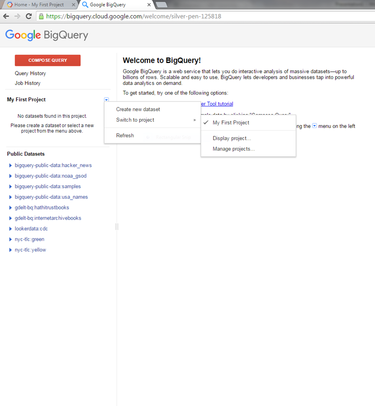
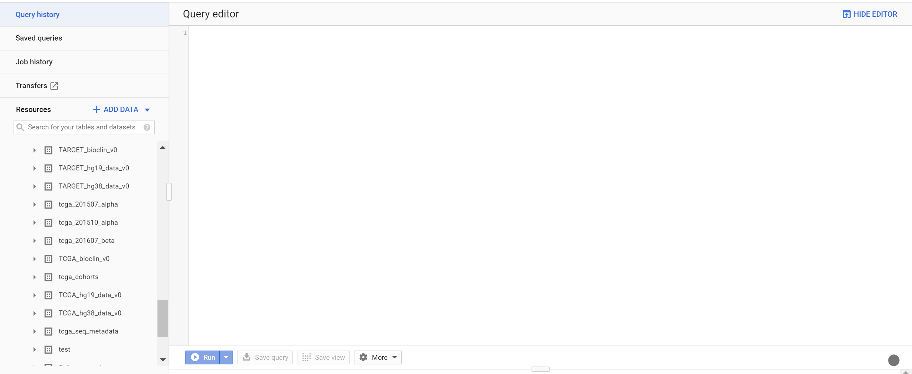

=======================================================
Linking BigQuery to ISB-CGC Project
=======================================================

To obtain access to the ISB-CGC project tables in BigQuery you must link these tables to your project so that they will show up in the left panel of your BigQuery web UI. 

When you access BigQuery from your Google Cloud Platform Console (see link `here <HowToAccessBigQueryFromTheGoogleCloudPlatform.html>`_ for more information on this), you will be presented with the following page:

The blue arrow will produce a drop down list; select 'Switch to Project'; then click 'display project...'

You will then be presented with the following page:

.. image:: AddISB-CGCProject.png
   :scale: 50
   :align: center

As shown in the image above you will need to type in "isb-cgc" in the project id and then click okay. 

Once this has been completed you will see all of the BigQuery datasets made public by the ISB-CGC project on the left hand side above public data sets (see screenshot below).

================================================
Other Genomics BigQuery Data Available on Google
================================================

Google and others have made additional datasets available in BigQuery.  These can be used in joins with the ISB-CGC datasets.  The current list can be found `here <https://googlegenomics.readthedocs.org/en/latest/use_cases/discover_public_data/index.html>`_.  

It is possible that not all the datasets provided on this page have BigQuery data.  You can find that out by opening up that link for each dataset and seeing if there is a section called "Google BigQuery Dataset ID(s)".  If there is, you can make these available through your Google console by the same process as you did for the ISB-CGC datasets above or by clicking on the link for that dataset.

